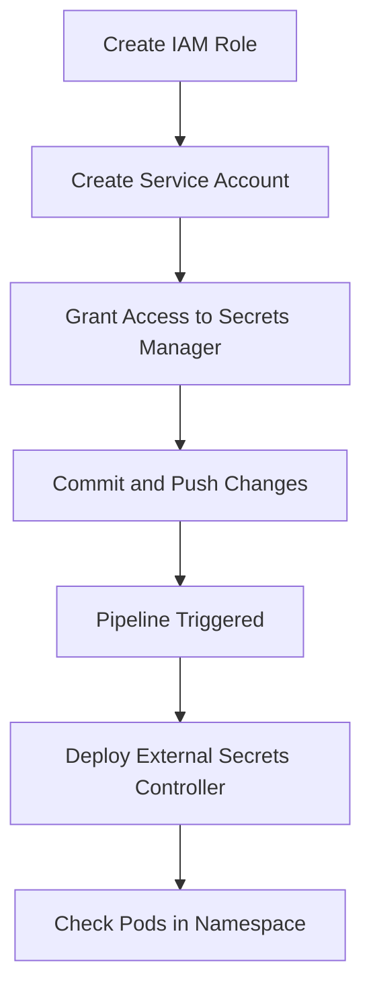
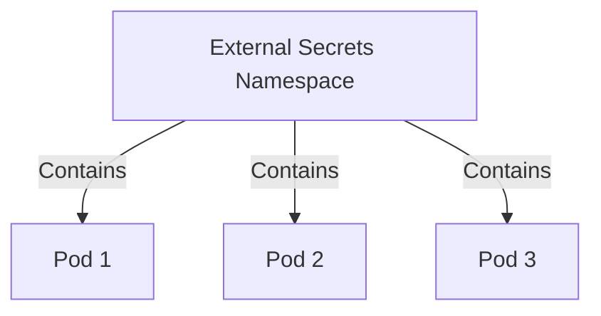

## Detailed Explanation of the Transcript Chunk

### Terraform Configuration and Dependencies

The transcript discusses the configuration of a Terraform script that manages dependencies between resources. Specifically, it ensures that a role is created before a service account is created to assume that role.

#### Code Example

```hcl
resource "aws_iam_role" "example" {
  name = "example-role"

  assume_role_policy = jsonencode({
    Version = "2012-10-17"
    Statement = [
      {
        Action = "sts:AssumeRole"
        Effect = "Allow"
        Principal = {
          Service = "ec2.amazonaws.com"
        }
      },
    ]
  })
}

resource "aws_iam_service_account" "example" {
  name = "example-service-account"
  role = aws_iam_role.example.name
}
```

#### Explanation

- **`aws_iam_role`**: Defines an IAM role named `example-role`.
- **`assume_role_policy`**: Specifies the policy that allows EC2 instances to assume this role.
- **`aws_iam_service_account`**: Creates a service account that assumes the previously defined role.

### Creating a Secret in AWS

The transcript mentions creating a secret in AWS using AWS Secrets Manager. This involves storing sensitive information securely and granting access to specific entities.

#### Code Example

```hcl
resource "aws_secretsmanager_secret" "example" {
  name = "example-secret"
}

resource "aws_secretsmanager_secret_version" "example" {
  secret_id     = aws_secretsmanager_secret.example.id
  secret_string = jsonencode({
    username = "admin"
    password = "securepassword123"
  })
}
```

#### Explanation

- **`aws_secretsmanager_secret`**: Creates a new secret named `example-secret`.
- **`aws_secretsmanager_secret_version`**: Adds a version to the secret containing the actual sensitive data.

### Granting Access to the Secret

The transcript describes granting a Kubernetes service account permission to access the AWS Secrets Manager.

#### Code Example

```hcl
resource "aws_iam_policy" "example" {
  name        = "example-policy"
  description = "Policy to allow access to AWS Secrets Manager"

  policy = jsonencode({
    Version = "2012-10-17"
    Statement = [
      {
        Action = [
          "secretsmanager:GetSecretValue",
          "secretsmanager:DescribeSecret"
        ]
        Effect   = "Allow"
        Resource = "*"
      },
    ]
  })
}

resource "aws_iam_policy_attachment" "example" {
  name       = "example-attachment"
  policy_arn = aws_iam_policy.example.arn
  roles      = [aws_iam_role.example.name]
}
```

#### Explanation

- **`aws_iam_policy`**: Defines a policy that allows the specified actions on AWS Secrets Manager.
- **`aws_iam_policy_attachment`**: Attaches the policy to the IAM role, thereby granting the necessary permissions.

### Committing and Pushing Changes

The transcript mentions committing the Terraform configuration and pushing it to a remote repository to trigger a pipeline.

#### Code Example

```bash
git add .
git commit -m "Add secrets management configuration"
git push origin main
```

#### Explanation

- **`git add .`**: Stages all changes in the working directory.
- **`git commit`**: Commits the staged changes with a descriptive message.
- **`git push`**: Pushes the committed changes to the remote repository, triggering the pipeline.

### Accessing the Kubernetes Cluster

The transcript discusses accessing the Kubernetes cluster after the pipeline completes.

#### Code Example

```bash
kubectl get namespaces
kubectl get pods -n external-secrets
```

#### Explanation

- **`kubectl get namespaces`**: Lists all namespaces in the cluster.
- **`kubectl get pods`**: Lists all pods in the specified namespace (`external-secrets`).

### Mermaid Diagrams

#### Terraform Dependency Diagram



#### Kubernetes Namespace and Pod Diagram



### Pitfalls and Common Mistakes

#### Incorrect Dependency Management

Failing to correctly manage dependencies can result in errors during deployment. For example, if the service account is created before the role, the service account may not have the necessary permissions.

#### Improper Access Controls

Granting overly broad permissions can expose secrets to unauthorized access. Always ensure that policies are as restrictive as possible.

#### Inadequate Monitoring

Failing to monitor access to secrets can lead to undetected breaches. Regularly review logs and set up alerts for suspicious activity.

### How to Prevent / Defend

#### Detection

- **Logging and Monitoring**: Implement comprehensive logging and monitoring to detect unauthorized access attempts.
- **Alerts**: Set up alerts for unusual activities, such as unexpected access to secrets.

#### Prevention

- **Least Privilege Principle**: Ensure that roles and policies grant only the minimum necessary permissions.
- **Regular Audits**: Conduct regular audits of IAM roles and policies to identify and mitigate potential risks.

#### Secure Coding Fixes

##### Vulnerable Code

```hcl
resource "aws_iam_policy" "example" {
  name        = "example-policy"
  description = "Policy to allow access to AWS Secrets Manager"

  policy = jsonencode({
    Version = "2012-10-17"
    Statement = [
      {
        Action = [
          "secretsmanager:*"
        ]
        Effect   = "Allow"
        Resource = "*"
      },
    ]
  })
}
```

##### Fixed Code

```hcl
resource "aws_iam_policy" "example" {
  name        = "example-policy"
  description = "Policy to allow access to AWS Secrets Manager"

  policy = jsonencode({
    Version = "2012-10-17"
    Statement = [
      {
        Action = [
          "secretsmanager:GetSecretValue",
          "se-cretsmanager:DescribeSecret"
        ]
        Effect   = "Allow"
        Resource = "arn:aws:secretsmanager:<region>:<account-id>:secret:example-secret-*"
      },
    ]
  })
}
```

#### Configuration Hardening

- **IAM Policies**: Use least privilege principles and restrict actions and resources as much as possible.
- **Secrets Manager**: Enable encryption at rest and configure rotation policies for secrets.

### Complete Example

#### Full Terraform Configuration

```hcl
provider "aws" {
  region = "us-west-2"
}

resource "aws_iam_role" "example" {
  name = "example-role"

  assume_role_policy = jsonencode({
    Version = "2012-10-17"
    Statement = [
      {
        Action = "sts:AssumeRole"
        Effect = "Allow"
        Principal = {
          Service = "ec2.amazonaws.com"
        }
      },
    ]
  })
}

resource "aws_iam_service_account" "example" {
  name = "example-service-account"
  role = aws_iam_role.example.name
}

resource "aws_secretsmanager_secret" "example" {
  name = "example-secret"
}

resource "aws_secretsmanager_secret_version" "example" {
  secret_id     = aws_secretsmanager_secret.example.id
  secret_string = jsonencode({
    username = "admin"
    password = "securepassword123"
  })
}

resource "aws_iam_policy" "example" {
  name        = "example-policy"
  description = "Policy to allow access to AWS Secrets Manager"

  policy = jsonencode({
    Version = "2012-10-17"
    Statement = [
      {
        Action = [
          "secretsmanager:GetSecretValue",
          "secretsmanager:DescribeSecret"
        ]
        Effect   = "Allow"
        Resource = "arn:aws:secretsmanager:us-west-2:<account-id>:secret:example-secret-*"
      },
    ]
  })
}

resource "aws_iam_policy_attachment" "example" {
  name       = "example-attachment"
  policy_arn = aws_iam_policy.example.arn
  roles      = [aws_iam_role.example.name]
}
```

#### Full Git Commands

```bash
git add .
git commit -m "Add secrets management configuration"
git push origin main
```

#### Full Kubernetes Commands

```bash
kubectl get namespaces
kubectl get pods -n external-secrets
```

### Hands-On Labs

For hands-on practice with secrets management in a DevSecOps environment, consider the following labs:

- **PortSwigger Web Security Academy**: Offers interactive labs on securing web applications, including handling secrets.
- **OWASP Juice Shop**: Provides a vulnerable web application for practicing security techniques, including secrets management.
- **DVWA (Damn Vulnerable Web Application)**: Another vulnerable web application for learning security practices.
- **Kubernetes Goat**: Focuses on Kubernetes security, including secrets management.

These labs provide practical experience in implementing and securing secrets management in real-world scenarios.

By thoroughly covering the concepts, providing detailed explanations, and including real-world examples, this chapter aims to provide a comprehensive understanding of secrets management in a DevSecOps context.

---
<!-- nav -->
[[09-Deploying External Secrets Controller|Deploying External Secrets Controller]] | [[DevSecOps/DevSecOps Bootcamp/03-Identity & Access Management/03-Secrets Management/Deploy External Secrets Controller Demo Part 1/00-Overview|Overview]] | [[11-Secrets Management in DevSecOps Part 1|Secrets Management in DevSecOps Part 1]]
