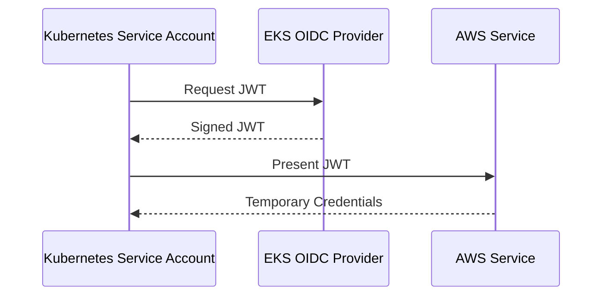

## Secrets Management in DevSecOps

### Introduction to Secrets Management

Secrets management is a critical aspect of securing applications and infrastructure. Secrets include sensitive data such as API keys, database passwords, encryption keys, and other credentials that are necessary for various operations but should not be exposed to unauthorized users. In the context of Kubernetes and cloud environments, managing these secrets securely is essential to prevent unauthorized access and potential breaches.

### Understanding External Secrets Controller

The External Secrets Controller is a tool designed to manage secrets stored externally in services like AWS Secrets Manager, HashiCorp Vault, or Azure Key Vault. It allows Kubernetes to fetch secrets from these external stores and inject them into pods as environment variables or files. This separation ensures that secrets are not hardcoded in application code or configuration files, reducing the risk of exposure.

### EKS OIDC Provider

To understand the deployment of the External Secrets Controller, we need to delve into the EKS OIDC (OpenID Connect) provider. OpenID Connect is an authentication protocol that provides identity information in the form of JSON Web Tokens (JWTs). The EKS OIDC provider enables Kubernetes service accounts to authenticate with AWS services using JWTs.

#### What is EKS OIDC Provider?

The EKS OIDC provider is a feature of Amazon EKS (Elastic Kubernetes Service) that integrates Kubernetes service accounts with AWS Identity and Access Management (IAM). It allows Kubernetes service accounts to assume IAM roles, thereby granting them permissions to access AWS resources.

#### Why Use EKS OIDC Provider?

Using the EKS OIDC provider is crucial because it provides a secure way to grant Kubernetes service accounts temporary AWS credentials. Without this integration, service accounts would need to store long-term AWS access keys and secret keys, which poses significant security risks.

#### How Does EKS OIDC Work?

When a Kubernetes service account is configured to use the EKS OIDC provider, it receives a unique identifier. This identifier is used to generate a JWT, which is then signed by the EKS OIDC provider. The JWT contains claims about the service account, such as its name and namespace. AWS services can validate this JWT and grant temporary credentials to the service account based on the associated IAM role.



### Configuring IAM Role for External Secrets Controller

To enable the External Secrets Controller to access AWS Secrets Manager, we need to configure an IAM role with appropriate permissions. This role will be assumed by the Kubernetes service account.

#### Creating the IAM Role

First, we create an IAM role with a trust relationship to the EKS OIDC provider. This trust relationship specifies that the role can be assumed by the Kubernetes service account.

```yaml
# iam-role-trust-policy.json
{
    "Version": "2012-10-17",
    "Statement": [
        {
            "Effect": "Allow",
            "Principal": {
                "Federated": "arn:aws:iam::123456789012:oidc-provider/oidc.eks.us-west-2.amazonaws.com/id/abcdef123456"
            },
            "Action": "sts:AssumeRoleWithWebIdentity",
            "Condition": {
                "StringEquals": {
                    "oidc.eks.us-west-2.amazonaws.com/id/abcdef123456:aud": "sts.amazonaws.com",
                    "oidc.eks.us-west-2.amazonaws.com/id/abcdef123456:sub": "system:serviceaccount:<namespace>:<service-account-name>"
                }
            }
        }
    ]
}
```

#### Attaching Inline Policy to IAM Role

Next, we attach an inline policy to the IAM role that grants read-only access to the AWS Secrets Manager.

```json
{
    "Version": "2012-10-17",
    "Statement": [
        {
            "Sid": "SecretsManagerReadOnlyAccess",
            "Effect": "Allow",
            "Action": [
                "secretsmanager:GetSecretValue",
                "secretsmanager:ListSecrets"
            ],
            "Resource": "*"
        }
    ]
}
```

This policy allows the service account to list secrets and retrieve their values from the Secrets Manager.

### Creating a Service Account in Kubernetes

Now that we have configured the IAM role, we need to create a Kubernetes service account that can assume this role.

#### Service Account Configuration

We create a service account in Kubernetes and annotate it with the ARN of the IAM role.

```yaml
apiVersion: v1
kind: ServiceAccount
metadata:
  name: external-secrets-sa
  namespace: default
  annotations:
    eks.amazonaws.com/role-arn: arn:aws:iam::123456789012:role/ExternalSecretsControllerRole
```

### Deploying External Secrets Controller

With the service account configured, we can deploy the External Secrets Controller. This controller watches for `Secret` objects in Kubernetes and fetches the corresponding secrets from the external store.

#### Deployment Example

Here is an example of deploying the External Secrets Controller using Helm:

```bash
helm repo add external-secrets https://external-secrets.github.io/kubernetes-external-secrets/
helm install external-secrets external-secrets/kubernetes-external-secrets \
  --set aws.region=us-west-2 \
  --set aws.roleArn=arn:aws:iam::123456789012:role/ExternalSecretsControllerRole
```

### Real-World Examples and Recent Breaches

Recent breaches involving mismanaged secrets highlight the importance of proper secrets management. For instance, in 2021, a misconfigured AWS S3 bucket exposed sensitive data due to improper IAM role permissions. This incident underscores the need for strict access controls and regular audits of IAM roles and policies.

### Common Pitfalls and Best Practices

#### Pitfall: Hardcoding Secrets

One common mistake is hardcoding secrets directly into application code or configuration files. This practice exposes secrets to anyone with access to the codebase, increasing the risk of unauthorized access.

#### Best Practice: Use Environment Variables or Files

Instead of hardcoding secrets, use environment variables or files to store them. Kubernetes supports injecting secrets as environment variables or files into pods.

#### Pitfall: Overly Permissive Policies

Another pitfall is creating overly permissive IAM policies. Granting unnecessary permissions increases the attack surface and the potential damage in case of a breach.

#### Best Practice: Least Privilege Principle

Adhere to the principle of least privilege by granting only the minimum permissions required for the service account to perform its tasks. Regularly review and update IAM policies to ensure they remain aligned with current requirements.

### How to Prevent / Defend

#### Detection

Regularly audit IAM roles and policies to identify and rectify overly permissive settings. Use tools like AWS Trusted Advisor or third-party security scanners to detect misconfigurations.

#### Prevention

Implement strict access controls and enforce the principle of least privilege. Use tools like AWS Organizations to centralize and manage IAM roles across multiple accounts.

#### Secure Coding Fixes

Compare the insecure and secure versions of IAM policies and service account configurations.

**Insecure Version:**

```json
{
    "Version": "2012-10-17",
    "Statement": [
        {
            "Effect": "Allow",
            "Action": "*",
            "Resource": "*"
        }
    ]
}
```

**Secure Version:**

```json
{
    "Version": "2012-10-17",
    "Statement": [
        {
            "Sid": "SecretsManagerReadOnlyAccess",
            "Effect": "Allow",
            "Action": [
                "secretsmanager:GetSecretValue",
                "secretsmanager:ListSecrets"
            ],
            "Resource": "*"
        }
    ]
}
```

### Conclusion

Proper secrets management is essential for securing applications and infrastructure. By leveraging tools like the External Secrets Controller and integrating with EKS OIDC provider, we can ensure that secrets are managed securely and accessed only by authorized entities. Regular audits and adherence to best practices help mitigate the risk of unauthorized access and potential breaches.

### Hands-On Labs

For practical experience with secrets management in Kubernetes, consider the following labs:

- **PortSwigger Web Security Academy**: Offers exercises on securing web applications, including handling secrets.
- **OWASP Juice Shop**: A deliberately insecure web application for practicing security skills, including secrets management.
- **DVWA (Damn Vulnerable Web Application)**: Another insecure web application for learning security concepts.
- **CloudGoat**: A set of labs for practicing cloud security, including IAM role management and secrets handling.

These labs provide real-world scenarios and challenges to reinforce the concepts covered in this chapter.

---
<!-- nav -->
[[10-Detailed Explanation of the Transcript Chunk|Detailed Explanation of the Transcript Chunk]] | [[DevSecOps/DevSecOps Bootcamp/03-Identity & Access Management/03-Secrets Management/Deploy External Secrets Controller Demo Part 1/00-Overview|Overview]] | [[12-Secrets Management in DevSecOps|Secrets Management in DevSecOps]]
