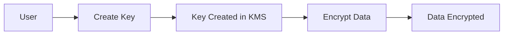
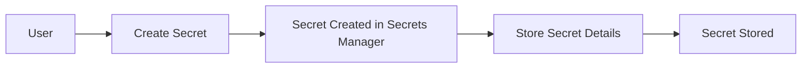
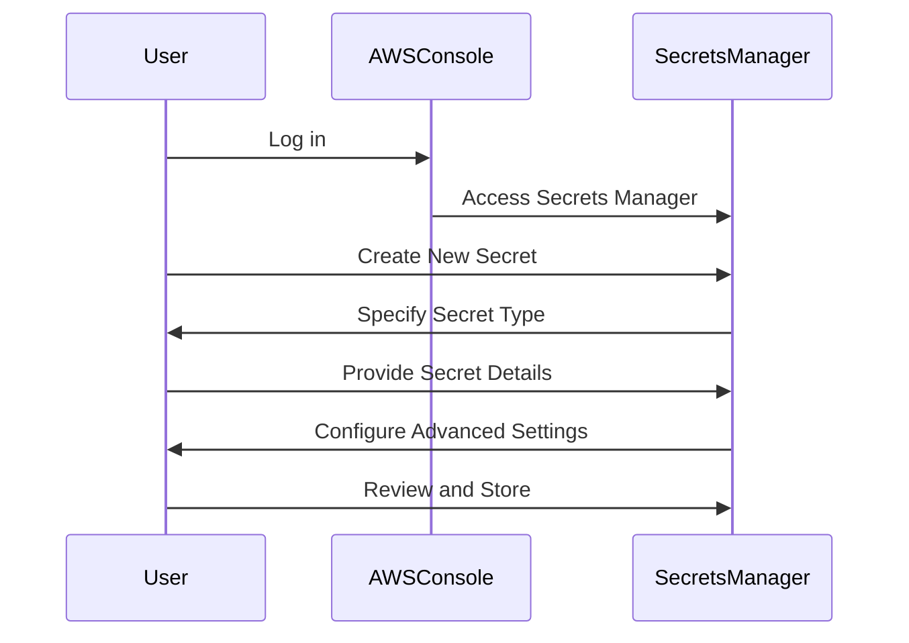
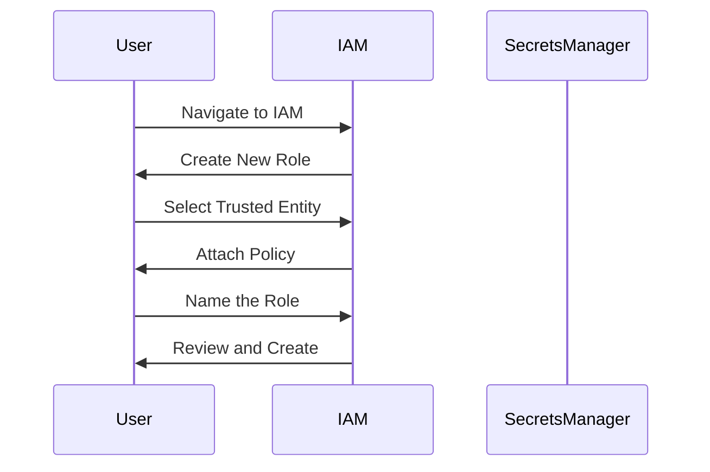

## Secrets Management in DevSecOps

### Introduction to Secrets Management

In the realm of DevSecOps, managing secrets securely is one of the most critical aspects of ensuring the integrity and confidentiality of applications and systems. Secrets can include API keys, database passwords, SSH keys, and other sensitive information that, if compromised, can lead to severe security breaches. This chapter delves into the intricacies of secrets management, focusing on deploying an external secrets controller in a Kubernetes environment.

### Key Concepts and Terminology

#### AWS Key Management Service (KMS)

The AWS Key Management Service (KMS) is a managed service that makes it easy for you to create and control the encryption keys used to encrypt your data. KMS integrates with other AWS services to provide automatic server-side encryption, and you can also use it to encrypt your data before storing it in any AWS service or even outside of AWS.

**Why Use KMS?**
- **Centralized Key Management:** KMS provides a centralized location to manage encryption keys, making it easier to enforce policies and monitor usage.
- **Compliance and Auditing:** KMS supports compliance requirements and provides detailed audit logs.
- **Integration with Other Services:** KMS seamlessly integrates with other AWS services like S3, RDS, and DynamoDB.

**Encryption Keys in KMS**
An encryption key in KMS is a cryptographic key used to encrypt and decrypt data. These keys can be created, rotated, and deleted through the KMS console or programmatically via the AWS SDKs.



#### AWS Secrets Manager

AWS Secrets Manager is a service that helps you protect access to your applications, services, and IT resources without compromising security. You can store, manage, and retrieve database credentials, API keys, and other secrets throughout their lifecycle.

**Why Use Secrets Manager?**
- **Centralized Secret Storage:** Secrets Manager provides a centralized location to store and manage secrets.
- **Automatic Rotation:** Secrets Manager can automatically rotate secrets according to a schedule you define.
- **Integration with Other Services:** Secrets Manager integrates with other AWS services and can be used with custom applications.

**Creating a Secret in Secrets Manager**
To create a secret in Secrets Manager, you first need to specify the type of secret (e.g., database credentials, API keys) and provide the necessary details.



### Example: Creating a Stripe API Key Secret

Let's walk through the process of creating a Stripe API key secret in AWS Secrets Manager.

1. **Log in to the AWS Console:**
   Navigate to the AWS Management Console and log in with your credentials.

2. **Access Secrets Manager:**
   Go to the AWS Secrets Manager service.

3. **Create a New Secret:**
   Click on "Store a new secret."

4. **Specify Secret Type:**
   Choose the type of secret you want to store. For this example, select "Other type of secrets."

5. **Provide Secret Details:**
   Enter the secret value (Stripe API key) and any additional metadata.

6. **Configure Advanced Settings:**
   Leave the advanced settings as default unless you have specific requirements.

7. **Review and Store:**
   Review the details and click "Next." Then click "Store" to save the secret.



### Creating a Role with Read-Only Permissions

Once the secret is stored, the next step is to create an IAM role that has read-only permissions to access the secrets in Secrets Manager.

1. **Navigate to IAM:**
   Go to the AWS Identity and Access Management (IAM) service.

2. **Create a New Role:**
   Click on "Roles" and then "Create role."

3. **Select Trusted Entity:**
   Choose the type of trusted entity (e.g., EC2 instance).

4. **Attach Policy:**
   Attach a policy that grants read-only access to Secrets Manager. You can use the `secretsmanager:GetSecretValue` action.

5. **Name the Role:**
   Give the role a descriptive name (e.g., `SecretsManagerReadOnlyRole`).

6. **Review and Create:**
   Review the details and click "Create role."



### Creating a Service Account to Assume the Role

Now, create a service account in Kubernetes that can assume the IAM role to fetch the secrets.

1. **Create a Service Account:**
   Define a service account in your Kubernetes cluster.

2. **Assign IAM Role:**
   Use the `aws-iam-authenticator` to map the service account to the IAM role.

3. **Fetch Secrets:**
   Use the external secrets controller to fetch the secrets from Secrets Manager.

```yaml
apiVersion: v1
kind: ServiceAccount
metadata:
  name: secrets-manager-sa
---
apiVersion: rbac.authorization.k8s.io/v1
kind: ClusterRoleBinding
metadata:
  name: secrets-manager-role-binding
subjects:
- kind: ServiceAccount
  name: secrets-manager-sa
  namespace: default
roleRef:
  kind: ClusterRole
  name: secrets-manager-role
  apiGroup: rbac.authorization.k8s.io
```

### Automating with Terraform

To automate the creation of the service account and role binding, use Terraform.

1. **Define Resources:**
   Define the service account and role binding in Terraform.

2. **Apply Configuration:**
   Run `terraform apply` to create the resources.

```hcl
resource "kubernetes_service_account" "secrets_manager_sa" {
  metadata {
    name = "secrets-manager-sa"
  }
}

resource "kubernetes_cluster_role_binding" "secrets_manager_role_binding" {
  metadata {
    name = "secrets-manager-role-binding"
  }
  role_ref {
    api_group = "rbac.authorization.k8s.io"
    kind      = "ClusterRole"
    name      = "secrets-manager-role"
  }
  subject {
    kind      = "ServiceAccount"
    name      = kubernetes_service_account.secrets_manager_sa.metadata[0].name
    namespace = "default"
  }
}
```

### How to Prevent / Defend

#### Detection
- **Audit Logs:** Enable audit logging in AWS to track access to secrets.
- **Monitoring:** Use monitoring tools to detect unauthorized access attempts.

#### Prevention
- **Least Privilege Principle:** Ensure that roles and service accounts have the minimum necessary permissions.
- **Regular Audits:** Perform regular audits to ensure compliance with security policies.

#### Secure Coding Fixes
- **Vulnerable Code:**
  ```python
  import boto3

  def get_secret(secret_name):
      client = boto3.client('secretsmanager')
      response = client.get_secret_value(SecretId=secret_name)
      return response['SecretString']
  ```

- **Secure Code:**
  ```python
  import boto3
  from botocore.exceptions import ClientError

  def get_secret(secret_name):
      client = boto3.client('secretsmanager')
      try:
          response = client.get_secret_value(SecretId=secret_name)
          return response['SecretString']
      except ClientError as e:
          print(f"Error retrieving secret: {e}")
          return None
  ```

### Real-World Examples

#### Recent Breaches
- **Capital One Breach (2019):** A misconfigured firewall allowed an attacker to access sensitive customer data, including credit card numbers and social security numbers.
- **Twitter Breach (2020):** Hackers gained access to Twitter's internal systems and were able to post fraudulent tweets from high-profile accounts.

#### CVEs
- **CVE-2020-14882:** A vulnerability in the AWS SDK for Java allowed attackers to bypass authentication checks.
- **CVE-2021-20225:** A vulnerability in the AWS SDK for Python allowed attackers to execute arbitrary code.

### Conclusion

Managing secrets securely is crucial for maintaining the integrity and confidentiality of applications and systems. By leveraging AWS KMS and Secrets Manager, you can centralize and manage secrets effectively. Additionally, automating the creation of service accounts and roles using Terraform ensures that your infrastructure remains secure and compliant.

### Practice Labs

For hands-on practice with secrets management in Kubernetes, consider the following labs:

- **PortSwigger Web Security Academy:** Offers a comprehensive set of labs covering various aspects of web security, including secrets management.
- **OWASP Juice Shop:** A deliberately insecure web application for security training purposes.
- **DVWA (Damn Vulnerable Web Application):** A PHP/MySQL web application that is riddled with vulnerabilities for educational purposes.

By completing these labs, you can gain practical experience in managing secrets securely in a Kubernetes environment.

---
<!-- nav -->
[[11-Secrets Management in DevSecOps Part 1|Secrets Management in DevSecOps Part 1]] | [[DevSecOps/DevSecOps Bootcamp/03-Identity & Access Management/03-Secrets Management/Deploy External Secrets Controller Demo Part 1/00-Overview|Overview]] | [[DevSecOps/DevSecOps Bootcamp/03-Identity & Access Management/03-Secrets Management/Deploy External Secrets Controller Demo Part 1/13-Practice Questions & Answers|Practice Questions & Answers]]
