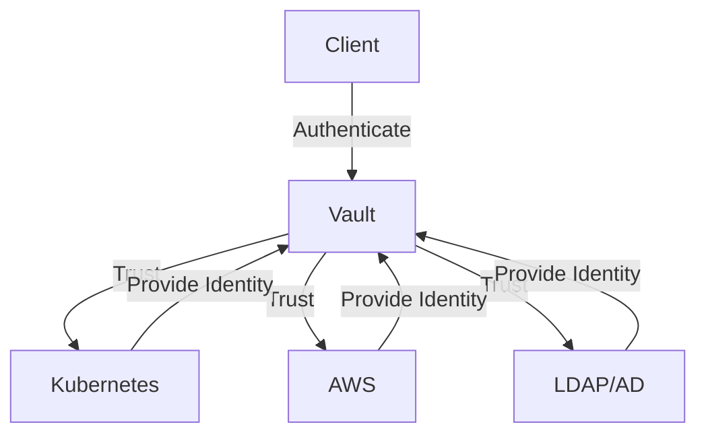

## Introduction to Secrets Management and HashiCorp Vault

### Background Theory

Secrets management is a critical aspect of modern DevSecOps practices. Secrets, such as API keys, database credentials, and encryption keys, are sensitive pieces of information that need to be securely stored and managed. One of the most popular tools for managing secrets is HashiCorp Vault. Vault provides a centralized, secure location to store and manage secrets, ensuring that they are accessed only by authorized entities.

Vault operates on the principle of providing a secure, auditable method for storing and retrieving secrets. It supports various authentication methods and integrates seamlessly with existing infrastructure, making it a versatile solution for organizations of all sizes.

### Authentication Methods in Vault

Vault uses authentication methods to verify the identity of clients requesting access to secrets. These methods allow Vault to trust external systems to identify and authenticate entities. This approach leverages existing identity providers (IDPs) and reduces the overhead of maintaining separate authentication mechanisms within Vault.

#### AWS Authentication Plugin

One of the most commonly used authentication plugins is the AWS authentication plugin. This plugin allows AWS resources, such as EC2 instances, to authenticate with Vault using their AWS credentials. This integration ensures that only authorized AWS resources can access the secrets stored in Vault.

**Example Configuration**

To configure the AWS authentication plugin in Vault, you need to enable the plugin and set up the necessary policies. Here’s a step-by-step guide:

1. **Enable the AWS Authentication Plugin:**

```bash
vault auth enable aws
```

2. **Configure the Plugin:**

You need to specify the AWS region and the role ARN that will be used for authentication.

```bash
vault write auth/aws/config \
    access_key=<your_access_key> \
    secret_key=<your_secret_key> \
    region=us-west-2
```

3. **Create Policies:**

Define policies that specify which secrets can be accessed by authenticated AWS resources.

```bash
vault policy write aws-policy - <<EOF
path "secret/data/*" {
  capabilities = ["read"]
}
EOF
```

4. **Assign Policies to Roles:**

Assign the created policies to roles that will be used by AWS resources.

```bash
vault write auth/aws/role/my-role \
    policies="aws-policy" \
    bound_iam_role_arn="arn:aws:iam::123456789012:role/my-role"
```

**HTTP Request Example**

Here’s an example of an HTTP request to authenticate with Vault using the AWS authentication plugin:

```http
POST /v1/auth/aws/login HTTP/1.1
Host: vault.example.com
Content-Type: application/json

{
  "method": "aws",
  "params": {
    "access_key": "<your_access_key>",
    "secret_key": "<your_secret_key>",
    "region": "us-west-2",
    "role": "my-role"
  }
}
```

**HTTP Response Example**

```http
HTTP/1.1 200 OK
Content-Type: application/json

{
  "auth": {
    "client_token": "hvs.1234567890abcdef",
    "accessor": "hva.1234567890abcdef",
    "policies": ["default", "aws-policy"],
    "metadata": {
      "role": "my-role"
    },
    "lease_duration": 76800,
    "renewable": true
  }
}
```

#### Kubernetes Authentication Plugin

Another widely used authentication plugin is the Kubernetes authentication plugin. This plugin allows Kubernetes components, such as Pods, to authenticate with Vault using their Kubernetes service account tokens. This integration ensures that only authorized Kubernetes components can access the secrets stored in Vault.

**Example Configuration**

To configure the Kubernetes authentication plugin in Vault, you need to enable the plugin and set up the necessary policies. Here’s a step-by-step guide:

1. **Enable the Kubernetes Authentication Plugin:**

```bash
vault auth enable kubernetes
```

2. **Configure the Plugin:**

You need to specify the Kubernetes service account token and the role that will be used for authentication.

```bash
vault write auth/kubernetes/config \
    token_reviewer_jwt=$(cat /var/run/secrets/kubernetes.io/serviceaccount/token) \
    kubernetes_host=https://$KUBERNETES_PORT_443_TCP_ADDR:$KUBERNETES_PORT_443_TCP_PORT \
    kubernetes_ca_cert=@/var/run/secrets/kubernetes.io/serviceaccount/ca.crt
```

3. **Create Policies:**

Define policies that specify which secrets can be accessed by authenticated Kubernetes components.

```bash
vault policy write k8s-policy - <<EOF
path "secret/data/*" {
  capabilities = ["read"]
}
EOF
```

4. **Assign Policies to Roles:**

Assign the created policies to roles that will be used by Kubernetes components.

```bash
vault write auth/kubernetes/role/my-role \
    bound_service_account_names=my-service-account \
    bound_service_account_namespaces=default \
    policies="k8s-policy" \
    ttl=24h
```

**HTTP Request Example**

Here’s an example of an HTTP request to authenticate with Vault using the Kubernetes authentication plugin:

```http
POST /v1/auth/kubernetes/login HTTP/1.1
Host: vault.example.com
Content-Type: application/json

{
  "jwt": "<your_kubernetes_jwt>",
  "role": "my-role"
}
```

**HTTP Response Example**

```http
HTTP/1.1 200 OK
Content-Type: application/json

{
  "auth": {
    "client_token": "hvs.1234567890abcdef",
    "accessor": "hva.1234567890abcdef",
    "policies": ["default", "k8s-policy"],
    "metadata": {
      "role": "my-role"
    },
    "lease_duration": 86400,
    "renewable": true
  }
}
```

#### LDAP/Active Directory Authentication Plugin

For human users, Vault supports authentication through LDAP or Active Directory. This plugin allows users to authenticate with Vault using their existing LDAP or AD credentials. This integration ensures that only authorized human users can access the secrets stored in Vault.

**Example Configuration**

To configure the LDAP/Active Directory authentication plugin in Vault, you need to enable the plugin and set up the necessary policies. Here’s a step-by-step guide:

1. **Enable the LDAP/Active Directory Authentication Plugin:**

```bash
vault auth enable ldap
```

2. **Configure the Plugin:**

You need to specify the LDAP server URL, bind DN, and other necessary parameters.

```bash
vault write auth/ldap/config \
    url="ldap://ldap.example.com" \
    binddn="cn=admin,dc=example,dc=com" \
    bindpass="<your_bind_password>" \
    userdn="ou=users,dc=example,dc=com" \
    groupdn="ou=groups,dc=example,dc=com"
```

3. **Create Policies:**

Define policies that specify which secrets can be accessed by authenticated users.

```bash
vault policy write ldap-policy - <<EOF
path "secret/data/*" {
  capabilities = ["read"]
}
EOF
```

4. **Assign Policies to Users:**

Assign the created policies to users based on their LDAP groups.

```bash
vault write auth/ldap/groups/my-group \
    policies="ldap-policy"
```

**HTTP Request Example**

Here’s an example of an HTTP request to authenticate with Vault using the LDAP/Active Directory authentication plugin:

```http
POST /v1/auth/ldap/login/nana HTTP/1.1
Host: vault.example.com
Content-Type: application/json

{
  "password": "<your_password>"
}
```

**HTTP Response Example**

```http
HTTP/1.1 200 OK
Content-Type: application/json

{
  "auth": {
    "client_token": "hvs.1234567890abcdef",
    "accessor": "hva.1234567890abcdef",
    "policies": ["default", "ldap-policy"],
    "metadata": {
      "username": "nana"
    },
    "lease_duration": 76800,
    "renewable": true
  }
}
```

### Identity Provider Concept

The identity provider (IDP) concept is central to how Vault authenticates clients. Instead of Vault identifying each specific entity (such as a Kubernetes Pod or an AWS EC2 instance) by itself, it trusts external systems like Kubernetes, AWS, and LDAP/AD to identify these entities. This approach leverages existing trusted systems and simplifies the authentication process.

**Mermaid Diagram: Identity Provider Integration**



### Real-World Examples and Recent Breaches

Recent breaches have highlighted the importance of proper secrets management. For example, the Capital One breach in 2019 exposed sensitive customer data due to misconfigured AWS S3 buckets. Proper use of Vault and its authentication plugins could have helped mitigate such risks by ensuring that only authorized entities had access to sensitive data.

### Common Pitfalls and Best Practices

#### Common Pitfalls

1. **Insufficient Authentication Mechanisms:** Relying solely on one authentication mechanism can lead to vulnerabilities. Always use multiple layers of authentication.
2. **Weak Policies:** Inadequate policies can grant excessive permissions to authenticated entities. Ensure that policies are granular and aligned with least privilege principles.
3. **Misconfigured Plugins:** Incorrectly configured authentication plugins can expose secrets to unauthorized entities. Always follow best practices for configuring plugins.

#### Best Practices

1. **Use Multiple Authentication Mechanisms:** Combine multiple authentication methods to enhance security.
2. **Implement Least Privilege Policies:** Grant only the minimum necessary permissions to authenticated entities.
3. **Regularly Audit Configurations:** Periodically review and audit configurations to ensure they remain secure.

### How to Prevent / Defend

#### Detection

1. **Audit Logs:** Regularly review audit logs to detect unauthorized access attempts.
2. **Monitoring Tools:** Use monitoring tools to detect anomalies in access patterns.

#### Prevention

1. **Secure Configuration:** Follow best practices for configuring authentication plugins and policies.
2. **Least Privilege Principle:** Implement least privilege policies to minimize exposure.

#### Secure Coding Fixes

**Vulnerable Code Example**

```bash
# Vulnerable configuration
vault write auth/aws/config \
    access_key=<your_access_key> \
    secret_key=<your_secret_key> \
    region=us-west-2
```

**Fixed Code Example**

```bash
# Fixed configuration
vault write auth/aws/config \
    access_key=<your_access_key> \
    secret_key=<your_secret_key> \
    region=us-west-2 \
    bound_iam_role_arn="arn:aws:iam::123456789012:role/my-role"
```

### Hands-On Labs

For practical experience with Vault and its authentication plugins, consider the following labs:

- **PortSwigger Web Security Academy:** Offers hands-on labs for web application security.
- **OWASP Juice Shop:** Provides a vulnerable web application for practicing security techniques.
- **DVWA (Damn Vulnerable Web Application):** A deliberately insecure web application for practicing penetration testing.
- **WebGoat:** An interactive training application for learning about web application security.

These labs provide a comprehensive environment to practice and master secrets management using Vault.

### Conclusion

Proper secrets management is crucial for securing sensitive information in modern DevSecOps environments. HashiCorp Vault, with its robust authentication plugins and integration capabilities, provides a powerful solution for managing secrets securely. By following best practices and regularly auditing configurations, organizations can significantly reduce the risk of unauthorized access to sensitive data.

---
<!-- nav -->
[[DevSecOps/DevSecOps Bootcamp/03-Identity & Access Management/03-Secrets Management/How Vault works Vault Deep Dive Part 2/01-Introduction to Secrets Management Tools|Introduction to Secrets Management Tools]] | [[DevSecOps/DevSecOps Bootcamp/03-Identity & Access Management/03-Secrets Management/How Vault works Vault Deep Dive Part 2/00-Overview|Overview]] | [[DevSecOps/DevSecOps Bootcamp/03-Identity & Access Management/03-Secrets Management/How Vault works Vault Deep Dive Part 2/03-Introduction to Secrets Management with Vault|Introduction to Secrets Management with Vault]]
