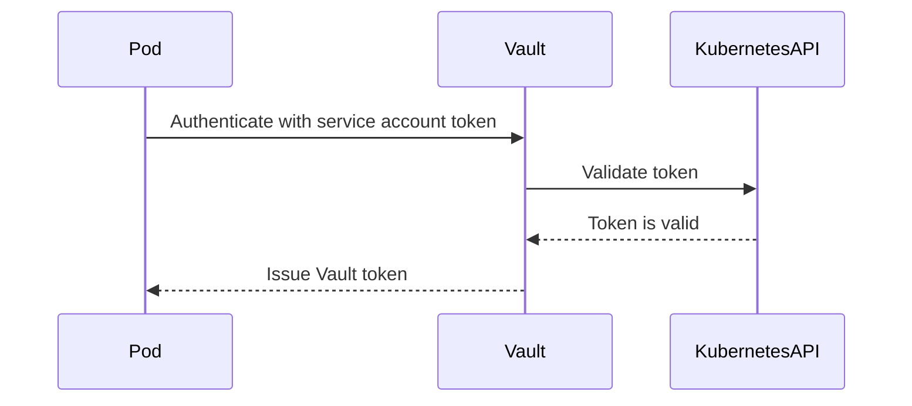
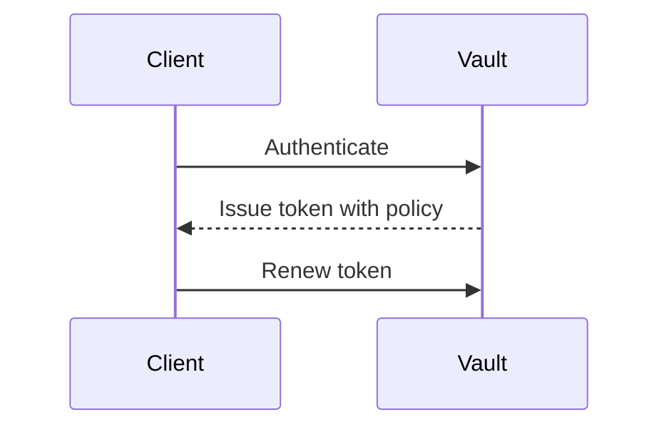

## Introduction to Secrets Management

Secrets management is a critical aspect of modern DevSecOps practices. In today’s complex IT environments, applications often require access to sensitive information such as API keys, database passwords, and encryption keys. Managing these secrets securely is essential to prevent unauthorized access and ensure the confidentiality and integrity of your systems.

Vault, developed by HashiCorp, is one of the most popular tools for managing secrets. It provides a centralized way to store, manage, and distribute secrets securely. This chapter will delve deep into how Vault works, focusing on authentication, authorization, and the lifecycle of secrets.

### What is Vault?

Vault is a tool for securely accessing secrets. A secret is anything that you want to tightly control access to, such as API keys, passwords, certificates, and more. Vault provides a unified interface to any secret backend and can centralize your secrets management.

#### Key Concepts in Vault

- **Secrets**: Any piece of sensitive information that needs to be protected.
- **Identity**: The unique identifier for a client (human or machine) that interacts with Vault.
- **Authentication**: The process of verifying the identity of a client.
- **Authorization**: The process of determining what actions a client is allowed to perform.
- **Policies**: Rules that define the permissions granted to a client based on their identity.
- **Tokens**: Credentials issued by Vault to clients after successful authentication.

### Authentication in Vault

In Vault, authentication is the process of verifying the identity of a client. This is crucial because different clients may have different levels of access to secrets based on their identity. Vault supports various authentication methods, including:

- **Username/Password**
- **LDAP**
- **Kubernetes Service Account Tokens**
- **AWS IAM**

Each authentication method corresponds to a specific path in Vault. For example, the Kubernetes service account token authentication method might be configured at the path `auth/kubernetes`.

#### Example: Kubernetes Service Account Token Authentication

When a Kubernetes pod needs to access secrets stored in Vault, it uses a service account token to authenticate. Here’s how it works:

1. **Service Account Creation**: A Kubernetes service account is created with a specific role.
2. **Token Issuance**: The service account is assigned a token.
3. **Vault Configuration**: Vault is configured to trust the Kubernetes API server and validate tokens issued by it.
4. **Authentication Request**: The pod sends an authentication request to Vault using the service account token.
5. **Token Validation**: Vault validates the token against the Kubernetes API server.
6. **Token Issuance**: If validation is successful, Vault issues a Vault token to the pod.



### Authorization in Vault

Once a client is authenticated, Vault determines what actions the client is allowed to perform through policies. Policies are rules that define the permissions granted to a client based on their identity.

#### Policy Structure

A policy in Vault is a set of rules that specify what paths a client can read, write, list, etc. Policies are defined in HCL (HashiCorp Configuration Language) format.

Example policy:

```hcl
path "secret/data/*" {
  capabilities = ["read", "list"]
}

path "secret/data/sensitive/*" {
  capabilities = ["read"]
}
```

This policy allows the client to read and list all secrets under the `secret/data` path but only read secrets under the `secret/data/sensitive` path.

#### Token and Policy Association

After a client is authenticated, Vault issues a token. This token is associated with a policy that defines the client’s permissions. The token is short-lived and must be renewed periodically.



### Secret Engines in Vault

Vault supports various types of secret engines, which are plugins that generate and store secrets. The simplest secret engine is the Key-Value (KV) store.

#### Key-Value Store

The KV store allows you to store and retrieve secrets as key-value pairs. There are two versions of the KV store: v1 and v2. Version 2 adds additional features like versioning and metadata.

##### Example: Storing and Retrieving Secrets

To store a secret in the KV store:

```bash
vault kv put secret/myapp/api-key api-key=abc123
```

To retrieve a secret:

```bash
vault kv get secret/myapp/api-key
```

#### Secret Engine Configuration

Secret engines are mounted at specific paths in Vault. For example, the KV store might be mounted at `secret/`.

```bash
vault secrets enable -path=secret kv
```

### Token Lifecycle Management

Tokens in Vault are short-lived credentials that must be renewed periodically. This ensures that even if a token is compromised, it can only be used for a limited time.

#### Token Renewal

Tokens can be renewed using the `vault token renew` command. The renewal process checks the token’s expiration and extends its validity.

```bash
vault token renew <token-id>
```

#### Token Revocation

Tokens can also be revoked if they are no longer needed or if there is a suspicion of compromise.

```bash
vault token revoke <token-id>
```

### Real-World Examples and Breaches

Recent breaches have highlighted the importance of proper secrets management. For example, the Capital One breach in 2019 exposed sensitive customer data due to misconfigured AWS IAM roles. Proper use of Vault could have helped mitigate this risk by ensuring that secrets were managed securely and access was strictly controlled.

### How to Prevent / Defend

#### Detection

Regularly audit your Vault configurations and token usage to detect any unauthorized access or suspicious activity. Tools like HashiCorp Boundary can help monitor and enforce access controls.

#### Prevention

- **Use Strong Authentication Methods**: Ensure that strong authentication methods like multi-factor authentication (MFA) are used.
- **Implement Least Privilege Principle**: Grant the minimum necessary permissions to clients.
- **Renew Tokens Regularly**: Ensure that tokens are renewed frequently to minimize exposure in case of compromise.
- **Monitor and Audit**: Regularly monitor and audit Vault logs to detect any unauthorized access.

#### Secure Coding Fixes

Compare the insecure and secure versions of a policy:

**Insecure Policy:**

```hcl
path "secret/data/*" {
  capabilities = ["read", "write", "list", "delete"]
}
```

**Secure Policy:**

```hcl
path "secret/data/*" {
  capabilities = ["read", "list"]
}

path "secret/data/sensitive/*" {
  capabilities = ["read"]
}
```

### Conclusion

Vault is a powerful tool for managing secrets securely. By understanding how authentication, authorization, and secret engines work in Vault, you can effectively manage and protect sensitive information in your DevSecOps environment. Regular auditing and strict adherence to best practices will help ensure that your secrets remain secure.

### Practice Labs

For hands-on experience with Vault, consider the following labs:

- **PortSwigger Web Security Academy**: Offers practical exercises on securing web applications, including the use of Vault.
- **OWASP Juice Shop**: A deliberately insecure web application for practicing security skills, including secrets management.
- **HashiCorp Learn**: Provides interactive tutorials and labs specifically focused on Vault and other HashiCorp tools.

By engaging with these labs, you can gain practical experience in implementing and managing secrets with Vault.

---
<!-- nav -->
[[DevSecOps/DevSecOps Bootcamp/03-Identity & Access Management/03-Secrets Management/How Vault works Vault Deep Dive Part 2/03-Introduction to Secrets Management with Vault|Introduction to Secrets Management with Vault]] | [[DevSecOps/DevSecOps Bootcamp/03-Identity & Access Management/03-Secrets Management/How Vault works Vault Deep Dive Part 2/00-Overview|Overview]] | [[DevSecOps/DevSecOps Bootcamp/03-Identity & Access Management/03-Secrets Management/How Vault works Vault Deep Dive Part 2/05-How Vault Works|How Vault Works]]
