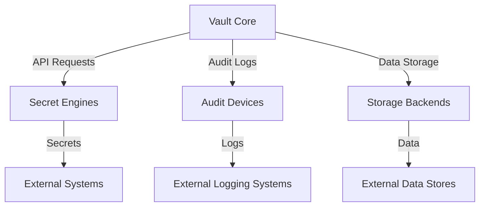

## Secrets Management with HashiCorp Vault

### Introduction to HashiCorp Vault

HashiCorp Vault is a tool designed to help organizations securely manage secrets such as API keys, passwords, and certificates. It provides a centralized and secure way to store, distribute, and manage secrets throughout the development lifecycle. In this section, we will delve deep into how Vault works, focusing on its secret backends, audit trails, and the overall architecture.

### Secret Backends

Vault supports various types of secret backends, which are plugins that allow Vault to interact with different types of secrets and data stores. These backends can be enabled after installing and setting up Vault. Some common secret backends include:

- **AWS Secrets Engine**: Manages AWS credentials and secrets.
- **Azure Secrets Engine**: Manages Azure credentials and secrets.
- **Database Secrets Engine**: Manages database credentials and secrets.
- **Generic Secrets Engine**: Stores arbitrary key-value pairs.

#### Enabling Secret Backends

To enable a secret backend, you need to use the `vault secrets enable` command. Here’s an example of enabling the AWS Secrets Engine:

```sh
vault secrets enable aws
```

This command enables the AWS Secrets Engine, allowing you to manage AWS credentials through Vault.

### Audit Trails

Audit trails are crucial for tracking who accessed what secrets, when, and how often. They provide visibility into the usage of sensitive data and help in detecting potential compromises. Vault achieves this through audit devices, which are components that log all interactions with the Vault API.

#### Audit Devices

Audit devices are configured to stream logs to an external system, such as a file or syslog. You can configure multiple audit devices to ensure redundancy and comprehensive logging.

#### Configuring Audit Devices

To configure an audit device, you need to use the `vault audit enable` command. Here’s an example of enabling a file-based audit device:

```sh
vault audit enable file file_path=/var/log/vault_audit.log
```

This command sets up a file-based audit device that logs all Vault API interactions to `/var/log/vault_audit.log`.

### Detailed Logging

Every operation with Vault is an API request-response cycle. The audit log captures every interaction, including errors. This ensures that you have a complete record of all activities within Vault.

#### Example of Audit Log Entry

Here’s an example of what an audit log entry might look like:

```plaintext
2023-10-01T12:00:00Z [INFO] (request-id=abc123) auth=token path=read response="{"data":{"key":"value"}}"
```

This log entry shows the timestamp, request ID, authentication method, path accessed, and the response data.

### Plugable Architecture Design

Vault’s architecture is designed to be highly modular and extensible. The core functionality is complemented by various plugins, including secret engines, audit devices, and storage backends. This allows organizations to customize Vault to meet their specific needs.

#### Core Components

The core components of Vault include:

- **Core Server**: The main server that handles all requests and responses.
- **Secret Engines**: Plugins that manage different types of secrets.
- **Audit Devices**: Components that log all interactions with the Vault API.
- **Storage Backends**: External systems that store Vault’s data.

### Real-World Examples

#### Recent Breaches and CVEs

Recent breaches and CVEs have highlighted the importance of robust secrets management. For example, the SolarWinds breach (CVE-2020-1014) involved the compromise of API keys and other sensitive information. Proper use of Vault could have helped mitigate such risks by ensuring that secrets were securely managed and audited.

### Pitfalls and Common Mistakes

#### Misconfiguration of Audit Devices

One common mistake is misconfiguring audit devices, leading to incomplete or inaccurate logs. It’s essential to ensure that audit devices are properly configured and tested to capture all necessary information.

#### Insufficient Access Controls

Another pitfall is insufficient access controls. Without proper role-based access control (RBAC), unauthorized users may gain access to sensitive secrets. It’s crucial to implement strict access controls and regularly review permissions.

### How to Prevent / Defend

#### Detection

To detect potential compromises, regularly review audit logs for suspicious activity. Look for patterns such as unauthorized access attempts, unusual access times, or repeated failed login attempts.

#### Prevention

To prevent compromises, implement the following measures:

- **Strict Access Controls**: Use RBAC to ensure that only authorized users have access to secrets.
- **Regular Audits**: Conduct regular audits of audit logs to identify and address any issues.
- **Secure Configuration**: Ensure that Vault is configured securely, with strong encryption and secure storage backends.

#### Secure Coding Fixes

Here’s an example of a vulnerable configuration and its secure counterpart:

**Vulnerable Configuration:**

```json
{
  "backend": "file",
  "options": {
    "path": "/tmp/vault_audit.log"
  }
}
```

**Secure Configuration:**

```json
{
  "backend": "syslog",
  "options": {
    "address": "udp://localhost:514",
    "format": "json"
  }
}
```

In the secure configuration, we use a more secure syslog backend instead of a file-based backend.

### Complete Example

#### Full HTTP Request and Response

Here’s an example of a full HTTP request and response when accessing a secret:

**Request:**

```http
POST /v1/secret/data/my-secret HTTP/1.1
Host: localhost:8200
X-Vault-Token: s.FoKqR9QkOyGmEJj9hU5rYF
Content-Type: application/json

{
  "data": {
    "key": "value"
  }
}
```

**Response:**

```http
HTTP/1.1 200 OK
Content-Type: application/json
Date: Sun, 01 Oct 2023 12:00:00 GMT
X-Vault-Audit-ID: abc123

{
  "request_id": "abc123",
  "lease_id": "",
  "renewable": false,
  "lease_duration": 0,
  "data": {
    "key": "value"
  },
  "wrap_info": null,
  "warnings": null,
  "auth": null
}
```

### Mermaid Diagrams

#### Vault Architecture Diagram



### Hands-On Labs

For practical experience with Vault, consider the following labs:

- **PortSwigger Web Security Academy**: Offers a series of challenges and labs focused on web security, including secrets management.
- **OWASP Juice Shop**: A deliberately insecure web application for practicing web security skills.
- **DVWA (Damn Vulnerable Web Application)**: Another intentionally vulnerable web application for learning web security.

These labs provide a hands-on environment to practice and reinforce the concepts learned about Vault and secrets management.

### Conclusion

Vault is a powerful tool for managing secrets securely. By understanding its architecture, configuring secret backends, and implementing robust audit trails, organizations can significantly enhance their security posture. Regular reviews and strict access controls are essential to prevent and detect potential compromises. With the right setup and practices, Vault can be a cornerstone of your DevSecOps strategy.

---
<!-- nav -->
[[DevSecOps/DevSecOps Bootcamp/03-Identity & Access Management/03-Secrets Management/How Vault works Vault Deep Dive Part 2/05-How Vault Works|How Vault Works]] | [[DevSecOps/DevSecOps Bootcamp/03-Identity & Access Management/03-Secrets Management/How Vault works Vault Deep Dive Part 2/00-Overview|Overview]] | [[07-Secrets Management with HashiCorp Vault Part 2|Secrets Management with HashiCorp Vault Part 2]]
