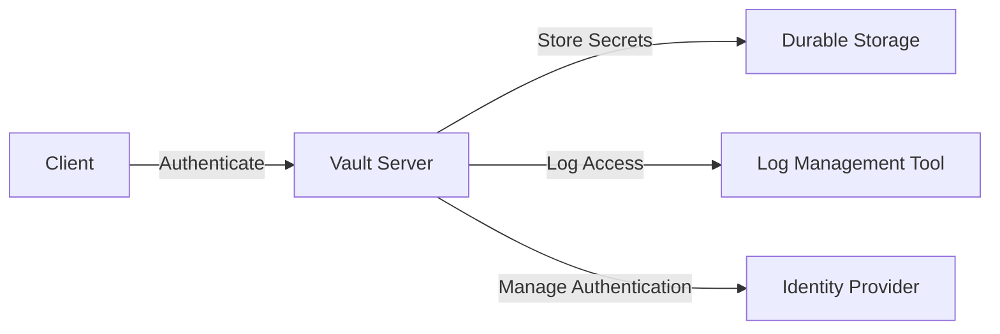

## Secrets Management with HashiCorp Vault

### Introduction to HashiCorp Vault

HashiCorp Vault is a tool designed to manage secrets securely across various environments. A secret can be anything from API keys, database credentials, to encryption keys. The primary goal of Vault is to provide a centralized and secure way to manage these secrets, ensuring that they are only accessible to authorized parties and are stored in a manner that minimizes exposure.

### Architecture of HashiCorp Vault

Vault's architecture is designed to be flexible and scalable, making it easy to integrate with different platforms and services. This flexibility is crucial because it allows organizations to adopt Vault in a variety of environments, whether it's on-premises, in the cloud, or a hybrid setup.

#### Components of Vault Architecture

1. **Server**: The core component of Vault, responsible for managing secrets, authentication, and authorization.
2. **Clients**: Applications or services that interact with Vault to retrieve or store secrets.
3. **Identity Providers (IDPs)**: External systems used for user authentication.
4. **Log Management Tools**: Systems used to log and audit access to secrets.
5. **Durable Storage**: Systems used to persistently store secret data.



### Integration with Different Platforms and Services

Vault's architecture makes it highly adaptable to various environments. Here’s how it integrates with different platforms and services:

1. **Cloud Platforms**: Vault can be deployed on cloud platforms like AWS, Azure, and GCP. It can leverage cloud-specific features such as IAM roles and managed storage solutions.
   
2. **On-Premises Environments**: Vault can be installed on-premises, providing a consistent experience across different deployment models.

3. **Hybrid Environments**: Vault can be used in hybrid environments, combining both cloud and on-premises resources. This ensures that secrets are managed consistently across all environments.

### Managing Clients and Identity Providers

One of the key functionalities of Vault is managing client authentication against different identity providers. This ensures that only authorized users and services can access secrets.

#### Client Authentication

When a client wants to access a secret, it first needs to authenticate itself. This process involves the following steps:

1. **Authentication Request**: The client sends an authentication request to Vault.
2. **Verification**: Vault verifies the client's credentials against the configured identity provider.
3. **Token Issuance**: Upon successful verification, Vault issues a token to the client. This token is used for subsequent requests to access secrets.

#### Identity Providers

Vault supports integration with various identity providers, including:

- **LDAP**: Lightweight Directory Access Protocol.
- **Kerberos**: Network authentication protocol.
- **OAuth**: Open standard for token-based authentication.
- **JWT**: JSON Web Tokens.

Here’s an example of configuring LDAP as an identity provider in Vault:

```bash
# Enable the LDAP auth method
vault auth enable ldap

# Configure LDAP settings
vault write auth/ldap/config \
  url="ldap://ldap.example.com" \
  binddn="cn=admin,dc=example,dc=com" \
  bindpass="adminpassword" \
  userdn="ou=users,dc=example,dc=com" \
  groupdn="ou=groups,dc=example,dc=com"
```

### Logging Access

Logging is a critical aspect of Vault's architecture. It helps in auditing and monitoring access to secrets. Vault supports logging access to different trusted sources of log management tools.

#### Log Management Tools

Common log management tools include:

- **ELK Stack**: Elasticsearch, Logstash, Kibana.
- **Splunk**: Enterprise-grade log management solution.
- **Graylog**: Open-source log management platform.

Here’s an example of configuring logging in Vault:

```bash
# Enable audit logging
vault audit enable file file_path=/var/log/vault_audit.log

# Example of a log entry
{
  "request": {
    "id": "b4c5a2d3-e1f2-a3b4-c5d6-e7f8a9b0c1d2",
    "operation": "read",
    "path": "secret/data/my-secret",
    "remote_address": "192.168.1.100",
    "time": "2023-10-01T12:00:00Z"
  },
  "response": {
    "data": {
      "my_secret_key": "my_secret_value"
    }
  }
}
```

### Storing Secret Data

Vault can store secret data in any durable system. This includes both static and dynamic secrets. Static secrets are those that remain constant, while dynamic secrets are generated on-demand and have a limited lifetime.

#### Static Secrets

Static secrets are typically used for long-lived credentials, such as database usernames and passwords. These secrets are stored in Vault and can be retrieved by clients when needed.

#### Dynamic Secrets

Dynamic secrets are generated on-demand and have a limited lifetime. They are useful for scenarios where short-lived credentials are required, such as temporary database connections.

Here’s an example of storing a static secret in Vault:

```bash
# Write a static secret
vault kv put secret/my-static-secret my_secret_key=my_secret_value

# Retrieve the static secret
vault kv get secret/my-static-secret
```

### Using Different Secret Backends

Vault supports different secret backends, allowing organizations to choose the most appropriate backend based on their requirements. Some common secret backends include:

- **KV (Key-Value)**: Simple key-value storage.
- **Database**: Generates dynamic database credentials.
- **AWS**: Manages AWS secrets and credentials.
- **SSH**: Manages SSH keys.

Here’s an example of using the KV backend to store a secret:

```bash
# Enable the KV secret engine
vault secrets enable -version=2 kv

# Write a secret to the KV backend
vault kv put kv/my-secret my_secret_key=my_secret_value

# Retrieve the secret from the KV backend
vault kv get kv/my-secret
```

### Recent Real-World Examples

Recent breaches and vulnerabilities have highlighted the importance of proper secrets management. For instance:

- **CVE-2021-3278**: A vulnerability in HashiCorp Consul allowed unauthorized access to sensitive data. This underscores the importance of securing secrets and ensuring proper access controls.
- **SolarWinds Supply Chain Attack**: This attack involved the compromise of build servers, leading to the distribution of malicious software. Proper secrets management could have helped mitigate the impact of such attacks.

### Pitfalls and Common Mistakes

While Vault provides robust mechanisms for managing secrets, there are several pitfalls and common mistakes to avoid:

1. **Improper Configuration**: Misconfigurations can lead to unauthorized access. Ensure that all configurations are reviewed and tested.
2. **Insufficient Logging**: Lack of proper logging can make it difficult to audit and monitor access to secrets.
3. **Inadequate Access Controls**: Weak access controls can expose secrets to unauthorized users. Ensure that access controls are properly enforced.

### How to Prevent / Defend

To ensure the security of secrets managed by Vault, follow these best practices:

1. **Proper Configuration**: Review and test all configurations to ensure they are secure.
2. **Robust Logging**: Implement comprehensive logging to monitor and audit access to secrets.
3. **Strong Access Controls**: Enforce strong access controls to limit access to secrets only to authorized users and services.

#### Secure Coding Fixes

Here’s an example of a vulnerable configuration and its secure counterpart:

**Vulnerable Configuration:**

```bash
# Incorrectly configured LDAP settings
vault write auth/ldap/config \
  url="ldap://ldap.example.com" \
  binddn="cn=admin,dc=example,dc=com" \
  bindpass="adminpassword" \
  userdn="ou=users,dc=example,dc=com" \
  groupdn="ou=groups,dc=example,dc=com"
```

**Secure Configuration:**

```bash
# Correctly configured LDAP settings
vault write auth/ldap/config \
  url="ldap://ldap.example.com" \
  binddn="cn=admin,dc=example,dc=com" \
  bindpass="adminpassword" \
  userdn="ou=users,dc=example,dc=com" \
  groupdn="ou=groups,dc=example,dc=com"

# Enable audit logging
vault audit enable file file_path=/var/log/vault_audit.log
```

### Detection and Prevention

To detect and prevent unauthorized access to secrets, implement the following measures:

1. **Regular Audits**: Conduct regular audits of access logs to identify any suspicious activity.
2. **Monitoring**: Set up monitoring to alert on any unusual access patterns.
3. **Hardening**: Harden the configuration of Vault and related components to minimize exposure.

### Hands-On Labs

For practical experience with HashiCorp Vault, consider the following labs:

- **PortSwigger Web Security Academy**: Offers hands-on labs focused on web application security, including sections on secrets management.
- **OWASP Juice Shop**: A deliberately insecure web application for practicing web security skills, including secrets management.
- **DVWA (Damn Vulnerable Web Application)**: Another insecure web application for learning web security, which can be adapted for secrets management exercises.

These labs provide a controlled environment to practice and reinforce the concepts learned about HashiCorp Vault and secrets management.

### Conclusion

HashiCorp Vault is a powerful tool for managing secrets securely across various environments. By understanding its architecture, integrating it with different platforms and services, and implementing best practices, organizations can significantly enhance the security of their secrets. Regular audits, monitoring, and hardening are essential to maintaining the integrity of the secrets management system.

---
<!-- nav -->
[[06-Secrets Management with HashiCorp Vault Part 1|Secrets Management with HashiCorp Vault Part 1]] | [[DevSecOps/DevSecOps Bootcamp/03-Identity & Access Management/03-Secrets Management/How Vault works Vault Deep Dive Part 2/00-Overview|Overview]] | [[08-Secrets Management with HashiCorp Vault|Secrets Management with HashiCorp Vault]]
