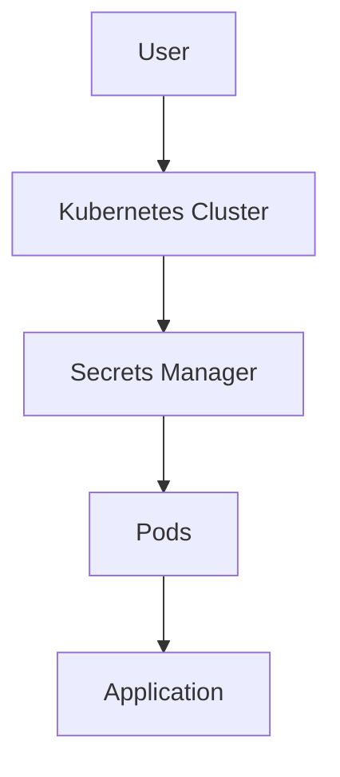

## Secrets Management in Kubernetes

### Introduction to Secrets Management

In modern DevSecOps practices, managing sensitive information such as API keys, passwords, and certificates is crucial. Storing these secrets securely and using them efficiently in a microservices architecture can be challenging. Kubernetes provides a robust mechanism to manage secrets, ensuring they are stored and accessed securely without exposing them in plain text within your pipeline configurations or local machines.

### What Are Secrets?

A secret in Kubernetes is an object that contains a small amount of sensitive data, such as a password, SSH key, or token. This data can then be consumed by pods. Secrets are designed to keep sensitive data out of your application code and configuration files, thereby reducing the risk of exposure.

#### Why Use Secrets?

Using secrets in Kubernetes offers several benefits:

1. **Security**: Secrets are encrypted at rest and in transit, making it harder for unauthorized users to access them.
2. **Convenience**: Secrets can be referenced in pod specifications, allowing you to dynamically inject sensitive data into your applications.
3. **Isolation**: Secrets are isolated from other resources, reducing the risk of accidental exposure.

### Creating and Storing Secrets

To create a secret in Kubernetes, you can use the `kubectl` command-line tool. Here’s an example of creating a secret named `my-secret` with two key-value pairs:

```sh
kubectl create secret generic my-secret --from-literal=key1=value1 --from-literal=key2=value2
```

This command creates a secret named `my-secret` with two keys (`key1` and `key2`) and their corresponding values (`value1` and `value2`). The secret is stored in the default namespace unless specified otherwise.

### Referencing Secrets in Pods

Once a secret is created, you can reference it in your pod specifications. Here’s an example of a pod specification that uses the `my-secret`:

```yaml
apiVersion: v1
kind: Pod
metadata:
  name: my-pod
spec:
  containers:
  - name: my-container
    image: my-image
    env:
    - name: SECRET_KEY1
      valueFrom:
        secretKeyRef:
          name: my-secret
          key: key1
    - name: SECRET_KEY2
      valueFrom:
        secretKeyRef:
          name: my-secret
          key: key2
```

In this example, the `my-pod` container references the `my-secret` secret and injects the values of `key1` and `key2` into environment variables `SECRET_KEY1` and `SECRET_KEY2`.

### Auto-Syncing Secrets

Kubernetes does not automatically sync secrets across different namespaces or clusters. However, you can achieve auto-syncing using tools like HashiCorp Vault or Kubernetes Operators that watch for changes in secrets and update them accordingly.

Here’s an example of using HashiCorp Vault to auto-sync secrets:

1. **Install and Configure HashiCorp Vault**:
   - Install HashiCorp Vault and configure it to integrate with Kubernetes.
   - Create a secret in Vault and enable auto-syncing.

2. **Use Vault in Your Application**:
   - Reference the secret in your application using Vault’s API.

```yaml
apiVersion: v1
kind: Pod
metadata:
  name: my-pod
spec:
  containers:
  - name: my-container
    image: my-image
    env:
    - name: VAULT_SECRET
      valueFrom:
        secretKeyRef:
          name: vault-secret
          key: secret-key
```

### Real-World Examples and Recent Breaches

Recent breaches have highlighted the importance of proper secrets management. For instance, the 2021 SolarWinds breach involved the theft of credentials, leading to widespread compromise. Properly managing secrets can help mitigate such risks.

### Pitfalls and Common Mistakes

1. **Storing Secrets in Plain Text**: Avoid storing secrets in plain text within your application code or configuration files.
2. **Hardcoding Secrets**: Hardcoding secrets in your application can lead to exposure if the code is shared or committed to a public repository.
3. **Improper Access Control**: Ensure that only authorized users and services have access to secrets.

### How to Prevent / Defend

#### Detection

1. **Audit Logs**: Enable audit logs in Kubernetes to track access to secrets.
2. **Monitoring Tools**: Use monitoring tools like Prometheus and Grafana to monitor access patterns and detect anomalies.

#### Prevention

1. **Role-Based Access Control (RBAC)**: Implement RBAC to restrict access to secrets based on roles.
2. **Encryption**: Use encryption to protect secrets both at rest and in transit.

#### Secure Coding Fixes

Here’s an example of a vulnerable and secure way to handle secrets:

**Vulnerable Code**:
```python
import os

# Hardcoded secret
secret = "my-secret-password"

# Use the secret
print(f"Using secret: {secret}")
```

**Secure Code**:
```python
import os

# Retrieve secret from environment variable
secret = os.getenv("SECRET_KEY")

# Use the secret
print(f"Using secret: {secret}")
```

### Complete Example

Let’s walk through a complete example of creating, storing, and using a secret in a Kubernetes cluster.

1. **Create a Secret**:
   ```sh
   kubectl create secret generic my-secret --from-literal=key1=value1 --from-literal=key2=value2
   ```

2. **Define a Pod Specification**:
   ```yaml
   apiVersion: v1
   kind: Pod
   metadata:
     name: my-pod
   spec:
     containers:
     - name: my-container
       image: my-image
       env:
       - name: SECRET_KEY1
         valueFrom:
           secretKeyRef:
             name: my-secret
             key: key1
       - name: SECRET_KEY2
         valueFrom:
           secretKeyRef:
             name:
             key: key2
   ```

3. **Deploy the Pod**:
   ```sh
   kubectl apply -f pod-spec.yaml
   ```

### Mermaid Diagrams

#### Secret Management Architecture



### Hands-On Labs

For hands-on practice with secrets management in Kubernetes, consider the following labs:

- **PortSwigger Web Security Academy**: Offers practical exercises on securing web applications, including handling secrets.
- **OWASP Juice Shop**: Provides a vulnerable web application for practicing security techniques, including secrets management.
- **CloudGoat**: Focuses on cloud security practices, including managing secrets in Kubernetes.

By following these steps and best practices, you can ensure that your secrets are managed securely in a Kubernetes environment, reducing the risk of exposure and enhancing the overall security posture of your applications.

---
<!-- nav -->
[[02-Background Theory on Secrets Management|Background Theory on Secrets Management]] | [[DevSecOps/DevSecOps Bootcamp/03-Identity & Access Management/03-Secrets Management/Use Secret in Microservice Demo Part 3/00-Overview|Overview]] | [[04-Secrets Management in Kubernetes|Secrets Management in Kubernetes]]
