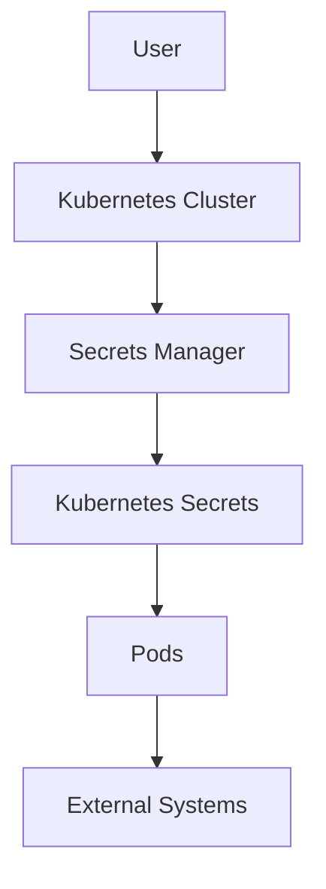

## Secrets Management in Kubernetes

### Kubernetes Native Secrets

Kubernetes provides built-in support for managing secrets through its `Secret` resource. A `Secret` is a Kubernetes object that stores sensitive data, such as passwords, OAuth tokens, or SSH keys, in a secure manner.

#### Creating a Kubernetes Secret

To create a Kubernetes secret, you can use the `kubectl` command-line tool. Here is an example of creating a secret named `my-secret` with a key-value pair:

```bash
kubectl create secret generic my-secret --from-literal=key=value
```

This command creates a secret named `my-secret` with a key `key` and a value `value`.

#### Accessing a Kubernetes Secret

Pods can access secrets by mounting them as volumes or by referencing them in environment variables. Here is an example of a Pod specification that mounts a secret as a volume:

```yaml
apiVersion: v1
kind: Pod
metadata:
  name: my-pod
spec:
  containers:
  - name: my-container
    image: my-image
    volumeMounts:
    - name: secret-volume
      mountPath: /etc/secrets
  volumes:
  - name: secret-volume
    secret:
      secretName: my-secret
```

In this example, the secret `my-secret` is mounted at `/etc/secrets` in the container.

### External Secrets Management Services

While Kubernetes provides native support for secrets, using an external secrets management service can offer additional benefits, such as centralized management, enhanced security features, and integration with other services.

#### Managed AWS Secrets Manager

AWS Secrets Manager is a fully managed service that helps you protect access to your applications, services, and IT resources without requiring you to manage and protect industry-standard master keys. You can store, retrieve, and rotate secrets throughout their lifecycle.

#### Integrating AWS Secrets Manager with Kubernetes

To integrate AWS Secrets Manager with Kubernetes, you can use a third-party operator or a custom solution. One popular approach is to use the `external-secrets` operator, which watches for changes in external secrets and updates Kubernetes secrets accordingly.

Here is an example of a configuration for the `external-secrets` operator:

```yaml
apiVersion: external-secrets.io/v1beta1
kind: ExternalSecret
metadata:
  name: my-external-secret
spec:
  backendType: awssm
  dataFrom:
  - extract:
      key: my-secret-key
      name: my-secret-name
```

In this example, the `ExternalSecret` resource specifies that it should fetch the secret `my-secret-key` from AWS Secrets Manager and store it in a Kubernetes secret named `my-secret-name`.

### Refreshing Secrets in Pods

When secrets are updated externally, the pods that depend on these secrets need to be refreshed to pick up the new values. This can be achieved by restarting the pods or by using a script to reload the configuration.

#### Simulating Pod Restart

To simulate a pod restart, you can delete the pod and let the deployment recreate it. Here is an example of deleting a pod:

```bash
kubectl delete pod my-pod
```

This command deletes the pod named `my-pod`, and the deployment will automatically recreate it.

#### Automating Secret Reload

To automate the process of reloading secrets, you can use a script inside the pod that periodically checks for updates and reloads the configuration. Here is an example of a simple script that checks for updates every minute:

```bash
#!/bin/bash

while true; do
  kubectl get secret my-secret -o json | jq '.data.my-secret-key' > /etc/secrets/my-secret-key
  sleep 60
done
```

In this script, the `kubectl` command retrieves the secret and the `jq` command extracts the value of the key `my-secret-key`. The value is then written to `/etc/secrets/my-secret-key`.

### Mermaid Diagrams

#### Secret Management Architecture

A mermaid diagram can help visualize the architecture of a secrets management system in Kubernetes.



In this diagram, the user interacts with the Kubernetes cluster, which communicates with the secrets manager to retrieve and update secrets. The secrets are then stored in Kubernetes secrets, which are accessed by the pods. The pods can then use these secrets to interact with external systems.

### Pitfalls and Best Practices

#### Common Mistakes

1. **Hardcoding Secrets**: Avoid hardcoding secrets in your application code or configuration files. Instead, use environment variables or secrets management solutions.
2. **Exposing Secrets**: Ensure that secrets are not exposed in logs, error messages, or other outputs. Use proper logging mechanisms that mask sensitive information.
3. **Manual Updates**: Avoid manually updating secrets in production environments. Use automated scripts or operators to handle updates.

#### Best Practices

1. **Use Strong Encryption**: Ensure that secrets are encrypted both at rest and in transit. Use strong encryption algorithms and key management practices.
2. **Limit Access**: Restrict access to secrets to only those who need it. Use role-based access control (RBAC) to enforce least privilege principles.
3. **Regular Audits**: Perform regular audits of your secrets management practices to identify and mitigate potential vulnerabilities.

### How to Prevent / Defend

#### Detection

To detect potential issues with secrets management, you can use tools like `kube-bench` to perform security audits on your Kubernetes cluster. Additionally, you can monitor your cluster for unusual activity using tools like `Falco`.

#### Prevention

To prevent secrets from being exposed, follow these best practices:

1. **Use Secrets Management Solutions**: Utilize secrets management solutions like AWS Secrets Manager or HashiCorp Vault to centralize and secure your secrets.
2. **Automate Secret Rotation**: Implement automated secret rotation to minimize the window of exposure. Use tools like `external-secrets` to manage the lifecycle of your secrets.
3. **Secure Configuration**: Ensure that your Kubernetes configurations are secure. Use RBAC to restrict access to secrets and use encryption to protect sensitive data.

#### Secure Coding Fixes

Here is an example of a vulnerable code snippet that hardcodes a secret:

```python
# Vulnerable code
import requests

API_KEY = "my-secret-key"
response = requests.get("https://example.com/api", headers={"Authorization": f"Bearer {API_KEY}"})
```

And here is the corrected version that uses an environment variable:

```python
# Corrected code
import os
import requests

API_KEY = os.getenv("API_KEY")
response = requests.get("https://example.com/api", headers={"Authorization": f"Bearer {API_KEY}"})
```

In the corrected version, the API key is retrieved from an environment variable, which can be set securely using a secrets management solution.

### Complete Example

#### Full HTTP Request and Response

Here is an example of a full HTTP request and response for retrieving a secret from AWS Secrets Manager:

```http
GET /secretsmanager/get-secret-value HTTP/1.1
Host: secretsmanager.us-east-1.amazonaws.com
Authorization: Bearer <access_token>
X-Amz-Date: 20230915T123456Z
Content-Type: application/x-amz-json-1.1
{
  "SecretId": "my-secret-id"
}
```

Response:

```http
HTTP/1.1 200 OK
Content-Type: application/x-amz-json-1.1
{
  "ARN": "arn:aws:secretsmanager:us-east-1:123456789012:secret:my-secret-id",
  "Name": "my-secret-id",
  "VersionId": "abcd1234-abcd-1234-abcd-1234abcd1234",
  "SecretString": "{\"key\":\"value\"}"
}
```

In this example, the request retrieves the secret with ID `my-secret-id` from AWS Secrets Manager. The response contains the ARN, name, version ID, and the secret string.

#### Full Policy/Config File

Here is an example of a full Kubernetes secret configuration file:

```yaml
apiVersion: v1
kind: Secret
metadata:
  name: my-secret
type: Opaque
data:
  key: dmFsdWU=
```

In this example, the secret `my-secret` contains a key `key` with a base64-encoded value `dmFsdWU=`.

#### Expected Result/Output

The expected result of retrieving the secret is that the value `value` is decoded and made available to the pod.

### Practice Labs

For hands-on experience with secrets management in Kubernetes, consider the following labs:

- **PortSwigger Web Security Academy**: Offers exercises on securing web applications, including handling secrets.
- **OWASP Juice Shop**: Provides a vulnerable web application for practicing security techniques, including secrets management.
- **CloudGoat**: A cloud security training platform that includes exercises on managing secrets in AWS.

These labs provide practical experience in implementing and securing secrets management in real-world scenarios.

By following these guidelines and best practices, you can ensure that your secrets are managed securely in a Kubernetes environment, minimizing the risk of exposure and unauthorized access.

---
<!-- nav -->
[[03-Secrets Management in Kubernetes Part 1|Secrets Management in Kubernetes Part 1]] | [[DevSecOps/DevSecOps Bootcamp/03-Identity & Access Management/03-Secrets Management/Use Secret in Microservice Demo Part 3/00-Overview|Overview]] | [[05-Secrets Management in Microservices|Secrets Management in Microservices]]
