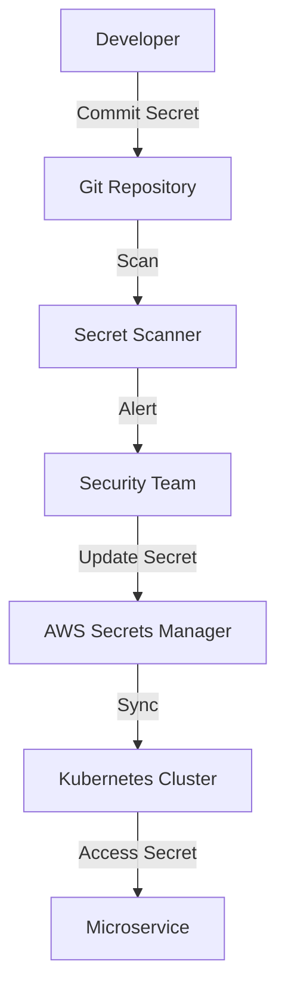

## Secrets Management in Microservices

### Introduction to Secrets Management

Secrets management is a critical aspect of securing applications, especially in microservices architectures where sensitive information such as API keys, database credentials, and encryption keys need to be securely stored and accessed. In a microservices environment, secrets are often managed through a combination of tools and services designed to ensure that these sensitive pieces of data are handled securely and efficiently.

### Key Concepts

#### What is a Secret?

A secret is any piece of sensitive information that needs to be protected. This includes API keys, passwords, encryption keys, and other confidential data. In the context of microservices, secrets are typically used to authenticate and authorize access to various services and databases.

#### Why Manage Secrets Securely?

Managing secrets securely is essential to prevent unauthorized access and potential breaches. If secrets are not properly managed, they can be exposed to attackers, leading to serious security vulnerabilities. For example, if an API key is accidentally committed to a public Git repository, it can be easily exploited by malicious actors.

#### How Secrets Are Managed

Secrets are managed using a variety of tools and services, including:

- **AWS Secrets Manager**: A service provided by Amazon Web Services (AWS) that enables users to store, manage, and retrieve secrets securely.
- **Kubernetes Secrets**: A mechanism within Kubernetes to store and manage sensitive data such as passwords, tokens, and keys.
- **External Secrets Operator**: A tool that integrates with Kubernetes to automatically sync secrets from external sources like AWS Secrets Manager.

### Fetching and Using Secrets in Microservices

In the given scenario, we are fetching a secret from AWS Secrets Manager and making it available to a microservice running in a Kubernetes cluster. Let's break down the process step-by-step.

#### Step 1: Fetching the Secret

To fetch the secret, we first need to ensure that the necessary configurations are in place. This includes setting up the External Secrets Operator and configuring it to sync secrets from AWS Secrets Manager.

```yaml
apiVersion: externalsecrets.io/v1beta1
kind: ExternalSecret
metadata:
  name: payment-service-secret
spec:
  refreshInterval: 1h
  secretStoreRef:
    kind: SecretStore
    name: aws-secrets-manager
  target:
    name: payment-service-secret
    creationPolicy: Owner
  data:
  - key: stripe-secret-key
    name: STRIPE_SECRET_KEY
```

This YAML configuration sets up an `ExternalSecret` resource that specifies the secret key (`stripe-secret-key`) to be fetched from AWS Secrets Manager and made available as an environment variable (`STRIPE_SECRET_KEY`) in the Kubernetes cluster.

#### Step 2: Accessing the Secret in the Microservice

Once the secret is synced to the Kubernetes cluster, it can be accessed by the microservice. Here’s an example of how the secret might be accessed in a Python-based microservice:

```python
import os

stripe_secret_key = os.getenv('STRIPE_SECRET_KEY')
if not stripe_secret_key:
    raise ValueError("Stripe secret key not found")

# Use the secret key to interact with Stripe API
```

### Changing the Secret Value

If the secret value needs to be changed, for instance, due to an accidental check-in of the secret into a Git repository, the process involves updating the secret in AWS Secrets Manager and ensuring that the change is reflected in the Kubernetes cluster.

#### Step 1: Update the Secret in AWS Secrets Manager

First, update the secret value in AWS Secrets Manager. This can be done via the AWS Management Console or programmatically using the AWS SDK.

```python
import boto3

client = boto3.client('secretsmanager')

response = client.update_secret(
    SecretId='stripe-secret-key',
    SecretString='new-stripe-secret-key'
)
```

#### Step 2: Sync the Updated Secret to the Cluster

The External Secrets Operator will automatically sync the updated secret to the Kubernetes cluster based on the configured refresh interval. Once the sync completes, the new secret value will be available to the microservice.

### Real-World Examples and Recent Breaches

#### Example: Accidental Check-in of Secrets

In a real-world scenario, a developer might accidentally commit a secret key to a public Git repository. This happened in a notable breach where a developer committed an AWS access key to a public GitHub repository, leading to unauthorized access to the company's AWS resources.

#### Example: CVE-2021-20225

CVE-2021-20225 is a vulnerability in the Kubernetes Dashboard that allowed unauthorized access to secrets stored in the cluster. This highlights the importance of securing secrets and ensuring that only authorized personnel have access to them.

### How to Prevent / Defend

#### Detection

To detect accidental check-ins of secrets, organizations can implement automated scanning tools that monitor Git repositories for sensitive information. Tools like `git-secrets` and `truffleHog` can be used to scan repositories for secrets and alert developers when they are found.

```bash
# Install git-secrets
brew install git-secrets

# Initialize git-secrets in your repository
git secrets --register-aws
git secrets --install .git

# Scan the repository for secrets
git secrets --scan
```

#### Prevention

To prevent accidental check-ins of secrets, organizations should enforce strict policies around handling sensitive information. This includes:

- **Educating Developers**: Ensure that developers are aware of the risks associated with committing secrets to repositories.
- **Automated Scanning**: Implement automated scanning tools to detect and prevent secrets from being committed.
- **Secure Storage**: Use secure storage solutions like AWS Secrets Manager and Kubernetes Secrets to store sensitive information.

#### Secure Coding Practices

Here’s an example of how to securely handle secrets in code:

**Vulnerable Code:**

```python
import os

stripe_secret_key = os.getenv('STRIPE_SECRET_KEY')
if not stripe_secret_key:
    raise ValueError("Stripe secret key not found")

# Use the secret key to interact with Stripe API
```

**Secure Code:**

```python
import os

stripe_secret_key = os.getenv('STRIPE_SECRET_KEY')
if not stripe_secret_key:
    raise ValueError("Stripe secret key not found")

# Use the secret key to interact with Stripe API
# Ensure that the secret key is not logged or printed in any form
```

### Diagrams and Topologies

#### Mermaid Diagram: Secrets Management Architecture



### Conclusion

Secrets management is a crucial aspect of securing microservices architectures. By using tools like AWS Secrets Manager and Kubernetes Secrets, organizations can ensure that sensitive information is handled securely and efficiently. Additionally, implementing automated scanning tools and enforcing strict policies can help prevent accidental exposure of secrets.

---
<!-- nav -->
[[04-Secrets Management in Kubernetes|Secrets Management in Kubernetes]] | [[DevSecOps/DevSecOps Bootcamp/03-Identity & Access Management/03-Secrets Management/Use Secret in Microservice Demo Part 3/00-Overview|Overview]] | [[06-Using Kubernetes Secrets in Microservices|Using Kubernetes Secrets in Microservices]]
