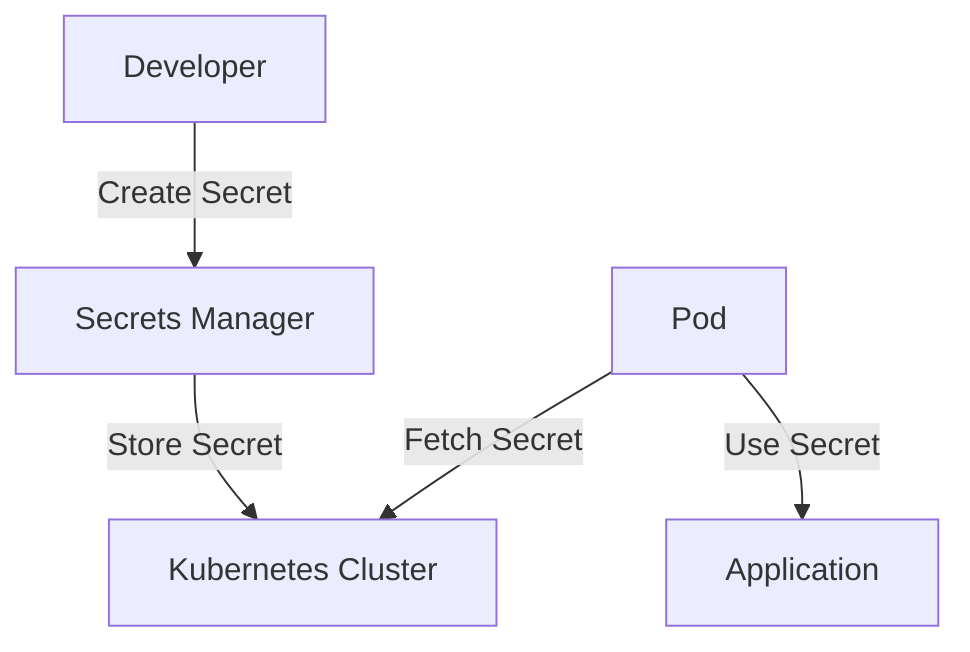
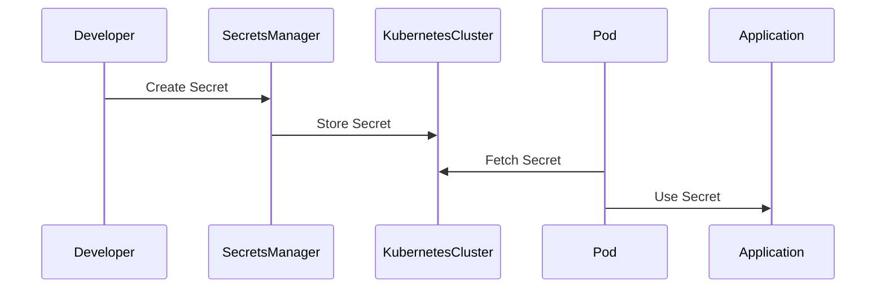

## Using Kubernetes Secrets in Microservices

### What Are Kubernetes Secrets?

Kubernetes Secrets are a way to store sensitive data, such as passwords, OAuth tokens, and SSH keys, within the Kubernetes cluster. They are designed to keep this data secure and make it available to pods as needed.

### How to Use Kubernetes Secrets

There are two primary ways to use Kubernetes secrets in your microservices:

1. **Mounting Secrets as Volumes**
2. **Referencing Secrets in Environment Variables**

#### Mounting Secrets as Volumes

When you mount a secret as a volume, the entire secret is mounted into the pod as a file. This approach is useful when the entire secret needs to be accessible within the pod.

```yaml
apiVersion: v1
kind: Pod
metadata:
  name: my-pod
spec:
  containers:
  - name: my-container
    image: my-image
    volumeMounts:
    - name: secret-volume
      mountPath: /etc/secrets
  volumes:
  - name: secret-volume
    secret:
      secretName: my-secret
```

In this example, the `my-secret` is mounted as a volume at `/etc/secrets` in the pod.

#### Referencing Secrets in Environment Variables

When you reference a secret in an environment variable, you can specify a specific key-value pair from the secret. This approach is useful when only a subset of the secret is needed.

```yaml
apiVersion: v1
kind: Pod
metadata:
  name: my-pod
spec:
  containers:
  - name: my-container
    image: my-image
    env:
    - name: STRIPE_SECRET
      valueFrom:
        secretKeyRef:
          name: my-secret
          key: stripe-key
```

In this example, the `stripe-key` from the `my-secret` is referenced in the `STRIPE_SECRET` environment variable.

### Demonstration: Referencing Secrets in Environment Variables

Let's walk through a detailed demonstration of referencing a secret in an environment variable for a microservice.

#### Step 1: Define the Secret

First, create a secret in Kubernetes. For this example, we will create a secret named `stripe-secret` with a key `stripe-key`.

```bash
kubectl create secret generic stripe-secret --from-literal=stripe-key=sk_test_1234567890
```

This command creates a secret named `stripe-secret` with a key `stripe-key` and a value `sk_test_1234567890`.

#### Step 2: Reference the Secret in the Pod Configuration

Next, update the pod configuration to reference the secret in an environment variable.

```yaml
apiVersion: apps/v1
kind: Deployment
metadata:
  name: payment-service
spec:
  replicas: 1
  selector:
    matchLabels:
      app: payment-service
  template:
    metadata:
      labels:
        app: payment-service
    spec:
      containers:
      - name: payment-service
        image: my-payment-service:latest
        env:
        - name: STRIPE_SECRET
          valueFrom:
            secretKeyRef:
              name: stripe-secret
              key: stripe-key
```

In this configuration, the `STRIPE_SECRET` environment variable is set to the value of the `stripe-key` from the `stripe-secret` secret.

#### Step 3: Apply the Configuration

Apply the updated configuration to the Kubernetes cluster.

```bash
kubectl apply -f payment-service-deployment.yaml
```

This command applies the deployment configuration to the cluster, creating or updating the `payment-service` deployment.

#### Step 4: Verify the Secret Usage

Check the environment variables in the running pod to verify that the secret is correctly referenced.

```bash
kubectl exec -it <pod-name> -- printenv | grep STRIPE_SECRET
```

This command prints the environment variables in the pod and filters for the `STRIPE_SECRET` variable.

### Full HTTP Request and Response Example

Here is a complete example of the HTTP request and response for fetching the secret from the AWS Secrets Manager and using it in the pod.

#### Fetching the Secret from AWS Secrets Manager

```http
GET /secretsmanager/get-secret-value?SecretId=stripe-secret HTTP/1.1
Host: secretsmanager.us-east-1.amazonaws.com
Authorization: Bearer <access-token>
Content-Type: application/x-amz-json-1.1
X-Amz-Target: SecretsManager.GetSecretValue
```

Response:

```http
HTTP/1.1 200 OK
Content-Type: application/json
{
  "ARN": "arn:aws:secretsmanager:us-east-1:123456789012:secret:stripe-secret",
  "Name": "stripe-secret",
  "SecretString": "{\"stripe-key\":\"sk_test_1234567890\"}"
}
```

#### Using the Secret in the Pod

```yaml
apiVersion: v1
kind: Pod
metadata:
  name: payment-service-pod
spec:
  containers:
  - name: payment-service
    image: my-payment-service:latest
    env:
    - name: STRIPE_SECRET
      valueFrom:
        secretKeyRef:
          name: stripe-secret
          key: stripe-key
```

### Common Pitfalls and How to Avoid Them

#### Pitfall 1: Hardcoding Secrets in Code

Hardcoding secrets in code is a common mistake that can lead to exposure of sensitive information. Always use environment variables or secrets managers to manage secrets.

**Secure Coding Fix:**

Vulnerable Code:

```python
stripe_secret = "sk_test_1234567890"
```

Secure Code:

```python
import os

stripe_secret = os.getenv("STRIPE_SECRET")
```

#### Pitfall 2: Improper Access Controls

Improper access controls can allow unauthorized users to access secrets. Ensure that access to secrets is restricted to only those who need it.

**Secure Coding Fix:**

Ensure that the secret is only accessible to the necessary roles and services.

```yaml
apiVersion: rbac.authorization.k8s.io/v1
kind: RoleBinding
metadata:
  name: payment-service-role-binding
subjects:
- kind: ServiceAccount
  name: payment-service-sa
roleRef:
  kind: Role
  name: payment-service-role
  apiGroup: rbac.authorization.k8s.io
```

### How to Prevent / Defend

#### Detection

Regularly audit your secrets management practices to ensure that secrets are properly managed and accessed. Use tools like `kube-bench` to check for compliance with best practices.

#### Prevention

1. **Use Secrets Managers**: Utilize secrets managers like AWS Secrets Manager, HashiCorp Vault, or Azure Key Vault to securely store and manage secrets.
2. **Role-Based Access Control (RBAC)**: Implement RBAC to restrict access to secrets to only those who need it.
3. **Periodic Rotation**: Rotate secrets periodically to minimize the risk of exposure.

#### Secure-Coding Fixes

Compare the vulnerable and secure versions of code side by side.

**Vulnerable Code:**

```python
stripe_secret = "sk_test_1234567890"
```

**Secure Code:**

```python
import os

stripe_secret = os.getenv("STRIPE_SECRET")
```

### Mermaid Diagrams

#### Secrets Management Architecture



#### Request/Response Flow



### Practice Labs

For hands-on practice with secrets management in Kubernetes, consider the following labs:

- **PortSwigger Web Security Academy**: Offers a comprehensive course on web security, including sections on secrets management.
- **OWASP Juice Shop**: A deliberately insecure web application for practicing web security skills.
- **Kubernetes Goat**: A Kubernetes-based security training platform that includes exercises on secrets management.

By following these steps and best practices, you can ensure that your secrets are managed securely and effectively in your Kubernetes environment.

---
<!-- nav -->
[[05-Secrets Management in Microservices|Secrets Management in Microservices]] | [[DevSecOps/DevSecOps Bootcamp/03-Identity & Access Management/03-Secrets Management/Use Secret in Microservice Demo Part 3/00-Overview|Overview]] | [[DevSecOps/DevSecOps Bootcamp/03-Identity & Access Management/03-Secrets Management/Use Secret in Microservice Demo Part 3/07-Practice Questions & Answers|Practice Questions & Answers]]
