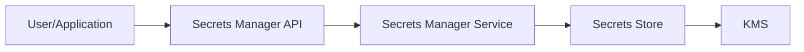

## AWS Secrets Manager

AWS Secrets Manager is a service provided by Amazon Web Services (AWS) that helps you protect access to your applications, services, and IT resources without requiring you to manage the complexity of cryptographic keys. It allows you to easily rotate, manage, and retrieve database credentials, API keys, and other secrets throughout their lifecycle.

### Architecture of AWS Secrets Manager

The architecture of AWS Secrets Manager is designed to ensure secure storage and retrieval of secrets. Here’s a high-level overview:



- **User/Application**: Interacts with AWS Secrets Manager through the API.
- **Secrets Manager API**: Provides an interface for creating, retrieving, and rotating secrets.
- **Secrets Manager Service**: Manages the lifecycle of secrets, including rotation and storage.
- **Secrets Store**: Stores the actual secrets.
- **KMS (Key Management Service)**: Provides encryption keys for securing secrets.

### Creating and Managing Secrets

To create a secret in AWS Secrets Manager, you can use the AWS Management Console, AWS CLI, or SDKs. Here’s an example using the AWS CLI:

```bash
aws secretsmanager create-secret \
    --name MySecret \
    --secret-string '{"username":"myuser","password":"mypassword"}'
```

This command creates a new secret named `MySecret` with a JSON string containing username and password.

### Retrieving Secrets

To retrieve a secret, you can use the following command:

```bash
aws secretsmanager get-secret-value --secret-id MySecret
```

This returns the secret value in the specified format.

### Rotating Secrets

AWS Secrets Manager supports automatic rotation of secrets. You can configure rotation policies to automatically update secrets at regular intervals.

```bash
aws secretsmanager rotate-secret --secret-id MySecret --rotation-lambda-arn arn:aws:lambda:us-west-2:123456789012:function:RotateSecretFunction
```

Here, `RotateSecretFunction` is a Lambda function that handles the rotation logic.

### How to Prevent / Defend

#### Detection

Regularly monitor access logs and audit trails to detect unauthorized access attempts.

#### Prevention

- **Use IAM Policies**: Restrict access to secrets based on least privilege principles.
- **Enable Encryption**: Ensure secrets are encrypted both at rest and in transit.
- **Automate Rotation**: Regularly rotate secrets to minimize exposure.

#### Secure Coding Fixes

**Vulnerable Code Example:**

```python
import boto3

def get_secret():
    client = boto3.client('secretsmanager')
    response = client.get_secret_value(SecretId='MySecret')
    return response['SecretString']
```

**Secure Code Example:**

```python
import boto3
import json

def get_secret():
    client = boto3.client('secretsmanager')
    response = client.get_secret_value(SecretId='MySecret')
    secret_string = response['SecretString']
    secret_dict = json.loads(secret_string)
    return secret_dict
```

### Real-World Example

Consider a scenario where an application uses AWS Secrets Manager to store database credentials. An attacker gains access to the application and attempts to retrieve the credentials. With proper IAM policies and encryption, the attacker would be unable to access the secrets.

---
<!-- nav -->
[[DevSecOps/DevSecOps Bootcamp/03-Identity & Access Management/03-Secrets Management/Why Secrets Manager are needed/06-Introduction to Secrets Management|Introduction to Secrets Management]] | [[DevSecOps/DevSecOps Bootcamp/03-Identity & Access Management/03-Secrets Management/Why Secrets Manager are needed/00-Overview|Overview]] | [[08-HashiCorp Vault|HashiCorp Vault]]
