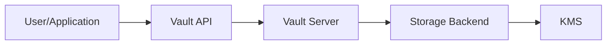

## HashiCorp Vault

HashiCorp Vault is a tool for securely accessing secrets. It is a more comprehensive solution compared to AWS Secrets Manager, offering features like dynamic secrets and encryption as a service.

### Architecture of HashiCorp Vault

Vault's architecture is designed to provide a secure and flexible way to manage secrets. Here’s a high-level overview:



- **User/Application**: Interacts with Vault through the API.
- **Vault API**: Provides an interface for creating, retrieving, and managing secrets.
- **Vault Server**: Manages the lifecycle of secrets, including storage and retrieval.
- **Storage Backend**: Stores the actual secrets.
- **KMS (Key Management Service)**: Provides encryption keys for securing secrets.

### Creating and Managing Secrets

To create a secret in Vault, you can use the Vault CLI or API. Here’s an example using the Vault CLI:

```bash
vault kv put secret/myapp username=myuser password=mypassword
```

This command creates a new secret named `myapp` with a username and password.

### Retrieving Secrets

To retrieve a secret, you can use the following command:

```bash
vault kv get secret/myapp
```

This returns the secret value in the specified format.

### Dynamic Secrets

Vault supports dynamic secrets, which are generated on-demand and have a limited lifetime. This reduces the risk of long-lived secrets being compromised.

```bash
vault secrets enable database
vault write database/config/mydb plugin_name=mysql-database-plugin connection_url="{{username}}:{{password}}@tcp(localhost:3306)/"
vault write database/roles/myrole db_name=mydb sql="CREATE USER '{{name}}'@'%' IDENTIFIED BY '{{password}}'; GRANT SELECT ON * TO '{{name}}'@'%';" ttl=1h
```

Here, `myrole` is a role that generates dynamic MySQL user credentials with a TTL of 1 hour.

### How to Prevent / Defend

#### Detection

Regularly monitor access logs and audit trails to detect unauthorized access attempts.

#### Prevention

- **Use Policies**: Restrict access to secrets based on least privilege principles.
- **Enable Encryption**: Ensure secrets are encrypted both at rest and in transit.
- **Automate Rotation**: Regularly rotate secrets to minimize exposure.

#### Secure Coding Fixes

**Vulnerable Code Example:**

```python
import hvac

client = hvac.Client(url='http://127.0.0.1:8200', token='myroot')
response = client.secrets.kv.v2.read_secret_version(path='myapp')
print(response['data']['data'])
```

**Secure Code Example:**

```python
import hvac

client = hvac.Client(url='http://127.0.0.1:8200', token='myroot')
response = client.secrets.kv.v2.read_secret_version(path='myapp')
secret_data = response['data']['data']
print(secret_data)
```

### Real-World Example

Consider a scenario where an application uses HashiCorp Vault to store database credentials. An attacker gains access to the application and attempts to retrieve the credentials. With proper policies and encryption, the attacker would be unable to access the secrets.

---
<!-- nav -->
[[07-AWS Secrets Manager|AWS Secrets Manager]] | [[DevSecOps/DevSecOps Bootcamp/03-Identity & Access Management/03-Secrets Management/Why Secrets Manager are needed/00-Overview|Overview]] | [[09-Integrating Secrets Management with Kubernetes|Integrating Secrets Management with Kubernetes]]
