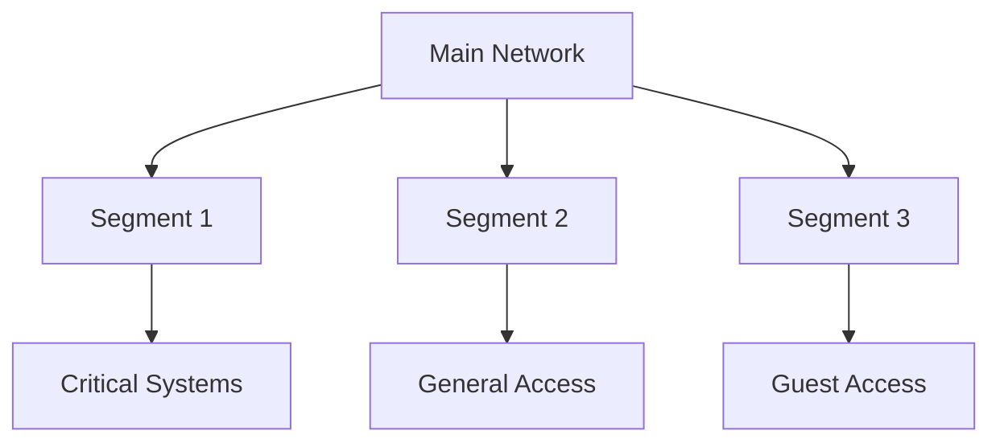
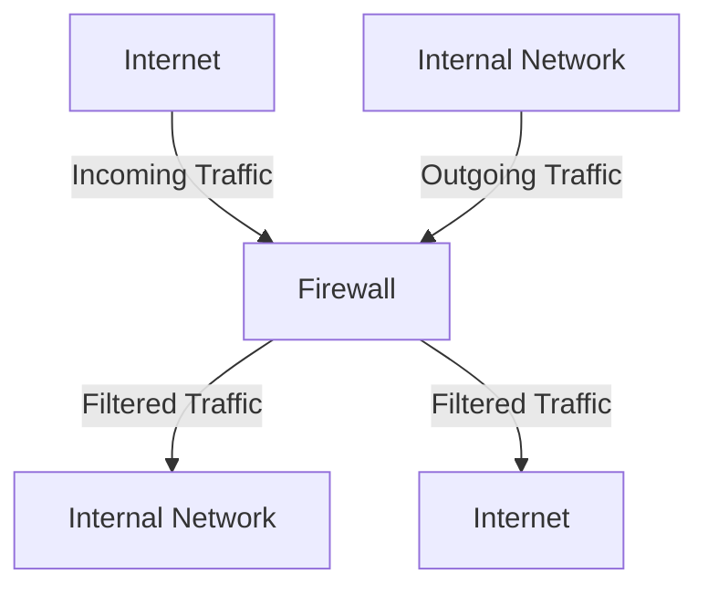
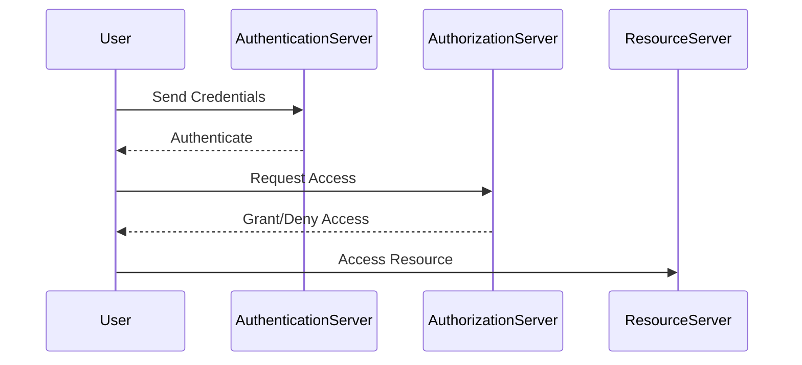

## Introduction to Securing Systems Against Attacks

In the realm of DevSecOps, securing systems against attacks is paramount. Just as a physical bank building might have vulnerabilities such as an open window on the second floor or an unlocked roof deck, digital systems can also have vulnerabilities that allow unauthorized access. This analogy helps us understand the importance of securing both physical and digital assets. In this chapter, we will delve deep into the principles and practices of securing systems against various types of attacks, focusing on application security, network security, and infrastructure security.

### Physical Security Analogy

Imagine a scenario where a thief sneaks into a bank building through an open window on the second floor or via an unlocked roof deck. Once inside, the thief waits until everyone leaves and then proceeds to access various parts of the building, including different rooms and valuable items. This scenario mirrors the digital world where hackers can gain unauthorized access to an internal network and then move laterally within the system to access sensitive data and resources.

#### Digital Security Counterparts

In the digital world, the equivalent of a secure building is a well-secured network. Just as a physical building might have locked rooms to protect valuable assets, a digital network should have layers of security to prevent unauthorized access. These layers include:

- **Network Segmentation**: Dividing the network into smaller segments to limit the spread of an attack.
- **Firewalls**: Acting as barriers to control incoming and outgoing traffic based on predetermined security rules.
- **Access Control**: Ensuring that only authorized users can access specific resources.
- **Encryption**: Protecting data in transit and at rest to prevent unauthorized access.

### Network Security Basics

Network security is crucial for protecting the integrity, confidentiality, and availability of data and resources within a network. Let's explore some key concepts and techniques used in network security.

#### Network Segmentation

Network segmentation involves dividing a larger network into smaller, isolated segments. This approach helps contain potential threats and limits the spread of an attack. For example, critical systems can be placed in a separate segment with stricter security controls.



#### Firewalls

A firewall is a network security device that monitors and controls incoming and outgoing network traffic based on predetermined security rules. Firewalls can be hardware-based, software-based, or a combination of both.



#### Access Control

Access control mechanisms ensure that only authorized users can access specific resources. This includes user authentication, authorization, and accounting (AAA).



### Application Security

Application security focuses on protecting applications from various types of attacks. This includes securing the front-end, back-end, and the underlying infrastructure. Let's dive deeper into the key aspects of application security.

#### Front-End Security

Front-end security involves protecting the user interface (UI) of an application from attacks. Common vulnerabilities include cross-site scripting (XSS), cross-site request forgery (CSRF), and insecure direct object references (IDOR).

##### Cross-Site Scripting (XSS)

XSS occurs when an attacker injects malicious scripts into a trusted website. These scripts can steal cookies, session tokens, and other sensitive information.

**Example Vulnerable Code:**

```html
<!DOCTYPE html>
<html>
<head>
    <title>XSS Example</title>
</head>
<body>
    <h1>Welcome, <?php echo $_GET['name']; ?></h1>
</body>
</html>
```

**Secure Code:**

```html
<!DOCTYPE html>
<html>
<head>
    <title>XSS Example</title>
</head>
<body>
    <h1>Welcome, <?php echo htmlspecialchars($_GET['name'], ENT_QUOTES, 'UTF-8'); ?></h1>
</body>
</html>
```

**Explanation:**
The `htmlspecialchars` function converts special characters to HTML entities, preventing the execution of injected scripts.

##### Cross-Site Request Forgery (CSRF)

CSRF occurs when an attacker tricks a victim into performing unwanted actions on a web application in which they are authenticated.

**Example Vulnerable Code:**

```html
<form action="/transfer" method="POST">
    <input type="hidden" name="amount" value="1000">
    <input type="submit" value="Transfer">
</form>
```

**Secure Code:**

```html
<form action="/transfer" method="POST">
    <input type="hidden" name="amount" value="1000">
    <input type="hidden" name="csrf_token" value="<?php echo $_SESSION['csrf_token']; ?>">
    <input type="submit" value="Transfer">
</form>
```

**Explanation:**
The `csrf_token` ensures that the form submission is valid and not forged.

#### Back-End Security

Back-end security involves protecting the server-side logic and databases from attacks. Common vulnerabilities include SQL injection, remote code execution (RCE), and buffer overflows.

##### SQL Injection

SQL injection occurs when an attacker injects malicious SQL queries into a web application's input fields.

**Example Vulnerable Code:**

```sql
SELECT * FROM users WHERE username = '$username' AND password = '$password';
```

**Secure Code:**

```sql
SELECT * FROM users WHERE username = ? AND password = ?;
```

**Explanation:**
Using parameterized queries prevents the execution of malicious SQL commands.

##### Remote Code Execution (RCE)

RCE occurs when an attacker can execute arbitrary code on the server.

**Example Vulnerable Code:**

```php
eval($_GET['code']);
```

**Secure Code:**

```php
// Avoid using eval() for untrusted input
```

**Explanation:**
Avoiding the use of `eval()` for untrusted input prevents the execution of arbitrary code.

#### Infrastructure Security

Infrastructure security involves protecting the underlying infrastructure, including servers, cloud platforms, and network devices. Common vulnerabilities include misconfigured servers, weak encryption, and unpatched vulnerabilities.

##### Misconfigured Servers

Misconfigured servers can expose sensitive data and allow unauthorized access.

**Example Vulnerable Configuration:**

```yaml
server {
    listen 80;
    server_name example.com;

    location / {
        root /var/www/html;
        index index.html;
    }
}
```

**Secure Configuration:**

```yaml
server {
    listen 80;
    server_name example.com;

    location / {
        root /var/www/html;
        index index.html;
        autoindex off;
        deny all;
    }
}
```

**Explanation:**
Disabling directory listing (`autoindex off`) and denying access to the root directory (`deny all`) prevents unauthorized access.

##### Weak Encryption

Weak encryption can allow attackers to decrypt sensitive data.

**Example Vulnerable Configuration:**

```nginx
server {
    listen 443 ssl;
    ssl_certificate /etc/nginx/ssl/example.crt;
    ssl_certificate_key /etc/nginx/ssl/example.key;
    ssl_protocols TLSv1 TLSv1.1 TLSv1.2;
    ssl_ciphers HIGH:!aNULL:!MD5;
}
```

**Secure Configuration:**

```nginx
server {
    listen 443 ssl;
    ssl_certificate /etc/nginx/ssl/example.crt;
    ssl_certificate_key /etc/nginx/ssl/example.key;
    ssl_protocols TLSv1.2 TLSv1.3;
    ssl_ciphers HIGH:!aNULL:!MD5:!SHA1:!AES128;
}
```

**Explanation:**
Using strong encryption protocols (`TLSv1.2` and `TLSv1.3`) and ciphers (`HIGH:!aNULL:!MD5:!SHA1:!AES128`) ensures that data is securely encrypted.

##### Unpatched Vulnerabilities

Unpatched vulnerabilities can allow attackers to exploit known weaknesses.

**Example Vulnerable System:**

```bash
$ sudo apt update
$ sudo apt upgrade
```

**Secure System:**

```bash
$ sudo apt update
$ sudo apt upgrade
$ sudo apt install --only-upgrade <package-name>
```

**Explanation:**
Regularly updating and patching systems ensures that known vulnerabilities are addressed.

### Real-World Examples

Let's look at some recent real-world examples of security breaches and how they could have been prevented.

#### Equifax Data Breach (2017)

Equifax suffered a massive data breach due to an unpatched Apache Struts vulnerability. The attackers exploited the vulnerability to gain access to sensitive personal information.

**Vulnerable Code:**

```java
public class UserController {
    @RequestMapping(value = "/user/{id}", method = RequestMethod.GET)
    public String getUser(@PathVariable("id") int id) {
        // Retrieve user details from database
    }
}
```

**Secure Code:**

```java
public class UserController {
    @RequestMapping(value = "/user/{id}", method = RequestMethod.GET)
    public String getUser(@PathVariable("id") int id) {
        // Validate user input
        if (id <= 0) {
            throw new IllegalArgumentException("Invalid user ID");
        }
        // Retrieve user details from database
    }
}
```

**Explanation:**
Validating user input and keeping software up-to-date with security patches can prevent such vulnerabilities.

#### Capital One Data Breach (2019)

Capital One suffered a data breach due to a misconfigured web application firewall (WAF). The attacker exploited the misconfiguration to access sensitive customer data.

**Vulnerable Configuration:**

```json
{
  "rules": [
    {
      "ruleId": "1",
      "priority": 1,
      "action": "allow",
      "match": {
        "request": {
          "method": "GET",
          "path": "/api/v1/customers"
        }
      }
    }
  ]
}
```

**Secure Configuration:**

```json
{
  "rules": [
    {
      "ruleId": "1",
      "priority": 1,
      "action": "allow",
      "match": {
        "request": {
          "method": "GET",
          "path": "/api/v1/customers",
          "headers": {
            "Authorization": "Bearer .*"
          }
        }
      }
    }
  ]
}
```

**Explanation:**
Adding proper authentication checks to the WAF rules can prevent unauthorized access.

### How to Prevent / Defend

To effectively prevent and defend against attacks, it is essential to implement a multi-layered security strategy. Here are some key steps:

#### Implement Strong Authentication Mechanisms

Strong authentication mechanisms, such as multi-factor authentication (MFA), can significantly reduce the risk of unauthorized access.

**Example Implementation:**

```bash
$ sudo apt install libpam-google-authenticator
$ google-authenticator
```

**Explanation:**
Enabling MFA requires users to provide a second factor, such as a time-based one-time password (TOTP), in addition to their username and password.

#### Regularly Update and Patch Systems

Regularly updating and patching systems ensures that known vulnerabilities are addressed.

**Example Command:**

```bash
$ sudo apt update && sudo apt upgrade
```

**Explanation:**
Running regular updates and upgrades ensures that the system is protected against known vulnerabilities.

#### Conduct Regular Security Audits and Penetration Testing

Regular security audits and penetration testing can help identify and address vulnerabilities before they can be exploited.

**Example Tools:**

- **Nmap**: Network scanning tool
- **Metasploit**: Penetration testing framework
- **Burp Suite**: Web application security testing tool

**Explanation:**
Using these tools can help identify vulnerabilities and test the effectiveness of security measures.

### Hands-On Labs

To gain practical experience in securing systems against attacks, consider the following hands-on labs:

- **PortSwigger Web Security Academy**: Offers interactive labs for learning web application security.
- **OWASP Juice Shop**: A deliberately insecure web application for practicing web security skills.
- **DVWA (Damn Vulnerable Web Application)**: A PHP/MySQL web application that contains numerous security vulnerabilities.
- **WebGoat**: An interactive, gamified training environment for learning web application security.

These labs provide a safe environment to practice and learn about securing systems against various types of attacks.

### Conclusion

Securing systems against attacks is a critical aspect of DevSecOps. By implementing strong authentication mechanisms, regularly updating and patching systems, and conducting regular security audits and penetration testing, organizations can significantly reduce the risk of unauthorized access and data breaches. Understanding the principles and practices of network security, application security, and infrastructure security is essential for building and maintaining secure systems.

---
<!-- nav -->
[[01-Introduction to Application Security|Introduction to Application Security]] | [[DevSecOps/DevSecOps Bootcamp/03-Identity & Access Management/04-Security Essentials/02-How to Secure Systems Against Attacks/00-Overview|Overview]] | [[03-Understanding Multi-Layered Security|Understanding Multi-Layered Security]]
