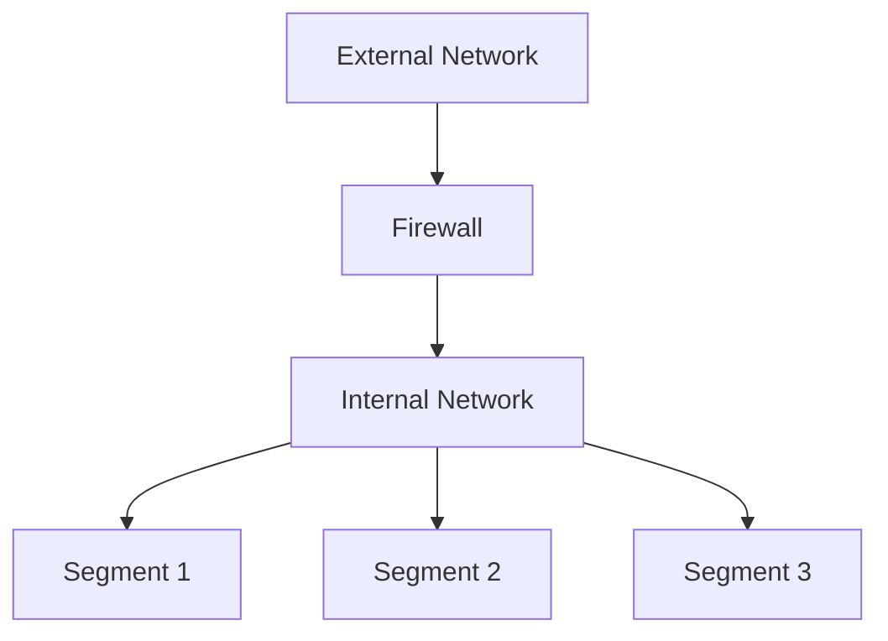
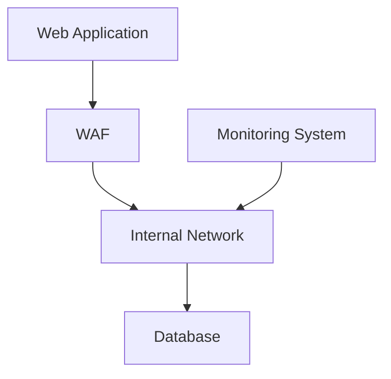

## Understanding Multi-Layered Security

In the realm of cybersecurity, the concept of multi-layered security is paramount. Just as a physical building such as a bank headquarters employs various layers of security—entrance guards, surveillance cameras, locked rooms, and biometric checks—a digital infrastructure must also implement multiple layers of protection to safeguard against unauthorized access and cyber threats.

### Physical Security Analogy

Consider a large bank building. The first layer of security is the exterior perimeter, which includes fences, gates, and security personnel. This is akin to the external firewall that protects an organization’s network from unauthorized access. The next layer might be the entrance itself, where visitors are required to present identification and pass through metal detectors. This is similar to the authentication mechanisms used in digital environments, such as username/password combinations or multi-factor authentication (MFA).

Further inside, there are additional layers of security. For instance, certain areas within the building may require specific clearance levels, and access is granted only to authorized personnel. Similarly, in a digital environment, different levels of access control can be implemented based on roles and responsibilities. For example, an employee in the finance department might have access to financial records but not to HR data.

### Digital Security Layers

In a digital context, multi-layered security can be broken down into several key components:

1. **Network Security**: This involves protecting the network infrastructure from unauthorized access and ensuring that only legitimate traffic is allowed to pass through. This includes firewalls, intrusion detection systems (IDS), and intrusion prevention systems (IPS).

2. **Endpoint Security**: This focuses on securing individual devices such as laptops, desktops, and mobile devices. This includes antivirus software, endpoint detection and response (EDR) tools, and encryption.

3. **Application Security**: This involves securing the applications themselves, both those developed in-house and third-party applications. This includes secure coding practices, input validation, and regular security assessments.

4. **Data Security**: This involves protecting the data stored within the organization. This includes encryption, access controls, and regular backups.

5. **Identity and Access Management (IAM)**: This involves managing user identities and controlling their access to resources. This includes authentication mechanisms, authorization policies, and role-based access control (RBAC).

### Real-World Examples

#### Example 1: Equifax Data Breach (CVE-2017-5638)

In 2017, Equifax suffered a massive data breach that exposed sensitive information of over 143 million customers. The breach was caused by a vulnerability in Apache Struts, a popular web application framework. The attackers exploited a flaw in the framework to gain access to the Equifax network and steal personal data.

**What Went Wrong:**
- Lack of proper patch management: The vulnerability had been publicly disclosed and a patch was available, but Equifax failed to apply it in a timely manner.
- Insufficient network segmentation: Once the attackers gained access, they were able to move laterally within the network, accessing sensitive data.

**How to Prevent / Defend:**

- **Patch Management**: Regularly update and patch all systems to ensure they are protected against known vulnerabilities.
- **Network Segmentation**: Implement network segmentation to limit the spread of attacks. This involves dividing the network into smaller segments and applying strict access controls between them.



#### Example 2: Capital One Data Breach (CVE-2019-11510)

In 2019, Capital One suffered a data breach that exposed the personal information of over 100 million customers. The breach was caused by a misconfigured web application firewall (WAF) that allowed an attacker to access sensitive data.

**What Went Wrong:**
- Misconfiguration: The WAF was improperly configured, allowing the attacker to bypass security controls.
- Lack of monitoring: There was insufficient monitoring and logging in place to detect the breach in a timely manner.

**How to Prevent / Defend:**

- **Configuration Management**: Ensure that all security controls are properly configured and regularly reviewed.
- **Monitoring and Logging**: Implement robust monitoring and logging to detect and respond to suspicious activity.



### Detailed Explanation of Each Layer

#### Network Security

Network security involves protecting the network infrastructure from unauthorized access and ensuring that only legitimate traffic is allowed to pass through. This includes:

- **Firewalls**: Firewalls act as a barrier between trusted internal networks and untrusted external networks, such as the internet. They can be configured to allow or deny traffic based on predefined rules.
  
  ```mermaid
graph TD
      A[Internet] --> B[Firewall]
      B --> C[Internal Network]
```

- **Intrusion Detection Systems (IDS)**: IDS monitor network traffic for signs of malicious activity and alert administrators when suspicious behavior is detected.
  
  ```mermaid
graph TD
      A[Network Traffic] --> B[IDS]
      B --> C[Alert]
```

- **Intrusion Prevention Systems (IPS)**: IPS not only detect but also prevent malicious activity by blocking traffic that matches known attack signatures.
  
  ```mermaid
graph TD
      A[Network Traffic] --> B[IPS]
      B --> C[Block Malicious Traffic]
```

#### Endpoint Security

Endpoint security focuses on securing individual devices such as laptops, desktops, and mobile devices. This includes:

- **Antivirus Software**: Antivirus software detects and removes malware from endpoints.
  
  ```mermaid
graph TD
      A[Malware] --> B[Antivirus]
      B --> C[Remove Malware]
```

- **Endpoint Detection and Response (EDR)**: EDR tools provide real-time monitoring and response capabilities to detect and mitigate threats on endpoints.
  
  ```mermaid
graph TD
      A[Endpoint] --> B[EDR]
      B --> C[Monitor and Respond]
```

- **Encryption**: Encryption ensures that data stored on endpoints is protected even if the device is lost or stolen.
  
  ```mermaid
graph TD
      A[Data] --> B[Encryption]
      B --> C[Encrypted Data]
```

#### Application Security

Application security involves securing the applications themselves, both those developed in-house and third-party applications. This includes:

- **Secure Coding Practices**: Secure coding practices involve writing code that is free from vulnerabilities and follows best practices for security.
  
  ```mermaid
graph TD
      A[Code] --> B[Static Analysis]
      B --> C[Find Vulnerabilities]
```

- **Input Validation**: Input validation ensures that user inputs are checked for validity before being processed by the application.
  
  ```mermaid
graph TD
      A[User Input] --> B[Validation]
      B --> C[Process Valid Input]
```

- **Security Assessments**: Regular security assessments, such as penetration testing and vulnerability scanning, help identify and remediate security weaknesses.
  
  ```mermaid
graph TD
      A[Application] --> B[Penetration Testing]
      B --> C[Identify Vulnerabilities]
```

#### Data Security

Data security involves protecting the data stored within the organization. This includes:

- **Encryption**: Encryption ensures that data is protected even if it is accessed by unauthorized parties.
  
  ```mermaid
graph TD
      A[Data] --> B[Encryption]
      B --> C[Encrypted Data]
```

- **Access Controls**: Access controls ensure that only authorized users have access to sensitive data.
  
  ```mermaid
graph TD
      A[User] --> B[Access Control]
      B --> C[Authorized Access]
```

- **Regular Backups**: Regular backups ensure that data can be restored in the event of a loss or corruption.
  
  ```mermaid
graph TD
      A[Data] --> B[Backup]
      B --> C[Restore Data]
```

#### Identity and Access Management (IAM)

Identity and access management (IAM) involves managing user identities and controlling their access to resources. This includes:

- **Authentication Mechanisms**: Authentication mechanisms verify the identity of users before granting access to resources.
  
  ```mermaid
graph TD
      A[User] --> B[Authentication]
      B --> C[Verify Identity]
```

- **Authorization Policies**: Authorization policies define what actions users are permitted to perform based on their roles and responsibilities.
  
  ```mermaid
graph TD
      A[User] --> B[Authorization]
      B --> C[Permitted Actions]
```

- **Role-Based Access Control (RBAC)**: RBAC assigns permissions based on the roles of users within the organization.
  
  ```mermaid
graph TD
      A[User] --> B[Role]
      B --> C[Permissions]
```

### Common Pitfalls and Best Practices

#### Common Pitfalls

- **Insufficient Patch Management**: Failing to apply security patches in a timely manner can leave systems vulnerable to known exploits.
- **Misconfiguration**: Improperly configuring security controls can render them ineffective.
- **Lack of Monitoring**: Failing to monitor and log network activity can make it difficult to detect and respond to security incidents.
- **Weak Authentication Mechanisms**: Using weak or easily guessable passwords can make it easy for attackers to gain unauthorized access.

#### Best Practices

- **Regular Patch Management**: Regularly update and patch all systems to ensure they are protected against known vulnerabilities.
- **Proper Configuration**: Ensure that all security controls are properly configured and regularly reviewed.
- **Robust Monitoring and Logging**: Implement robust monitoring and logging to detect and respond to suspicious activity.
- **Strong Authentication Mechanisms**: Use strong authentication mechanisms, such as multi-factor authentication (MFA), to protect against unauthorized access.

### Hands-On Labs

To gain practical experience with implementing multi-layered security, consider the following hands-on labs:

- **PortSwigger Web Security Academy**: Offers interactive labs to practice web application security techniques.
- **OWASP Juice Shop**: A deliberately insecure web application for practicing web security skills.
- **DVWA (Damn Vulnerable Web Application)**: A PHP/MySQL web application that demonstrates web application vulnerabilities.
- **WebGoat**: An interactive, gamified training application for learning about web application security.

By understanding and implementing multi-layered security, organizations can significantly reduce their risk of cyber attacks and protect their valuable assets.

---

This expanded explanation covers the essential concepts of multi-layered security, provides real-world examples, and includes detailed explanations, code snippets, and mermaid diagrams to illustrate the points. The "How to Prevent / Defend" section offers practical advice on how to implement effective security measures.

---
<!-- nav -->
[[02-Introduction to Securing Systems Against Attacks|Introduction to Securing Systems Against Attacks]] | [[DevSecOps/DevSecOps Bootcamp/03-Identity & Access Management/04-Security Essentials/02-How to Secure Systems Against Attacks/00-Overview|Overview]] | [[DevSecOps/DevSecOps Bootcamp/03-Identity & Access Management/04-Security Essentials/02-How to Secure Systems Against Attacks/04-Practice Questions & Answers|Practice Questions & Answers]]
