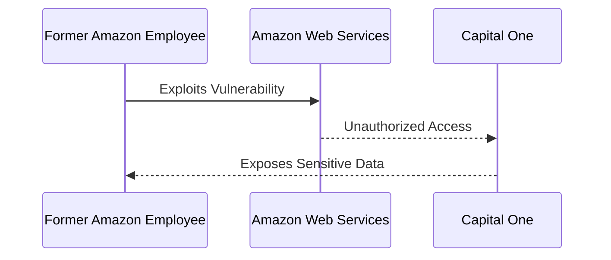

## Introduction to Security Essentials in DevSecOps

In the realm of DevSecOps, ensuring the security of applications and services is paramount. This chapter delves into the importance of security, particularly within the context of cloud services such as AWS. We will explore the shared responsibility model, the impact of security breaches, and how to secure your AWS environment effectively.

### Shared Responsibility Model in AWS

The shared responsibility model in AWS divides security responsibilities between AWS and the customer. AWS is responsible for securing the infrastructure, including the hardware, software, networking, and facilities that run all of the services offered by AWS. On the other hand, the customer is responsible for securing their own applications, data, and access to AWS resources.

#### AWS Responsibilities

AWS manages the following aspects:

- **Physical Security**: Securing the data centers and physical infrastructure.
- **Network Security**: Ensuring the network infrastructure is secure.
- **Software Security**: Patching and maintaining the underlying operating systems and software.

#### Customer Responsibilities

Customers must manage the following aspects:

- **Identity and Access Management (IAM)**: Configuring IAM policies and roles to control access to AWS resources.
- **Application Security**: Implementing security controls within the application itself.
- **Data Encryption**: Encrypting data both in transit and at rest.
- **Security Groups and Network ACLs**: Configuring these to control inbound and outbound traffic.

### Importance of Security in Cloud Services

Security breaches can have severe consequences, especially for large organizations that handle vast amounts of sensitive data. These organizations are often targeted by attackers due to the potential value of the data they possess. Let's delve into some recent real-world examples to understand the impact of security breaches.

#### Real-World Example: Capital One Data Breach

One of the most notable breaches occurred in 2019 when Capital One, an AWS customer, suffered a significant data breach. A former Amazon employee exploited vulnerabilities in AWS's infrastructure to gain unauthorized access to Capital One's data. As a result, sensitive personal information of over 100 million customers was exposed.



This breach highlights the critical nature of securing both the cloud provider's infrastructure and the customer's applications and data.

### Security Measures for Large Companies

Large companies often implement robust security measures to protect their data. However, the sheer volume of data and the complexity of their systems make them attractive targets for attackers. Here are some key security measures that large companies should consider:

#### Identity and Access Management (IAM)

IAM is crucial for controlling access to AWS resources. Properly configured IAM policies and roles ensure that users and services have only the necessary permissions to perform their tasks.

```yaml
# Example IAM Policy
{
    "Version": "2012-10-17",
    "Statement": [
        {
            "Effect": "Allow",
            "Action": [
                "s3:GetObject",
                "s3:PutObject"
            ],
            "Resource": "arn:aws:s3:::my-bucket/*"
        }
    ]
}
```

#### Network Security

Network security involves configuring security groups and network access control lists (ACLs) to control inbound and outbound traffic.

```yaml
# Example Security Group Rule
{
    "IpPermissions": [
        {
            "FromPort": 80,
            "ToPort": 80,
            "IpProtocol": "tcp",
            "UserIdGroupPairs": [],
            "IpRanges": [
                {
                    "CidrIp": "0.0.0.0/0"
                }
            ]
        }
    ]
}
```

#### Data Encryption

Encrypting data both in transit and at rest is essential to protect sensitive information.

```yaml
# Example KMS Key Configuration
{
    "KeyId": "alias/my-key",
    "Description": "My encryption key",
    "Enabled": true,
    "KeyUsage": "ENCRYPT_DECRYPT"
}
```

### How to Prevent and Defend Against Security Breaches

Preventing and defending against security breaches requires a multi-layered approach. Here are some key strategies:

#### Detection

Implementing monitoring and logging mechanisms helps detect potential security incidents early.

```yaml
# Example CloudTrail Configuration
{
    "Name": "my-cloudtrail",
    "S3BucketName": "my-bucket",
    "IncludeGlobalServiceEvents": true,
    "IsMultiRegionTrail": true
}
```

#### Prevention

Properly configuring IAM policies, security groups, and encryption mechanisms can prevent unauthorized access and data exposure.

#### Secure Coding Practices

Writing secure code is crucial to prevent vulnerabilities. Here’s an example of a vulnerable code snippet and its secure counterpart:

```python
# Vulnerable Code
import boto3
s3 = boto3.client('s3')
response = s3.get_object(Bucket='my-bucket', Key='my-key')
print(response['Body'].read())

# Secure Code
import boto3
from botocore.exceptions import ClientError
s3 = boto3.client('s3')
try:
    response = s3.get_object(Bucket='my-bucket', Key='my-key')
    print(response['Body'].read())
except ClientError as e:
    print(f"Error: {e}")
```

### Hands-On Labs for Practice

To gain practical experience with these concepts, consider the following labs:

- **PortSwigger Web Security Academy**: Offers interactive labs to practice web application security.
- **OWASP Juice Shop**: A deliberately insecure web application for practicing web security.
- **CloudGoat**: Provides hands-on labs to practice securing AWS environments.

By thoroughly understanding and implementing these security measures, you can significantly reduce the risk of security breaches and protect your organization's sensitive data.

### Conclusion

In conclusion, the shared responsibility model in AWS emphasizes the importance of both AWS and the customer in securing the environment. Real-world examples like the Capital One data breach highlight the severe consequences of security breaches. By implementing robust security measures, detecting potential threats, and writing secure code, you can effectively defend against attacks and protect your organization's data.

---
<!-- nav -->
[[DevSecOps/DevSecOps Bootcamp/03-Identity & Access Management/04-Security Essentials/Importance of Security Impact of Security Breaches/00-Overview|Overview]] | [[02-Introduction to Security Essentials Part 1|Introduction to Security Essentials Part 1]]
