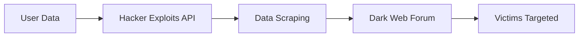
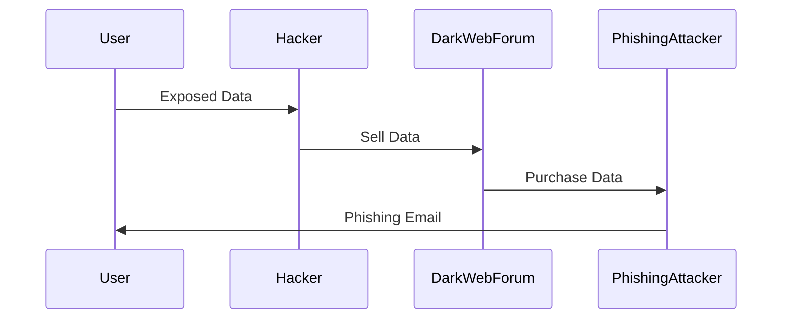
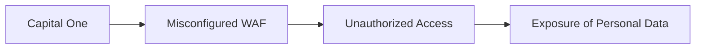
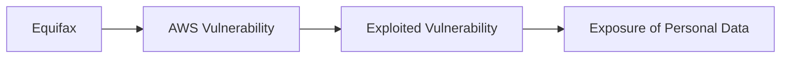
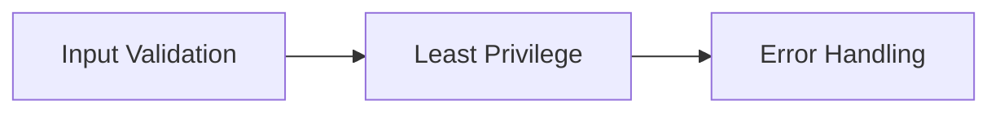

## Introduction to Security Essentials

Security is a critical aspect of modern computing and business operations. In the context of DevSecOps, ensuring the security of systems and data is paramount. This chapter will delve into the importance of security, the impact of security breaches, and provide a comprehensive overview of how to prevent and defend against such breaches.

### Importance of Security

Implementing robust security measures is essential for protecting sensitive data, maintaining trust with customers, and ensuring compliance with regulatory requirements. However, the cost of implementing security measures can be substantial. For instance, a company might need to allocate significant resources, such as $150 million, to enforce more stringent data security measures after experiencing a breach.

#### Example: LinkedIn Data Breach

One notable example is the LinkedIn data breach, which affected approximately 700 million users. The breach occurred when a hacker exploited LinkedIn's API through data scraping techniques to gather user data. Although the data did not contain highly sensitive personal information, it included email addresses, phone numbers, geolocation records, gender, and other social media details.



### Impact of Security Breaches

The impact of security breaches can be severe and far-reaching. Beyond the immediate financial costs, breaches can lead to reputational damage, loss of customer trust, and legal consequences. In the case of LinkedIn, the breach resulted in a large-scale exposure of user data, which could be used for various malicious activities.

#### Retargeting Victims with Phishing Attacks

Even seemingly innocuous data can be leveraged by cybercriminals to launch targeted phishing attacks. With a vast database of personal information, attackers can craft highly convincing phishing emails that appear to come from trusted sources, increasing the likelihood of success.



### Recent Real-World Examples

To further illustrate the impact of security breaches, let's examine some recent real-world examples:

#### Example 1: Capital One Data Breach (CVE-2019-11510)

In 2019, Capital One experienced a data breach that exposed the personal information of over 100 million customers. The breach occurred due to a misconfigured web application firewall (WAF) that allowed unauthorized access to sensitive data.



#### Example 2: Equifax Data Breach (CVE-2017-5638)

In 2017, Equifax suffered a massive data breach that compromised the personal information of over 143 million consumers. The breach was caused by a vulnerability in Apache Struts, which was not patched in a timely manner.



### How to Prevent and Defend Against Security Breaches

Preventing and defending against security breaches requires a multi-faceted approach that includes both technical and organizational measures.

#### Secure Coding Practices

Secure coding practices are essential for preventing vulnerabilities that can be exploited by attackers. Here are some key principles:

1. **Input Validation**: Always validate input data to ensure it meets expected formats and constraints.
2. **Least Privilege**: Limit permissions to the minimum necessary for a given task.
3. **Error Handling**: Implement proper error handling to avoid exposing sensitive information.



#### Example: Secure Input Validation

Consider a web application that accepts user input. Without proper validation, an attacker could inject malicious code. Here’s an example of insecure versus secure input validation:

**Insecure Code:**
```python
def process_input(user_input):
    # Process user input without validation
    exec(user_input)
```

**Secure Code:**
```python
import re

def process_input(user_input):
    # Validate user input using regular expressions
    if re.match(r'^[a-zA-Z0-9\s]+$', user_input):
        # Process validated input
        print("Valid input:", user_input)
    else:
        print("Invalid input")
```

#### Configuration Hardening

Hardening configurations is another crucial aspect of security. This involves securing system configurations to minimize attack surfaces.

**Example: Securing Nginx Configuration**

Here’s an example of a secure Nginx configuration:

**Vulnerable Configuration:**
```nginx
server {
    listen 80;
    server_name example.com;

    location / {
        root /var/www/html;
        index index.html;
    }
}
```

**Secure Configuration:**
```nginx
server {
    listen 80 default_server;
    server_name _;

    location / {
        root /var/www/html;
        index index.html;
        deny all;
    }

    location = /robots.txt {
        allow all;
        root /var/www/html;
    }

    location ~* \.(js|css|png|jpg|jpeg|gif|ico)$ {
        expires max;
        log_not_found off;
    }
}
```

#### Detection and Monitoring

Effective detection and monitoring mechanisms are essential for identifying and responding to security incidents promptly.

**Example: Using SIEM Tools**

SIEM (Security Information and Event Management) tools can help monitor and analyze security events in real-time. Here’s an example of configuring a SIEM tool to detect suspicious activity:

**SIEM Rule: Detect Unauthorized Access Attempts**
```json
{
    "name": "Unauthorized Access Attempts",
    "description": "Detects repeated failed login attempts",
    "condition": "failed_login_attempts > 5",
    "actions": [
        {
            "type": "alert",
            "message": "Suspicious login activity detected"
        },
        {
            "type": "block_ip",
            "ip_address": "{{source_ip}}"
        }
    ]
}
```

### Hands-On Labs

To gain practical experience with security essentials, consider the following hands-on labs:

- **PortSwigger Web Security Academy**: Offers a wide range of web security challenges and tutorials.
- **OWASP Juice Shop**: An intentionally vulnerable web application for practicing web security skills.
- **DVWA (Damn Vulnerable Web Application)**: A PHP/MySQL web application that demonstrates web application vulnerabilities.

By combining theoretical knowledge with practical experience, you can develop a robust understanding of security essentials and effectively protect systems and data.

### Conclusion

Security is a critical component of modern computing and business operations. Understanding the importance of security, the impact of breaches, and implementing preventive measures are essential for maintaining the integrity and confidentiality of data. By following secure coding practices, hardening configurations, and employing effective detection and monitoring mechanisms, you can significantly reduce the risk of security breaches and protect your organization from potential threats.

---
<!-- nav -->
[[DevSecOps/DevSecOps Bootcamp/03-Identity & Access Management/04-Security Essentials/Importance of Security Impact of Security Breaches/01-Introduction to Security Essentials in DevSecOps|Introduction to Security Essentials in DevSecOps]] | [[DevSecOps/DevSecOps Bootcamp/03-Identity & Access Management/04-Security Essentials/Importance of Security Impact of Security Breaches/00-Overview|Overview]] | [[03-Introduction to Security Essentials Part 2|Introduction to Security Essentials Part 2]]
