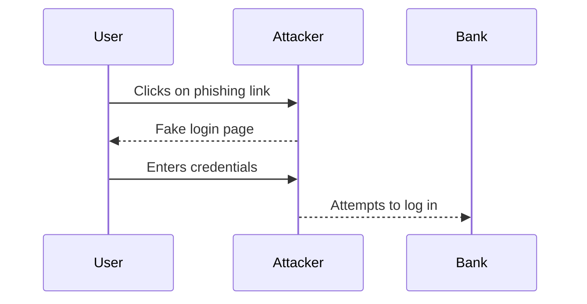

## Introduction to Security Essentials

Security is a critical aspect of modern computing and business operations. In the context of DevSecOps, ensuring the security of systems and data is paramount. This chapter will delve into the importance of security and the impact of security breaches, providing a comprehensive understanding of the subject.

### What is Security?

Security refers to the measures taken to protect systems, networks, and data from unauthorized access, theft, damage, or disruption. It encompasses various aspects such as confidentiality, integrity, and availability (the CIA triad).

- **Confidentiality**: Ensuring that sensitive information is accessible only to authorized individuals.
- **Integrity**: Maintaining the accuracy and completeness of data.
- **Availability**: Ensuring that resources are accessible to authorized users when needed.

### Why is Security Important?

Security is crucial for several reasons:

1. **Protection of Data**: Sensitive information such as personal data, financial records, and intellectual property must be protected from unauthorized access.
2. **Trust and Reputation**: A security breach can severely damage a company’s reputation and erode customer trust.
3. **Legal Compliance**: Many industries are subject to regulatory requirements that mandate specific security measures.
4. **Operational Continuity**: Security breaches can disrupt business operations, leading to financial losses and operational downtime.

### How Does Security Work Under the Hood?

Security mechanisms typically involve a combination of hardware, software, and policies. Key components include:

- **Authentication**: Verifying the identity of users or systems.
- **Authorization**: Determining what actions an authenticated entity is allowed to perform.
- **Encryption**: Protecting data by converting it into a coded format that can only be deciphered with a key.
- **Firewalls**: Network security systems that monitor and control incoming and outgoing traffic based on predetermined security rules.
- **Intrusion Detection Systems (IDS)**: Tools that monitor network traffic for suspicious activity and alert administrators.

### Social Engineering Attacks

Social engineering attacks are a significant threat vector. These attacks manipulate individuals into divulging confidential information or performing actions that compromise security.

#### What is Social Engineering?

Social engineering involves psychological manipulation to trick individuals into breaking normal security procedures. Common techniques include:

- **Phishing**: Sending fraudulent emails or messages that appear to come from trusted sources.
- **Pretexting**: Creating a fabricated scenario to gain the victim’s trust.
- **Baiting**: Offering something enticing to lure victims into a trap.

#### Real-World Example: Phishing Attack

A recent phishing attack involved attackers sending emails that appeared to come from a trusted financial institution. The email contained a link to a fake login page designed to capture victims’ credentials.

#### How to Prevent / Defend Against Social Engineering Attacks

- **Education and Training**: Regularly train employees on recognizing and responding to social engineering attempts.
- **Multi-Factor Authentication (MFA)**: Implement MFA to add an additional layer of security.
- **Email Filters**: Use advanced email filters to detect and block phishing attempts.
- **Secure Coding Practices**: Ensure that applications are developed with security in mind, using frameworks and libraries that are less susceptible to injection attacks.

### Real-World Example: Adobe Data Breach

In 2013, Adobe suffered a significant data breach where hackers stole millions of encrypted customer credit card records and logging data of tens of millions of user accounts. The breach included customer names, passwords, debit and credit card information, and other sensitive data.

#### Impact of the Adobe Data Breach

The breach had severe consequences for Adobe:

- **Financial Losses**: Adobe incurred substantial costs, including $1.2 million in legal fees.
- **Reputation Damage**: The breach significantly damaged Adobe’s reputation and eroded customer trust.
- **Regulatory Penalties**: Adobe faced penalties for not properly disclosing the extent of the breach.

#### How to Prevent / Defend Against Data Breaches

- **Data Encryption**: Encrypt sensitive data both at rest and in transit.
- **Access Controls**: Implement strict access controls and least privilege principles.
- **Regular Audits**: Conduct regular security audits and penetration testing.
- **Incident Response Plan**: Develop and maintain an effective incident response plan to quickly address and mitigate breaches.

### Recent Real-World Examples of Security Breaches

Several high-profile breaches have occurred in recent years, highlighting the ongoing threat landscape:

- **Equifax Data Breach (2017)**: Hackers accessed sensitive data of approximately 147 million consumers.
- **Capital One Data Breach (2019)**: A hacker accessed sensitive data of over 100 million customers and small businesses.
- **SolarWinds Supply Chain Attack (2020)**: Hackers compromised SolarWinds software, affecting numerous organizations.

#### How to Detect and Mitigate Security Breaches

- **Monitoring and Logging**: Implement robust monitoring and logging to detect unusual activity.
- **Patch Management**: Keep systems and software up to date with the latest security patches.
- **Network Segmentation**: Segment networks to limit the spread of attacks.
- **Security Awareness**: Foster a culture of security awareness among all employees.

### Hands-On Labs for Practice

To gain practical experience with security concepts, consider the following labs:

- **PortSwigger Web Security Academy**: Offers interactive labs to practice web application security.
- **OWASP Juice Shop**: A deliberately insecure web application for learning and practicing security skills.
- **DVWA (Damn Vulnerable Web Application)**: A PHP/MySQL web application that demonstrates web application vulnerabilities.
- **WebGoat**: An interactive, gamified training application for learning web security.

### Conclusion

Security is a fundamental aspect of DevSecOps, essential for protecting systems, data, and reputations. Understanding the importance of security and the impact of breaches is crucial for implementing effective security measures. By staying informed about the latest threats and best practices, organizations can better defend against security incidents and maintain operational continuity.

---

This chapter provides a comprehensive overview of security essentials, covering the importance of security, the impact of breaches, and practical steps to prevent and mitigate security issues. Through detailed explanations, real-world examples, and hands-on labs, readers will gain a deep understanding of the subject matter.

---
<!-- nav -->
[[02-Introduction to Security Essentials Part 1|Introduction to Security Essentials Part 1]] | [[DevSecOps/DevSecOps Bootcamp/03-Identity & Access Management/04-Security Essentials/Importance of Security Impact of Security Breaches/00-Overview|Overview]] | [[04-Introduction to Security Essentials|Introduction to Security Essentials]]
