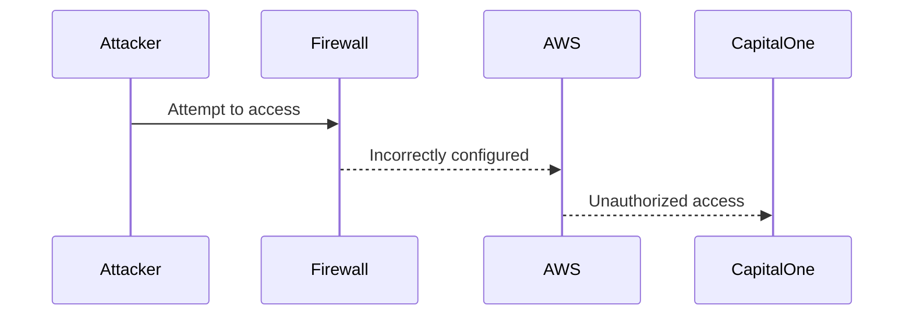
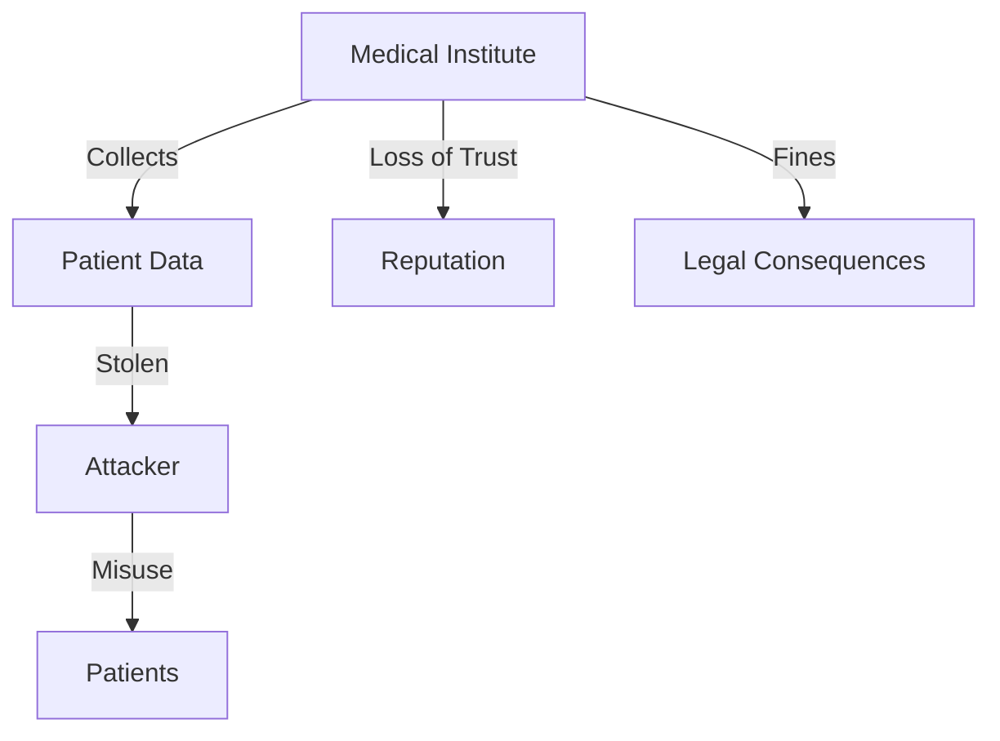

## Introduction to Security Essentials

Security is a critical aspect of modern business operations, particularly in the digital age where data breaches can have severe financial, reputational, and legal consequences. This chapter delves into the importance of security, focusing on real-world examples and providing detailed explanations of how breaches occur and how they can be prevented.

### Understanding Data Sensitivity

Data sensitivity refers to the degree to which certain types of information must be protected. Examples of highly sensitive data include:

- **Social Security Numbers (SSNs):** These are unique identifiers used for tax purposes and other government services. Exposure can lead to identity theft.
- **Bank Account Numbers:** Financial details that, if compromised, can result in unauthorized transactions and financial loss.
- **Credit Card Information:** Similar to bank accounts, credit card details can be used for fraudulent purchases.
- **Transaction Data:** Details of financial transactions can reveal patterns and habits, making them valuable to attackers.

#### Real-World Example: Capital One Data Breach

In 2019, Capital One suffered a significant data breach affecting approximately 100 million customers. The breach was attributed to a misconfigured firewall on the AWS side. This incident highlights the importance of proper security configurations and the potential consequences of negligence.



### Impact of Security Breaches

The impact of a security breach can be multifaceted, affecting both the organization and its stakeholders. Here are some key areas of concern:

- **Financial Losses:** Direct costs such as fines, legal fees, and compensation to affected parties.
- **Reputational Damage:** Loss of trust among customers and partners.
- **Operational Disruption:** Downtime and resource allocation to address the breach.
- **Legal Consequences:** Potential lawsuits and regulatory penalties.

#### Medical Institute Scenario

Consider a medical institute that handles sensitive patient data. A breach could occur through various means, including physical theft or cyber attacks. The consequences are severe:

- **Patient Privacy Violation:** Misuse of personal health information can lead to discrimination, blackmail, or other forms of exploitation.
- **Reputational Damage:** Patients may lose trust in the institution, leading to a decline in patient volume.
- **Legal Implications:** Non-compliance with regulations such as HIPAA can result in hefty fines and legal action.



### How to Prevent / Defend Against Security Breaches

Preventing security breaches requires a multi-layered approach, encompassing technical measures, policies, and training.

#### Technical Measures

1. **Network Security:**
   - **Firewalls:** Ensure firewalls are correctly configured to block unauthorized access.
   - **Intrusion Detection Systems (IDS):** Monitor network traffic for suspicious activity.
   - **Encryption:** Use encryption to protect sensitive data both at rest and in transit.

2. **Access Control:**
   - **Least Privilege Principle:** Grant users the minimum level of access necessary to perform their job functions.
   - **Multi-Factor Authentication (MFA):** Require additional verification steps to access systems.

3. **Regular Audits:**
   - **Penetration Testing:** Conduct regular penetration tests to identify vulnerabilities.
   - **Compliance Checks:** Ensure adherence to industry standards and regulations.

#### Policy and Training

1. **Security Policies:**
   - Develop comprehensive security policies that cover all aspects of data handling and protection.
   - Regularly review and update policies to reflect new threats and technologies.

2. **Employee Training:**
   - Provide ongoing training to employees on security best practices and awareness.
   - Conduct simulated phishing exercises to test and improve employee vigilance.

#### Secure Coding Practices

Secure coding is crucial to preventing vulnerabilities that can be exploited by attackers. Here are some best practices:

1. **Input Validation:**
   - Validate all user inputs to prevent injection attacks.
   - Example of insecure code:
     ```python
     # Insecure code
     user_input = input("Enter your name: ")
     query = f"SELECT * FROM users WHERE name = '{user_input}'"
     ```

   - Secure code:
     ```python
     # Secure code
     import sqlite3
     conn = sqlite3.connect('database.db')
     cursor = conn.cursor()
     user_input = input("Enter your name: ")
     cursor.execute("SELECT * FROM users WHERE name = ?", (user_input,))
     ```

2. **Error Handling:**
   - Avoid exposing sensitive information through error messages.
   - Example of insecure code:
     ```python
     # Insecure code
     try:
         # Some operation that might fail
         pass
     except Exception as e:
         print(f"An error occurred: {e}")
     ```

   - Secure code:
     ```python
     # Secure code
     try:
         # Some operation that might fail
         pass
     except Exception as e:
         logging.error(f"An error occurred: {e}")
     ```

#### Configuration Hardening

Hardening configurations ensures that systems are less vulnerable to attacks. Here are some examples:

1. **Web Server Configuration:**
   - Disable unnecessary modules and features.
   - Example of insecure configuration:
     ```nginx
     # Insecure configuration
     server {
         listen 80;
         server_name example.com;
         location / {
             root /var/www/html;
             index index.html;
         }
     }
     ```

   - Secure configuration:
     ```nginx
     # Secure configuration
     server {
         listen 80 default_server;
         server_name _;
         return 444;
     }

     server {
         listen 80;
         server_name example.com;
         location / {
             root /var/www/html;
             index index.html;
         }
         location ~ /\.ht {
             deny all;
         }
     }
     ```

2. **Database Configuration:**
   - Limit database permissions to the minimum required.
   - Example of insecure configuration:
     ```sql
     -- Insecure configuration
     GRANT ALL PRIVILEGES ON *.* TO 'user'@'%';
     ```

   - Secure configuration:
     ```sql
     -- Secure configuration
     GRANT SELECT, INSERT, UPDATE, DELETE ON database_name.* TO 'user'@'localhost';
     ```

### Conclusion

Security is paramount in today’s digital landscape. Organizations must implement robust security measures to protect sensitive data and mitigate the risks associated with breaches. By understanding the importance of security, recognizing the impact of breaches, and implementing effective preventive measures, organizations can safeguard their assets and maintain trust with their stakeholders.

### Hands-On Labs

For practical experience in web application security, consider the following labs:

- **PortSwigger Web Security Academy:** Offers interactive challenges to learn about various web security concepts.
- **OWASP Juice Shop:** A deliberately insecure web application for practicing web security skills.
- **DVWA (Damn Vulnerable Web Application):** A PHP/MySQL web application that demonstrates insecure coding practices.
- **WebGoat:** An interactive lab environment for learning about web application security.

These labs provide real-world scenarios and hands-on experience to reinforce the theoretical knowledge covered in this chapter.

---
<!-- nav -->
[[03-Introduction to Security Essentials Part 2|Introduction to Security Essentials Part 2]] | [[DevSecOps/DevSecOps Bootcamp/03-Identity & Access Management/04-Security Essentials/Importance of Security Impact of Security Breaches/00-Overview|Overview]] | [[05-What Is Security|What Is Security]]
