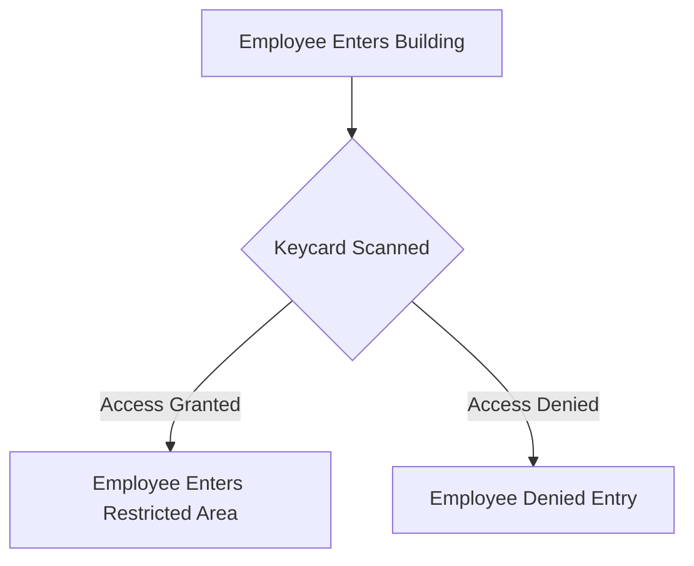
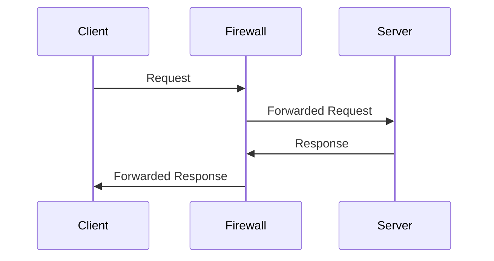
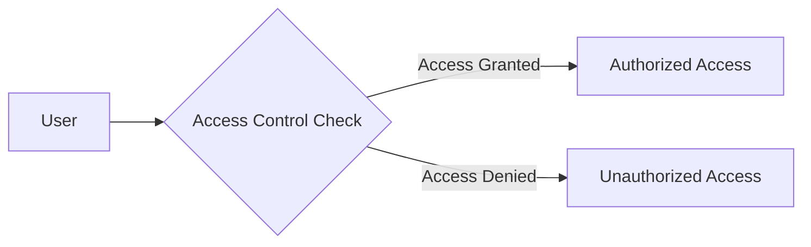
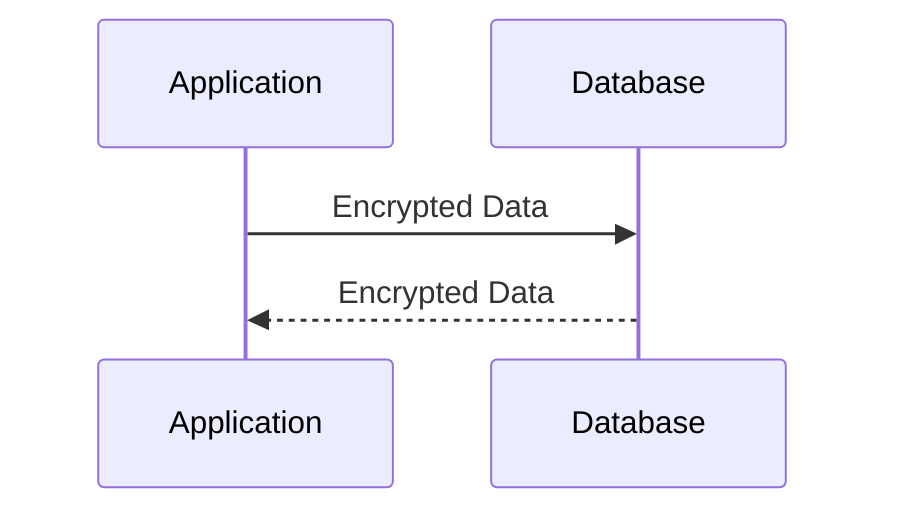
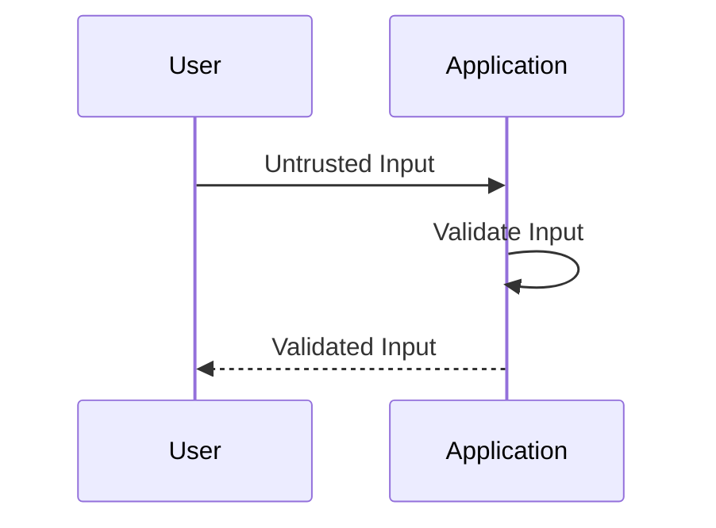
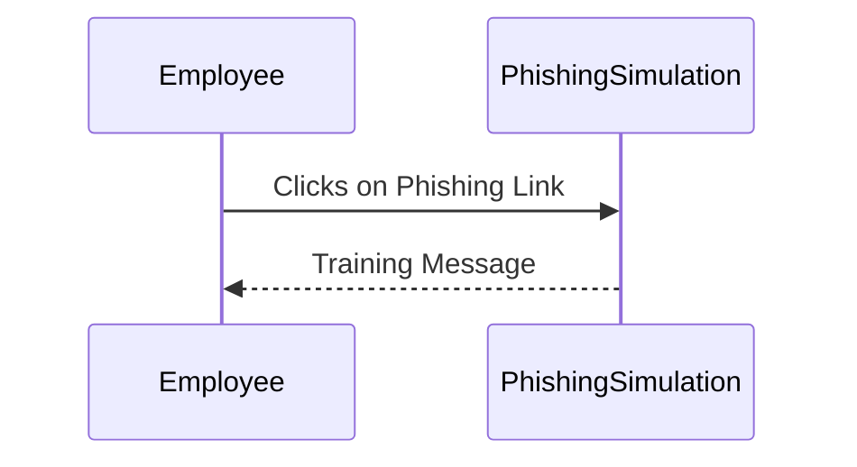
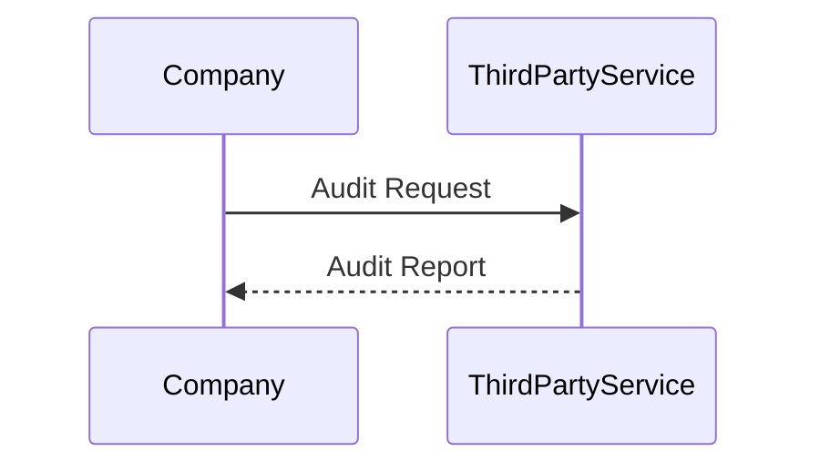

## How to Prevent / Defend

To prevent and defend against security breaches, companies should implement a comprehensive security strategy that includes:

- **Physical Security Measures**: Implementing robust physical security measures such as keycard access, biometric scanners, and security personnel.
- **Network Security Measures**: Implementing robust network security measures such as firewalls, intrusion detection systems, and encryption.
- **Server Security Measures**: Implementing robust server security measures such as regular patching, access controls, and monitoring.
- **Database Security Measures**: Implementing robust database security measures such as encryption, access controls, and regular backups.
- **Application Security Measures**: Implementing robust application security measures such as input validation, output encoding, and regular security testing.
- **Employee Training and Awareness Programs**: Implementing robust employee training and awareness programs to educate employees about security best practices and potential threats.
- **Third-Party Service Security Measures**: Implementing robust third-party service security measures such as regular audits, access controls, and monitoring.

### Physical Security Measures

Physical security measures can include:

- **Keycard Access**: Requiring employees to use keycards to access restricted areas.
- **Biometric Scanners**: Using biometric scanners to verify employee identities.
- **Security Personnel**: Employing security personnel to monitor and control access to restricted areas.

#### Example: Keycard Access

### Network Security Measures

Network security measures can include:

- **Firewalls**: Implementing firewalls to control incoming and outgoing network traffic based on predetermined security rules.
- **Intrusion Detection Systems (IDS)**: Implementing IDS to monitor network traffic for suspicious activity and alert administrators.
- **Encryption**: Implementing encryption to protect data in transit and at rest.

#### Example: Firewall Configuration

### Server Security Measures

Server security measures can include:

- **Regular Patching**: Regularly applying security patches to address known vulnerabilities.
- **Access Controls**: Implementing access controls to restrict access to sensitive data and systems.
- **Monitoring**: Implementing monitoring to detect and respond to suspicious activity.

#### Example: Access Control Configuration

### Database Security Measures

Database security measures can include:

- **Encryption**: Implementing encryption to protect sensitive data stored in databases.
- **Access Controls**: Implementing access controls to restrict access to sensitive data.
- **Regular Backups**: Implementing regular backups to ensure data can be recovered in case of a breach.

#### Example: Encryption Configuration

### Application Security Measures

Application security measures can include:

- **Input Validation**: Implementing input validation to prevent injection attacks.
- **Output Encoding**: Implementing output encoding to prevent cross-site scripting (XSS) attacks.
- **Regular Security Testing**: Implementing regular security testing to identify and address vulnerabilities.

#### Example: Input Validation Configuration

### Employee Training and Awareness Programs

Employee training and awareness programs can include:

- **Phishing Simulations**: Conducting phishing simulations to train employees on recognizing and responding to phishing attempts.
- **Security Best Practices**: Educating employees on security best practices such as strong password policies and secure browsing habits.
- **Incident Reporting**: Educating employees on how to report security incidents and potential threats.

#### Example: Phishing Simulation

### Third-Party Service Security Measures

Third-party service security measures can include:

- **Regular Audits**: Conducting regular audits of third-party services to ensure compliance with security requirements.
- **Access Controls**: Implementing access controls to restrict access to sensitive data and systems.
- **Monitoring**: Implementing monitoring to detect and respond to suspicious activity.

#### Example: Third-Party Service Audit

---
<!-- nav -->
[[05-What Is Security|What Is Security]] | [[DevSecOps/DevSecOps Bootcamp/03-Identity & Access Management/04-Security Essentials/Importance of Security Impact of Security Breaches/00-Overview|Overview]] | [[07-Impact of Security Breaches|Impact of Security Breaches]]
