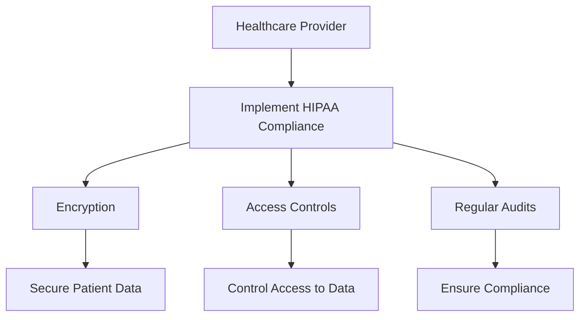
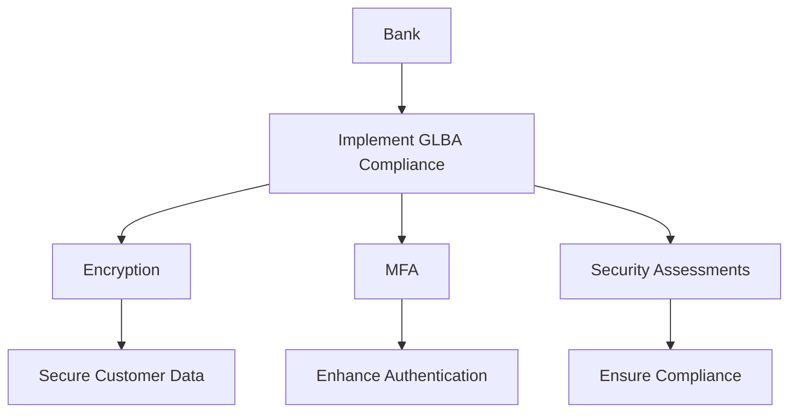
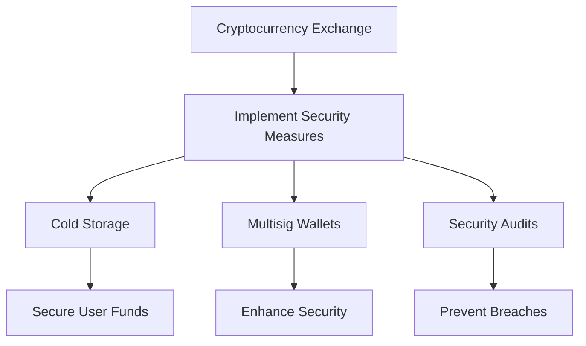
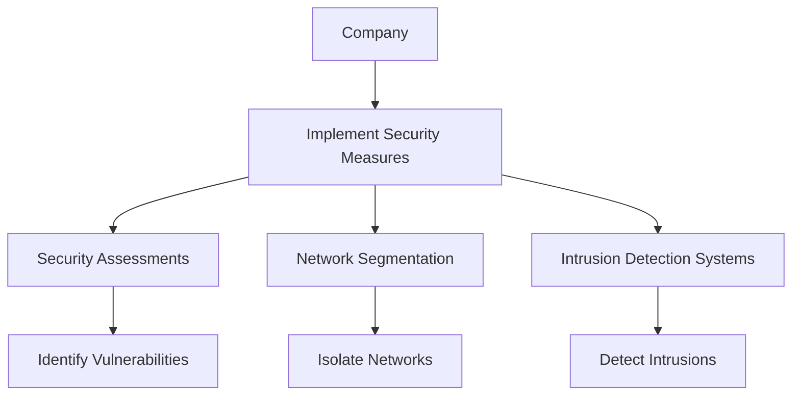
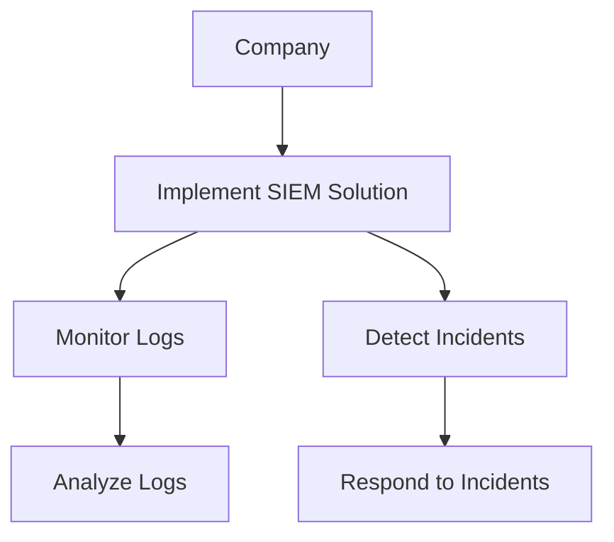
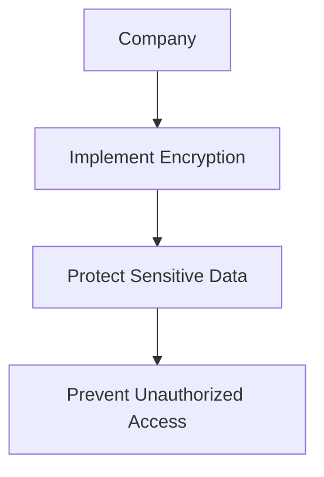
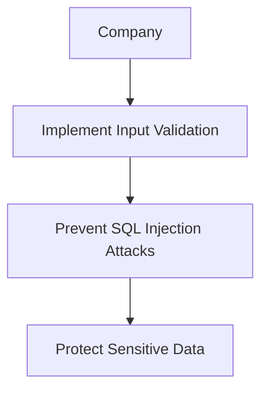

## Importance of Security and Impact of Security Breaches

### Introduction to Security Essentials

Security is a critical aspect of any organization, especially in today’s digital age where data breaches can have severe financial, reputational, and legal consequences. Understanding the importance of security and the impact of security breaches is essential for any DevSecOps practitioner. This chapter delves into the necessity of prioritizing security measures, the role of government regulations, and the impact of security breaches on various industries.

### Why Security Matters

#### Financial Impact

One of the primary reasons security matters is the financial impact of a breach. A data breach can result in significant financial losses due to theft, fraud, and the costs associated with remediation. For instance, a breach at Target in 2013 resulted in the theft of 40 million credit and debit card numbers, leading to a settlement of $18.5 million. This example highlights the direct financial cost of a breach.

#### Reputational Damage

Another critical aspect is the reputational damage caused by a breach. Customers lose trust in an organization that fails to protect their data, leading to a loss of customers and revenue. For example, Equifax suffered a massive data breach in 2017, exposing sensitive personal information of 147 million people. This breach severely damaged Equifax’s reputation and led to a significant decline in customer trust.

#### Legal Consequences

Legal consequences are another significant reason to prioritize security. Governments around the world have implemented strict regulations and laws to ensure that organizations protect sensitive data. Failure to comply with these regulations can result in hefty fines and legal action. For instance, the General Data Protection Regulation (GDPR) in the European Union imposes fines of up to €20 million or 4% of global annual turnover, whichever is higher, for non-compliance.

### Government Regulations and Laws

#### Healthcare Industry

In the healthcare industry, the Health Insurance Portability and Accountability Act (HIPAA) mandates that healthcare providers protect patient data. HIPAA requires covered entities to implement administrative, physical, and technical safeguards to ensure the confidentiality, integrity, and availability of electronic protected health information (ePHI). Failure to comply with HIPAA can result in substantial fines and legal action.

**Example:**
Consider a hospital that stores patient records in an insecure database. If this database is breached, the hospital could face significant fines and legal consequences. To prevent such a scenario, the hospital should implement robust security measures, such as encryption, access controls, and regular audits.

#### Banking Industry

In the banking industry, regulations such as the Gramm-Leach-Bliley Act (GLBA) require financial institutions to protect customer data. GLBA mandates that financial institutions provide customers with a privacy notice and implement appropriate safeguards to protect customer information.

**Example:**
A bank that stores customer account information in an insecure manner could face significant fines and legal action if this information is compromised. To prevent such a scenario, the bank should implement robust security measures, such as encryption, multi-factor authentication, and regular security assessments.

### Lack of Regulations in Unregulated Industries

#### Cryptocurrency Industry

The cryptocurrency industry is largely unregulated, which has led to significant security issues. For example, in 2022, hackers stole approximately $1.4 billion worth of cryptocurrency. This example highlights the lack of regulatory oversight in the cryptocurrency industry and the resulting security risks.

**Example:**
Consider a cryptocurrency exchange that stores user funds in an insecure manner. If this exchange is hacked, users could lose their funds. To prevent such a scenario, the exchange should implement robust security measures, such as cold storage, multi-signature wallets, and regular security audits.

### Recent Real-World Examples

#### Recent Breaches

Recent breaches highlight the importance of prioritizing security measures. For example, the SolarWinds supply chain attack in 2020 affected numerous organizations, including government agencies and private companies. This attack demonstrates the potential impact of a breach and the importance of implementing robust security measures.

**Example:**
Consider a company that uses SolarWinds software. If this software is compromised, the company could suffer significant damage. To prevent such a scenario, the company should implement robust security measures, such as regular security assessments, network segmentation, and intrusion detection systems.

### How to Prevent / Defend Against Security Breaches

#### Detection

Detection is a critical component of preventing security breaches. Organizations should implement robust monitoring and logging mechanisms to detect potential security incidents. For example, using tools such as SIEM (Security Information and Event Management) can help organizations detect and respond to security incidents in real-time.

**Example:**
Consider a company that implements a SIEM solution. This solution can help the company detect and respond to security incidents in real-time, reducing the impact of a breach.

#### Prevention

Prevention is another critical component of preventing security breaches. Organizations should implement robust security measures, such as encryption, access controls, and regular security assessments. For example, using encryption can help organizations protect sensitive data from unauthorized access.

**Example:**
Consider a company that implements encryption to protect sensitive data. This measure can help the company prevent unauthorized access to sensitive data.

#### Secure Coding Practices

Secure coding practices are essential for preventing security breaches. Organizations should implement secure coding practices, such as input validation, error handling, and secure configuration management. For example, using input validation can help organizations prevent SQL injection attacks.

**Example:**
Consider a company that implements input validation to prevent SQL injection attacks. This measure can help the company prevent unauthorized access to sensitive data.

### Conclusion

In conclusion, security is a critical aspect of any organization, and prioritizing security measures is essential for preventing security breaches. Government regulations and laws play a crucial role in ensuring that organizations protect sensitive data. Recent real-world examples highlight the importance of prioritizing security measures. By implementing robust security measures, organizations can prevent security breaches and protect sensitive data.

### Practice Labs

For hands-on practice in web application security, consider the following labs:

- **PortSwigger Web Security Academy**: Offers a comprehensive set of labs covering various web security topics.
- **OWASP Juice Shop**: A deliberately insecure web application for practicing web security skills.
- **DVWA (Damn Vulnerable Web Application)**: A PHP/MySQL web application that is riddled with vulnerabilities for educational purposes.
- **WebGoat**: An interactive, gamified training application for learning about web application security.

These labs provide practical experience in identifying and mitigating security vulnerabilities, which is essential for any DevSecOps practitioner.

---
<!-- nav -->
[[07-Impact of Security Breaches|Impact of Security Breaches]] | [[DevSecOps/DevSecOps Bootcamp/03-Identity & Access Management/04-Security Essentials/Importance of Security Impact of Security Breaches/00-Overview|Overview]] | [[09-Importance of Security and Impact of Security Breaches Part 2|Importance of Security and Impact of Security Breaches Part 2]]
