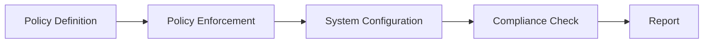

## Importance of Security and Impact of Security Breaches

### Regulatory Controls and Compliance

In the realm of DevSecOps, regulatory controls and compliance play a crucial role in ensuring that organizations adhere to legal requirements and maintain the integrity of their systems. Governments impose regulations to ensure that companies handle sensitive data responsibly and securely. These regulations vary across industries, such as finance, healthcare, and telecommunications, each with specific compliance standards.

#### What is Compliance?

Compliance refers to the adherence to laws, regulations, guidelines, and standards set forth by governing bodies. In the context of DevSecOps, compliance ensures that an organization's IT infrastructure and operations meet the necessary security and privacy requirements. This includes safeguarding customer data, preventing unauthorized access, and ensuring that data breaches are minimized.

#### Why is Compliance Important?

Compliance is essential for several reasons:

1. **Legal Requirements**: Organizations must comply with laws and regulations to avoid legal penalties and fines.
2. **Customer Trust**: Adhering to compliance standards helps build trust with customers by demonstrating a commitment to data security and privacy.
3. **Operational Efficiency**: Compliance can streamline operations by providing a framework for consistent and secure practices.
4. **Risk Management**: Compliance helps identify and mitigate risks associated with data breaches and other security incidents.

### Auditing and Compliance Checks

Auditing is a critical process used to verify that an organization meets the required compliance standards. Audits can be internal or external and involve reviewing policies, procedures, and system configurations to ensure they align with regulatory requirements.

#### Types of Audits

1. **Internal Audits**: Conducted by the organization’s own staff to assess compliance and identify areas for improvement.
2. **External Audits**: Performed by independent third parties to provide an unbiased assessment of compliance.

#### Purpose of Audits

- **Verification**: To confirm that the organization is following established policies and procedures.
- **Identification of Gaps**: To identify areas where the organization may be falling short of compliance requirements.
- **Improvement**: To recommend improvements and corrective actions to enhance compliance.

### Industry-Specific Compliance Standards

Different industries have unique compliance standards tailored to their specific needs and risks. Here are some examples:

1. **Healthcare**: HIPAA (Health Insurance Portability and Accountability Act)
2. **Finance**: PCI DSS (Payment Card Industry Data Security Standard)
3. **Telecommunications**: FCC (Federal Communications Commission) regulations

Each standard has specific requirements that organizations must meet to ensure compliance.

### Automating Compliance Using Tools

Automating compliance processes can significantly reduce the burden on organizations and improve the accuracy and consistency of compliance checks. Various tools and frameworks can be used to automate compliance, including:

1. **Configuration Management Tools**: Tools like Ansible, Puppet, and Chef can enforce compliance by ensuring that system configurations meet predefined standards.
2. **Security Scanning Tools**: Tools like Nessus, Qualys, and OpenVAS can scan systems for vulnerabilities and ensure they meet compliance requirements.
3. **Compliance-as-Code Frameworks**: Frameworks like Open Policy Agent (OPA) and HashiCorp Sentinel can enforce compliance policies programmatically.

#### Example: Implementing Compliance-as-Code with OPA

Open Policy Agent (OPA) is a powerful tool for implementing compliance-as-code. OPA allows you to define policies in a declarative language and enforce them across your infrastructure.



Here is an example of a simple OPA policy that enforces a minimum password length requirement:

```rego
package compliance

default allow = false

allow {
    input.password_length >= 8
}
```

This policy checks that the password length is at least 8 characters. If the condition is not met, the `allow` variable will be `false`, indicating non-compliance.

### Real-World Example: T-Mobile Data Breach

In 2022, T-Mobile, a major mobile communications company, experienced a significant data breach that affected approximately 77 million customers. The breach occurred due to unauthorized access to T-Mobile's systems, leading to the exposure of customer data on a cybercriminal forum.

#### Incident Details

- **Date**: 2022
- **Company**: T-Mobile
- **Impact**: 77 million customers
- **Cause**: Unauthorized access to T-Mobile systems
- **Consequence**: Data listed for sale on a cybercriminal forum

#### Legal Consequences

T-Mobile faced severe legal consequences for the breach, including a lawsuit filed by affected customers. The company had to pay a substantial fine to settle the lawsuit, amounting to $350 million in total costs, including legal fees and expenses.

### How to Prevent / Defend Against Data Breaches

To prevent and defend against data breaches, organizations should implement robust security measures and compliance practices. Here are some key strategies:

1. **Implement Strong Access Controls**: Ensure that only authorized personnel have access to sensitive data.
2. **Regular Security Audits**: Conduct regular audits to identify and address security gaps.
3. **Use Encryption**: Encrypt sensitive data both at rest and in transit to protect it from unauthorized access.
4. **Monitor and Log Activities**: Implement logging and monitoring to detect and respond to suspicious activities promptly.
5. **Educate Employees**: Provide regular training to employees on security best practices and phishing awareness.

#### Secure Coding Practices

Secure coding practices are essential to prevent vulnerabilities that could lead to data breaches. Here is an example of a vulnerable code snippet and its secure counterpart:

**Vulnerable Code:**

```python
import sqlite3

def login(username, password):
    conn = sqlite3.connect('database.db')
    cursor = conn.cursor()
    cursor.execute(f"SELECT * FROM users WHERE username='{username}' AND password='{password}'")
    result = cursor.fetchone()
    conn.close()
    return result is not None
```

**Secure Code:**

```python
import sqlite3

def login(username, password):
    conn = sqlite3.connect('database.db')
    cursor = conn.cursor()
    cursor.execute("SELECT * FROM users WHERE username=? AND password=?", (username, password))
    result = cursor.fetchone()
    conn.close()
    return result is not None
```

The secure code uses parameterized queries to prevent SQL injection attacks.

### Hands-On Labs for Practice

To gain practical experience with compliance and security, consider the following hands-on labs:

- **PortSwigger Web Security Academy**: Offers comprehensive labs on web application security.
- **OWASP Juice Shop**: A deliberately insecure web application for practicing security testing.
- **DVWA (Damn Vulnerable Web Application)**: A PHP/MySQL web application that demonstrates common web application vulnerabilities.
- **WebGoat**: An interactive training application designed to teach web application security lessons.

These labs provide real-world scenarios and challenges to help you master the concepts of compliance and security.

### Conclusion

Understanding the importance of security and the impact of security breaches is crucial for any organization. By adhering to compliance standards, conducting regular audits, and implementing robust security measures, organizations can minimize the risk of data breaches and protect sensitive information. The T-Mobile data breach serves as a stark reminder of the consequences of failing to prioritize security and compliance. By learning from these incidents and implementing best practices, organizations can build a more secure and compliant environment.

---
<!-- nav -->
[[08-Importance of Security and Impact of Security Breaches Part 1|Importance of Security and Impact of Security Breaches Part 1]] | [[DevSecOps/DevSecOps Bootcamp/03-Identity & Access Management/04-Security Essentials/Importance of Security Impact of Security Breaches/00-Overview|Overview]] | [[10-Importance of Security and Impact of Security Breaches Part 3|Importance of Security and Impact of Security Breaches Part 3]]
