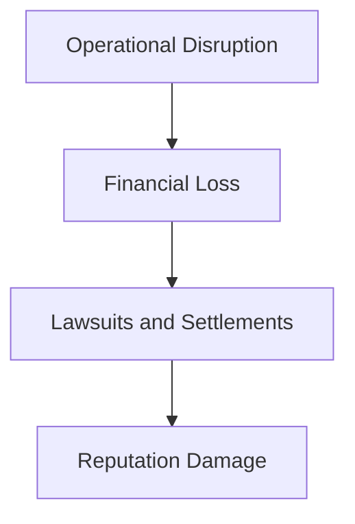
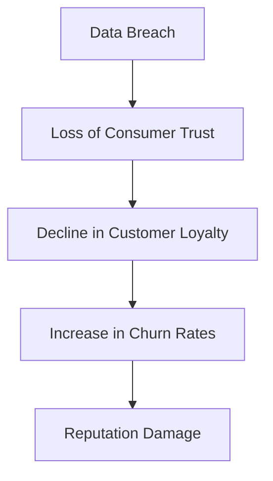
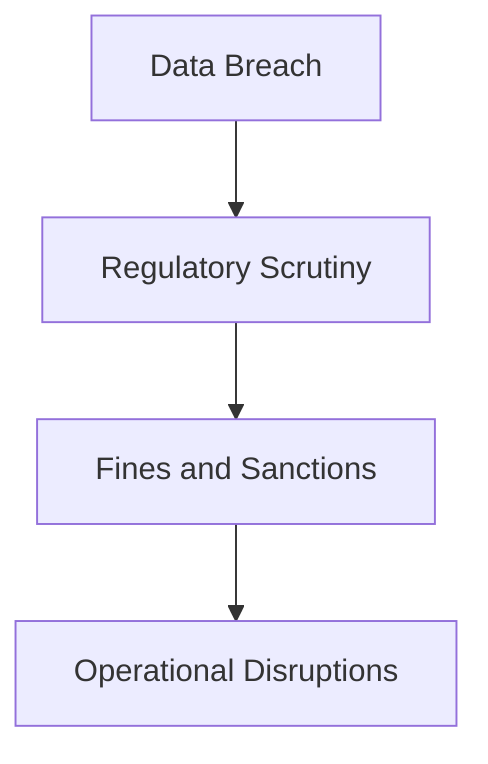
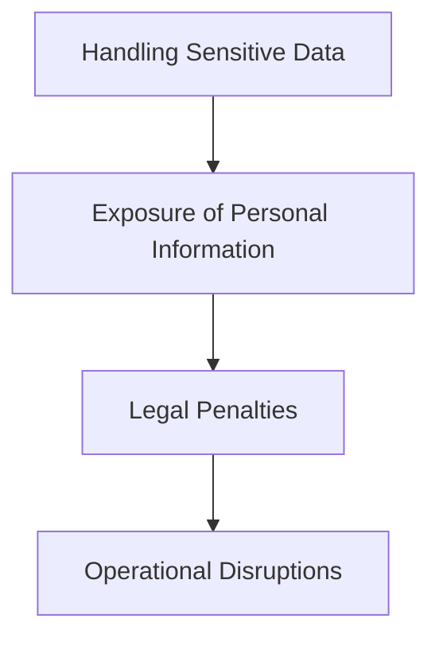

## Importance of Security and Impact of Security Breaches

### Introduction

Security is a critical aspect of any business, especially those operating in the digital realm. The importance of securing a platform cannot be overstated, as a breach can lead to severe consequences, including financial losses, reputational damage, and legal penalties. This chapter delves into the significance of security, the impact of security breaches, and the measures businesses can take to prevent such incidents.

### Business Continuity and Financial Losses

One of the most significant impacts of a security breach is the potential loss of business continuity. A company may face operational disruptions, leading to a halt in services and a decline in customer trust. This can result in substantial financial losses due to downtime, lost revenue, and the costs associated with recovery efforts.

#### Real-World Example: Target Data Breach (2013)

In 2013, Target suffered a massive data breach that compromised the personal information of approximately 40 million customers. The breach led to a significant financial impact, with Target reporting a loss of $148 million in the first quarter following the incident. Additionally, the company faced numerous lawsuits and settlements, further exacerbating the financial burden.



### Reputational Damage

A security breach can severely damage a company's reputation. Customers may lose trust in the company's ability to protect their personal and financial information, leading to a decline in customer loyalty and an increase in churn rates. This can have long-lasting effects on the company's brand and market position.

#### Real-World Example: Equifax Data Breach (2017)

In 2017, Equifax experienced a data breach that exposed the personal information of over 143 million consumers. The breach resulted in a significant loss of consumer trust, with many individuals filing lawsuits against the company. The incident also led to a decline in stock prices and a loss of market share.



### Legal Penalties and Compliance Issues

Companies that handle sensitive user data are subject to strict government regulations and policies. Failure to comply with these regulations can result in significant legal penalties, including fines and sanctions. Additionally, companies may face regulatory scrutiny and investigations, leading to additional costs and operational disruptions.

#### Real-World Example: Marriott International Data Breach (2018)

In 2018, Marriott International suffered a data breach that exposed the personal information of approximately 339 million guests. The breach resulted in a fine of £99 million from the UK Information Commissioner's Office (ICO) for failing to adequately protect customer data. The incident also led to regulatory investigations and increased scrutiny from data protection authorities worldwide.



### Handling Sensitive User Data

Companies that handle sensitive user data are particularly vulnerable to security breaches. This includes personal information such as names, addresses, social security numbers, and financial details. The exposure of such data can have severe consequences for both the company and its users.

#### Real-World Example: Capital One Data Breach (2019)

In 2019, Capital One experienced a data breach that exposed the personal information of approximately 100 million customers. The breach resulted in a fine of $80 million from the Federal Trade Commission (FTC) and a settlement of $150 million with affected customers. The incident also led to increased regulatory scrutiny and operational disruptions for the company.



### How to Prevent / Defend Against Security Breaches

To prevent security breaches, companies must implement robust security measures and adhere to best practices. This includes:

1. **Implementing Strong Access Controls**: Ensure that access to sensitive data is restricted to authorized personnel only. Use multi-factor authentication (MFA) to enhance security.

2. **Regularly Updating and Patching Systems**: Keep all systems and software up to date with the latest security patches to mitigate vulnerabilities.

3. **Conducting Regular Security Audits and Penetration Testing**: Perform regular security audits and penetration testing to identify and address potential vulnerabilities.

4. **Educating Employees on Security Best Practices**: Train employees on security best practices, including recognizing phishing attempts and using strong passwords.

5. **Implementing Data Encryption**: Encrypt sensitive data both at rest and in transit to protect it from unauthorized access.

6. **Using Intrusion Detection and Prevention Systems (IDPS)**: Implement IDPS to monitor network traffic and detect potential security threats.

7. **Maintaining Incident Response Plans**: Develop and maintain incident response plans to quickly respond to security breaches and minimize their impact.

#### Secure Coding Practices

Secure coding practices are essential to prevent security breaches. Here are some key principles:

1. **Input Validation**: Validate all input data to ensure it meets expected formats and constraints. This helps prevent injection attacks such as SQL injection and cross-site scripting (XSS).

2. **Error Handling**: Implement proper error handling to avoid exposing sensitive information through error messages. Use generic error messages and log detailed errors securely.

3. **Least Privilege Principle**: Grant users and processes the minimum privileges necessary to perform their tasks. Avoid using administrative accounts for routine operations.

4. **Secure Authentication and Authorization**: Use strong authentication mechanisms such as MFA and secure session management. Implement role-based access control (RBAC) to enforce authorization policies.

#### Example: Vulnerable Code vs. Secure Code

Consider the following example of a vulnerable code snippet that is susceptible to SQL injection:

```python
# Vulnerable code
def get_user_details(user_id):
    query = f"SELECT * FROM users WHERE id = {user_id}"
    cursor.execute(query)
    return cursor.fetchall()
```

The above code is vulnerable to SQL injection because it directly concatenates user input into the SQL query. An attacker could manipulate the `user_id` parameter to execute arbitrary SQL commands.

Here is the secure version of the same code using parameterized queries:

```python
# Secure code
def get_user_details(user_id):
    query = "SELECT * FROM users WHERE id = %s"
    cursor.execute(query, (user_id,))
    return cursor.fetchall()
```

By using parameterized queries, the code ensures that user input is treated as data rather than executable code, preventing SQL injection attacks.

### Hands-On Labs

To gain practical experience in securing platforms and preventing security breaches, consider the following hands-on labs:

- **PortSwigger Web Security Academy**: Offers interactive labs to learn about web application security, including SQL injection, XSS, and other vulnerabilities.
- **OWASP Juice Shop**: A deliberately insecure web application for practicing web security skills.
- **DVWA (Damn Vulnerable Web Application)**: A PHP/MySQL web application that demonstrates web application vulnerabilities.
- **WebGoat**: An interactive, gamified training application for learning about web application security.

These labs provide a safe environment to practice and improve your security skills.

### Conclusion

Security is a critical aspect of any business, especially those handling sensitive user data. The impact of a security breach can be severe, leading to financial losses, reputational damage, and legal penalties. To prevent such incidents, companies must implement robust security measures, adhere to best practices, and educate employees on security best practices. By taking proactive steps to secure their platforms, companies can protect their business continuity and maintain customer trust.

---
<!-- nav -->
[[09-Importance of Security and Impact of Security Breaches Part 2|Importance of Security and Impact of Security Breaches Part 2]] | [[DevSecOps/DevSecOps Bootcamp/03-Identity & Access Management/04-Security Essentials/Importance of Security Impact of Security Breaches/00-Overview|Overview]] | [[11-Importance of Security and Impact of Security Breaches|Importance of Security and Impact of Security Breaches]]
