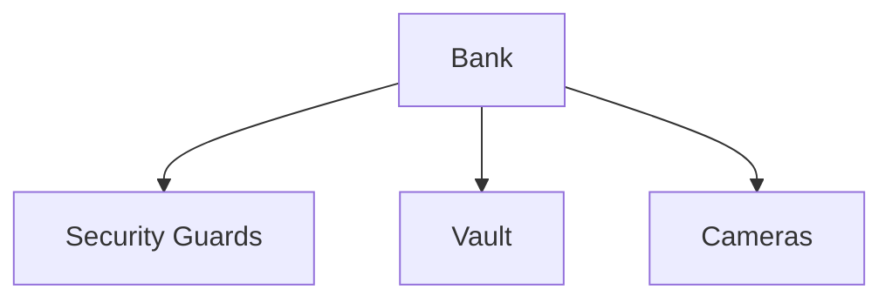
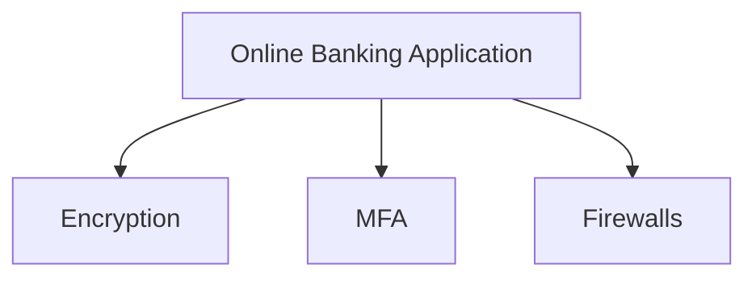
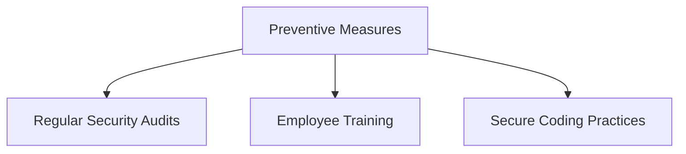
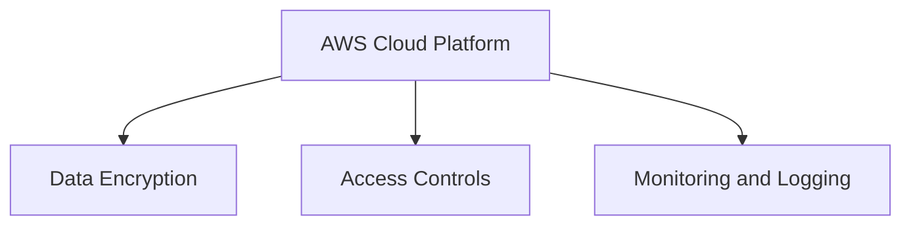
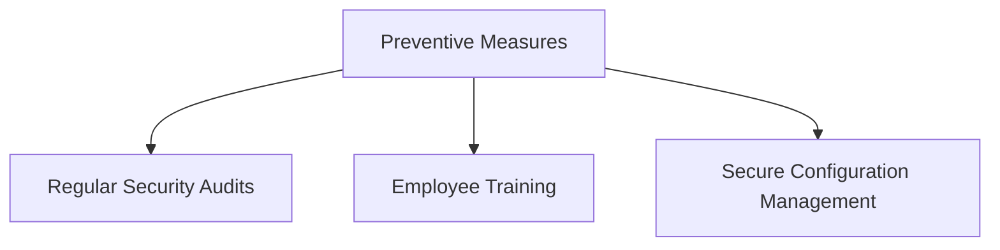
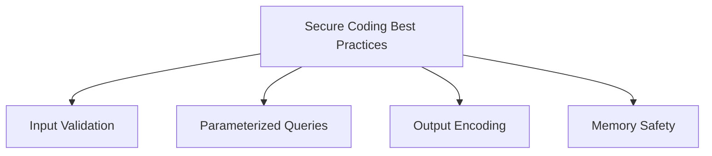
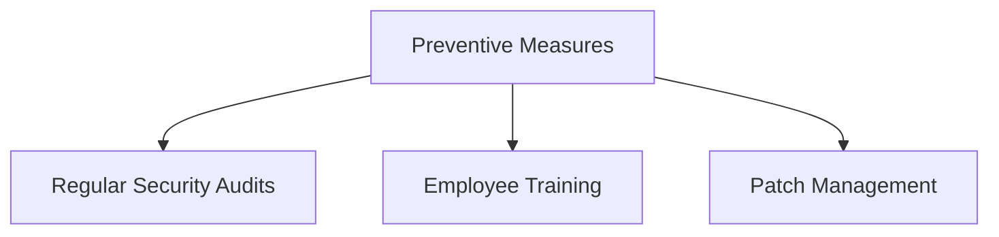

## Importance of Security and Impact of Security Breaches

### Introduction to Security Essentials

Security is a critical aspect of any organization, especially those dealing with sensitive data and financial transactions. This chapter delves into the importance of security, particularly in the context of financial institutions and cloud service providers. We will explore the necessity of robust security measures, recent real-world examples of breaches, and practical steps to prevent such incidents.

### Financial Institutions and Security

Financial institutions, such as banks, handle vast amounts of sensitive data and financial transactions. The security measures implemented by these institutions are crucial to protect both the institution and its customers from potential threats.

#### Physical Security Measures

Physical security measures are essential for protecting physical assets and ensuring the safety of employees and customers. These measures include:

- **Security Guards**: Trained personnel stationed at entrances to monitor and control access.
- **Vaults**: Secure storage areas for valuable items such as cash and precious metals.
- **Cameras**: Surveillance systems to monitor activities within the premises.

#### Digital Security Measures

In the digital age, financial institutions must also implement robust security measures to protect online banking applications and other digital assets. These measures include:

- **Encryption**: Protecting data in transit and at rest using cryptographic techniques.
- **Multi-Factor Authentication (MFA)**: Requiring users to provide multiple forms of identification to access accounts.
- **Firewalls**: Network security systems that monitor and control incoming and outgoing traffic based on predetermined security rules.

### Real-World Example: JPMorgan Chase Data Breach

One of the most significant data breaches in the financial sector occurred in 2014 when hackers gained unauthorized access to JPMorgan Chase's systems. The breach affected approximately 83 million customers, compromising personal information such as names, addresses, phone numbers, and email addresses.

#### Impact of the Breach

The breach had severe consequences for JPMorgan Chase, including:

- **Reputation Damage**: The incident significantly tarnished the bank's reputation.
- **Financial Losses**: The bank incurred substantial costs in investigating the breach and implementing additional security measures.
- **Customer Trust**: Many customers lost trust in the bank's ability to protect their personal information.

#### How to Prevent / Defend

To prevent similar breaches, financial institutions should implement the following security measures:

- **Regular Security Audits**: Conducting periodic security assessments to identify vulnerabilities.
- **Employee Training**: Educating employees on security best practices and phishing awareness.
- **Secure Coding Practices**: Implementing secure coding standards to minimize vulnerabilities in applications.

### Cloud Service Providers and Security

Cloud service providers, such as AWS, play a crucial role in the modern computing landscape. They offer various services, including data storage, compute resources, and networking capabilities. However, the security of these services is paramount to ensure the integrity and availability of customer data.

#### Security Measures for Cloud Service Providers

Cloud service providers must implement robust security measures to protect their infrastructure and customer data. These measures include:

- **Data Encryption**: Encrypting data at rest and in transit to prevent unauthorized access.
- **Access Controls**: Implementing strict access controls to ensure only authorized personnel can access sensitive data.
- **Monitoring and Logging**: Continuously monitoring and logging system activities to detect and respond to potential security incidents.

### Real-World Example: Capital One Data Breach

In 2019, Capital One experienced a significant data breach that exposed the personal information of approximately 100 million customers. The breach was caused by a misconfigured firewall, allowing an attacker to gain unauthorized access to the company's systems.

#### Impact of the Breach

The breach had severe consequences for Capital One, including:

- **Reputation Damage**: The incident significantly tarnished the bank's reputation.
- **Financial Losses**: The bank incurred substantial costs in investigating the breach and implementing additional security measures.
- **Customer Trust**: Many customers lost trust in the bank's ability to protect their personal information.

#### How to Prevent / Defend

To prevent similar breaches, cloud service providers should implement the following security measures:

- **Regular Security Audits**: Conducting periodic security assessments to identify vulnerabilities.
- **Employee Training**: Educating employees on security best practices and phishing awareness.
- **Secure Configuration Management**: Ensuring that all systems and configurations are securely managed to prevent misconfigurations.

### Secure Coding Practices

Secure coding practices are essential to prevent vulnerabilities in applications. Developers should follow best practices to ensure the security of their code.

#### Common Vulnerabilities

Some common vulnerabilities in applications include:

- **SQL Injection**: An attacker injects malicious SQL queries to manipulate database operations.
- **Cross-Site Scripting (XSS)**: An attacker injects malicious scripts into web pages viewed by other users.
- **Buffer Overflow**: An attacker exploits buffer overflow vulnerabilities to execute arbitrary code.

#### Secure Coding Best Practices

To prevent these vulnerabilities, developers should follow secure coding best practices:

- **Input Validation**: Validating user input to ensure it meets expected criteria.
- **Parameterized Queries**: Using parameterized queries to prevent SQL injection attacks.
- **Output Encoding**: Encoding output to prevent XSS attacks.
- **Memory Safety**: Ensuring proper memory management to prevent buffer overflow vulnerabilities.

### Real-World Example: Equifax Data Breach

In 2017, Equifax experienced a significant data breach that exposed the personal information of approximately 147 million customers. The breach was caused by a vulnerability in the Apache Struts framework, which was exploited by attackers to gain unauthorized access to the company's systems.

#### Impact of the Breach

The breach had severe consequences for Equifax, including:

- **Reputation Damage**: The incident significantly tarnished the company's reputation.
- **Financial Losses**: The company incurred substantial costs in investigating the breach and implementing additional security measures.
- **Customer Trust**: Many customers lost trust in the company's ability to protect their personal information.

#### How to Prevent / Defend

To prevent similar breaches, organizations should implement the following security measures:

- **Regular Security Audits**: Conducting periodic security assessments to identify vulnerabilities.
- **Employee Training**: Educating employees on security best practices and phishing awareness.
- **Patch Management**: Ensuring that all systems and software are up-to-date with the latest security patches.

### Conclusion

Security is a critical aspect of any organization, especially those dealing with sensitive data and financial transactions. Robust security measures are essential to protect both the organization and its customers from potential threats. By implementing secure coding practices, conducting regular security audits, and educating employees on security best practices, organizations can significantly reduce the risk of security breaches.

### Practice Labs

For hands-on experience with web application security, consider the following practice labs:

- **PortSwigger Web Security Academy**: Offers interactive labs to learn and practice web security techniques.
- **OWASP Juice Shop**: A deliberately insecure web application to practice penetration testing and security auditing.
- **DVWA (Damn Vulnerable Web Application)**: A PHP/MySQL web application that demonstrates web application vulnerabilities.
- **WebGoat**: An interactive, gamified training application to learn about web application security.

These labs provide practical experience in identifying and mitigating security vulnerabilities in web applications.

---
<!-- nav -->
[[10-Importance of Security and Impact of Security Breaches Part 3|Importance of Security and Impact of Security Breaches Part 3]] | [[DevSecOps/DevSecOps Bootcamp/03-Identity & Access Management/04-Security Essentials/Importance of Security Impact of Security Breaches/00-Overview|Overview]] | [[12-Practice Labs|Practice Labs]]
