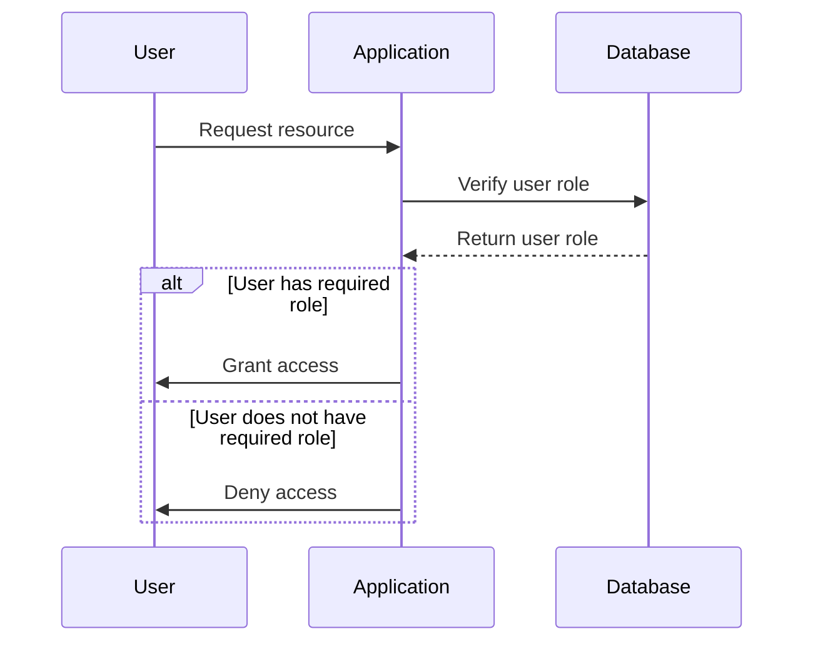

## Introduction to Broken Access Control

Access control is a fundamental aspect of securing applications. It ensures that only authorized users have access to specific resources or can perform certain actions within an application. When access control mechanisms are improperly implemented or bypassed, it leads to a critical security issue known as "Broken Access Control." This issue is ranked highly in the OWASP Top 10 due to its prevalence and potential impact on application security.

### What is Broken Access Control?

Broken Access Control occurs when an application fails to properly enforce access controls, allowing unauthorized users to access sensitive information or perform actions they should not be permitted to do. This can happen due to various reasons such as:

- **Insufficient Authorization Checks**: The application does not verify user permissions correctly.
- **Inadequate Role Management**: Roles and permissions are not managed effectively.
- **Missing or Weak Authentication Mechanisms**: Users can bypass authentication checks.
- **Improper Resource Handling**: Resources are not properly protected against unauthorized access.

### Why Does Broken Access Control Matter?

Broken Access Control is a significant security risk because it can lead to unauthorized access to sensitive data, privilege escalation, and other malicious activities. For instance, if an attacker can access administrative functions or view confidential user data, it can result in severe consequences such as data breaches, financial losses, and reputational damage.

### How Does Broken Access Control Work?

To understand how Broken Access Control works, let's break down the process:

1. **User Authentication**: The user logs into the application using their credentials.
2. **Authorization Check**: The application verifies the user's role and permissions.
3. **Resource Access**: Based on the authorization check, the user is allowed or denied access to specific resources.

If any of these steps fail, it can lead to Broken Access Control. For example, if the application does not properly validate the user's role or permissions, an unauthorized user might gain access to sensitive data.

### Real-World Examples

#### Example 1: CVE-2021-21972

**Description**: In 2021, a vulnerability was discovered in the popular open-source project Apache Struts. The vulnerability allowed attackers to bypass access controls and execute arbitrary commands on the server.

**Impact**: This vulnerability could lead to remote code execution, allowing attackers to take full control of the server and access sensitive data.

**Code Example**:
```java
// Vulnerable Code
public class UserController {
    public String getUserDetails() {
        // No proper authorization check
        return userService.getUserDetails();
    }
}
```

**Fixed Code**:
```java
// Secure Code
public class UserController {
    @PreAuthorize("hasRole('USER')")
    public String getUserDetails() {
        return userService.getUserDetails();
    }
}
```

#### Example 2: Equifax Data Breach (2017)

**Description**: In 2017, Equifax suffered a massive data breach that exposed personal information of approximately 147 million people. One of the root causes was a vulnerability in the Apache Struts framework, which allowed attackers to bypass access controls and gain unauthorized access to sensitive data.

**Impact**: The breach resulted in significant financial losses and reputational damage for Equifax.

### Detailed Explanation of Access Control Mechanisms

Access control mechanisms can be broadly categorized into three types:

1. **Discretionary Access Control (DAC)**: Access rights are assigned based on the discretion of the resource owner.
2. **Mandatory Access Control (MAC)**: Access rights are assigned based on predefined security policies.
3. **Role-Based Access Control (RBAC)**: Access rights are assigned based on roles and permissions associated with those roles.

### Common Pitfalls in Access Control Implementation

1. **Hardcoding Permissions**: Hardcoding permissions directly in the code can lead to maintenance issues and security vulnerabilities.
2. **Inconsistent Authorization Checks**: Inconsistent authorization checks across different parts of the application can lead to security gaps.
3. **Weak Authentication Mechanisms**: Weak or missing authentication mechanisms can allow unauthorized access.
4. **Improper Error Handling**: Improper error handling can reveal sensitive information to attackers.

### How to Prevent / Defend Against Broken Access Control

#### Detection

1. **Static Code Analysis**: Use static code analysis tools to identify potential access control vulnerabilities.
2. **Dynamic Application Security Testing (DAST)**: Use DAST tools to simulate attacks and identify access control weaknesses.
3. **Penetration Testing**: Conduct regular penetration testing to identify and mitigate access control vulnerabilities.

#### Prevention

1. **Implement Strong Authentication Mechanisms**: Ensure that strong authentication mechanisms are in place to prevent unauthorized access.
2. **Use RBAC**: Implement Role-Based Access Control to manage user permissions effectively.
3. **Consistent Authorization Checks**: Ensure consistent authorization checks across all parts of the application.
4. **Proper Error Handling**: Implement proper error handling to avoid revealing sensitive information to attackers.

#### Secure Coding Practices

1. **Avoid Hardcoding Permissions**: Avoid hardcoding permissions directly in the code. Use centralized permission management systems.
2. **Use Secure Libraries and Frameworks**: Use secure libraries and frameworks that provide robust access control mechanisms.
3. **Regular Audits and Reviews**: Conduct regular audits and reviews of access control mechanisms to ensure they are functioning correctly.

### Complete Example: Access Control Implementation

Let's consider a simple example of implementing access control in a web application using Spring Security.

#### Vulnerable Code

```java
// UserController.java
@RestController
@RequestMapping("/users")
public class UserController {

    @Autowired
    private UserService userService;

    @GetMapping("/{id}")
    public User getUser(@PathVariable Long id) {
        return userService.getUser(id);
    }
}
```

#### Fixed Code

```java
// UserController.java
@RestController
@RequestMapping("/users")
public class UserController {

    @Autowired
    private UserService userService;

    @PreAuthorize("hasRole('USER')")
    @GetMapping("/{id}")
    public User getUser(@PathVariable Long id) {
        return userService.getUser(id);
    }
}
```

### Mermaid Diagrams

#### Access Control Flow



### Conclusion

Broken Access Control is a critical security issue that can lead to severe consequences if not properly addressed. By understanding the underlying mechanisms, common pitfalls, and implementing robust access control measures, developers can significantly reduce the risk of unauthorized access and protect sensitive data.

### Practice Labs

For hands-on practice with access control, consider the following labs:

- **PortSwigger Web Security Academy**: Offers interactive labs on various web security topics, including access control.
- **OWASP Juice Shop**: A deliberately insecure web application for practicing web security skills.
- **DVWA (Damn Vulnerable Web Application)**: A PHP/MySQL web application that is riddled with vulnerabilities for educational purposes.

These labs provide practical experience in identifying and mitigating access control vulnerabilities in real-world scenarios.

---
<!-- nav -->
[[DevSecOps/DevSecOps Bootcamp/03-Identity & Access Management/04-Security Essentials/OWASP top 10 Part 1/00-Overview|Overview]] | [[DevSecOps/DevSecOps Bootcamp/03-Identity & Access Management/04-Security Essentials/OWASP top 10 Part 1/02-Introduction to DevSecOps and OWASP Top 10|Introduction to DevSecOps and OWASP Top 10]]
