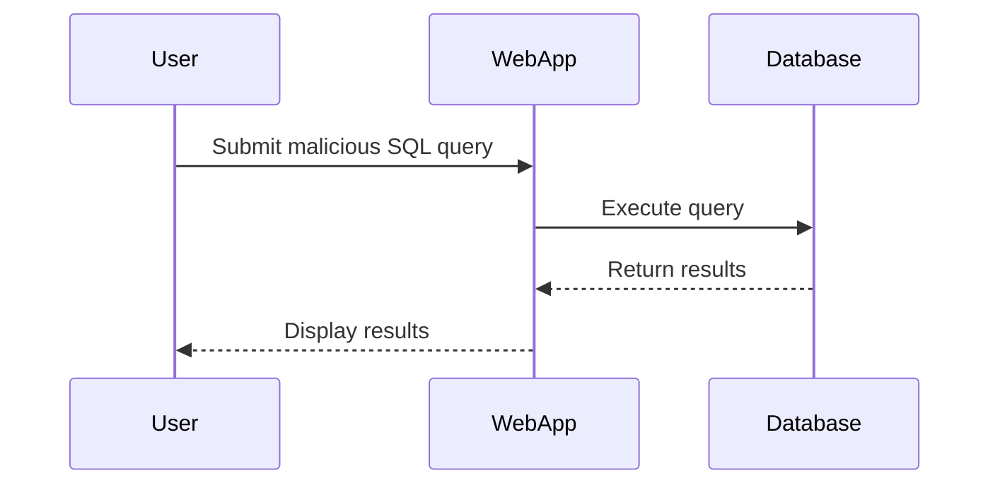
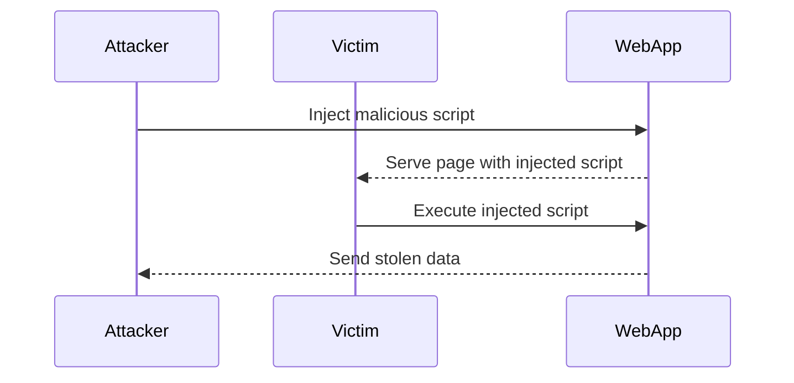
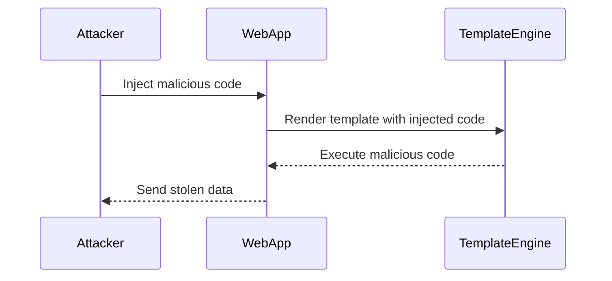

## Introduction to Injection Attacks

Injection attacks are a class of vulnerabilities that occur when an attacker can manipulate input data to execute unintended commands or access unauthorized resources. These attacks can take various forms, including SQL injection, JavaScript injection (cross-site scripting), and template injection. Injection attacks are among the most critical security threats because they can lead to data theft, unauthorized access, and even complete system compromise.

### What is Injection?

Injection occurs when an attacker can insert malicious data into an application's input fields, which are then processed by the application without proper validation or sanitization. This can result in the execution of arbitrary commands, leading to severe security breaches.

#### Why Does Injection Matter?

Injection attacks are significant because they can bypass authentication mechanisms, read sensitive data, modify data, and even execute arbitrary code on the server. The consequences can range from minor data leaks to full system compromise, making injection attacks a top priority for security professionals.

#### How Does Injection Work Under the Hood?

Injection attacks work by exploiting the way an application processes user input. For example, in SQL injection, an attacker can insert SQL commands into a query that is executed by the database. Similarly, in template injection, an attacker can insert malicious code into a template engine that is used to generate dynamic content.

### Common Types of Injection

There are several common types of injection attacks, including:

- **SQL Injection**: Exploiting vulnerabilities in SQL queries to execute arbitrary SQL commands.
- **JavaScript Injection (Cross-Site Scripting)**: Inserting malicious JavaScript code into a web page to execute in the context of other users.
- **Template Injection**: Inserting malicious code into a template engine to execute arbitrary code.

### Real-World Examples of Injection Attacks

Injection attacks have been responsible for numerous high-profile breaches. Here are a few recent examples:

- **CVE-2021-21972**: A SQL injection vulnerability in Microsoft Exchange Server led to widespread exploitation by threat actors.
- **CVE-2022-22965**: A template injection vulnerability in Apache Struts was exploited to gain remote code execution.

These examples illustrate the severity and prevalence of injection attacks in modern software environments.

### SQL Injection

SQL injection is one of the most common and dangerous types of injection attacks. It occurs when an attacker can insert SQL commands into a query that is executed by the database.

#### How SQL Injection Works

Consider the following SQL query:

```sql
SELECT * FROM users WHERE username = 'admin' AND password = 'password';
```

An attacker can manipulate this query by inserting additional SQL commands. For example:

```sql
SELECT * FROM users WHERE username = 'admin' OR '1'='1' -- AND password = 'password';
```

This modified query will return all rows from the `users` table because the condition `'1'='1'` is always true.

#### Real-World Example: CVE-2021-21972

In March 2021, a series of vulnerabilities in Microsoft Exchange Server were disclosed, including a SQL injection vulnerability (CVE-2021-21972). Attackers exploited this vulnerability to gain remote code execution and access to sensitive data.

#### How to Prevent SQL Injection

To prevent SQL injection, follow these best practices:

1. **Use Prepared Statements**: Prepared statements ensure that user input is treated as data rather than executable code.
2. **Input Validation**: Validate all user input to ensure it conforms to expected formats.
3. **Least Privilege Principle**: Ensure that database accounts have the minimum privileges necessary to perform their tasks.

Here is an example of a vulnerable SQL query and its secure counterpart using prepared statements:

**Vulnerable Code:**

```php
$username = $_GET['username'];
$password = $_GET['password'];

$query = "SELECT * FROM users WHERE username = '$username' AND password = '$password'";
$result = mysqli_query($conn, $query);
```

**Secure Code:**

```php
$username = $_GET['username'];
$password = $_GET['password'];

$stmt = $conn->prepare("SELECT * FROM users WHERE username = ? AND password = ?");
$stmt->bind_param("ss", $username, $password);
$stmt->execute();
$result = $stmt->get_result();
```

### JavaScript Injection (Cross-Site Scripting)

Cross-Site Scripting (XSS) is a type of injection attack where an attacker inserts malicious JavaScript code into a web page viewed by other users. This can lead to session hijacking, data theft, and other malicious activities.

#### How XSS Works

Consider a web application that displays user-submitted comments on a webpage:

```html
<div id="comments">
    <div><?php echo $_GET['comment']; ?></div>
</div>
```

An attacker can inject malicious JavaScript code by submitting a comment like:

```html
<script>alert('XSS');</script>
```

When another user views the page, the injected script will execute in their browser.

#### Real-World Example: CVE-2022-22965

In April 2022, a vulnerability in Apache Struts (CVE-2022-22965) was discovered, allowing attackers to inject malicious code through a template engine. This led to remote code execution and data theft.

#### How to Prevent XSS

To prevent XSS, follow these best practices:

1. **Output Encoding**: Encode all user input before displaying it on a web page.
2. **Content Security Policy (CSP)**: Implement a CSP to restrict the sources of executable scripts.
3. **Input Validation**: Validate all user input to ensure it conforms to expected formats.

Here is an example of a vulnerable code snippet and its secure counterpart using output encoding:

**Vulnerable Code:**

```php
echo $_GET['comment'];
```

**Secure Code:**

```php
echo htmlspecialchars($_GET['comment'], ENT_QUOTES, 'UTF-8');
```

### Template Injection

Template injection occurs when an attacker can insert malicious code into a template engine used to generate dynamic content. This can lead to arbitrary code execution and data theft.

#### How Template Injection Works

Consider a web application that uses a template engine like Jinja2 to generate dynamic content:

```python
from jinja2 import Template

template = Template("Hello {{ name }}")
name = request.GET.get('name')
output = template.render(name=name)
```

An attacker can inject malicious code by submitting a value like:

```python
{{ config.__class__.__init__.func_globals }}
```

This can lead to arbitrary code execution and data theft.

#### Real-World Example: CVE-2022-22965

In April 2022, a vulnerability in Apache Struts (CVE-2022-22965) was discovered, allowing attackers to inject malicious code through a template engine. This led to remote code execution and data theft.

#### How to Prevent Template Injection

To prevent template injection, follow these best practices:

1. **Sanitize User Input**: Sanitize all user input before passing it to the template engine.
2. **Restrict Template Engine Features**: Restrict the features available to the template engine to prevent arbitrary code execution.
3. **Input Validation**: Validate all user input to ensure it conforms to expected formats.

Here is an example of a vulnerable code snippet and its secure counterpart using sanitization:

**Vulnerable Code:**

```python
from jinja2 import Template

template = Template("Hello {{ name }}")
name = request.GET.get('name')
output = template.render(name=name)
```

**Secure Code:**

```python
from jinja2 import Template

template = Template("Hello {{ name|e }}")
name = request.GET.get('name')
output = template.render(name=name)
```

### Conclusion

Injection attacks are a serious threat to the security of web applications. By understanding the different types of injection attacks and implementing best practices for prevention, you can significantly reduce the risk of these attacks. Always validate and sanitize user input, use prepared statements, and implement security policies to protect your applications from injection attacks.

### Practice Labs

For hands-on experience with injection attacks, consider the following practice labs:

- **PortSwigger Web Security Academy**: Offers comprehensive training on various web security topics, including injection attacks.
- **OWASP Juice Shop**: A deliberately insecure web application for practicing web security skills.
- **DVWA (Damn Vulnerable Web Application)**: A PHP/MySQL web application that demonstrates web application vulnerabilities.

By working through these labs, you can gain practical experience in identifying and preventing injection attacks.

### Mermaid Diagrams

#### SQL Injection Attack Flow



#### XSS Attack Flow



#### Template Injection Attack Flow



### Summary

Injection attacks are a critical security concern for web applications. By understanding the different types of injection attacks and implementing best practices for prevention, you can significantly reduce the risk of these attacks. Always validate and sanitize user input, use prepared statements, and implement security policies to protect your applications from injection attacks.

---
<!-- nav -->
[[DevSecOps/DevSecOps Bootcamp/03-Identity & Access Management/04-Security Essentials/OWASP top 10 Part 1/02-Introduction to DevSecOps and OWASP Top 10|Introduction to DevSecOps and OWASP Top 10]] | [[DevSecOps/DevSecOps Bootcamp/03-Identity & Access Management/04-Security Essentials/OWASP top 10 Part 1/00-Overview|Overview]] | [[DevSecOps/DevSecOps Bootcamp/03-Identity & Access Management/04-Security Essentials/OWASP top 10 Part 1/04-Introduction to Misconfiguration Scanning in DevSecOps|Introduction to Misconfiguration Scanning in DevSecOps]]
