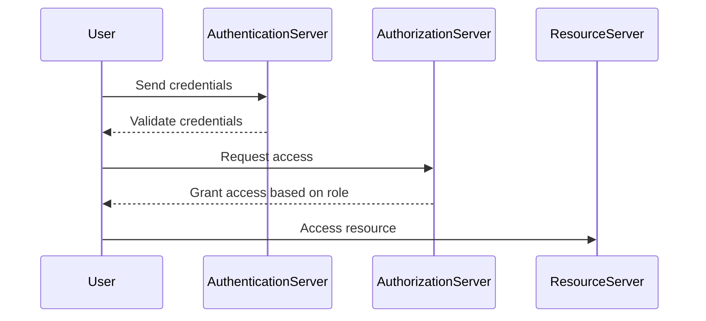
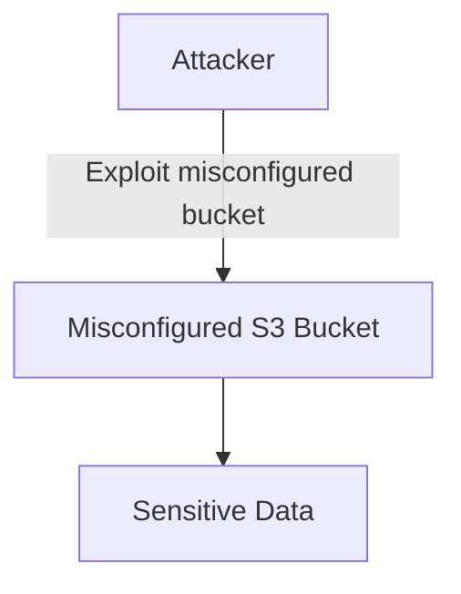
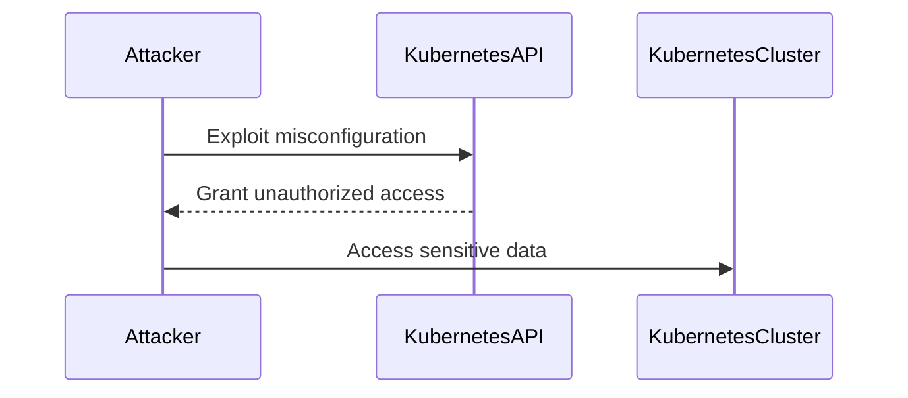

## Introduction to Misconfiguration Scanning in DevSecOps

In the realm of DevSecOps, ensuring the security of applications and infrastructure is paramount. One critical aspect of this is the scanning and identification of misconfigurations. Misconfigurations can lead to severe vulnerabilities, allowing unauthorized access, data breaches, and other security incidents. This chapter will delve into the process of automatically scanning misconfigurations for various components of an application, including access management, cloud configurations, and Kubernetes setups. We will explore the underlying concepts, recent real-world examples, and provide detailed steps on how to prevent and defend against such misconfigurations.

### Access Management Misconfigurations

Access management involves controlling who can access resources and what actions they can perform. Misconfigurations in access management can lead to unauthorized access and privilege escalation. Let's break down the key aspects of access management and how misconfigurations can occur.

#### What is Access Management?

Access management is the process of controlling access to resources within an application or system. It includes authentication (verifying the identity of users) and authorization (granting permissions based on roles and policies).

#### Why Does Access Management Matter?

Proper access management is crucial because it ensures that only authorized users can access sensitive data and perform critical operations. Without robust access management, attackers can exploit misconfigurations to gain unauthorized access and cause significant damage.

#### How Does Access Management Work?

Access management typically involves the following components:

- **Authentication**: Verifies the identity of users through mechanisms like passwords, multi-factor authentication (MFA), and biometrics.
- **Authorization**: Grants permissions based on user roles and policies. This can be implemented using role-based access control (RBAC) or attribute-based access control (ABAC).

#### Common Misconfigurations in Access Management

Misconfigurations in access management can include:

- **Weak Password Policies**: Allowing weak passwords or not enforcing password complexity requirements.
- **Insufficient Multi-Factor Authentication**: Not requiring MFA for critical accounts or failing to properly configure MFA settings.
- **Improper Role Assignment**: Granting excessive privileges to users or roles, leading to privilege escalation.

#### Real-World Example: CVE-2021-21972

CVE-2021-21972 is a critical vulnerability in Microsoft Exchange Server that allowed attackers to bypass authentication and gain unauthorized access to the server. This vulnerability was due to a misconfiguration in the authentication mechanism, which did not properly validate user credentials.



#### How to Prevent / Defend Against Access Management Misconfigurations

To prevent and defend against access management misconfigurations, follow these best practices:

- **Enforce Strong Password Policies**: Require complex passwords and enforce regular password changes.
- **Implement Multi-Factor Authentication**: Require MFA for critical accounts and ensure proper configuration.
- **Use Role-Based Access Control (RBAC)**: Assign roles based on least privilege principles and regularly review role assignments.

**Vulnerable Code Example:**

```python
# Vulnerable code: Weak password policy
def authenticate(username, password):
    if username == "admin" and password == "password":
        return True
    return False
```

**Secure Code Example:**

```python
# Secure code: Strong password policy
import re

def authenticate(username, password):
    if username == "admin" and re.match(r"^(?=.*[A-Za-z])(?=.*\d)[A-Za-z\d]{8,}$", password):
        return True
    return False
```

### Cloud Configuration Misconfigurations

Cloud configurations involve setting up and managing resources in cloud environments like AWS, Azure, and Google Cloud. Misconfigurations in cloud configurations can lead to unauthorized access, data leaks, and other security issues.

#### What is Cloud Configuration?

Cloud configuration refers to the setup and management of resources in cloud environments. This includes configuring virtual machines, storage, networking, and security settings.

#### Why Does Cloud Configuration Matter?

Proper cloud configuration is essential because it ensures that resources are securely managed and protected from unauthorized access. Misconfigurations can expose sensitive data and allow attackers to gain unauthorized access to cloud resources.

#### How Does Cloud Configuration Work?

Cloud configuration typically involves the following components:

- **Virtual Machines (VMs)**: Configuring VMs with appropriate security settings, such as firewalls and access controls.
- **Storage**: Configuring storage with encryption and access controls.
- **Networking**: Configuring network settings, such as subnets and security groups.
- **Security Settings**: Configuring security settings, such as IAM policies and encryption keys.

#### Common Misconfigurations in Cloud Configuration

Misconfigurations in cloud configuration can include:

- **Improper Network Segmentation**: Failing to properly segment networks, leading to unauthorized access.
- **Weak IAM Policies**: Allowing excessive permissions or failing to properly configure IAM policies.
- **Insufficient Encryption**: Failing to encrypt sensitive data stored in the cloud.

#### Real-World Example: AWS S3 Bucket Exposure

In 2019, Capital One suffered a data breach due to a misconfigured AWS S3 bucket. The attacker exploited a misconfigured bucket policy that allowed public access to sensitive data. This misconfiguration exposed the personal information of over 100 million customers.



#### How to Prevent / Defend Against Cloud Configuration Misconfigurations

To prevent and defend against cloud configuration misconfigurations, follow these best practices:

- **Use Least Privilege Principles**: Configure IAM policies with least privilege principles and regularly review permissions.
- **Enable Encryption**: Enable encryption for sensitive data stored in the cloud.
- **Regularly Audit Configurations**: Regularly audit cloud configurations to identify and remediate misconfigurations.

**Vulnerable Configuration Example:**

```json
{
  "Version": "2012-10-17",
  "Statement": [
    {
      "Sid": "PublicReadGetObject",
      "Effect": "Allow",
      "Principal": "*",
      "Action": "s3:GetObject",
      "Resource": "arn:aws:s3:::my-bucket/*"
    }
  ]
}
```

**Secure Configuration Example:**

```json
{
  "Version": "2012-10-17",
  "Statement": [
    {
      "Sid": "AllowSpecificUser",
      "Effect": "Allow",
      "Principal": {
        "AWS": "arn:aws:iam::123456789012:user/specific-user"
      },
      "Action": "s3:GetObject",
      "Resource": "arn:aws:s3:::my-bucket/*"
    }
  ]
}
```

### Kubernetes Configuration Misconfigurations

Kubernetes is an open-source platform for automating deployment, scaling, and management of containerized applications. Misconfigurations in Kubernetes configurations can lead to unauthorized access, privilege escalation, and other security issues.

#### What is Kubernetes Configuration?

Kubernetes configuration involves setting up and managing Kubernetes clusters, including nodes, pods, services, and deployments.

#### Why Does Kubernetes Configuration Matter?

Proper Kubernetes configuration is essential because it ensures that applications are securely deployed and managed. Misconfigurations can expose sensitive data and allow attackers to gain unauthorized access to Kubernetes resources.

#### How Does Kubernetes Configuration Work?

Kubernetes configuration typically involves the following components:

- **Nodes**: Configuring nodes with appropriate security settings, such as firewalls and access controls.
- **Pods**: Configuring pods with appropriate security settings, such as resource limits and access controls.
- **Services**: Configuring services with appropriate security settings, such as load balancing and access controls.
- **Deployments**: Configuring deployments with appropriate security settings, such as rolling updates and access controls.

#### Common Misconfigurations in Kubernetes Configuration

Misconfigurations in Kubernetes configuration can include:

- **Improper Node Security**: Failing to properly secure nodes, leading to unauthorized access.
- **Weak Pod Security Policies**: Allowing excessive permissions or failing to properly configure pod security policies.
- **Insufficient Service Security**: Failing to properly secure services, leading to unauthorized access.

#### Real-World Example: Kubernetes API Server Misconfiguration

In 2020, a misconfiguration in the Kubernetes API server allowed attackers to gain unauthorized access to Kubernetes clusters. The misconfiguration involved improper RBAC settings, which allowed attackers to escalate their privileges and gain access to sensitive data.



#### How to Prevent / Defend Against Kubernetes Configuration Misconfigurations

To prevent and defend against Kubernetes configuration misconfigurations, follow these best practices:

- **Use Least Privilege Principles**: Configure RBAC policies with least privilege principles and regularly review permissions.
- **Enable Encryption**: Enable encryption for sensitive data stored in Kubernetes.
- **Regularly Audit Configurations**: Regularly audit Kubernetes configurations to identify and remediate misconfigurations.

**Vulnerable Configuration Example:**

```yaml
apiVersion: rbac.authorization.k8s.io/v1
kind: ClusterRoleBinding
metadata:
  name: admin-clusterrolebinding
subjects:
- kind: Group
  name: system:masters
  apiGroup: rbac.authorization.k8s.io
roleRef:
  kind: ClusterRole
  name: cluster-admin
  apiGroup: rbac.authorization.k8s.io
```

**Secure Configuration Example:**

```yaml
apiVersion: rbac.authorization.k8s.io/v1
kind: ClusterRoleBinding
metadata:
  name: specific-user-clusterrolebinding
subjects:
- kind: User
  name: specific-user
  apiGroup: rbac.authorization.k8s.io
roleRef:
  kind: ClusterRole
  name: view
  apiGroup: rbac.authorization.k8s.io
```

### Hands-On Labs for Practice

To gain practical experience with misconfiguration scanning and remediation, consider the following hands-on labs:

- **PortSwigger Web Security Academy**: Offers interactive labs for web application security, including access management and cloud configuration.
- **OWASP Juice Shop**: A deliberately insecure web application for practicing web security skills.
- **DVWA (Damn Vulnerable Web Application)**: A PHP/MySQL web application that is vulnerable by design for educational purposes.
- **WebGoat**: An interactive, gamified training application for learning about web application security.

By engaging in these hands-on labs, you can apply the theoretical knowledge gained in this chapter to real-world scenarios and improve your skills in identifying and remediating misconfigurations.

### Conclusion

In conclusion, misconfiguration scanning is a critical component of DevSecOps. By understanding the underlying concepts, common misconfigurations, and best practices for prevention and defense, you can significantly enhance the security of your applications and infrastructure. Regularly auditing configurations, implementing least privilege principles, and enabling encryption are key steps in preventing and defending against misconfigurations. Engaging in hands-on labs can further solidify your understanding and skills in this area.

---
<!-- nav -->
[[DevSecOps/DevSecOps Bootcamp/03-Identity & Access Management/04-Security Essentials/OWASP top 10 Part 1/03-Introduction to Injection Attacks|Introduction to Injection Attacks]] | [[DevSecOps/DevSecOps Bootcamp/03-Identity & Access Management/04-Security Essentials/OWASP top 10 Part 1/00-Overview|Overview]] | [[05-Introduction to OWASP Top 10 Part 1|Introduction to OWASP Top 10 Part 1]]
