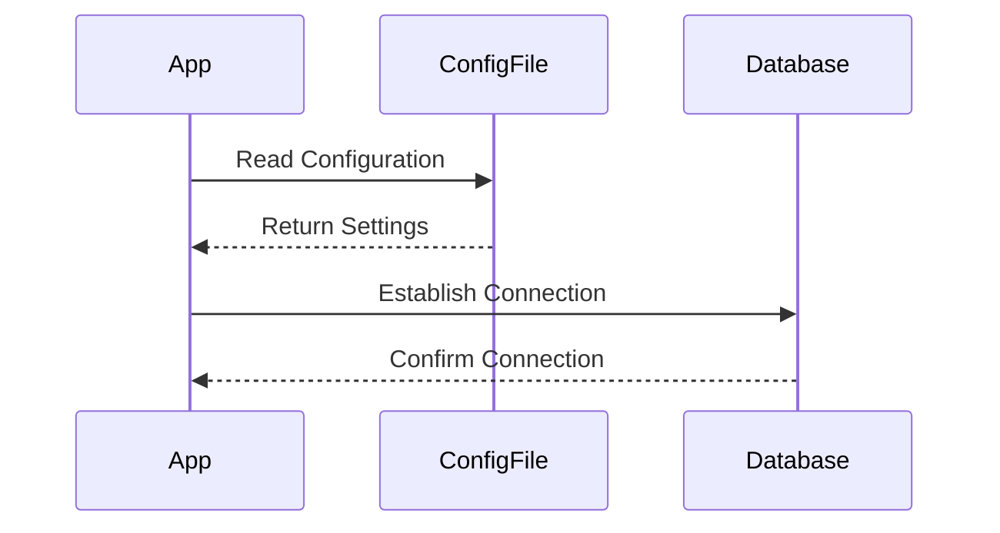

## Application Configuration Files

### What Are Application Configuration Files?

Application configuration files are essential components of software applications that define various settings and parameters required for the application to function correctly. These files can include environment-specific settings, database connection details, API keys, and other critical configurations. They are typically stored in plain text formats such as JSON, XML, or YAML.

### Why Are They Important?

Configuration files are crucial because they allow developers to manage different environments (development, testing, staging, production) without changing the core codebase. This separation ensures that sensitive information is not hardcoded into the application, reducing the risk of exposure.

### How Do They Work Under the Hood?

Configuration files are read by the application at runtime. The application parses these files and uses the values to initialize its internal state. For example, a configuration file might specify the database connection string, which the application uses to establish a connection to the database.

#### Example Configuration File (JSON)

```json
{
  "environment": "production",
  "database": {
    "host": "localhost",
    "port": 5432,
    "username": "dbuser",
    "password": "dbpass"
  },
  "apiKeys": {
    "googleMaps": "AIzaSyD_foo_bar_baz"
  }
}
```

### Common Pitfalls

One common pitfall is storing sensitive information in configuration files without proper protection. If these files are checked into version control systems like Git, they can be exposed to unauthorized users. Additionally, if the configuration files are not properly managed across different environments, it can lead to misconfigurations and security vulnerabilities.

### Real-World Examples

A notable example of configuration file mismanagement leading to a breach is the **GitHub OAuth token leak** in 2019 (CVE-2019-10229). A developer accidentally committed a GitHub OAuth token to a public repository, allowing unauthorized access to private repositories.

### How to Prevent / Defend

#### Detection

To detect misconfigured or exposed configuration files, you can use static analysis tools like `git-secrets` or `trufflehog`. These tools scan your codebase for patterns that match sensitive information and alert you if they find any.

#### Prevention

1. **Environment Variables**: Use environment variables to store sensitive information instead of hardcoding them in configuration files.
2. **Secret Management Tools**: Utilize secret management tools like HashiCorp Vault or AWS Secrets Manager to securely store and manage secrets.
3. **Version Control Policies**: Implement strict policies to prevent sensitive information from being checked into version control systems.

#### Secure Code Fix

**Vulnerable Configuration File**

```json
{
  "database": {
    "host": "localhost",
    "port": 5432,
    "username": "dbuser",
    "password": "dbpass"
  }
}
```

**Secure Configuration File**

```json
{
  "database": {
    "host": "${DB_HOST}",
    "port": "${DB_PORT}",
    "username": "${DB_USERNAME}",
    "password": "${DB_PASSWORD}"
  }
}
```

### Mermaid Diagram: Configuration File Flow



---
<!-- nav -->
[[08-Overview of OWASP Top 10|Overview of OWASP Top 10]] | [[DevSecOps/DevSecOps Bootcamp/03-Identity & Access Management/04-Security Essentials/OWASP top 10 Part 1/00-Overview|Overview]] | [[10-Broken Access Control Part 1|Broken Access Control Part 1]]
