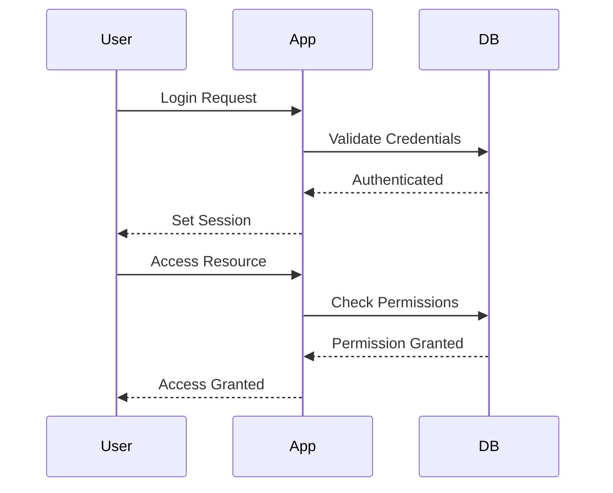

## Broken Access Control

### What is Broken Access Control?

Broken access control is a critical security issue that occurs when an application fails to properly restrict access to resources based on the identity and permissions of the user. This weakness allows attackers to gain unauthorized access to sensitive information or perform actions that should be restricted to specific roles or users.

#### Why Does Broken Access Control Matter?

Access control is fundamental to maintaining the confidentiality, integrity, and availability of an application's data and functionality. Without proper access control, an attacker could:

- Impersonate a legitimate user.
- Access sensitive data that should be restricted.
- Perform administrative actions that should be limited to privileged users.

This can lead to severe consequences such as data breaches, financial loss, and reputational damage.

#### How Does Broken Access Control Work?

Access control mechanisms typically involve authentication, authorization, and session management. Authentication verifies the identity of a user, authorization determines what actions a user is allowed to perform, and session management ensures that the user's identity and permissions are maintained throughout their interaction with the application.

When these mechanisms are flawed, an attacker can exploit the vulnerabilities to bypass access controls. For example, if an application does not properly validate user roles before allowing access to certain resources, an attacker could manipulate the application to gain unauthorized access.

### Real-World Examples

One notable example of broken access control is the Equifax breach in 2017. The attackers exploited a vulnerability in the Apache Struts framework, which allowed them to execute arbitrary code on the server. Once they gained access, they were able to bypass access controls and steal sensitive personal information from millions of consumers.

Another example is the Capital One breach in 2019, where an attacker exploited a misconfigured web application firewall (WAF) to access sensitive customer data. The WAF was supposed to enforce access controls, but due to a configuration error, it failed to properly restrict access.

### Common Pitfalls

- **Inadequate Role-Based Access Control (RBAC):** Not properly defining and enforcing roles and permissions can lead to unauthorized access.
- **Improper Session Management:** Weak session handling can allow attackers to hijack sessions and impersonate legitimate users.
- **Lack of Input Validation:** Failing to validate input can allow attackers to manipulate parameters and bypass access controls.

### How to Prevent / Defend

#### Detection

To detect broken access control issues, you can use automated tools and manual testing techniques:

- **Static Application Security Testing (SAST):** Tools like SonarQube and Fortify can analyze source code for potential access control vulnerabilities.
- **Dynamic Application Security Testing (DAST):** Tools like Burp Suite and OWASP ZAP can simulate attacks to test access control mechanisms.
- **Manual Penetration Testing:** Conduct thorough penetration tests to identify and exploit access control weaknesses.

#### Prevention

- **Implement Strong RBAC:** Define clear roles and permissions, and ensure that users can only access resources appropriate to their role.
- **Use Secure Session Management:** Implement strong session management practices, such as using secure cookies, regenerating session IDs after login, and setting appropriate timeouts.
- **Input Validation:** Always validate input to prevent manipulation of parameters that could bypass access controls.

#### Secure Coding Fixes

Here is an example of how to implement secure access control in a web application using Python and Flask:

```python
from flask import Flask, session, redirect, url_for, request

app = Flask(__name__)
app.secret_key = 'your_secret_key'

# Define roles and permissions
ROLES = {
    'admin': ['view', 'edit', 'delete'],
    'user': ['view']
}

@app.route('/login', methods=['POST'])
def login():
    username = request.form['username']
    password = request.form['password']
    
    # Simulate user authentication
    if authenticate_user(username, password):
        session['user'] = username
        session['role'] = get_user_role(username)
        return redirect(url_for('dashboard'))
    else:
        return 'Login Failed'

@app.route('/dashboard')
def dashboard():
    if 'user' in session:
        return f"Welcome {session['user']}!"
    else:
        return redirect(url_for('login'))

@app.route('/protected_resource')
def protected_resource():
    if 'user' in session and 'view' in ROLES[session['role']]:
        return "Access granted"
    else:
        return "Access denied"

def authenticate_user(username, password):
    # Simulate authentication logic
    return True

def get_user_role(username):
    # Simulate role retrieval logic
    return 'user'

if __name__ == '__main__':
    app.run(debug=True)
```

### Mermaid Diagrams

#### Access Control Flow



### Practice Labs

For hands-on practice with broken access control, consider the following labs:

- **PortSwigger Web Security Academy:** Offers interactive labs on access control vulnerabilities.
- **OWASP Juice Shop:** A deliberately insecure web application for learning about various security issues, including access control.
- **DVWA (Damn Vulnerable Web Application):** Provides a range of security vulnerabilities, including broken access control, for educational purposes.

---
<!-- nav -->
[[09-Application Configuration Files|Application Configuration Files]] | [[DevSecOps/DevSecOps Bootcamp/03-Identity & Access Management/04-Security Essentials/OWASP top 10 Part 1/00-Overview|Overview]] | [[11-Broken Access Control|Broken Access Control]]
