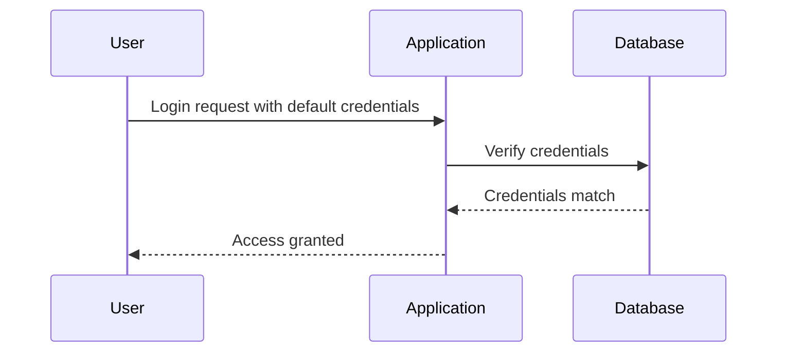
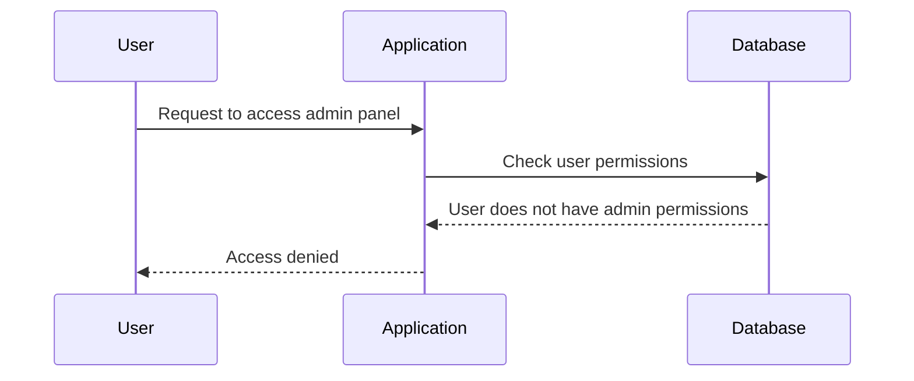
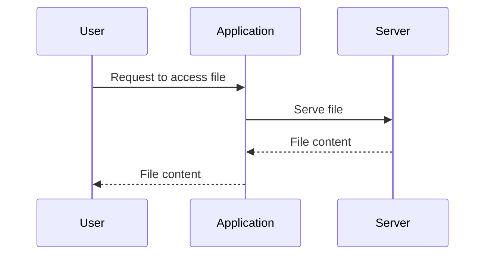
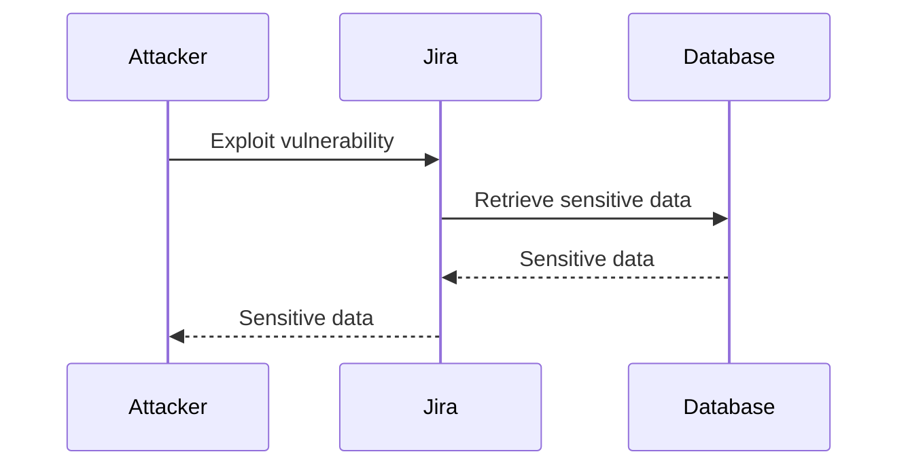
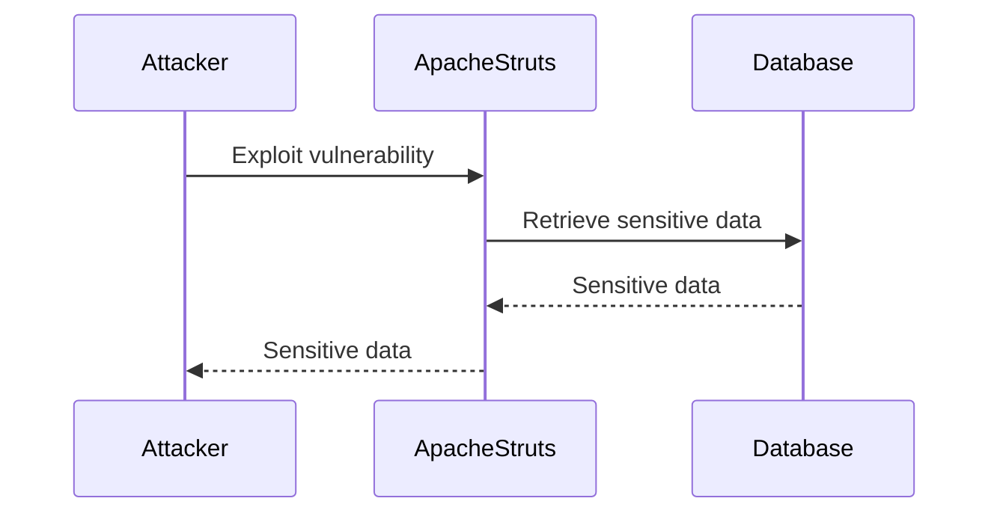

## Broken Access Control

### Introduction

Broken access control is one of the most critical vulnerabilities listed in the OWASP Top 10. It occurs when an application fails to properly enforce restrictions on what authenticated users are allowed to do. This can lead to unauthorized access to sensitive data, administrative functions, and other resources that should be restricted. Understanding and preventing broken access control is crucial for maintaining the security and integrity of web applications.

### What is Broken Access Control?

Broken access control refers to a situation where an application does not correctly enforce the intended access controls. This means that users might be able to access resources or perform actions that they should not be allowed to. This can happen due to various reasons, such as:

- **Improper Authentication**: The application may not properly verify the identity of the user.
- **Inadequate Authorization Checks**: The application may not check whether a user has the necessary permissions to access certain resources.
- **Sensitive Data Exposure**: The application may expose sensitive data to unauthorized users.
- **Manipulation of Requests**: Attackers can manipulate requests to gain unauthorized access.

### Why Does Broken Access Control Matter?

Broken access control can lead to severe consequences, including:

- **Data Leakage**: Unauthorized users can access sensitive data, leading to data breaches.
- **Privilege Escalation**: Users can gain elevated privileges and perform actions they should not be allowed to.
- **Financial Loss**: In financial systems, unauthorized access can result in significant financial losses.
- **Reputation Damage**: Data breaches can severely damage the reputation of an organization.

### How Does Broken Access Control Work?

To understand how broken access control works, let's consider a few scenarios:

#### Scenario 1: Improper Authentication

In this scenario, the application does not properly authenticate users. For example, an attacker might be able to log in using a default username and password, which were not changed after deployment.



#### Scenario 2: Inadequate Authorization Checks

In this scenario, the application does not check whether a user has the necessary permissions to access certain resources. For example, an attacker might be able to access administrative functions by simply changing the URL.



#### Scenario 3: Sensitive Data Exposure

In this scenario, the application exposes sensitive data to unauthorized users. For example, an attacker might be able to access files on the server by manipulating the URL.



### Recent Real-World Examples

#### Example 1: CVE-2021-21972

CVE-2021-21972 is a vulnerability in the Atlassian Jira application that allows unauthorized access to sensitive data. An attacker could exploit this vulnerability to access sensitive information, such as user credentials and project details.



#### Example 2: Equifax Data Breach (2017)

The Equifax data breach in 2017 was caused by a vulnerability in the Apache Struts framework. This vulnerability allowed attackers to access sensitive data, including Social Security numbers and birth dates of millions of customers.



### How to Prevent / Defend Against Broken Access Control

#### Detection

To detect broken access control, organizations should implement the following measures:

- **Regular Security Audits**: Conduct regular security audits to identify potential vulnerabilities.
- **Penetration Testing**: Perform penetration testing to simulate attacks and identify weaknesses.
- **Logging and Monitoring**: Implement logging and monitoring to detect unauthorized access attempts.

#### Prevention

To prevent broken access control, organizations should implement the following measures:

- **Strong Authentication Mechanisms**: Use strong authentication mechanisms, such as multi-factor authentication (MFA).
- **Role-Based Access Control (RBAC)**: Implement RBAC to ensure that users have only the necessary permissions.
- **Input Validation**: Validate all inputs to prevent manipulation of requests.
- **Secure Configuration Management**: Ensure that configurations are securely managed and default credentials are changed.

#### Secure Coding Fixes

Here are some examples of secure coding practices to prevent broken access control:

##### Vulnerable Code

```python
@app.route('/admin')
def admin_panel():
    return render_template('admin.html')
```

##### Secure Code

```python
@app.route('/admin')
@login_required
@roles_required('admin')
def admin_panel():
    return render_template('admin.html')
```

In the secure code, we use `@login_required` to ensure that only authenticated users can access the admin panel, and `@roles_required('admin')` to ensure that only users with the 'admin' role can access the admin panel.

### Complete Example

Let's consider a complete example of a web application that implements broken access control and how to fix it.

#### Vulnerable Application


#### Vulnerable Code

```python
@app.route('/admin')
def admin_panel():
    return render_template('admin.html')
```

#### Secure Application


#### Secure Code

```python
@app.route('/admin')
@login_required
@roles_required('admin')
def admin_panel():
    return render_template('admin.html')
```

### Common Pitfalls

When implementing access control, organizations often fall into the following pitfalls:

- **Hardcoding Permissions**: Hardcoding permissions in the application can lead to maintenance issues and security vulnerabilities.
- **Overly Permissive Roles**: Assigning overly permissive roles to users can lead to privilege escalation.
- **Ignoring Input Validation**: Ignoring input validation can allow attackers to manipulate requests and gain unauthorized access.

### Hands-On Labs

To practice and reinforce your understanding of broken access control, consider the following hands-on labs:

- **PortSwigger Web Security Academy**: Offers interactive labs on broken access control.
- **OWASP Juice Shop**: A deliberately insecure web application for practicing web security skills.
- **DVWA (Damn Vulnerable Web Application)**: A PHP/MySQL web application that demonstrates web application vulnerabilities.

By thoroughly understanding and implementing the principles of secure access control, organizations can significantly reduce the risk of data breaches and other security incidents.

---
<!-- nav -->
[[10-Broken Access Control Part 1|Broken Access Control Part 1]] | [[DevSecOps/DevSecOps Bootcamp/03-Identity & Access Management/04-Security Essentials/OWASP top 10 Part 1/00-Overview|Overview]] | [[12-Cloud Platform Misconfigurations|Cloud Platform Misconfigurations]]
