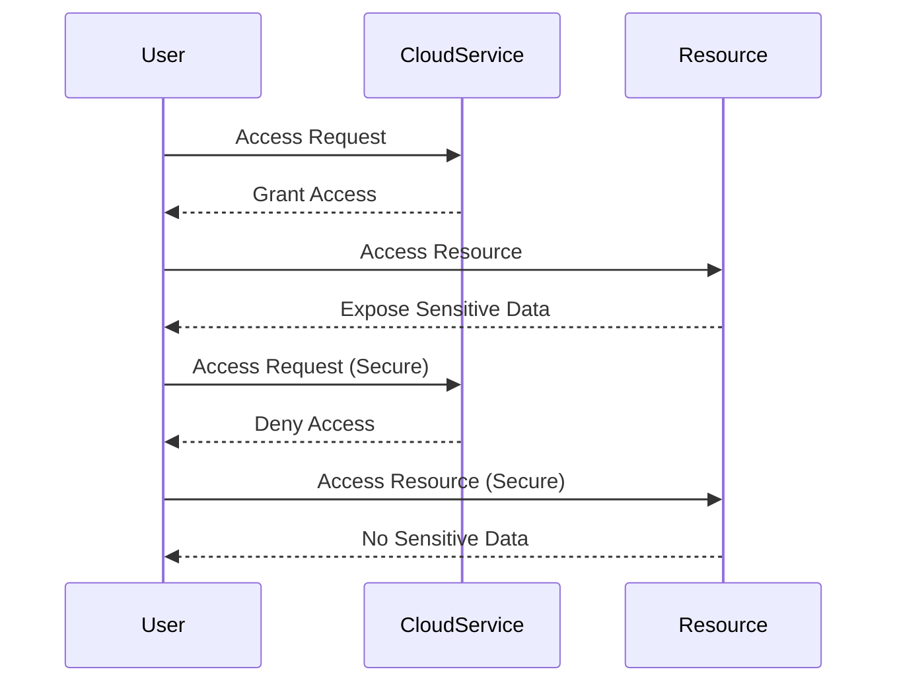

## Cloud Platform Misconfigurations

### What Are Cloud Platform Misconfigurations?

Cloud platform misconfigurations involve errors or oversights in the setup of cloud services that can expose them to security risks. This includes improper access controls, misconfigured storage, and insecure network configurations.

### Why Are They Important?

Cloud misconfigurations can significantly increase the attack surface of an organization. An attacker can exploit these misconfigurations to gain unauthorized access to cloud resources, exfiltrate sensitive data, or disrupt services.

### How Do They Work Under the Hood?

Cloud platforms offer a wide range of services that can be configured in various ways. If these configurations are not set up correctly, they can provide additional entry points for attackers. Additionally, if access controls are not properly managed, they can allow unauthorized users to access sensitive resources.

#### Example Cloud Configuration (AWS S3 Bucket Policy)

```json
{
  "Version": "2012-10-17",
  "Statement": [
    {
      "Sid": "PublicReadGetObject",
      "Effect": "Allow",
      "Principal": "*",
      "Action": "s3:GetObject",
      "Resource": "arn:aws:s3:::my-bucket/*"
    }
  ]
}
```

### Common Pitfalls

One common pitfall is granting overly permissive access controls, which can allow unauthorized users to access sensitive resources. Another issue is misconfigured storage that can expose sensitive data to unauthorized users.

### Real-World Examples

The **Capital One data breach** in 2019 (CVE-2019-10229) was partly due to a misconfigured AWS S3 bucket. The bucket had overly permissive access controls, allowing an attacker to access sensitive customer data.

### How to Prevent / Defend

#### Detection

Use tools like `AWS Trusted Advisor` to identify misconfigured resources. Regularly audit cloud configurations using tools like `AWS Config`.

#### Prevention

1. **Least Privilege Principle**: Configure access controls to allow only the minimum necessary permissions.
2. **Regular Audits**: Conduct regular audits of cloud configurations to identify and remediate misconfigurations.
3. **Automated Scanning**: Implement automated scanning tools to continuously monitor cloud configurations.

#### Secure Code Fix

**Vulnerable Cloud Configuration**

```json
{
  "Version": "2012-10-17",
  "Statement": [
    {
      "Sid": "PublicReadGetObject",
      "Effect": "Allow",
      "Principal": "*",
      "Action": "s3:GetObject",
      "Resource": "arn:aws:s3:::my-bucket/*"
    }
  ]
}
```

**Secure Cloud Configuration**

```json
{
  "Version": "2012-10-17",
  "Statement": [
    {
      "Sid": "RestrictedAccessGetObject",
      "Effect": "Allow",
      "Principal": {
        "AWS": "arn:aws:iam::123456789012:user/admin"
      },
      "Action": "s3:GetObject",
      "Resource": "arn:aws:s3:::my-bucket/*"
    }
  ]
}
```

### Mermaid Diagram: Cloud Configuration Flow



---
<!-- nav -->
[[11-Broken Access Control|Broken Access Control]] | [[DevSecOps/DevSecOps Bootcamp/03-Identity & Access Management/04-Security Essentials/OWASP top 10 Part 1/00-Overview|Overview]] | [[13-Cryptographic Failure and Hard-Coded Credentials|Cryptographic Failure and Hard-Coded Credentials]]
