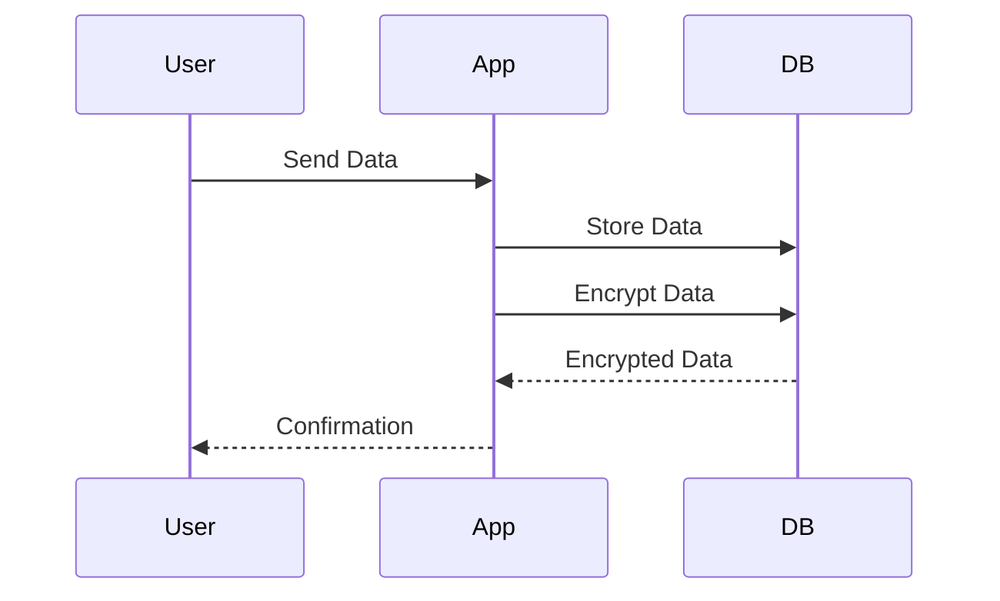

## Cryptographic Failures

### What are Cryptographic Failures?

Cryptographic failures occur when an application uses weak or incorrect encryption methods, leaving sensitive data vulnerable to attacks. Encryption is crucial for protecting data at rest and in transit, ensuring that even if an attacker gains access to the data, they cannot read it without the proper decryption key.

#### Why Do Cryptographic Failures Matter?

Data is often the most valuable asset for an application, similar to art pieces, money, or digital currency. Without proper encryption, an attacker can easily access and misuse sensitive information, leading to significant financial and reputational losses.

#### How Do Cryptographic Failures Work?

Encryption involves converting plaintext data into ciphertext using a cryptographic algorithm and a key. Decryption reverses this process, converting ciphertext back into plaintext using the same key. Weak encryption can be easily broken, allowing attackers to access the original data.

### Real-World Examples

One notable example of cryptographic failure is the Heartbleed bug in OpenSSL, discovered in 2014. This vulnerability allowed attackers to read sensitive information from memory, including private keys used for encryption. This led to widespread attacks on websites and services that relied on OpenSSL for encryption.

Another example is the POODLE attack, which exploited a vulnerability in SSLv3 to decrypt HTTPS traffic. This attack demonstrated the importance of using strong encryption protocols and avoiding outdated and insecure versions.

### Common Pitfalls

- **Weak Encryption Algorithms:** Using outdated or weak encryption algorithms, such as DES or RC4, can make data vulnerable to attacks.
- **Incorrect Key Management:** Poorly managed encryption keys can lead to unauthorized access to encrypted data.
- **Outdated Protocols:** Using outdated encryption protocols, such as SSLv3 or TLS 1.0, can expose data to known vulnerabilities.

### How to Prevent / Defend

#### Detection

To detect cryptographic failures, you can use automated tools and manual testing techniques:

- **Static Application Security Testing (SAST):** Tools like SonarQube and Fortify can analyze source code for potential cryptographic vulnerabilities.
- **Dynamic Application Security Testing (DAST):** Tools like Burp Suite and OWASP ZAP can test encryption mechanisms and detect weak encryption.
- **Manual Penetration Testing:** Conduct thorough penetration tests to identify and exploit cryptographic weaknesses.

#### Prevention

- **Use Strong Encryption Algorithms:** Ensure that strong encryption algorithms, such as AES, are used for encrypting data.
- **Proper Key Management:** Implement secure key management practices, such. as using hardware security modules (HSMs) and rotating keys regularly.
- **Update Encryption Protocols:** Use up-to-date encryption protocols, such as TLS 1.2 or 1.3, and avoid using outdated and insecure versions.

#### Secure Coding Fixes

Here is an example of how to implement strong encryption in a web application using Python and the `cryptography` library:

```python
from cryptography.fernet import Fernet

# Generate a key
key = Fernet.generate_key()
cipher_suite = Fernet(key)

# Encrypt data
plaintext = b"Sensitive data"
ciphertext = cipher_suite.encrypt(plaintext)

# Decrypt data
decrypted_text = cipher_suite.decrypt(ciphertext)

print(f"Plaintext: {plaintext}")
print(f"Ciphertext: {ciphertext}")
print(f"Decrypted Text: {decrypted_text}")
```

### Mermaid Diagrams

#### Encryption Flow



### Practice Labs

For hands-on practice with cryptographic failures, consider the following labs:

- **PortSwigger Web Security Academy:** Offers interactive labs on encryption vulnerabilities.
- **OWASP Juice Shop:** A deliberately insecure web application for learning about various security issues, including cryptographic failures.
- **DVWA (Damn Vulnerable Web Application):** Provides a range of security vulnerabilities, including cryptographic failures, for educational purposes.

By thoroughly understanding and implementing these security measures, you can significantly reduce the risk of broken access control and cryptographic failures in your applications.

---
<!-- nav -->
[[13-Cryptographic Failure and Hard-Coded Credentials|Cryptographic Failure and Hard-Coded Credentials]] | [[DevSecOps/DevSecOps Bootcamp/03-Identity & Access Management/04-Security Essentials/OWASP top 10 Part 1/00-Overview|Overview]] | [[15-Default Credentials and Misconfigurations|Default Credentials and Misconfigurations]]
