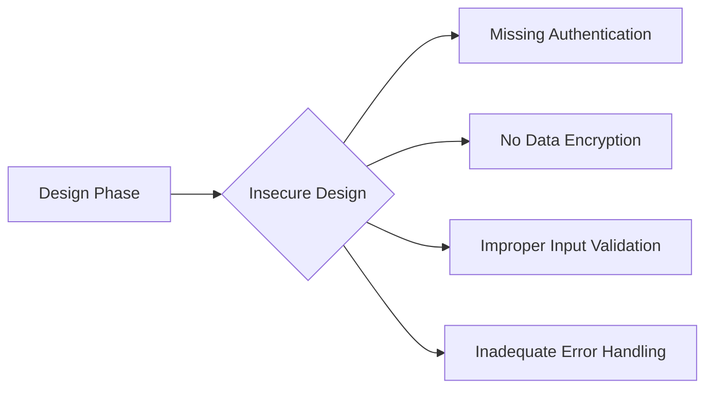
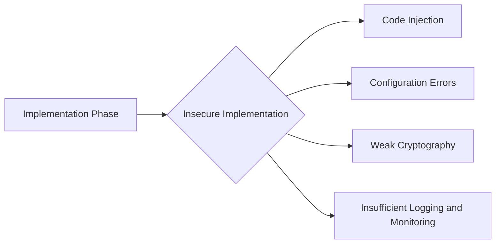
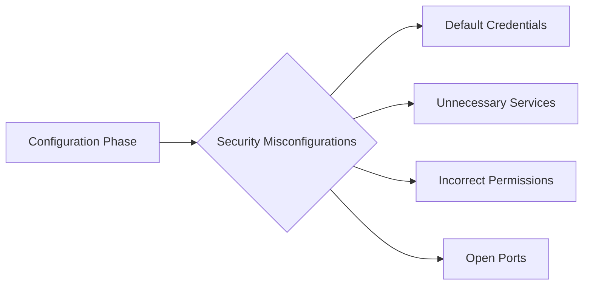

## Insecure Design and Implementation

### Introduction to Application Security

Application security encompasses the measures taken to protect applications from threats and vulnerabilities. This includes both the design and implementation phases of the development lifecycle. Understanding the distinction between these two phases is crucial for ensuring robust security.

#### What is Insecure Design?

Insecure design refers to the lack of proper security controls and considerations during the initial planning and architecture stages of an application. This phase involves defining the overall structure, components, and interactions within the system. If these foundational elements are not designed with security in mind, the application will inherently be vulnerable to various attacks.

**Why Does Insecure Design Matter?**

Insecure design can lead to fundamental flaws that cannot be easily remedied through secure implementation alone. For instance, if an application is designed without proper authentication mechanisms, it will be susceptible to unauthorized access regardless of how securely the code is written.

**How Does Insecure Design Work Under the Hood?**

During the design phase, developers and architects should consider potential security threats and incorporate appropriate controls. This includes:

- **Authentication and Authorization**: Ensuring that users are properly identified and granted the correct level of access.
- **Data Encryption**: Protecting sensitive data both in transit and at rest.
- **Input Validation**: Ensuring that user inputs are validated to prevent injection attacks.
- **Error Handling**: Properly handling errors to avoid exposing sensitive information.

**Real-World Example: Equifax Breach (CVE-2017-5638)**

The Equifax breach in 2017 was partly due to insecure design. The company failed to properly secure their web application, leading to a massive data leak affecting millions of customers. The root cause was the lack of proper input validation and error handling, which allowed attackers to exploit a vulnerability in the Apache Struts framework.



### Insecure Implementation

#### What is Insecure Implementation?

Insecure implementation refers to the actual coding and deployment of an application. Even if the design is sound, poor implementation practices can introduce vulnerabilities. This includes issues such as:

- **Code Injection**: Allowing malicious code to execute within the application.
- **Configuration Errors**: Incorrectly setting up security settings.
- **Weak Cryptography**: Using weak encryption algorithms or keys.
- **Insufficient Logging and Monitoring**: Failing to track and respond to suspicious activities.

**Why Does Insecure Implementation Matter?**

Even with a secure design, insecure implementation can render the entire system vulnerable. For example, if an application uses strong encryption but fails to properly configure the encryption keys, the data can still be compromised.

**How Does Insecure Implementation Work Under the Hood?**

During the implementation phase, developers should adhere to secure coding practices and ensure that all security controls are correctly implemented. This includes:

- **Using Secure Libraries and Frameworks**: Choosing libraries and frameworks that have been vetted for security.
- **Proper Configuration Management**: Ensuring that all configurations are set up correctly and securely.
- **Regular Code Reviews**: Conducting thorough reviews to identify and fix security issues.
- **Continuous Testing**: Regularly testing the application for vulnerabilities using tools like static and dynamic analysis.

**Real-World Example: Capital One Breach (CVE-2019-11510)**

The Capital One breach in 2019 was caused by insecure implementation. An attacker exploited a misconfigured web application firewall (WAF) to gain access to sensitive customer data. The WAF was improperly configured, allowing the attacker to bypass security controls.



### How to Prevent / Defend Against Insecure Design and Implementation

#### Detection

To detect insecure design and implementation, organizations should employ a combination of automated and manual techniques:

- **Static Analysis Tools**: Tools like SonarQube and Fortify can scan code for potential security issues.
- **Dynamic Analysis Tools**: Tools like Burp Suite and OWASP ZAP can test the application for runtime vulnerabilities.
- **Penetration Testing**: Engaging ethical hackers to simulate attacks and identify weaknesses.

#### Prevention

Preventing insecure design and implementation requires a comprehensive approach:

- **Secure Coding Practices**: Adhering to established guidelines such as the OWASP Top Ten and the SANS Top 25.
- **Regular Audits**: Conducting regular security audits to identify and address vulnerabilities.
- **Security Training**: Providing ongoing training for developers to stay updated on the latest security practices.

#### Secure-Coding Fixes

Here is an example of a vulnerable code snippet and its secure counterpart:

**Vulnerable Code:**
```python
def login(username, password):
    if username == "admin" and password == "password":
        return True
    else:
        return False
```

**Secure Code:**
```python
import hashlib

def hash_password(password):
    return hashlib.sha256(password.encode()).hexdigest()

def login(username, password):
    stored_username = "admin"
    stored_password_hash = "5e884898da28047151d0e56f8dc6292773603d0d6aabbdd62a11ef721d1542d8"  # Hash of "password"
    
    if username == stored_username and hash_password(password) == stored_password_hash:
        return True
    else:
        return False
```

#### Configuration Hardening

Hardening configurations involves setting up security settings correctly. Here is an example of securing an Apache server:

**Insecure Configuration:**
```apache
ServerName localhost
Listen 80
DocumentRoot "/var/www/html"
```

**Secure Configuration:**
```apache
ServerName localhost
Listen 443 ssl
DocumentRoot "/var/www/html"

<Directory "/var/www/html">
    Options Indexes FollowSymLinks MultiViews
    AllowOverride None
    Order allow,deny
    Allow from all
</Directory>

SSLEngine on
SSLCertificateFile /etc/ssl/certs/server.crt
SSLCertificateKeyFile /etc/ssl/private/server.key
```

### Security Misconfigurations

#### What are Security Misconfigurations?

Security misconfigurations occur when an application or its underlying environment is not properly configured. This can happen at any level of the application stack, including the operating system, web server, database, and application itself.

**Why Do Security Misconfigurations Matter?**

Misconfigurations can expose sensitive data and provide attackers with easy entry points. For example, leaving default credentials unchanged or failing to disable unnecessary services can lead to security breaches.

**How Do Security Misconfigurations Work Under the Hood?**

Misconfigurations can manifest in various ways:

- **Default Credentials**: Leaving default usernames and passwords unchanged.
- **Unnecessary Services**: Running services that are not required for the application.
- **Incorrect Permissions**: Setting incorrect file and directory permissions.
- **Open Ports**: Leaving ports open that should be closed.

**Real-World Example: Yahoo! Breach (CVE-2014-9390)**

The Yahoo! breach in 2014 was partly due to security misconfigurations. The company failed to properly secure its servers, leading to a massive data leak affecting billions of users. The root cause was the use of default credentials and the exposure of sensitive data through open ports.



### How to Prevent / Defend Against Security Misconfigurations

#### Detection

To detect security misconfigurations, organizations should employ a combination of automated and manual techniques:

- **Configuration Scanners**: Tools like OpenSCAP and Lynis can scan systems for misconfigurations.
- **Penetration Testing**: Engaging ethical hackers to simulate attacks and identify weaknesses.
- **Regular Audits**: Conducting regular security audits to identify and address vulnerabilities.

#### Prevention

Preventing security misconfigurations requires a comprehensive approach:

- **Standardized Configurations**: Using standardized configurations across all environments.
- **Automated Deployment**: Using automation tools like Ansible and Terraform to ensure consistent and secure configurations.
- **Regular Updates**: Keeping all systems and software up to date with the latest security patches.

#### Secure-Coding Fixes

Here is an example of a vulnerable configuration and its secure counterpart:

**Vulnerable Configuration:**
```json
{
    "username": "admin",
    "password": "password",
    "services": ["http", "ftp", "ssh"]
}
```

**Secure Configuration:**
```json
{
    "username": "admin",
    "password": "5e884898da28047151d0e56f8dc6292773603d0d6aabbdd62a11ef721d1542d8",  // Hash of "password"
    "services": ["https", "ssh"]
}
```

#### Configuration Hardening

Hardening configurations involves setting up security settings correctly. Here is an example of securing an Nginx server:

**Insecure Configuration:**
```nginx
server {
    listen 80;
    server_name localhost;
    location / {
        root /var/www/html;
        index index.html index.htm;
    }
}
```

**Secure Configuration:**
```nginx
server {
    listen 443 ssl;
    server_name localhost;
    ssl_certificate /etc/nginx/ssl/server.crt;
    ssl_certificate_key /etc/nginx/ssl/server.key;

    location / {
        root /var/www/html;
        index index.html index.htm;
    }

    location ~ /\.ht {
        deny all;
    }
}
```

### Conclusion

Understanding the difference between insecure design and insecure implementation is crucial for building secure applications. By addressing both design and implementation issues, organizations can significantly reduce the risk of security breaches. Regular audits, secure coding practices, and proper configuration management are essential steps in achieving robust application security.

### Practice Labs

For hands-on experience with these concepts, consider the following practice labs:

- **PortSwigger Web Security Academy**: Offers interactive labs covering various web security topics, including insecure design and implementation.
- **OWASP Juice Shop**: A deliberately insecure web application for practicing web security skills.
- **DVWA (Damn Vulnerable Web Application)**: A PHP/MySQL web application that demonstrates web application vulnerabilities.

By engaging with these labs, you can apply the theoretical knowledge gained in this chapter to practical scenarios, further enhancing your understanding of application security.

---
<!-- nav -->
[[19-Insecure Data Transmission and Cryptographic Failures|Insecure Data Transmission and Cryptographic Failures]] | [[DevSecOps/DevSecOps Bootcamp/03-Identity & Access Management/04-Security Essentials/OWASP top 10 Part 1/00-Overview|Overview]] | [[21-Insecure Design|Insecure Design]]
