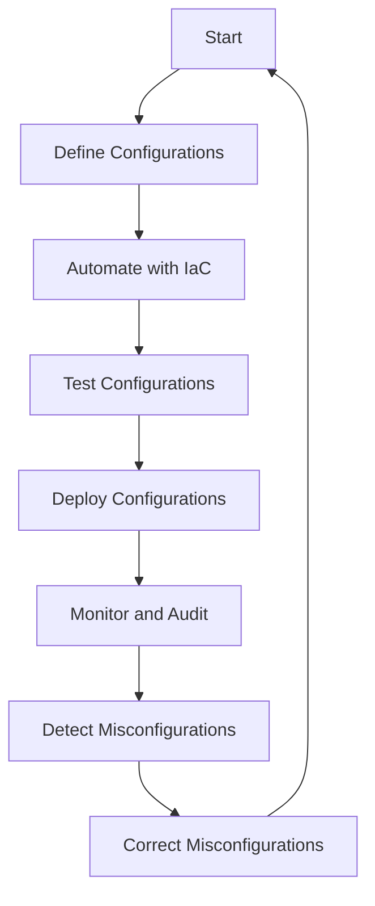

## Misconfiguration Vulnerabilities in Applications

### Introduction to Misconfiguration Vulnerabilities

Misconfiguration vulnerabilities are among the most common issues found across various applications. These vulnerabilities arise when an application or its components are not properly set up or configured according to best practices. This can occur at any level of the application stack, including the operating system, middleware, database, and application itself. The critical aspect to understand is that a hacker only needs one entry point to exploit a system, whereas a security engineer must ensure that every single configuration is correct. This makes misconfiguration vulnerabilities particularly dangerous and challenging to manage.

### Complexity and Human Error

In modern applications, especially those built using microservices architecture or containerized environments, the complexity of configurations can be overwhelming. There are numerous layers and tools that require proper setup, and the sheer number of configurations can easily lead to human error. For instance, forgetting to change default credentials, leaving unnecessary features enabled, or misconfiguring security settings can create significant vulnerabilities.

#### Real-World Example: CVE-2021-21972

One notable example of a misconfiguration vulnerability leading to a significant breach is CVE-2021-21972, which affected VMware vCenter Server. This vulnerability allowed attackers to bypass authentication and gain unauthorized access to the server. The root cause was a misconfigured service that did not enforce proper authentication mechanisms. This highlights the importance of ensuring that all services and configurations are correctly set up to avoid such vulnerabilities.

### Automation and Processes in DevSecOps

Given the complexity and potential for human error, automation and robust processes are essential in managing configurations effectively. DevSecOps engineers implement automated tools and processes to validate and check configurations across all levels of the application stack. This helps in identifying and correcting misconfigurations before they can be exploited.

#### Tools and Techniques

Several tools and techniques are commonly used in DevSecOps to manage configurations:

1. **Configuration Management Tools**: Tools like Ansible, Puppet, and Chef help in automating the configuration management process. These tools allow for consistent and repeatable configurations across different environments.
   
2. **Infrastructure as Code (IaC)**: Using IaC tools like Terraform, CloudFormation, and Kubernetes manifests ensures that infrastructure configurations are version-controlled and can be audited and validated automatically.

3. **Security Scanners and Auditors**: Tools like Trivy, Aqua Security, and Twistlock can scan configurations and identify misconfigurations that could lead to security vulnerabilities.

4. **Continuous Integration/Continuous Deployment (CI/CD) Pipelines**: Integrating security checks into CI/CD pipelines ensures that configurations are validated and tested continuously.

### Mermaid Diagrams for Configuration Management

Let's visualize the process of configuration management using a mermaid diagram:



### Detailed Example: Misconfigured Service in Kubernetes

Consider a scenario where a Kubernetes deployment is misconfigured, allowing unauthorized access to sensitive data. Let's walk through the steps to identify and correct this misconfiguration.

#### Vulnerable Configuration

Suppose we have a Kubernetes deployment with the following manifest:

```yaml
apiVersion: apps/v1
kind: Deployment
metadata:
  name: myapp-deployment
spec:
  replicas: 3
  selector:
    matchLabels:
      app: myapp
  template:
    metadata:
      labels:
        app: myapp
    spec:
      containers:
      - name: myapp-container
        image: myapp:v1
        ports:
        - containerPort: 80
        env:
        - name: DB_PASSWORD
          valueFrom:
            secretKeyRef:
              name: db-secret
              key: password
```

#### Vulnerability Analysis

The above configuration does not specify any security context or network policies, which can lead to unauthorized access. Additionally, the environment variable `DB_PASSWORD` is exposed directly in the pod, which can be accessed by anyone with pod-level access.

#### Secure Configuration

To secure this configuration, we should add appropriate security contexts and network policies. Here is the corrected configuration:

```yaml
apiVersion: apps/v1
kind: Deployment
metadata:
  name: myapp-deployment
spec:
  replicas: 3
  selector:
    matchLabels:
      app: myapp
  template:
    metadata:
      labels:
        app: myapp
    spec:
      containers:
      - name: myapp-container
        image: myapp:v1
        ports:
        - containerPort: 80
        env:
        - name: DB_PASSWORD
          valueFrom:
            secretKeyRef:
              name: db-secret
              key: password
        securityContext:
          runAsUser: 1000
          runAsGroup: 3000
          readOnlyRootFilesystem: true
      securityContext:
        fsGroup: 2000
---
apiVersion: networking.k8s.io/v1
kind: NetworkPolicy
metadata:
  name: myapp-network-policy
spec:
  podSelector:
    matchLabels:
      app: myapp
  policyTypes:
  - Ingress
  ingress:
  - from:
    - podSelector:
        matchLabels:
          app: myapp
    ports:
    - protocol: TCP
      port: 80
```

### How to Prevent / Defend Against Misconfiguration Vulnerabilities

#### Detection

1. **Automated Scanning**: Use tools like Trivy, Aqua Security, and Twistlock to scan configurations and identify misconfigurations.
2. **Logging and Monitoring**: Implement logging and monitoring solutions to detect unusual activities that might indicate a misconfiguration.

#### Prevention

1. **Use Configuration Management Tools**: Leverage tools like Ansible, Puppet, and Chef to automate and standardize configurations.
2. **Implement IaC**: Use IaC tools like Terraform, CloudFormation, and Kubernetes manifests to ensure configurations are version-controlled and auditable.
3. **Enforce Security Policies**: Define and enforce security policies across all configurations to ensure compliance with best practices.

#### Secure Coding Fixes

Compare the vulnerable and secure versions of the Kubernetes deployment manifest to see the differences:

**Vulnerable Configuration:**

```yaml
apiVersion: apps/v1
kind: Deployment
metadata:
  name: myapp-deployment
spec:
  replicas: 3
  selector:
    matchLabels:
      app: myapp
  template:
    metadata:
      labels:
        app: myapp
    spec:
      containers:
      - name: myapp-container
        image: myapp:v1
        ports:
        - containerPort: 80
        env:
        - name: DB_PASSWORD
          valueFrom:
            secretKeyRef:
              name: db-secret
              key: password
```

**Secure Configuration:**

```yaml
apiVersion: apps/v1
kind: Deployment
metadata:
  name: myapp-deployment
spec:
  replicas: 3
  selector:
    matchLabels:
      app: myapp
  template:
    metadata:
      labels:
        app: myapp
    spec:
      containers:
      - name: myapp-container
        image: myapp:v1
        ports:
        - containerPort:  80
        env:
        - name: DB_PASSWORD
          valueFrom:
            secretKeyRef:
              name: db-secret
              key: password
        securityContext:
          runAsUser: 1000
          runAsGroup: 3000
          readOnlyRootFilesystem: true
      securityContext:
        fsGroup: 2000
---
apiVersion: networking.k8s.io/v1
kind: NetworkPolicy
metadata:
  name: myapp-network-policy
spec:
  podSelector:
    matchLabels:
      app: myapp
  policyTypes:
  - Ingress
  ingress:
  - from:
    - podSelector:
        matchLabels:
          app: myapp
    ports:
    - protocol: TCP
      port: 80
```

### Hands-On Labs

For practical experience in managing configurations securely, consider the following labs:

1. **Kubernetes Goat**: A hands-on lab for learning Kubernetes security.
2. **OWASP WrongSecrets**: A series of challenges to learn about secrets management and misconfigurations.
3. **kube-hunter**: A tool for hunting misconfigurations and vulnerabilities in Kubernetes clusters.

By thoroughly understanding and implementing these practices, you can significantly reduce the risk of misconfiguration vulnerabilities in your applications.

---
<!-- nav -->
[[21-Insecure Design|Insecure Design]] | [[DevSecOps/DevSecOps Bootcamp/03-Identity & Access Management/04-Security Essentials/OWASP top 10 Part 1/00-Overview|Overview]] | [[23-Network Level Misconfigurations|Network Level Misconfigurations]]
