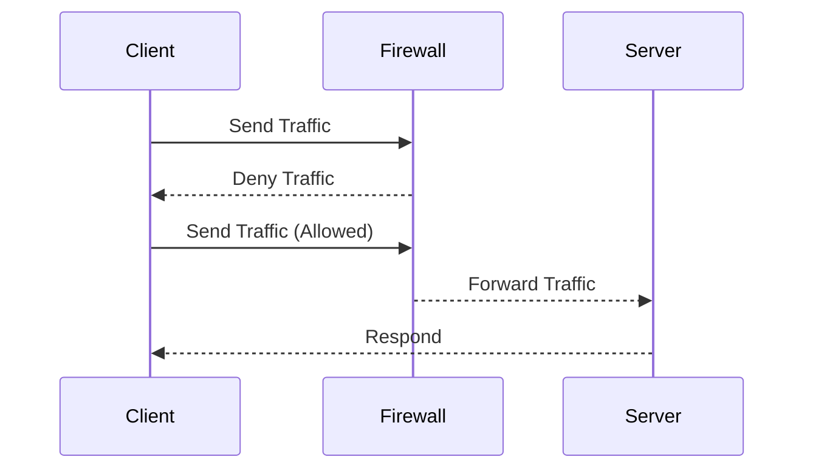

## Network Level Misconfigurations

### What Are Network Level Misconfigurations?

Network level misconfigurations refer to errors or oversights in the setup of network devices and services that can expose systems to security risks. This includes improperly configured firewalls, open ports, and insecure network protocols.

### Why Are They Important?

Network misconfigurations can significantly increase the attack surface of an organization. An attacker can exploit these misconfigurations to gain unauthorized access to systems, exfiltrate sensitive data, or disrupt services.

### How Do They Work Under the Hood?

Firewalls and routers are configured to allow or deny traffic based on predefined rules. If these rules are not set up correctly, they can inadvertently allow malicious traffic to pass through. Similarly, if network services are left running unnecessarily, they can provide additional entry points for attackers.

#### Example Firewall Configuration (iptables)

```bash
# Allow incoming SSH connections from any IP address
iptables -A INPUT -p tcp --dport 22 -j ACCEPT
```

### Common Pitfalls

One common pitfall is leaving default configurations in place, which often include overly permissive rules. Another issue is failing to regularly review and update firewall rules as the network architecture changes.

### Real-World Examples

The **Equifax data breach** in 2017 (CVE-2017-5638) was partly due to a misconfigured Apache Struts server. The server had a vulnerability that allowed attackers to execute arbitrary code, leading to the exposure of sensitive personal data.

### How to Prevent / Defend

#### Detection

Use network scanning tools like `Nmap` to identify open ports and services. Regularly audit firewall rules using tools like `iptables-save` to ensure they align with security policies.

#### Prevention

1. **Least Privilege Principle**: Configure firewalls to allow only the minimum necessary traffic.
2. **Regular Audits**: Conduct regular audits of network configurations to identify and remediate misconfigurations.
3. **Automated Scanning**: Implement automated scanning tools to continuously monitor network configurations.

#### Secure Code Fix

**Vulnerable Firewall Rule**

```bash
# Allow incoming SSH connections from any IP address
iptables -A INPUT -p tcp --dport 22 -j ACCEPT
```

**Secure Firewall Rule**

```bash
# Allow incoming SSH connections only from trusted IPs
iptables -A INPUT -p tcp --dport  22 -s 192.168.1.1 -j ACCEPT
```

### Mermaid Diagram: Network Configuration Flow



---
<!-- nav -->
[[22-Misconfiguration Vulnerabilities in Applications|Misconfiguration Vulnerabilities in Applications]] | [[DevSecOps/DevSecOps Bootcamp/03-Identity & Access Management/04-Security Essentials/OWASP top 10 Part 1/00-Overview|Overview]] | [[24-Secure Protocols and Encryption|Secure Protocols and Encryption]]
