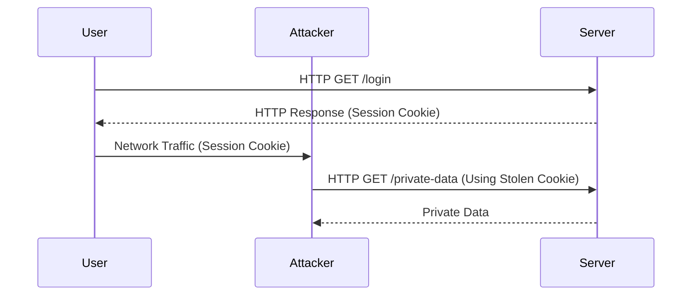
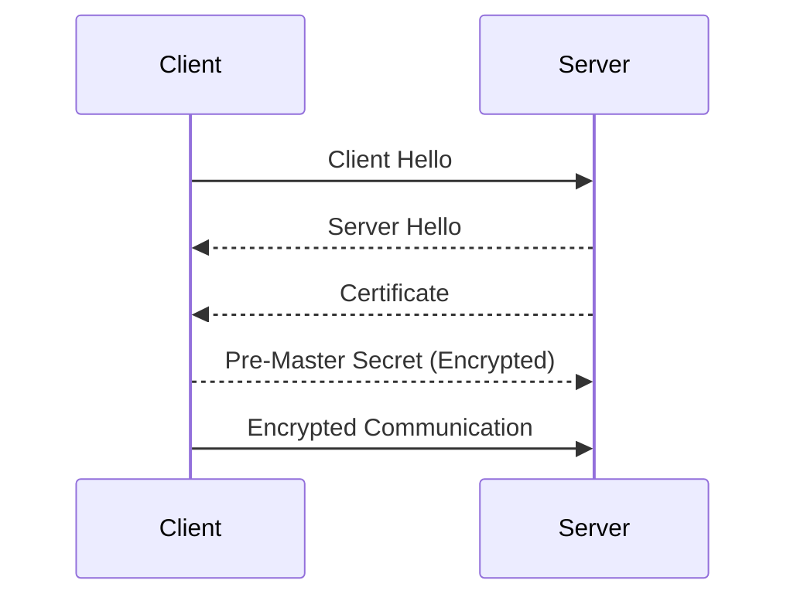

## Secure Protocols and Encryption

### Introduction to Secure Protocols

Secure protocols are essential for protecting data transmitted between clients and servers. One of the most critical aspects of secure communication is ensuring that all data is encrypted, particularly when sensitive information is involved. However, even non-sensitive data can pose significant risks if not properly protected. This section will delve into the importance of enforcing secure protocols across all pages of an application and the potential vulnerabilities that arise when this is not done.

### Why Enforce Secure Protocols?

When an application does not enforce secure protocols (such as HTTPS) on all pages, it leaves itself open to various attacks. The primary reason for this is that HTTP is a plaintext protocol, meaning that data sent over HTTP can be intercepted and read by anyone with access to the network traffic. This includes sensitive data such as session cookies, which can be used to hijack user sessions.

#### Example: Session Hijacking via HTTP

Consider a scenario where a user logs into a web application using HTTP. The session cookie generated during this login process is sent in plaintext over the network. An attacker monitoring the network traffic can intercept this cookie and use it to impersonate the user. This is known as session hijacking.



### The Importance of HTTPS

HTTPS (HTTP Secure) is an extension of HTTP that adds a layer of encryption through SSL/TLS (Secure Sockets Layer/Transport Layer Security). This ensures that all data transmitted between the client and server is encrypted, making it much harder for attackers to intercept and read the data.

#### How HTTPS Works

HTTPS uses SSL/TLS to establish a secure connection. Here’s a high-level overview of the process:

1. **Client Hello**: The client sends a "Client Hello" message to the server, initiating the handshake.
2. **Server Hello**: The server responds with a "Server Hello" message, including its SSL/TLS version, cipher suite, and other parameters.
3. **Certificate Exchange**: The server sends its SSL/TLS certificate to the client, which contains the public key.
4. **Key Exchange**: The client generates a pre-master secret and encrypts it using the server's public key. This encrypted pre-master secret is sent to the server.
5. **Session Key Establishment**: Both the client and server use the pre-master secret to derive the session keys, which are used to encrypt and decrypt the data.
6. **Encrypted Communication**: Once the session keys are established, all subsequent communication between the client and server is encrypted.



### Real-World Examples

Several real-world breaches have occurred due to the lack of proper encryption. For instance, the Equifax breach in 2017 exposed the personal data of over 143 million people. One of the contributing factors was the failure to properly implement HTTPS on certain parts of their website, allowing attackers to intercept and steal sensitive data.

#### CVE Example: CVE-2017-5638

CVE-2017-5638 is a vulnerability in Apache Struts that allowed attackers to execute arbitrary code on affected systems. This vulnerability could have been exploited more easily if the application did not enforce HTTPS, allowing attackers to intercept and manipulate HTTP traffic.

### How to Prevent / Defend

#### Detection

To detect whether an application is using insecure protocols, you can use tools such as `curl` to check the HTTP headers of a request.

```bash
curl -I http://example.com
```

If the response includes `Content-Type: text/html`, it indicates that the page is served over HTTP.

#### Prevention

To prevent these issues, ensure that all pages of your application enforce HTTPS. This can be achieved by configuring your web server to redirect all HTTP traffic to HTTPS.

##### Nginx Configuration

Here’s an example of how to configure Nginx to enforce HTTPS:

```nginx
server {
    listen 80;
    server_name example.com;
    return 301 https://$host$request_uri;
}

server {
    listen 443 ssl;
    server_name example.com;

    ssl_certificate /etc/nginx/ssl/example.crt;
    ssl_certificate_key /etc/nginx/ssl/example.key;

    location / {
        proxy_pass http://backend;
    }
}
```

##### Apache Configuration

Here’s an example of how to configure Apache to enforce HTTPS:

```apache
<VirtualHost *:80>
    ServerName example.com
    Redirect permanent / https://example.com/
</VirtualHost>

<VirtualHost *:443>
    ServerName example.com
    SSLEngine on
    SSLCertificateFile /etc/apache2/ssl/example.crt
    SSLCertificateKeyFile /etc/apache2/ssl/example.key

    <Directory /var/www/html>
        Require all granted
    </Directory>
</VirtualHost>
```

### Secure Coding Practices

Ensure that all session cookies are marked as `HttpOnly` and `Secure`. This prevents JavaScript from accessing the cookie and ensures that the cookie is only sent over HTTPS.

```javascript
// Insecure Cookie
document.cookie = "sessionID=abc123";

// Secure Cookie
document.cookie = "sessionID=abc123; HttpOnly; Secure";
```

### Additional Considerations

#### File Upload Vulnerabilities

Another common vulnerability is the exploitation of file upload flows in the UI. If an attacker can upload a malicious file, they may gain access to the database or other sensitive areas of the application.

##### Example: SQL Injection via File Upload

An attacker might upload a PHP file containing SQL injection code. If the application does not properly validate and sanitize the uploaded files, the attacker can execute arbitrary SQL commands.

```php
<?php
$pdo = new PDO('mysql:host=localhost;dbname=test', 'username', 'password');
$sql = "SELECT * FROM users WHERE username = '" . $_GET['username'] . "'";
$result = $pdo->query($sql);
?>
```

#### Password Storage

Even if an attacker gains access to the database, they should not be able to easily crack the stored passwords. Using strong hashing algorithms such as bcrypt or Argon2 is crucial.

##### Example: Weak Hashing Algorithm

```sql
CREATE TABLE users (
    id INT AUTO_INCREMENT PRIMARY KEY,
    username VARCHAR(255),
    password VARCHAR(255)
);

INSERT INTO users (username, password) VALUES ('admin', MD5('password'));
```

##### Secure Hashing Algorithm

```sql
CREATE TABLE users (
    id INT AUTO_INCREMENT PRIMARY KEY,
    username VARCHAR(255),
    password VARCHAR(255)
);

INSERT INTO users (username, password) VALUES ('admin', '$2y$10$92IXJXVbI4iKKjQZtqJZjU');
```

### Hands-On Labs

For hands-on practice, consider the following labs:

- **PortSwigger Web Security Academy**: Offers a comprehensive set of labs covering various web security topics, including secure protocols and encryption.
- **OWASP Juice Shop**: A deliberately insecure web application designed for security training purposes. It includes several challenges related to secure protocols and encryption.
- **DVWA (Damn Vulnerable Web Application)**: Another intentionally vulnerable web application that can be used to learn about web security vulnerabilities and how to mitigate them.

By thoroughly understanding and implementing these security measures, you can significantly reduce the risk of data breaches and ensure the confidentiality and integrity of your application's data.

---
<!-- nav -->
[[23-Network Level Misconfigurations|Network Level Misconfigurations]] | [[DevSecOps/DevSecOps Bootcamp/03-Identity & Access Management/04-Security Essentials/OWASP top 10 Part 1/00-Overview|Overview]] | [[25-Security Misconfigurations|Security Misconfigurations]]
