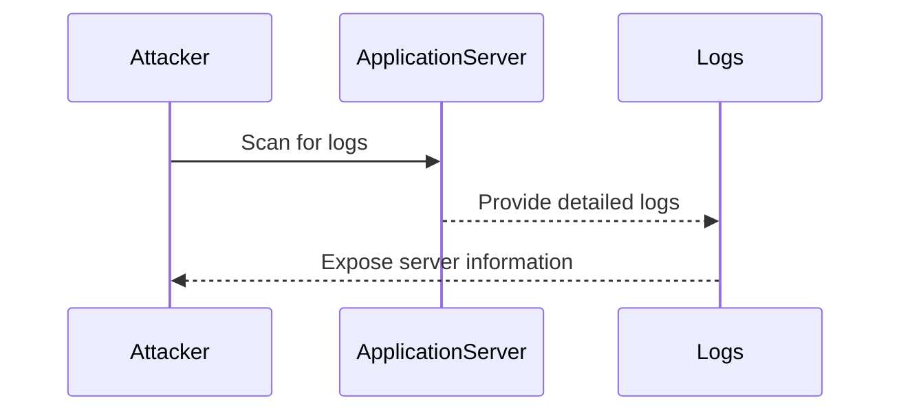
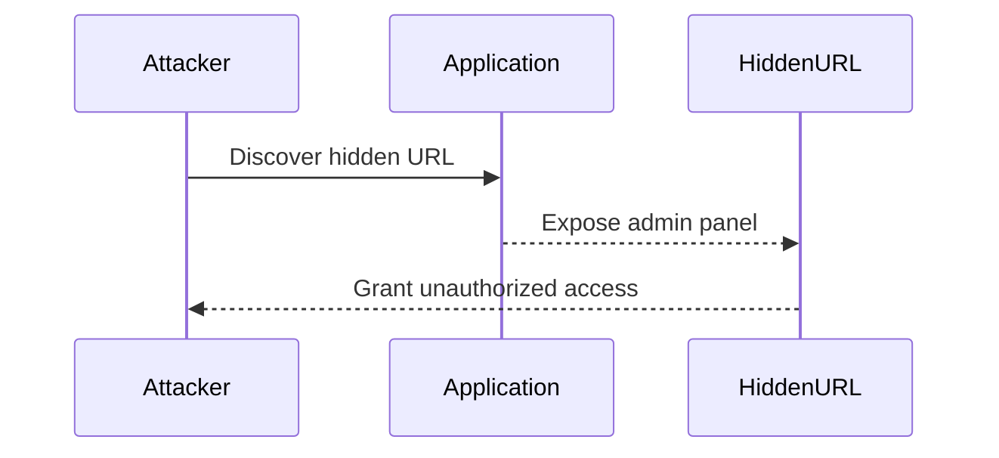
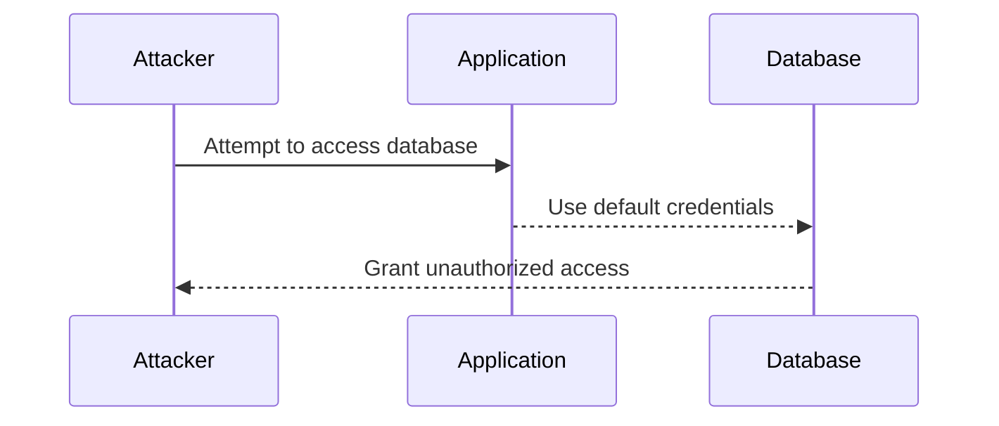
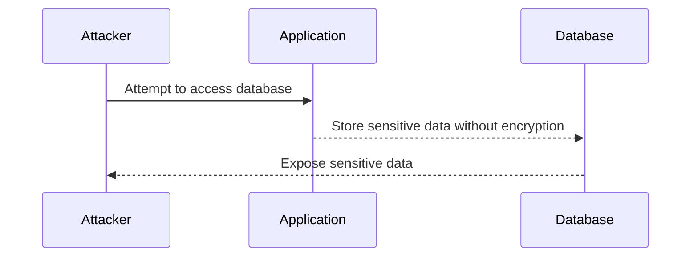

## Security Misconfigurations

Security misconfigurations are one of the most common vulnerabilities found in web applications and systems. They occur when the default settings of a system or application are not properly configured to meet the security requirements of the environment. This can lead to unauthorized access, data exposure, and other serious security issues. In this section, we will delve into various types of security misconfigurations, their implications, and how to prevent them.

### Application Server Configuration Logs

One of the most critical aspects of security misconfigurations is the exposure of sensitive information through logs. Logs can reveal a wealth of details about the underlying infrastructure, including the type of server, its version, and other configuration details. This information can be exploited by attackers to identify potential vulnerabilities and launch targeted attacks.

#### Example: Exposed Server Information

Consider a scenario where an application server is configured to log detailed information about its operations. An attacker can scan the logs and extract valuable information such as:

- **Server Type**: Apache, Nginx, etc.
- **Version**: 2.4.41, 1.19.0, etc.
- **Configuration Details**: Specific modules loaded, custom configurations, etc.



#### Real-World Example: CVE-2021-26084

In 2021, a vulnerability was discovered in the Apache Tomcat server (CVE-2021-26084). This vulnerability allowed attackers to bypass authentication mechanisms and gain unauthorized access to the server. One of the contributing factors was the improper configuration of logging settings, which exposed sensitive information that could be used to exploit the vulnerability.

#### How to Prevent / Defend

**Detection:**
- Regularly review logs for sensitive information exposure.
- Use tools like `grep` to search for specific keywords in log files.

```bash
grep -r "Apache" /var/log/
```

**Prevention:**
- Configure logging settings to minimize exposure of sensitive information.
- Use log management tools to centralize and monitor logs.

**Secure Code Fix:**

Vulnerable Configuration:
```ini
# /etc/apache2/apache2.conf
LogLevel debug
```

Fixed Configuration:
```ini
# /etc/apache2/apache2.conf
LogLevel warn
```

### Hidden URLs and Unnecessary Features

Another common security misconfiguration is the presence of hidden URLs or unnecessary features that were intended for testing or development but were inadvertently left in the production environment. These features can provide unauthorized access to sensitive areas of the application, such as administrative panels.

#### Example: Hidden Admin Panel URL

Consider a scenario where a developer creates a hidden URL `/admin/debug` to facilitate debugging during development. If this URL is not removed before deployment, an attacker can discover it and gain unauthorized access to the admin panel.



#### Real-World Example: CVE-2020-14882

In 2020, a vulnerability was discovered in the WordPress plugin "WP GraphQL" (CVE-2020-14882). This vulnerability allowed attackers to bypass authentication and gain unauthorized access to the admin panel through a hidden endpoint. The issue was caused by the presence of a hidden URL that was not properly secured.

#### How to Prevent / Defend

**Detection:**
- Use automated tools like Burp Suite or OWASP ZAP to scan for hidden URLs.
- Conduct regular security audits to identify and remove unnecessary features.

**Prevention:**
- Remove all development and testing features before deploying to production.
- Implement proper access controls and authentication mechanisms.

**Secure Code Fix:**

Vulnerable Code:
```php
// index.php
if ($_GET['debug'] == 'true') {
    include 'admin/debug.php';
}
```

Fixed Code:
```php
// index.php
if ($_SERVER['REMOTE_ADDR'] === '127.0.0.1') { // Only allow from localhost
    if ($_GET['debug'] == 'true') {
        include 'admin/debug.php';
    }
}
```

### Third-Party Services and Default Credentials

Using third-party services such as databases, message brokers, and other external services can introduce additional security risks if default credentials are left unchanged. Default credentials are often well-known and easily guessable, making them a prime target for attackers.

#### Example: Default Database Credentials

Consider a scenario where a web application uses a third-party database service with default credentials. If these credentials are not changed, an attacker can easily gain unauthorized access to the database and potentially steal sensitive data.



#### Real-World Example: CVE-2021-21972

In 2021, a vulnerability was discovered in the MongoDB database (CVE-2021-21972). This vulnerability allowed attackers to bypass authentication mechanisms and gain unauthorized access to the database. One of the contributing factors was the use of default credentials, which made it easier for attackers to exploit the vulnerability.

#### How to Prevent / Defend

**Detection:**
- Regularly review and audit third-party service configurations.
- Use tools like `nmap` to scan for open ports and services.

```bash
nmap -p 27017 <target_ip>
```

**Prevention:**
- Change default credentials immediately after deployment.
- Implement proper access controls and authentication mechanisms.

**Secure Code Fix:**

Vulnerable Configuration:
```json
{
  "username": "admin",
  "password": "password"
}
```

Fixed Configuration:
```json
{
  "username": "secure_user",
  "password": "strong_password123!"
}
```

### Data Exposure in Databases

Improperly securing data in databases can lead to data exposure and other security issues. This includes using weak encryption methods, failing to encrypt sensitive data, and leaving default configurations in place.

#### Example: Weak Encryption in Databases

Consider a scenario where a web application stores sensitive data in a database without proper encryption. If an attacker gains unauthorized access to the database, they can easily read and steal the sensitive data.



#### Real-World Example: CVE-2020-14882

In 2020, a vulnerability was discovered in the WordPress plugin "WP GraphQL" (CVE-2020-14882). This vulnerability allowed attackers to bypass authentication and gain unauthorized access to the admin panel through a hidden endpoint. The issue was caused by the presence of a hidden URL that was not properly secured.

#### How to Prevent / Defend

**Detection:**
- Regularly review and audit database configurations.
- Use tools like `sqlmap` to test for SQL injection vulnerabilities.

```bash
sqlmap -u "http://example.com/?id=1"
```

**Prevention:**
- Encrypt sensitive data stored in databases.
- Use strong encryption algorithms and key management practices.

**Secure Code Fix:**

Vulnerable Configuration:
```sql
CREATE TABLE users (
    id INT PRIMARY KEY,
    username VARCHAR(50),
    password VARCHAR(50)
);
```

Fixed Configuration:
```sql
CREATE TABLE users (
    id INT PRIMARY KEY,
    username VARCHAR(50),
    password_hash VARCHAR(255)
);
```

### Hands-On Labs

To practice and reinforce the concepts covered in this section, consider the following hands-on labs:

- **PortSwigger Web Security Academy**: Offers a variety of labs focused on web application security, including security misconfigurations.
- **OWASP Juice Shop**: A deliberately insecure web application for practicing web security skills.
- **DVWA (Damn Vulnerable Web Application)**: A PHP/MySQL web application that demonstrates web application vulnerabilities.

By thoroughly understanding and implementing the preventive measures discussed in this section, you can significantly reduce the risk of security misconfigurations in your applications and systems.

---
<!-- nav -->
[[24-Secure Protocols and Encryption|Secure Protocols and Encryption]] | [[DevSecOps/DevSecOps Bootcamp/03-Identity & Access Management/04-Security Essentials/OWASP top 10 Part 1/00-Overview|Overview]] | [[26-Security Posture and Its Importance|Security Posture and Its Importance]]
