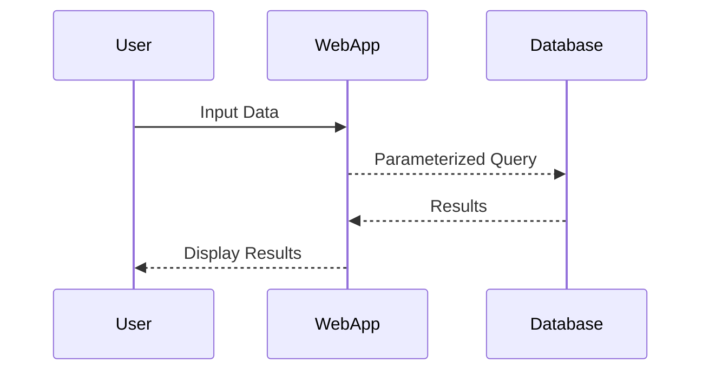
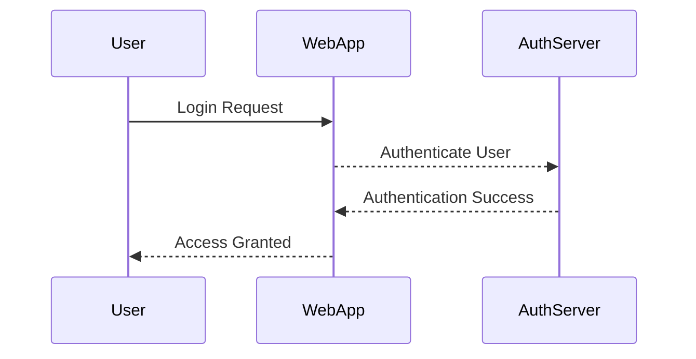
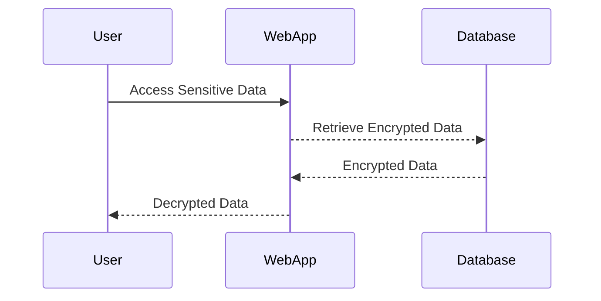
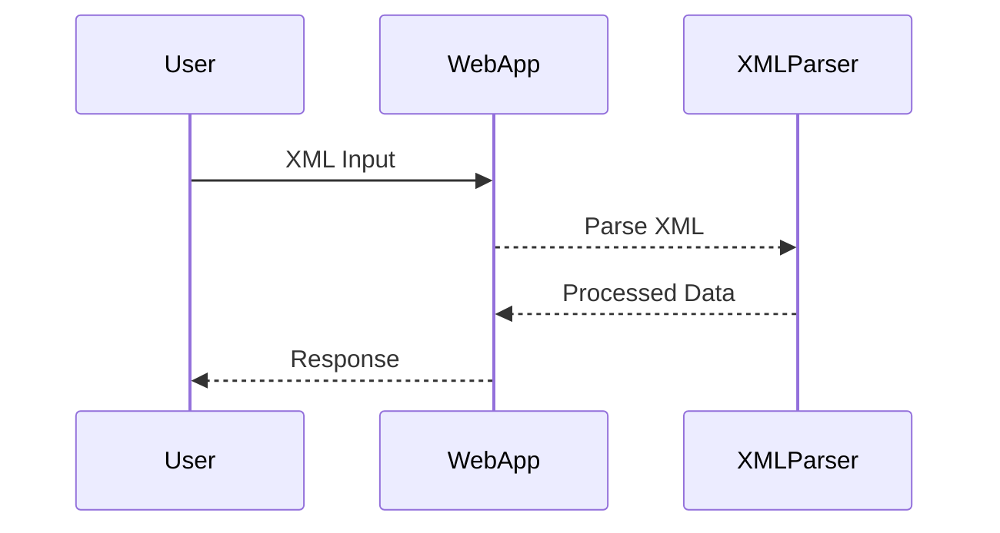
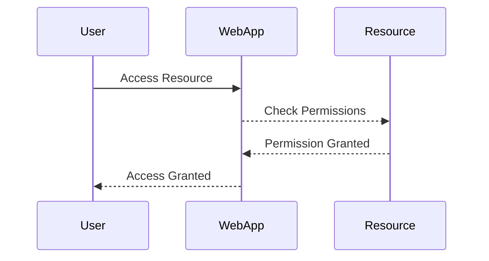
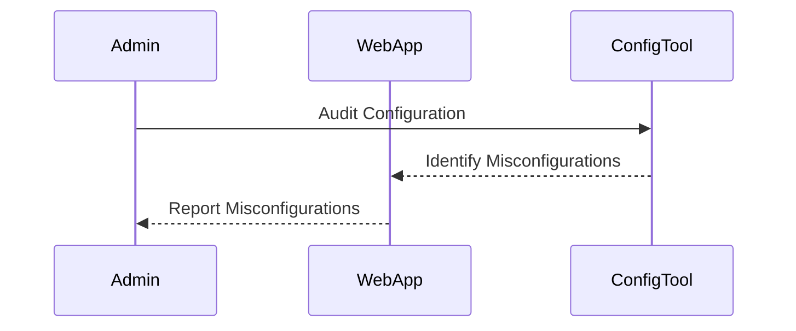
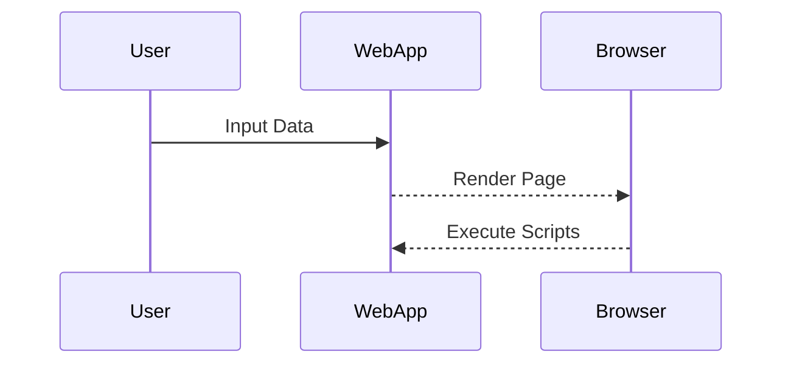
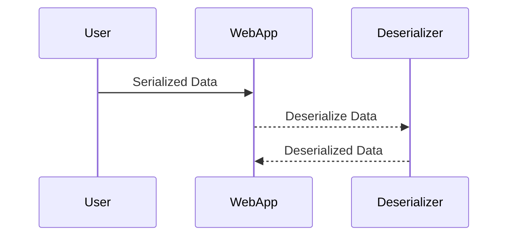
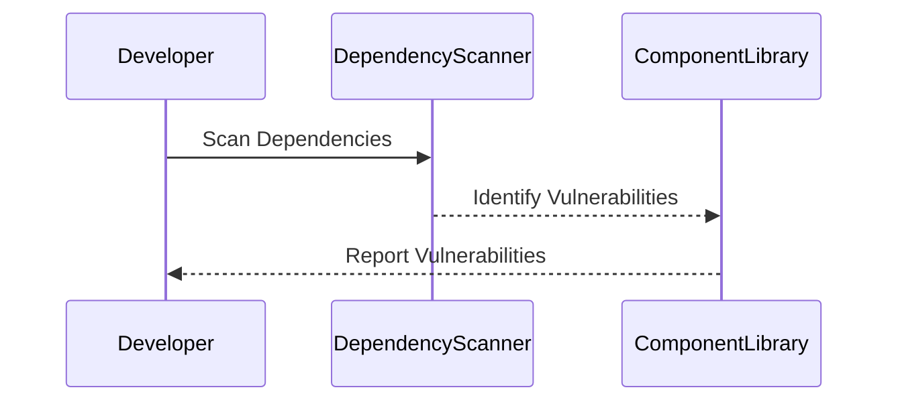
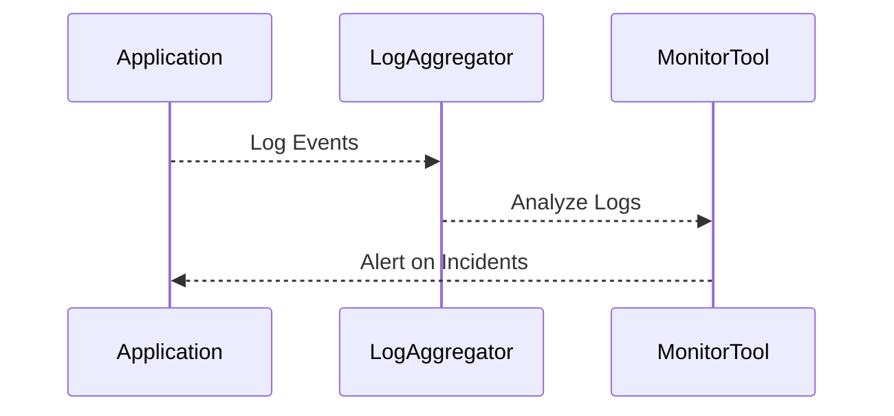

## Security Posture and Its Importance

### Understanding Security Posture

Security posture refers to the overall state of an organization’s security measures, including the effectiveness of its policies, procedures, technologies, and practices in protecting against cyber threats. A strong security posture ensures that an organization is resilient against various types of attacks and can quickly recover from incidents.

#### What Is Security Posture?

Security posture encompasses several key aspects:

- **Vulnerability Management**: Identifying and addressing weaknesses in systems and applications.
- **Threat Detection**: Monitoring for potential threats and responding to them.
- **Incident Response**: Having a plan in place to handle security incidents effectively.
- **Compliance**: Ensuring adherence to regulatory requirements and industry standards.

#### Why Does Security Posture Matter?

A robust security posture is crucial because it helps organizations:

- **Prevent Attacks**: By identifying and mitigating vulnerabilities.
- **Detect Threats**: Through continuous monitoring and threat intelligence.
- **Respond Quickly**: With a well-defined incident response plan.
- **Maintain Compliance**: Adhering to legal and regulatory requirements.

### Measuring Security Posture

To understand and improve your security posture, you need to measure it effectively. This involves using industry standards and guidelines to assess the security of your applications and infrastructure.

#### Industry Standards and Guidelines

One of the most widely recognized standards for measuring security posture is the OWASP Top Ten. OWASP (Open Web Application Security Project) is a non-profit organization dedicated to improving the security of software. The OWASP Top Ten provides a list of the most critical web application security risks based on empirical data.

### OWASP Top Ten

The OWASP Top Ten is a list of the most critical web application security risks. It is updated periodically to reflect the latest trends and threats. The current version (as of 2021) includes the following categories:

1. **Injection**
2. **Broken Authentication**
3. **Sensitive Data Exposure**
4. **XML External Entities (XXE)**
5. **Broken Access Control**
6. **Security Misconfiguration**
7. **Cross-Site Scripting (XSS)**
8. **Insecure Deserialization**
9. **Using Components with Known Vulnerabilities**
10. **Insufficient Logging & Monitoring**

#### Real-World Examples

Let's look at some recent real-world examples where these vulnerabilities were exploited:

- **CVE-2021-44228 (Log4j)**: This vulnerability allowed attackers to execute arbitrary code on affected servers. It falls under the category of "Using Components with Known Vulnerabilities."
- **Equifax Breach (2017)**: This breach was caused by a vulnerability in Apache Struts, leading to the exposure of sensitive personal information. It can be categorized under "Security Misconfiguration."

### How to Prevent / Defend Against OWASP Top Ten Risks

Each of the OWASP Top Ten risks requires specific defensive measures. Let's explore how to prevent and defend against each one.

#### Injection

**What Is Injection?**

Injection vulnerabilities occur when untrusted data is sent as part of a command or query. This can lead to unauthorized access or execution of malicious commands.

**Real-World Example**

- **SQL Injection**: In 2017, a SQL injection vulnerability in Equifax led to the exposure of sensitive data.

**How to Prevent / Defend**

- **Use Parameterized Queries**: Ensure that user input is properly sanitized and validated.
- **Input Validation**: Validate all user inputs to ensure they meet expected formats and constraints.

#### Broken Authentication

**What Is Broken Authentication?**

Broken authentication occurs when an application does not properly authenticate users, allowing unauthorized access.

**Real-World Example**

- **LinkedIn Breach (2012)**: Millions of user passwords were stolen due to weak password storage mechanisms.

**How to Prevent / Defend**

- **Use Strong Password Policies**: Enforce complex password requirements.
- **Multi-Factor Authentication (MFA)**: Implement MFA to add an additional layer of security.

#### Sensitive Data Exposure

**What Is Sensitive Data Exposure?**

Sensitive data exposure occurs when sensitive data is not properly protected, leading to unauthorized access.

**Real-World Example**

- **Yahoo Breach (2013)**: Over 3 billion user accounts were compromised, exposing sensitive data.

**How to Prevent / Defend**

- **Data Encryption**: Encrypt sensitive data both in transit and at rest.
- **Access Controls**: Limit access to sensitive data to authorized personnel only.

#### XML External Entities (XXE)

**What Is XXE?**

XXE vulnerabilities occur when an application processes XML input without proper validation, allowing an attacker to inject malicious XML entities.

**Real-World Example**

- **Apache Struts XXE Vulnerability (CVE-2017-5638)**: This vulnerability was exploited in the Equifax breach.

**How to Prevent / Defend**

- **Disable External Entity Loading**: Configure XML parsers to disable external entity loading.
- **Input Validation**: Validate all XML input to ensure it meets expected formats and constraints.

#### Broken Access Control

**What Is Broken Access Control?**

Broken access control occurs when an application does not properly enforce access controls, allowing unauthorized access to resources.

**Real-World Example**

- **GitHub OAuth Token Exposure (2019)**: Unauthorized access to OAuth tokens due to broken access control.

**How to Prevent / Defend**

- **Role-Based Access Control (RBAC)**: Implement RBAC to ensure users have only the necessary permissions.
- **Least Privilege Principle**: Grant users the minimum level of access required to perform their tasks.

#### Security Misconfiguration

**What Is Security Misconfiguration?**

Security misconfiguration occurs when an application or system is not properly configured, leaving it vulnerable to attacks.

**Real-World Example**

- **Equifax Breach (2017)**: Due to a vulnerability in Apache Struts, leading to the exposure of sensitive data.

**How to Prevent / Defend**

- **Regular Audits**: Conduct regular security audits to identify and address misconfigurations.
- **Default Settings**: Ensure default settings are changed to more secure configurations.

#### Cross-Site Scripting (XSS)

**What Is XSS?**

XSS vulnerabilities occur when an application allows untrusted data to be included in dynamically generated content, leading to the execution of malicious scripts.

**Real-World Example**

- **Facebook XSS Vulnerability (2013)**: An XSS vulnerability allowed attackers to steal session cookies.

**How to Prevent / Defend**

- **Output Encoding**: Encode all user inputs to prevent script execution.
- **Content Security Policy (CSP)**: Implement CSP to restrict the sources of executable scripts.

#### Insecure Deserialization

**What Is Insecure Deserialization?**

Insecure deserialization occurs when an application deserializes untrusted data, potentially leading to remote code execution.

**Real-World Example**

- **Apache Commons Collections RCE (CVE-2015-8103)**: This vulnerability allowed remote code execution through insecure deserialization.

**How to Prevent / Defend**

- **Validate Deserialized Data**: Ensure that deserialized data is valid and trusted.
- **Use Secure Serialization Libraries**: Use libraries that provide secure serialization mechanisms.

#### Using Components with Known Vulnerabilities

**What Are Components with Known Vulnerabilities?**

This category covers the use of components (such as libraries and frameworks) that have known vulnerabilities.

**Real-World Example**

- **Log4j Vulnerability (CVE-2021-44228)**: This vulnerability allowed remote code execution in many applications.

**How to Prevent / Defend**

- **Regular Updates**: Keep all components up to date with the latest security patches.
- **Dependency Scanning**: Use tools to scan dependencies for known vulnerabilities.

#### Insufficient Logging & Monitoring

**What Is Insufficient Logging & Monitoring?**

Insufficient logging and monitoring occurs when an application does not log and monitor security events adequately, making it difficult to detect and respond to incidents.

**Real-World Example**

- **Equifax Breach (2017)**: Lack of proper logging and monitoring contributed to the delay in detecting the breach.

**How to Prevent / Defend**

- **Centralized Logging**: Implement centralized logging to aggregate and analyze logs.
- **Real-Time Monitoring**: Use real-time monitoring tools to detect and respond to security events promptly.

### Conclusion

Understanding and improving your security posture is essential for protecting your applications and infrastructure. By adhering to industry standards like the OWASP Top Ten, you can identify and mitigate critical security risks. Regularly auditing and updating your security measures will help you maintain a strong security posture.

### Practice Labs

For hands-on experience with securing web applications, consider the following practice labs:

- **PortSwigger Web Security Academy**: Offers interactive labs to practice web security techniques.
- **OWASP Juice Shop**: A deliberately insecure web application for practicing security skills.
- **DVWA (Damn Vulnerable Web Application)**: A PHP/MySQL web application that demonstrates web application vulnerabilities.

By engaging with these labs, you can gain practical experience in identifying and mitigating security risks, thereby enhancing your security posture.

---
<!-- nav -->
[[25-Security Misconfigurations|Security Misconfigurations]] | [[DevSecOps/DevSecOps Bootcamp/03-Identity & Access Management/04-Security Essentials/OWASP top 10 Part 1/00-Overview|Overview]] | [[27-Server Level Misconfigurations|Server Level Misconfigurations]]
