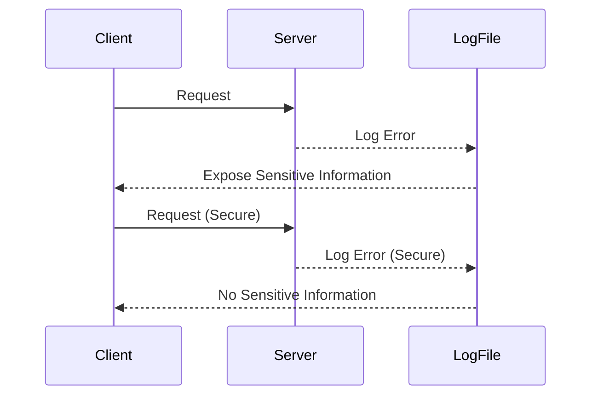

## Server Level Misconfigurations

### What Are Server Level Misconfigurations?

Server level misconfigurations involve errors or oversights in the setup of servers that can expose them to security risks. This includes running unnecessary services, misconfigured logging, and insecure error handling.

### Why Are They Important?

Server misconfigurations can significantly increase the attack surface of an organization. An attacker can exploit these misconfigurations to gain unauthorized access to systems, exfiltrate sensitive data, or disrupt services.

### How Do They Work Under the Hood?

Servers are configured to run various services and applications. If these services are not properly managed, they can provide additional entry points for attackers. Additionally, if logging and error handling are not configured securely, they can expose sensitive information to unauthorized users.

#### Example Server Configuration (Apache)

```apache
<VirtualHost *:80>
  ServerName example.com
  DocumentRoot /var/www/html
  ErrorLog ${APACHE_LOG_DIR}/error.log
  CustomLog ${APACHE_LOG_DIR}/access.log combined
</VirtualHost>
```

### Common Pitfalls

One common pitfall is running unnecessary services on the server, which increases the attack surface. Another issue is misconfigured logging that exposes sensitive information in error messages.

### Real-World Examples

The **Heartbleed bug** in OpenSSL (CVE-2014-0160) was partly due to a misconfigured logging mechanism that exposed sensitive information in error messages. This allowed attackers to extract private keys from servers, compromising the security of millions of websites.

### How to Prevent / Defend

#### Detection

Use tools like `netstat` to identify running services and `grep` to search for sensitive information in log files.

#### Prevention

1. **Disable Unnecessary Services**: Ensure that only the necessary services are running on the server.
2. **Secure Logging**: Configure logging to avoid exposing sensitive information in error messages.
3. **Regular Audits**: Conduct regular audits of server configurations to identify and remediate misconfigurations.

#### Secure Code Fix

**Vulnerable Server Configuration**

```apache
<VirtualHost *:80>
  ServerName example.com
  DocumentRoot /var/www/html
  ErrorLog ${APACHE_LOG_DIR}/error.log
  CustomLog ${APACHE_LOG_DIR}/access.log combined
</VirtualHost>
```

**Secure Server Configuration**

```apache
<VirtualHost *:80>
  ServerName example.com
  DocumentRoot /var/www/html
  ErrorLog ${APACHE_LOG_DIR}/error.log
  CustomLog ${APACHE_LOG_DIR}/access.log combined
  <Directory "/var/www/html">
    Options -Indexes
    Order deny,allow
    Deny from all
    Allow from 192.168.1.0/24
  </Directory>
</VirtualHost>
```

### Mermaid Diagram: Server Configuration Flow



---
<!-- nav -->
[[26-Security Posture and Its Importance|Security Posture and Its Importance]] | [[DevSecOps/DevSecOps Bootcamp/03-Identity & Access Management/04-Security Essentials/OWASP top 10 Part 1/00-Overview|Overview]] | [[28-Template Injection Attacks|Template Injection Attacks]]
