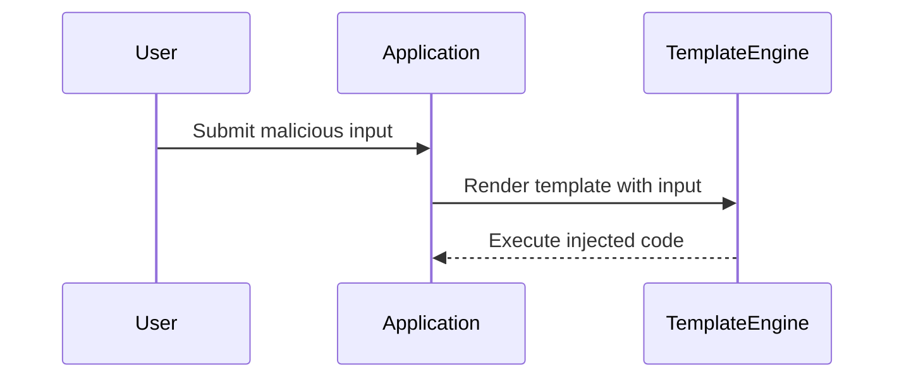
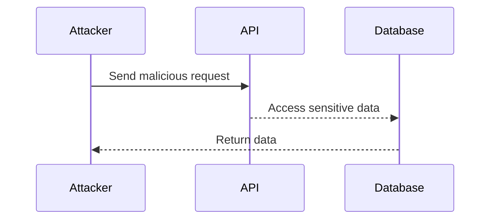
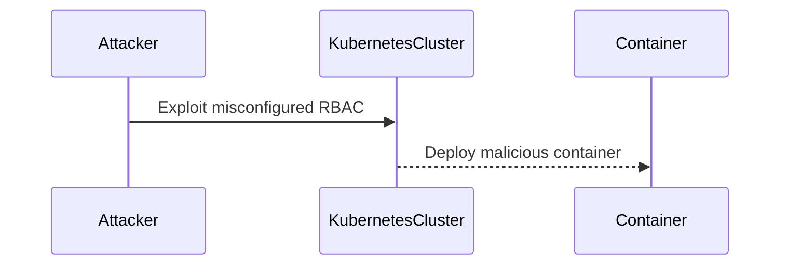
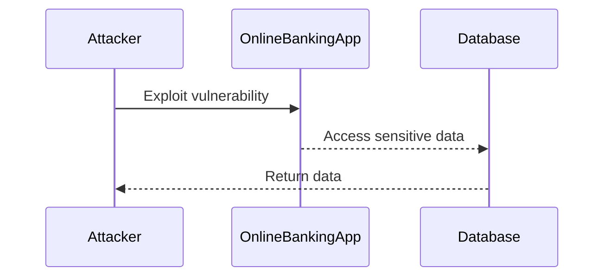
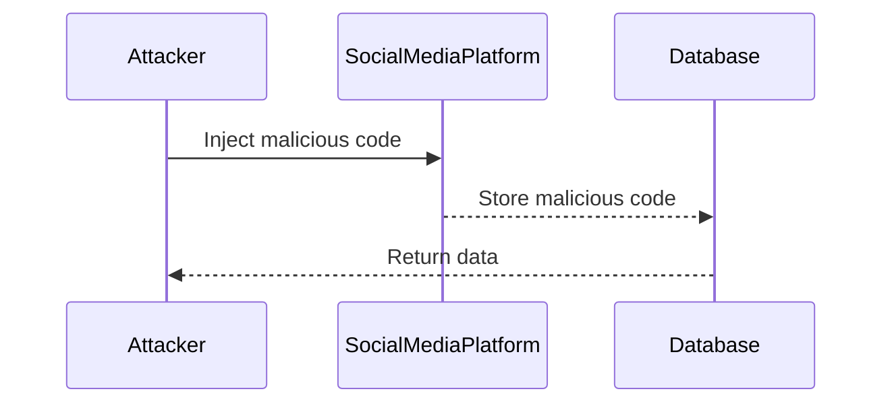
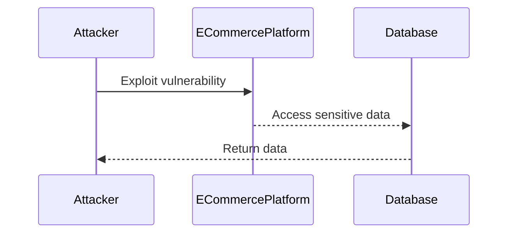
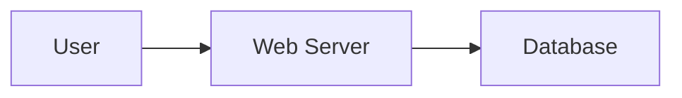
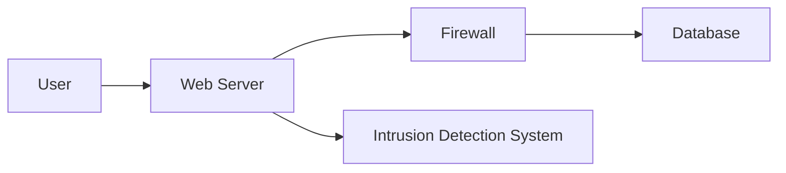

## Threat Modeling and Insecure Design

### Introduction to Threat Modeling

Threat modeling is a structured approach to identifying, quantifying, and addressing potential security threats to an application or system. This process helps developers and security professionals understand the risks associated with their applications and take proactive steps to mitigate them. By conducting a thorough threat model, teams can identify vulnerabilities early in the development lifecycle, reducing the likelihood of security breaches and minimizing the impact of any potential attacks.

### Components of Threat Modeling

Threat modeling involves several key components:

1. **Asset Identification**: Identifying the assets that need protection, such as data, services, and infrastructure.
2. **Threat Identification**: Identifying potential threats to these assets, including both external and internal threats.
3. **Vulnerability Analysis**: Analyzing the vulnerabilities that could be exploited by these threats.
4. **Risk Assessment**: Assessing the likelihood and impact of each identified threat.
5. **Mitigation Strategies**: Developing strategies to mitigate the identified risks.

### Example: Template Injection Threats

#### Background Theory

Template engines are used to generate dynamic content in web applications. They allow developers to separate the presentation logic from the business logic, making the code more maintainable and easier to manage. However, if not properly secured, template engines can be vulnerable to template injection attacks.

#### Real-World Example

A real-world example of a template injection vulnerability is the CVE-2019-10100, which affected the Twig template engine used in Symfony and other PHP frameworks. This vulnerability allowed attackers to inject arbitrary code into the templates, leading to remote code execution.



#### How to Prevent / Defend

To prevent template injection attacks, developers should:

1. **Sanitize Input**: Ensure that all user inputs are sanitized and validated before being passed to the template engine.
2. **Use Safe Contexts**: Use safe contexts provided by the template engine to escape potentially dangerous characters.
3. **Limit Permissions**: Restrict the permissions of the template engine to prevent it from executing arbitrary code.

**Vulnerable Code Example**:
```php
$template = $twig->render('template.html', ['user_input' => $_GET['input']]);
```

**Secure Code Example**:
```php
$template = $twig->render('template.html', ['user_input' => htmlspecialchars($_GET['input'], ENT_QUOTES, 'UTF-8')]);
```

### Example: Public API Security

#### Background Theory

Public APIs are interfaces that allow external systems to interact with an application. These APIs can expose sensitive data and functionality, making them a prime target for attackers. Properly securing public APIs is crucial to maintaining the integrity and confidentiality of the application.

#### Real-World Example

The Equifax breach in 2017 was partly due to vulnerabilities in their public API. Attackers exploited a flaw in the Apache Struts framework, which allowed them to access sensitive personal information of millions of users.



#### How to Prevent / Defend

To secure public APIs, developers should:

1. **Implement Authentication and Authorization**: Ensure that only authorized users can access the API endpoints.
2. **Use HTTPS**: Encrypt all communication between the client and the server to prevent eavesdropping and man-in-the-middle attacks.
3. **Validate Inputs**: Validate all inputs received by the API to prevent injection attacks.
4. **Rate Limiting**: Implement rate limiting to prevent abuse and denial-of-service attacks.

**Vulnerable API Configuration**:
```json
{
  "paths": {
    "/api/data": {
      "get": {
        "summary": "Retrieve data",
        "responses": {
          "200": {
            "description": "Successful response"
          }
        }
      }
    }
  }
}
```

**Secure API Configuration**:
```json
{
  "paths": {
    "/api/data": {
      "get": {
        "summary": "Retrieve data",
        "security": [
          {
            "apiKey": []
          }
        ],
        "responses": {
          "200": {
            "description": "Successful response"
          }
        }
      }
    }
  },
  "components": {
    "securitySchemes": {
      "apiKey": {
        "type": "apiKey",
        "in": "header",
        "name": "X-API-Key"
      }
    }
  }
}
```

### Example: Kubernetes Security

#### Background Theory

Kubernetes is an open-source platform for automating deployment, scaling, and management of containerized applications. While Kubernetes provides powerful tools for managing containerized workloads, it also introduces new security challenges. Ensuring the security of a Kubernetes cluster is critical to protecting the applications and data it hosts.

#### Real-World Example

In 2019, a Kubernetes cluster was compromised due to misconfigured RBAC (Role-Based Access Control) settings. The attacker gained unauthorized access to the cluster and was able to deploy malicious containers, leading to a significant security breach.



#### How to Prevent / Defend

To secure a Kubernetes cluster, administrators should:

1. **Implement RBAC**: Use Role-Based Access Control to restrict access to resources within the cluster.
2. **Enable Network Policies**: Use network policies to control traffic flow within the cluster.
3. **Use Pod Security Policies**: Enforce pod security policies to restrict what pods can do within the cluster.
4. **Regular Audits**: Regularly audit the cluster configuration and logs to detect and respond to suspicious activity.

**Vulnerable RBAC Configuration**:
```yaml
kind: ClusterRole
apiVersion: rbac.authorization.k8s.io/v1
metadata:
  name: admin-role
rules:
  - apiGroups: ["*"]
    resources: ["*"]
    verbs: ["*"]
---
kind: ClusterRoleBinding
apiVersion: rbac.authorization.k8s.io/v1
metadata:
  name: admin-binding
subjects:
  - kind: ServiceAccount
    name: default
    namespace: default
roleRef:
  kind: ClusterRole
  name: admin-role
  apiGroup: rbac.authorization.k8s.io
```

**Secure RBAC Configuration**:
```yaml
kind: ClusterRole
apiVersion: rbac.authorization.k8s.io/v1
metadata:
  name: restricted-role
rules:
  - apiGroups: [""]
    resources: ["pods", "services"]
    verbs: ["get", "list", "watch"]
---
kind: ClusterRoleBinding
apiVersion: rbac.authorization.k
```

### Business-Level Security Considerations

#### Online Banking Applications

Online banking applications handle sensitive financial data and require robust security measures. These applications must comply with regulatory requirements such as PCI DSS (Payment Card Industry Data Security Standard) and GDPR (General Data Protection Regulation).

#### Real-World Example

In 2020, a major bank suffered a data breach due to a vulnerability in their online banking application. The attackers were able to steal sensitive customer data, leading to significant financial losses and reputational damage.



#### How to Prevent / Defend

To secure online banking applications, developers should:

1. **Comply with Regulatory Requirements**: Ensure compliance with PCI DSS, GDPR, and other relevant regulations.
2. **Implement Strong Authentication**: Use multi-factor authentication (MFA) to prevent unauthorized access.
3. **Encrypt Sensitive Data**: Encrypt all sensitive data both at rest and in transit.
4. **Regular Penetration Testing**: Conduct regular penetration testing to identify and address vulnerabilities.

**Vulnerable Code Example**:
```java
public class BankController {
    @GetMapping("/account")
    public Account getAccountDetails(@RequestParam String username) {
        return accountService.getAccount(username);
    }
}
```

**Secure Code Example**:
```java
public class BankController {
    @GetMapping("/account")
    public Account getAccountDetails(@RequestParam String username, @RequestHeader("Authorization") String token) {
        if (authenticationService.authenticate(token)) {
            return accountService.getAccount(username);
        } else {
            throw new UnauthorizedAccessException();
        }
    }
}
```

### Secure Design Patterns and Principles

#### Background Theory

Secure design patterns and principles are guidelines and best practices that help developers create secure applications. These patterns and principles cover various aspects of application design, including authentication, authorization, input validation, and error handling.

#### Real-World Example

In 2018, a popular social media platform suffered a data breach due to a lack of proper input validation. Attackers were able to inject malicious code into the platform, leading to a significant security breach.



#### How to Prevent / Defend

To implement secure design patterns and principles, developers should:

1. **Use Secure Coding Practices**: Follow secure coding practices such as input validation, output encoding, and least privilege.
2. **Implement Defense in Depth**: Use multiple layers of security controls to protect against different types of attacks.
3. **Regular Code Reviews**: Conduct regular code reviews to identify and address security vulnerabilities.
4. **Use Security Frameworks**: Utilize security frameworks and libraries to simplify the implementation of security controls.

**Vulnerable Code Example**:
```python
@app.route('/submit', methods=['POST'])
def submit():
    data = request.form['data']
    execute(data)
```

**Secure Code Example**:
```python
@app.route('/submit', methods=['POST'])
def submit():
    data = request.form['data']
    if validate_input(data):
        execute(data)
    else:
        abort(400)
```

### Reference Architectures

#### Background Theory

Reference architectures provide a blueprint for designing and implementing secure applications. These architectures cover various aspects of application design, including infrastructure, networking, and security controls.

#### Real-World Example

In 2019, a major e-commerce platform suffered a data breach due to a lack of proper security controls. The attackers were able to access sensitive customer data, leading to significant financial losses and reputational damage.



#### How to Prevent / Defend

To implement reference architectures, developers should:

1. **Follow Best Practices**: Follow best practices for designing and implementing secure applications.
2. **Use Security Controls**: Use security controls such as firewalls, intrusion detection systems, and encryption to protect the application.
3. **Regular Audits**: Regularly audit the application and infrastructure to detect and respond to suspicious activity.
4. **Use Security Tools**: Utilize security tools such as vulnerability scanners and penetration testing tools to identify and address vulnerabilities.

**Vulnerable Architecture Diagram**:


**Secure Architecture Diagram**:


### Conclusion

Threat modeling is a critical component of secure application development. By identifying and addressing potential security threats early in the development lifecycle, teams can reduce the likelihood of security breaches and minimize the impact of any potential attacks. Developers should follow secure design patterns and principles, implement reference architectures, and regularly audit their applications to ensure they remain secure.

### Practice Labs

For hands-on practice with threat modeling and secure design, consider the following labs:

- **PortSwigger Web Security Academy**: Offers interactive labs for learning web security concepts, including threat modeling and secure design.
- **OWASP Juice Shop**: A deliberately insecure web application for practicing web security skills.
- **DVWA (Damn Vulnerable Web Application)**: A PHP/MySQL web application that demonstrates insecure coding practices.
- **WebGoat**: An interactive training application designed to teach web application security lessons.

These labs provide practical experience in identifying and mitigating security threats, helping developers build more secure applications.

---
<!-- nav -->
[[28-Template Injection Attacks|Template Injection Attacks]] | [[DevSecOps/DevSecOps Bootcamp/03-Identity & Access Management/04-Security Essentials/OWASP top 10 Part 1/00-Overview|Overview]] | [[30-Conclusion|Conclusion]]
