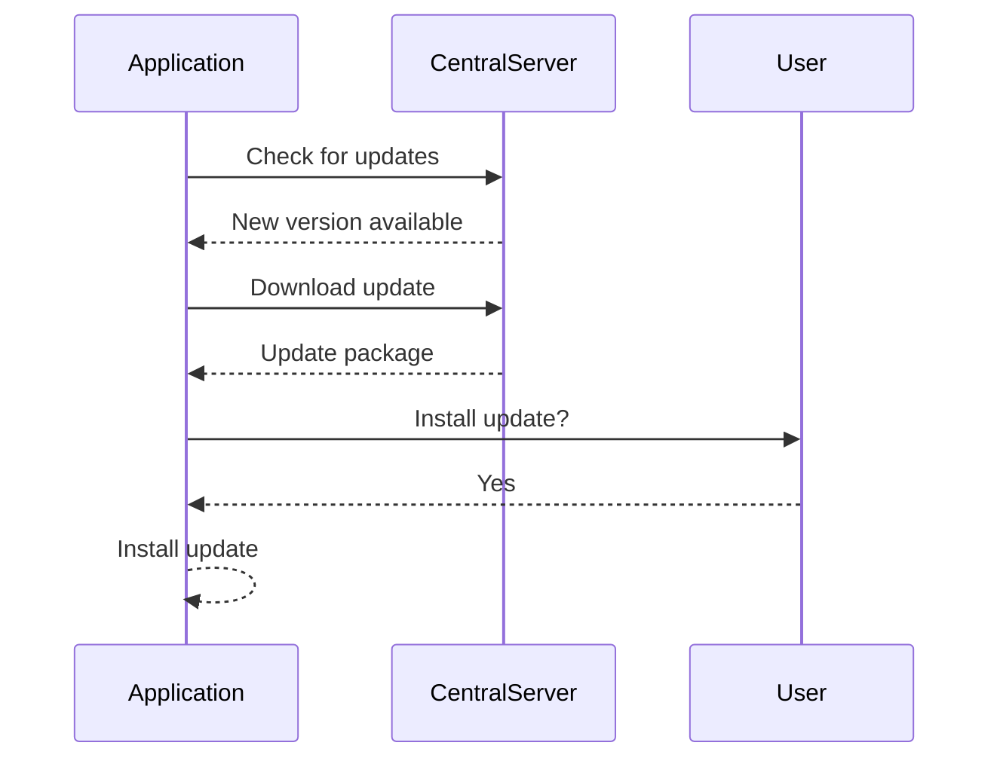

## Introduction to Software Installation and Auto-Updates

In the realm of DevSecOps, ensuring the security of software installations and auto-updates is paramount. This section delves into the risks associated with installing software via unverified sources and the dangers of auto-updates without proper integrity checks. We will explore the underlying mechanisms, recent real-world examples, and provide comprehensive guidance on how to prevent and defend against these vulnerabilities.

### Unverified Software Installation

When installing software on a server operating system, it is crucial to ensure that the source of the software is trustworthy. Often, developers follow tutorials found on blogs or forums, which may contain instructions to download and execute binaries using commands like `curl`. This practice can lead to significant security risks if the URL is not properly verified.

#### Example Command

```bash
curl -sSL https://example.com/install.sh | bash
```

This command downloads a script from `https://example.com/install.sh` and immediately executes it. The `-sSL` flags are used to suppress progress output, follow redirects, and handle SSL connections. However, the URL `https://example.com/install.sh` could be malicious, leading to the execution of harmful code on the server.

#### Real-World Example: CVE-2021-44228 (Log4Shell)

One of the most notable recent examples of a vulnerability exploited through unverified software installation is the Log4Shell (CVE-2021-44228) vulnerability. This vulnerability affected the Apache Log4j library, which is widely used in Java applications. Attackers could exploit this vulnerability by injecting malicious log messages into the application, leading to remote code execution.

**Impact**: Many organizations were compromised due to this vulnerability, including major companies like Apple and Twitter. The exploitation occurred because the Log4j library was included in numerous software packages, and many installations were done without verifying the integrity of the library.

### Auto-Updates and Component Integrity

Many modern applications include auto-update functionality, which automatically downloads and installs new versions of the software. While this feature simplifies maintenance, it also introduces security risks if the integrity of the updates is not verified.

#### How Auto-Updates Work

Auto-updates typically involve the following steps:

1. **Check for Updates**: The application periodically checks a central server for new versions.
2. **Download Update**: If a new version is available, the application downloads the update package.
3. **Install Update**: The downloaded package is installed, replacing the existing version.

#### Mermaid Diagram: Auto-Update Process



#### Real-World Example: CVE-2020-1472 (Zerologon)

The Zerologon vulnerability (CVE-2020-1472) affected Microsoft Windows Server implementations of the Netlogon Remote Protocol. This vulnerability allowed attackers to reset the password of any account, including the domain administrator account, without needing to know the current password. The vulnerability was present in the Netlogon service, which is part of the Windows operating system.

**Impact**: The vulnerability could be exploited during an auto-update process if the update package was compromised. This would allow attackers to gain unauthorized access to the system.

### Risks of Unverified Components

Components such as operating system tools, libraries, and Docker images can introduce security risks if their integrity is not verified. These components are often included in software installations and updates, and their trustworthiness is critical.

#### Example: Docker Image Vulnerability

Docker images are widely used in containerized environments. A compromised Docker image can lead to severe security issues. For instance, if a Docker image is downloaded from an unverified source, it could contain malicious code.

**Example Dockerfile**

```dockerfile
FROM unverified/source:latest
RUN apt-get update && apt-get install -y some-malicious-package
CMD ["some-malicious-command"]
```

In this example, the Docker image is built from an unverified source, and a malicious package is installed during the build process. This could result in the execution of harmful commands when the container is run.

### How to Prevent and Defend Against Unverified Software Installation and Auto-Updates

To mitigate the risks associated with unverified software installation and auto-updates, several best practices should be followed.

#### Secure Software Installation

1. **Verify Source**: Always verify the source of the software before installation. Use trusted repositories and official websites.
2. **Use Package Managers**: Utilize package managers like `apt`, `yum`, or `brew` that provide built-in verification mechanisms.
3. **Signature Verification**: Verify the digital signatures of the software packages to ensure their authenticity.

**Secure Installation Example**

```bash
wget https://example.com/install.sh
sha256sum install.sh
# Compare the checksum with the one provided by the official source
sudo bash install.sh
```

#### Secure Auto-Updates

1. **Integrity Checks**: Ensure that auto-updates perform integrity checks on the downloaded packages.
2. **Signed Packages**: Use signed packages and verify their signatures before installation.
3. **Automated Testing**: Implement automated testing to validate the behavior of updated components.

**Secure Auto-Update Configuration**

```json
{
  "auto_update": {
    "enabled": true,
    "verify_signature": true,
    "test_after_update": true
  }
}
```

#### Secure Component Management

1. **Component Scanning**: Regularly scan components for known vulnerabilities using tools like Trivy or Aqua Security.
2. **Dependency Management**: Use dependency management tools like `npm audit` for Node.js or `pip-audit` for Python to identify and fix vulnerabilities in dependencies.
3. **Immutable Infrastructure**: Use immutable infrastructure principles to ensure that components are not modified after deployment.

**Secure Component Management Example**

```yaml
# Dockerfile
FROM official/source:latest
RUN apt-get update && apt-get install -y some-trusted-package
CMD ["some-safe-command"]

# Docker Compose
version: '3'
services:
  app:
    image: official/source:latest
    deploy:
      resources:
        limits:
          cpus: '0.5'
          memory: 512M
```

### Detection and Prevention Tools

Several tools and practices can help detect and prevent vulnerabilities related to unverified software installation and auto-updates.

#### Detection Tools

1. **Trivy**: A container image scanner that detects vulnerabilities in container images.
2. **Aqua Security**: A platform that provides continuous security for containerized applications.
3. **OWASP Dependency-Check**: A tool that identifies project dependencies with known vulnerabilities.

#### Prevention Tools

1. **Snyk**: A tool that integrates with CI/CD pipelines to detect and fix vulnerabilities in dependencies.
2. **GitHub Security Alerts**: Automatic alerts for vulnerabilities in dependencies managed by GitHub.
3. **Sonatype Nexus Lifecycle**: A tool that provides security and compliance scanning for software components.

### Hands-On Labs

To gain practical experience with securing software installations and auto-updates, consider the following labs:

- **PortSwigger Web Security Academy**: Offers modules on secure coding practices and vulnerability management.
- **OWASP Juice Shop**: A deliberately insecure web application for practicing security skills.
- **CloudGoat**: Provides scenarios for learning about cloud security best practices.

By following these guidelines and utilizing the recommended tools and labs, you can significantly enhance the security of your software installations and auto-updates, ensuring that your systems remain protected against potential threats.

---
<!-- nav -->
[[DevSecOps/DevSecOps Bootcamp/03-Identity & Access Management/04-Security Essentials/OWASP top 10 Part 2/00-Overview|Overview]] | [[DevSecOps/DevSecOps Bootcamp/03-Identity & Access Management/04-Security Essentials/OWASP top 10 Part 2/02-Accessing Metadata Storage in Cloud Services|Accessing Metadata Storage in Cloud Services]]
