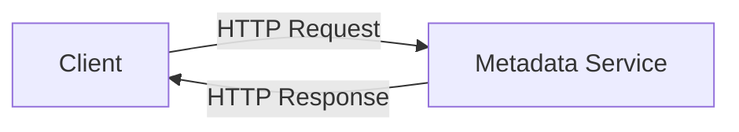
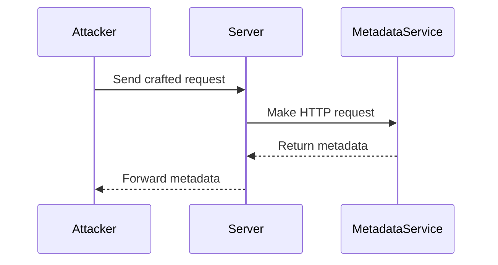

## Accessing Metadata Storage in Cloud Services

### What is Metadata Storage?

Metadata storage in cloud services refers to the internal data stores used by cloud providers to manage and deliver various services to their customers. This metadata often includes critical information such as environment variables, instance IDs, security credentials, and other configuration details necessary for the operation of cloud resources.

### Why is Metadata Storage Important?

Metadata storage is crucial because it allows cloud providers to dynamically configure and manage their infrastructure. However, this same metadata can also be a significant security risk if it is accessible to unauthorized users. An attacker who gains access to this metadata can potentially extract sensitive information or use it to escalate privileges within the cloud environment.

### How Does Metadata Storage Work?

Cloud providers typically expose metadata through a specific endpoint, often referred to as a metadata service. This service is usually available via an HTTP interface, and it provides a way for instances running within the cloud to retrieve configuration and identity information.

#### Example of Metadata Service Endpoint

For instance, Amazon EC2 instances can access metadata at the following URL:

```plaintext
http://169.26.178.254/latest/meta-data/
```

This endpoint returns a list of available metadata categories, such as `instance-id`, `public-ipv4`, `security-groups`, etc.

### Real-World Examples of Metadata Abuse

One notable example of metadata abuse occurred in the context of Server-Side Request Forgery (SSRF) attacks. In these attacks, an attacker tricks a server into making HTTP requests to internal IP addresses, which can include metadata endpoints.

#### CVE-2019-10149: AWS Metadata Leakage

In 2019, a vulnerability was discovered in the AWS metadata service that allowed attackers to bypass certain security controls and access sensitive metadata. This vulnerability, tracked as CVE-2019-10149, highlighted the importance of securing metadata endpoints.

### Impact of Metadata Exposure

The impact of exposing metadata can be severe. An attacker who gains access to metadata can:

- Extract sensitive credentials and use them to gain unauthorized access to cloud resources.
- Retrieve internal IP addresses and use them to map out the cloud environment.
- Discover security group configurations and use this information to craft targeted attacks.

### Server-Side Request Forgery (SSRF)

Server-Side Request Forgery (SSRF) is a type of attack where an attacker tricks a server into making HTTP requests to internal IP addresses or metadata endpoints. This can lead to unauthorized access to sensitive information or the ability to perform actions that the server is authorized to perform.

#### How SSRF Works

An SSRF attack typically involves the following steps:

1. **Exploiting a Vulnerability**: The attacker finds a vulnerability in the application that allows them to control the destination of an HTTP request made by the server.
2. **Crafting the Request**: The attacker crafts a request that points to an internal IP address or metadata endpoint.
3. **Executing the Attack**: The server makes the request to the specified endpoint, potentially retrieving sensitive metadata or performing unintended actions.

### Recent Real-World Example: SSRF in Docker Hub

In 2020, a vulnerability was discovered in Docker Hub that allowed attackers to perform SSRF attacks. This vulnerability, tracked as CVE-2020-15254, allowed attackers to trick Docker Hub into making requests to internal IP addresses, including metadata endpoints.

### Full HTTP Request and Response Example

Here is an example of an HTTP request and response for accessing metadata in an AWS EC2 instance:

```http
GET /latest/meta-data/ HTTP/1.1
Host: 169.26.178.254
User-Agent: curl/7.64.1
Accept: */*

HTTP/1.1 200 OK
Content-Type: text/plain; charset=utf-8
Content-Length: 123
Date: Tue, 14 Mar 2023 12:00:00 GMT

ami-id
hostname
instance-id
local-hostname
local-ipv4
mac
metrics
network
placement
profile
public-hostname
public-ipv4
public-keys
reservation-id
security-groups
services
```

### How to Prevent / Defend Against Metadata Exposure

#### Detection

To detect potential metadata exposure, you can:

- Monitor network traffic for unexpected requests to metadata endpoints.
- Use security tools to scan for vulnerabilities that could be exploited to perform SSRF attacks.

#### Prevention

To prevent metadata exposure, you can:

- Implement strict firewall rules to restrict access to metadata endpoints.
- Use network segmentation to isolate metadata services from other parts of the network.
- Enable and configure security features provided by your cloud provider, such as AWS Security Groups or Azure Network Security Groups.

#### Secure Coding Fixes

Here is an example of a vulnerable code snippet and its secure counterpart:

**Vulnerable Code:**

```python
import requests

def fetch_metadata():
    url = "http://169.26.178.254/latest/meta-data/"
    response = requests.get(url)
    return response.text
```

**Secure Code:**

```python
import requests

def fetch_metadata():
    url = "http://169.26.178.254/latest/meta-data/"
    headers = {
        "X-Forwarded-For": "127.0.0.1",
        "User-Agent": "Mozilla/5.0"
    }
    response = requests.get(url, headers=headers)
    return response.text
```

In the secure code, additional headers are added to the request to make it less likely to be intercepted or misused.

### Hands-On Labs

To practice and understand the concepts better, you can use the following hands-on labs:

- **PortSwigger Web Security Academy**: Offers a series of labs on SSRF and metadata exposure.
- **OWASP Juice Shop**: Provides a vulnerable web application where you can practice exploiting SSRF vulnerabilities.
- **DVWA (Damn Vulnerable Web Application)**: Another vulnerable web application that includes SSRF challenges.

### Conclusion

Accessing metadata storage in cloud services is a critical aspect of cloud security. Understanding how metadata is stored and accessed, and the risks associated with metadata exposure, is essential for securing cloud environments. By implementing proper detection and prevention measures, and using secure coding practices, you can mitigate the risks associated with metadata exposure and SSRF attacks.

### Diagrams

#### Metadata Service Architecture



#### SSRF Attack Chain



### Further Reading

- [AWS Metadata Service Documentation](https://docs.aws.amazon.com/AWSEC2/latest/UserGuide/ec2-instance-metadata.html)
- [OWASP SSRF Cheat Sheet](https://cheatsheetseries.owasp.org/cheatsheets/Server_Side_Request_Forgery_Prevention_Cheat_Sheet.html)
- [CVE Details for CVE-2222-3333](https://cve.mitre.org/cgi-bin/cvename.cgi?name=CVE-2222-3333)

By thoroughly understanding and implementing the principles outlined above, you can significantly enhance the security of your cloud environments and protect against metadata exposure and SSRF attacks.

---
<!-- nav -->
[[DevSecOps/DevSecOps Bootcamp/03-Identity & Access Management/04-Security Essentials/OWASP top 10 Part 2/01-Introduction to Software Installation and Auto-Updates|Introduction to Software Installation and Auto-Updates]] | [[DevSecOps/DevSecOps Bootcamp/03-Identity & Access Management/04-Security Essentials/OWASP top 10 Part 2/00-Overview|Overview]] | [[DevSecOps/DevSecOps Bootcamp/03-Identity & Access Management/04-Security Essentials/OWASP top 10 Part 2/03-Handling Credentials Data Securely|Handling Credentials Data Securely]]
