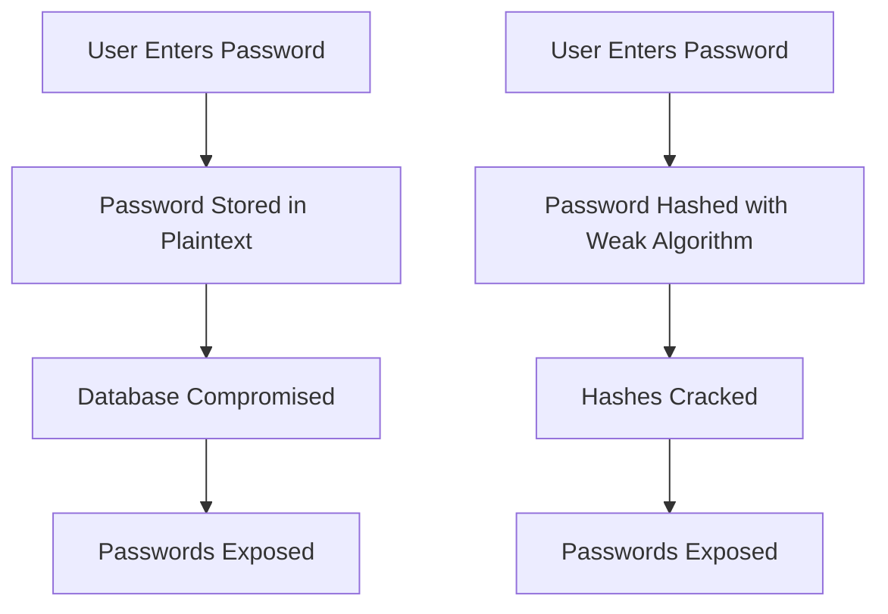
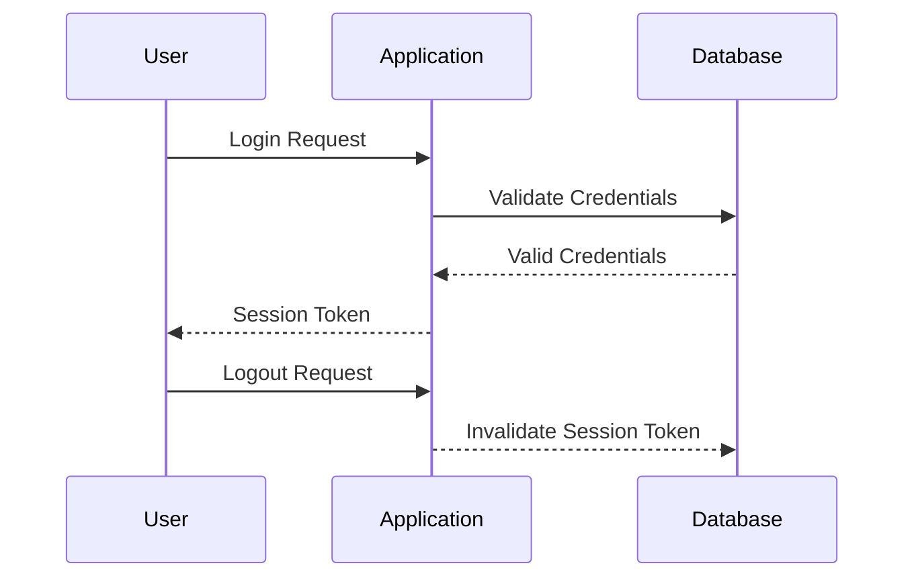

## Handling Credentials Data Securely

### Plaintext Storage and Weak Hashing

When dealing with sensitive information such as credentials, it is crucial to ensure that the data is stored securely. One of the most common mistakes is storing passwords in plaintext. This practice is highly insecure because if an attacker gains access to the database, they will immediately have access to all the passwords. 

#### Why Plaintext Storage Is Insecure

Plaintext storage is insecure because it provides no protection against unauthorized access. If an attacker manages to breach the system, they can read the passwords directly. This can lead to severe consequences, including unauthorized access to user accounts and potential data breaches.

#### Weak Hashing Algorithms

Another common mistake is using weak hashing algorithms to store passwords. Hashing is a process that converts a password into a fixed-length string of characters. However, if the hashing algorithm used is weak, it can be easily reversed or cracked. For example, using a simple hash function like MD5 or SHA-1 is not sufficient for securing passwords.

#### Real-World Example: Equifax Breach

In 2017, Equifax suffered a massive data breach that exposed the personal information of approximately 143 million people. One of the reasons for the breach was the use of weak hashing algorithms to store passwords. The attackers were able to crack the hashes and gain access to user accounts.



### How to Prevent / Defend Against Plaintext Storage and Weak Hashing

#### Use Strong Hashing Algorithms

To prevent plaintext storage and weak hashing, it is essential to use strong hashing algorithms such as bcrypt, scrypt, or Argon2. These algorithms are designed to be computationally expensive, making it difficult for attackers to crack the hashes.

#### Salted Hashes

Another important practice is to use salted hashes. Salting involves adding a random value to the password before hashing it. This ensures that even if two users have the same password, their hashes will be different. This makes it more difficult for attackers to use precomputed hash tables (rainbow tables) to crack the hashes.

#### Example Code

Here is an example of how to securely hash and verify passwords using bcrypt in Python:

```python
import bcrypt

# Hashing a password
password = b"mysecretpassword"
salt = bcrypt.gensalt()
hashed_password = bcrypt.hashpw(password, salt)

# Verifying a password
if bcrypt.checkpw(password, hashed_password):
    print("Password matches")
else:
    print("Password does not match")
```

### Session Management

Proper session management is critical for maintaining the security of web applications. When a user logs into an application, a session is created to keep track of the user's activities. This session is identified by a session ID or token.

#### Proper Validation of Session IDs/Tokens

It is essential to validate session IDs or tokens properly to ensure that only authenticated users can access the application. When a user logs in, the application should issue a session ID or token that uniquely identifies the user. This token is then used to authenticate subsequent requests.

#### Logout Process

When a user logs out of the application, the session ID or token should be invalidated and revoked. This ensures that the user cannot continue to use the application after logging out. If the application fails to invalidate the session, an attacker could potentially reuse the session ID or token to gain unauthorized access.

#### Real-World Example: Capital One Breach

In 2019, Capital One suffered a data breach that exposed the personal information of over 100 million customers. One of the reasons for the breach was improper session management. The attacker was able to reuse a session token to gain unauthorized access to the application.



### How to Prevent / Defend Against Improper Session Management

#### Secure Session Tokens

To prevent improper session management, it is essential to use secure session tokens. Session tokens should be generated randomly and should be of sufficient length to prevent guessing attacks. Additionally, session tokens should be transmitted securely using HTTPS to prevent interception.

#### Invalidate Sessions on Logout

When a user logs out of the application, the session token should be invalidated and removed from the server. This ensures that the user cannot continue to use the application after logging out. Additionally, the session token should be removed from the client-side storage to prevent reuse.

#### Example Code

Here is an example of how to manage sessions securely in a Flask application:

```python
from flask import Flask, session, redirect, url_for, request

app = Flask(__name__)
app.secret_key = 'your_secret_key'

@app.route('/login', methods=['POST'])
def login():
    username = request.form['username']
    password = request.form['password']
    # Validate credentials
    if validate_credentials(username, password):
        session['username'] = username
        return redirect(url_for('dashboard'))
    else:
        return 'Invalid credentials'

@app.route('/logout')
def logout():
    session.pop('username', None)
    return redirect(url_for('login'))

@app.route('/dashboard')
def dashboard():
    if 'username' in session:
        return 'Welcome %s' % escape(session['username'])
    else:
        return redirect(url_for('login'))
```

### Hands-On Labs

For hands-on practice with session management and secure credential handling, consider the following labs:

- **PortSwigger Web Security Academy**: Offers interactive labs on session management and secure credential handling.
- **OWASP Juice Shop**: Provides a vulnerable web application for practicing secure coding techniques.
- **DVWA (Damn Vulnerable Web Application)**: Allows you to practice securing web applications against various vulnerabilities.

By following these practices and using the provided resources, you can ensure that your applications handle credentials and sessions securely, protecting against unauthorized access and data breaches.

---
<!-- nav -->
[[DevSecOps/DevSecOps Bootcamp/03-Identity & Access Management/04-Security Essentials/OWASP top 10 Part 2/02-Accessing Metadata Storage in Cloud Services|Accessing Metadata Storage in Cloud Services]] | [[DevSecOps/DevSecOps Bootcamp/03-Identity & Access Management/04-Security Essentials/OWASP top 10 Part 2/00-Overview|Overview]] | [[DevSecOps/DevSecOps Bootcamp/03-Identity & Access Management/04-Security Essentials/OWASP top 10 Part 2/04-Hands-On Labs|Hands-On Labs]]
