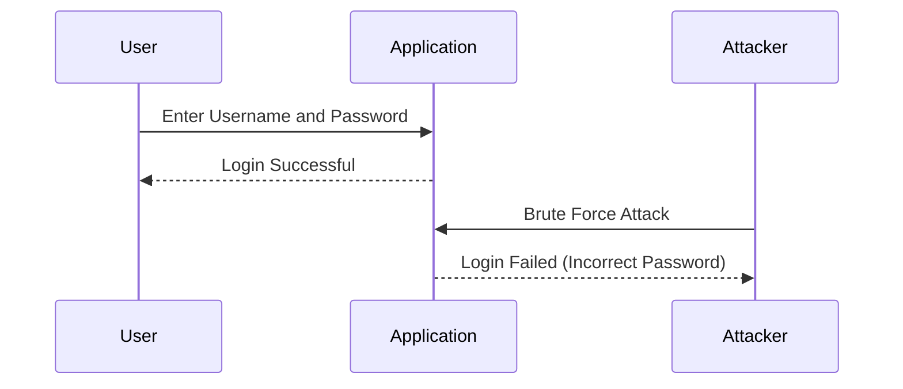
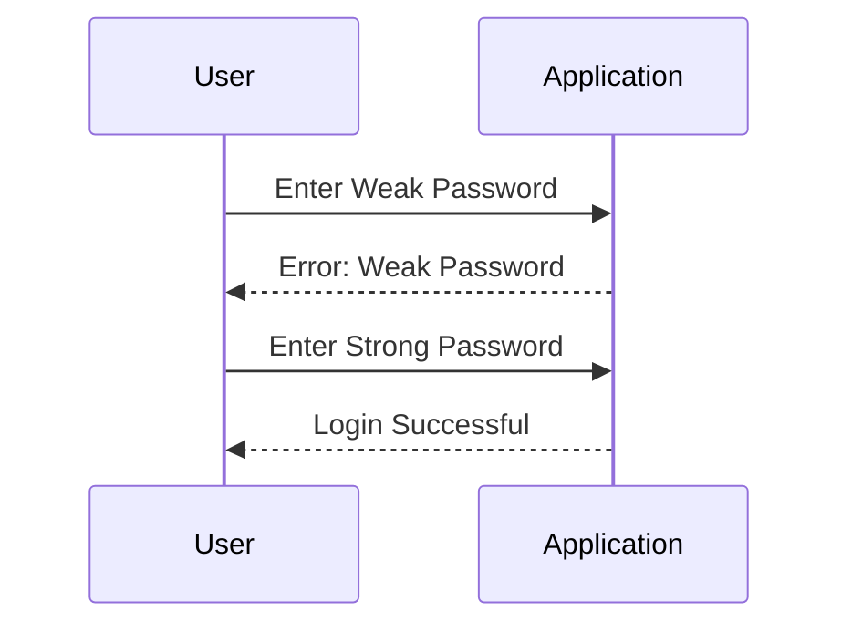

## Identification and Authentication Vulnerabilities

### Introduction to Identification and Authentication

Identification and authentication are fundamental components of any secure system. Identification refers to the process of identifying a specific user, typically through a unique identifier such as a username or email address. Authentication, on the other hand, is the process of verifying that the identified user is indeed who they claim to be. This is usually achieved through the use of credentials like passwords, private keys, or access tokens.

In the context of the OWASP Top 10, the seventh category focuses specifically on vulnerabilities related to identification and authentication. These vulnerabilities arise when an application fails to properly identify and authenticate users, leading to potential security breaches.

### Differentiating Between Authentication and Authorization

It is crucial to understand the difference between authentication and authorization:

- **Authentication**: Verifies the identity of a user. For example, checking a username and password combination.
- **Authorization**: Determines what actions an authenticated user is allowed to perform. For example, granting access to certain resources or functionalities within an application.

Both processes are critical for maintaining the security of an application. However, this discussion will focus primarily on authentication vulnerabilities.

### Weak Confirmation of User Identity

One of the primary issues in authentication is the failure to confirm a user's identity adequately. This can occur due to several reasons:

- **Insufficient Verification Mechanisms**: The application may rely solely on a username and password combination without additional verification steps.
- **Weak Password Policies**: Users might choose weak passwords, making it easier for attackers to guess or brute-force their way into the system.

#### Real-World Example: LinkedIn Breach (CVE-2012-0901)

In 2012, LinkedIn suffered a massive data breach where approximately 6.5 million hashed passwords were stolen. The breach highlighted the importance of strong password policies and proper hashing mechanisms. Many of the stolen passwords were weak and easily cracked, leading to widespread account compromises.



### Usage of Weak User Passwords

Another significant issue is the use of weak user passwords. Weak passwords are easy to guess or crack, making them a prime target for attackers. Common examples of weak passwords include:

- Simple combinations like "password123"
- Personal information like birthdays or pet names
- Dictionary words that can be easily guessed

#### Real-World Example: Equifax Data Breach (CVE-2017-11156)

In 2017, Equifax experienced a major data breach that exposed sensitive personal information of millions of customers. One of the contributing factors was the use of weak passwords by employees, which allowed attackers to gain unauthorized access to the system.



### Enforcing Strong Password Policies

To mitigate the risks associated with weak passwords, applications should enforce strong password policies. This can be achieved through various mechanisms:

- **Password Complexity Requirements**: Requiring a mix of uppercase and lowercase letters, numbers, and special characters.
- **Minimum Length Requirements**: Ensuring that passwords are at least a certain length.
- **Password History**: Preventing users from reusing old passwords.
- **Password Expiration**: Requiring users to change their passwords periodically.

#### Implementation Example

Here is an example of how to enforce strong password policies using a Python Flask application:

```python
from flask import Flask, request, jsonify
import re

app = Flask(__name__)

def validate_password(password):
    # Check password complexity
    if len(password) < 8:
        return False
    if not re.search("[a-z]", password):
        return False
    if not re.search("[A-Z]", password):
        return False
    if not re.search("[0-9]", password):
        return False
    if not re.search("[!@#$%^&*()_+]", password):
        return False
    return True

@app.route('/register', methods=['POST'])
def register():
    username = request.json.get('username')
    password = request.json.get('password')

    if not validate_password(password):
        return jsonify({"error": "Weak password"}), 400

    # Save the user and password securely (hashed)
    # ...

    return jsonify({"message": "Registration successful"}), 200

if __name__ == '__main__':
    app.run(debug=True)
```

### How to Prevent / Defend Against Weak Authentication

#### Detection

To detect weak authentication practices, organizations can implement the following measures:

- **Regular Security Audits**: Conduct regular security audits to identify weak authentication mechanisms.
- **Penetration Testing**: Perform penetration testing to simulate attacks and identify vulnerabilities.
- **Logging and Monitoring**: Implement logging and monitoring to track authentication attempts and detect suspicious activity.

#### Prevention

To prevent weak authentication, organizations should:

- **Enforce Strong Password Policies**: As demonstrated earlier, enforce strong password policies to ensure users choose secure passwords.
- **Use Multi-Factor Authentication (MFA)**: Implement multi-factor authentication to provide an additional layer of security.
- **Hash and Salt Passwords**: Store passwords securely by hashing and salting them to prevent unauthorized access even if the database is compromised.

#### Secure Coding Fixes

Here is an example of how to implement secure password storage using bcrypt in Python:

```python
import bcrypt

# Hash and salt a password
def hash_password(password):
    salt = bcrypt.gensalt()
    hashed_password = bcrypt.hashpw(password.encode('utf-8'), salt)
    return hashed_password

# Verify a password
def verify_password(stored_password, provided_password):
    return bcrypt.checkpw(provided_password.encode('utf-8'), stored_password)

# Example usage
password = "StrongPassword123!"
hashed_password = hash_password(password)
print(f"Hashed Password: {hashed_password}")

# Simulate a login attempt
provided_password = "StrongPassword123!"
is_valid = verify_password(hashed_password, provided_password)
print(f"Is the provided password valid? {is_valid}")
```

### Conclusion

Proper identification and authentication are essential for securing applications. By enforcing strong password policies and implementing robust authentication mechanisms, organizations can significantly reduce the risk of security breaches. Regular security audits, penetration testing, and logging and monitoring are crucial for detecting and preventing weak authentication practices.

### Hands-On Labs

For practical experience in securing authentication mechanisms, consider the following labs:

- **PortSwigger Web Security Academy**: Offers comprehensive modules on web security, including authentication vulnerabilities.
- **OWASP Juice Shop**: A deliberately insecure web application for practicing web security skills.
- **DVWA (Damn Vulnerable Web Application)**: A PHP/MySQL web application that demonstrates web application vulnerabilities.

By engaging with these labs, you can gain hands-on experience in identifying and mitigating authentication vulnerabilities.

---
<!-- nav -->
[[DevSecOps/DevSecOps Bootcamp/03-Identity & Access Management/04-Security Essentials/OWASP top 10 Part 2/04-Hands-On Labs|Hands-On Labs]] | [[DevSecOps/DevSecOps Bootcamp/03-Identity & Access Management/04-Security Essentials/OWASP top 10 Part 2/00-Overview|Overview]] | [[DevSecOps/DevSecOps Bootcamp/03-Identity & Access Management/04-Security Essentials/OWASP top 10 Part 2/06-Insufficient Logging and Monitoring|Insufficient Logging and Monitoring]]
