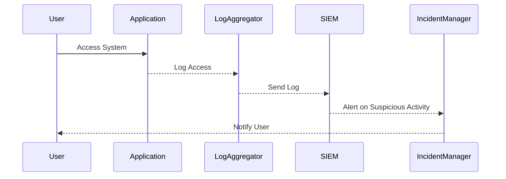
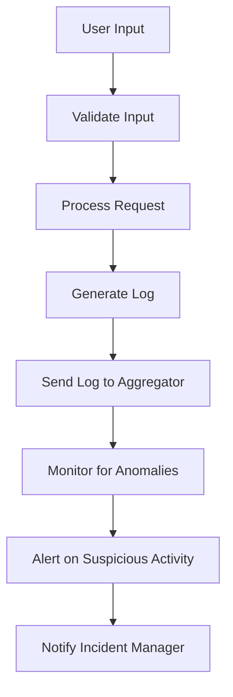

## Insufficient Logging and Monitoring

### Introduction

Insufficient logging and monitoring is a critical aspect of cybersecurity that often goes overlooked but can have severe consequences. This category refers to the lack of proper logging and monitoring mechanisms within an organization's systems, which can lead to undetected security breaches and unauthorized access to sensitive data. In the context of DevSecOps, ensuring robust logging and monitoring practices is essential to maintain the integrity and security of applications and systems.

### Background Theory

#### What is Logging?

Logging is the process of recording events that occur within a system. These events can range from routine operations to errors and security incidents. Logs provide a detailed record of activities, which can be used for various purposes, including troubleshooting, auditing, and forensic analysis.

#### Why is Logging Important?

- **Troubleshooting**: Logs help in diagnosing issues by providing a chronological record of events leading up to a problem.
- **Auditing**: Logs enable organizations to verify compliance with internal policies and external regulations.
- **Security**: Logs are crucial for detecting and responding to security incidents. They provide evidence of unauthorized access and malicious activities.

#### What is Monitoring?

Monitoring involves actively observing and analyzing system logs and other data sources to detect anomalies and potential threats. Effective monitoring ensures that security incidents are identified and addressed promptly.

#### Why is Monitoring Important?

- **Real-time Detection**: Monitoring allows for immediate detection of suspicious activities, enabling rapid response.
- **Incident Management**: Monitoring helps in managing incidents by providing timely alerts and facilitating the escalation process.
- **Continuous Improvement**: Monitoring provides insights into system behavior, helping organizations improve their security posture continuously.

### Real-World Example: Health Plan Provider Data Breach

In a notable case, an external party informed a health plan provider that an attacker had accessed and modified thousands of sensitive health records of more than 3.5 million children. The breach went undetected for approximately seven years due to the lack of proper logging and monitoring mechanisms. This incident highlights the critical importance of implementing robust logging and monitoring practices.

### Historical Context

Previously, this category was known as "Insufficient Logging and Monitoring." However, it has expanded to include more types of failures related to logging and monitoring. This expansion reflects the growing recognition of the importance of these practices in maintaining system security.

### Challenges in Testing for Insufficient Logging and Monitoring

Testing for insufficient logging and monitoring is challenging compared to other vulnerabilities. Traditional testing methods may not be sufficient to identify all potential issues. Automated tools can help detect these issues, but they are not always effective.

### Tools and Automation

In DevSecOps, automating the testing of vulnerabilities is a key objective. Tools such as:

- **Log Aggregation Systems**: Tools like ELK Stack (Elasticsearch, Logstash, Kibana) and Splunk aggregate and analyze logs from multiple sources.
- **Security Information and Event Management (SIEM)**: SIEM tools like IBM QRadar and Splunk Enterprise Security provide real-time monitoring and analysis of security events.
- **Automated Testing Tools**: Tools like Burp Suite and OWASP ZAP can be configured to check for logging and monitoring gaps.

### Recent Real-World Examples

#### CVE-2021-44228 (Log4j)

The Log4j vulnerability (CVE-2021-44228) is a recent example of how insufficient logging and monitoring can lead to severe security breaches. The vulnerability allowed attackers to execute arbitrary code on affected systems, leading to widespread exploitation. Proper logging and monitoring would have helped organizations detect and respond to such attacks more effectively.

#### SolarWinds Supply Chain Attack

The SolarWinds supply chain attack (CVE-2020-1014) involved the compromise of SolarWinds Orion software, which was then used to infiltrate numerous organizations. The attack went undetected for months due to inadequate logging and monitoring practices. This incident underscores the importance of comprehensive logging and monitoring across the entire supply chain.

### How to Prevent / Defend

#### Implementing Robust Logging Mechanisms

To prevent insufficient logging and monitoring, organizations should implement robust logging mechanisms. This includes:

- **Centralized Logging**: Aggregate logs from all systems into a centralized repository for easier analysis.
- **Structured Logging**: Use structured logging formats (e.g., JSON) to facilitate automated parsing and analysis.
- **Sensitive Data Masking**: Mask sensitive data in logs to comply with privacy regulations.

```json
{
  "timestamp": "2023-10-01T12:00:00Z",
  "level": "INFO",
  "message": "User logged in successfully.",
  "userId": "12345",
  "ipAddress": "192.168.1.1"
}
```

#### Implementing Effective Monitoring Practices

Effective monitoring practices include:

- **Real-time Alerts**: Configure alerts for suspicious activities and potential security incidents.
- **Behavioral Analysis**: Use machine learning algorithms to detect anomalous behavior.
- **Incident Response Playbooks**: Develop and maintain incident response playbooks to ensure a consistent and effective response to security incidents.



#### Secure Coding Practices

Secure coding practices can help prevent vulnerabilities that might go undetected due to insufficient logging and monitoring. This includes:

- **Input Validation**: Validate all user inputs to prevent injection attacks.
- **Error Handling**: Implement proper error handling to avoid exposing sensitive information through error messages.
- **Least Privilege Principle**: Ensure that users and processes have the minimum necessary privileges to perform their tasks.



### Common Pitfalls

#### Overlooking Logging and Monitoring

One common pitfall is overlooking the importance of logging and monitoring. Organizations may focus on other aspects of security while neglecting these critical practices.

#### Inadequate Logging Levels

Another pitfall is setting inadequate logging levels. Too much logging can overwhelm the system, while too little logging can miss important events.

#### Lack of Centralization

Failing to centralize logs can make it difficult to analyze and correlate events across different systems.

### Detection and Prevention

#### Detection

Detection involves identifying security incidents through logging and monitoring. This includes:

- **Real-time Alerts**: Configuring alerts for suspicious activities.
- **Log Analysis**: Regularly reviewing logs for signs of unauthorized access or malicious activities.
- **Behavioral Analysis**: Using machine learning to detect anomalous behavior.

#### Prevention

Prevention involves implementing measures to avoid security incidents. This includes:

- **Robust Logging**: Ensuring that all critical events are logged.
- **Effective Monitoring**: Implementing real-time monitoring to detect and respond to incidents promptly.
- **Incident Response**: Developing and maintaining incident response plans to ensure a consistent and effective response.

### Secure-Coding Fixes

#### Vulnerable Code

Consider a scenario where a web application does not log failed login attempts. This can allow an attacker to attempt brute-force attacks without being detected.

```python
# Vulnerable Code
def login(username, password):
    if authenticate(username, password):
        return "Login successful"
    else:
        return "Invalid credentials"
```

#### Secure Code

To address this issue, the application should log failed login attempts.

```python
# Secure Code
import logging

logging.basicConfig(filename='app.log', level=logging.INFO)

def login(username, password):
    if authenticate(username, password):
        logging.info(f"Successful login attempt for user {username}")
        return "Login successful"
    else:
        logging.warning(f"Failed login attempt for user {username}")
        return "Invalid credentials"
```

### Configuration Hardening

#### Vulnerable Configuration

Consider a scenario where a web server does not log access attempts.

```nginx
# Vulnerable Configuration
server {
    listen 80;
    server_name example.com;

    location / {
        root /var/www/html;
        index index.html;
    }
}
```

#### Secure Configuration

To address this issue, the web server should be configured to log access attempts.

```nginx
# Secure Configuration
server {
    listen 80;
    server_name example.com;

    access_log /var/log/nginx/access.log;

    location / {
        root /var/www/html;
        index index.html;
    }
}
```

### Conclusion

Insufficient logging and monitoring is a critical vulnerability that can lead to severe security breaches. By implementing robust logging and monitoring practices, organizations can detect and respond to security incidents more effectively. Automating the testing of these vulnerabilities using tools and frameworks can further enhance security. Real-world examples such as the Log4j vulnerability and the SolarWinds supply chain attack highlight the importance of comprehensive logging and monitoring practices.

### Practice Labs

For hands-on practice in implementing logging and monitoring, consider the following labs:

- **PortSwigger Web Security Academy**: Offers modules on logging and monitoring.
- **OWASP Juice Shop**: Provides scenarios for practicing logging and monitoring in a web application environment.
- **DVWA (Damn Vulnerable Web Application)**: Includes exercises for configuring and testing logging and monitoring mechanisms.

By engaging in these labs, you can gain practical experience in implementing and testing logging and monitoring practices, enhancing your skills in DevSecOps.

---
<!-- nav -->
[[DevSecOps/DevSecOps Bootcamp/03-Identity & Access Management/04-Security Essentials/OWASP top 10 Part 2/05-Identification and Authentication Vulnerabilities|Identification and Authentication Vulnerabilities]] | [[DevSecOps/DevSecOps Bootcamp/03-Identity & Access Management/04-Security Essentials/OWASP top 10 Part 2/00-Overview|Overview]] | [[DevSecOps/DevSecOps Bootcamp/03-Identity & Access Management/04-Security Essentials/OWASP top 10 Part 2/07-Logging and Monitoring for Security Relevance|Logging and Monitoring for Security Relevance]]
