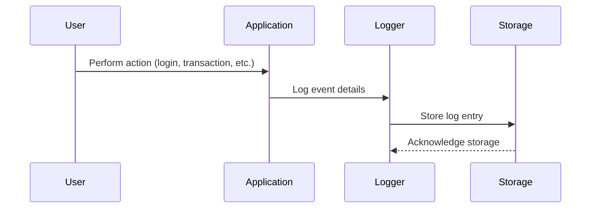
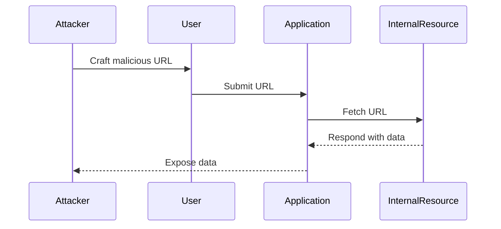

## Logging and Monitoring for Security Relevance

### Importance of Logging Security-Relevant Events

Logging is a fundamental aspect of securing applications. It provides visibility into the activities occurring within an application, enabling administrators and security teams to monitor and respond to potential threats. Security-relevant events are those that could indicate malicious activity or unauthorized access. Examples include:

- **Logins**: Successful and failed login attempts.
- **High-value transactions**: Financial transfers or significant data changes.
- **Password changes**: Resetting or modifying passwords.
- **Access to sensitive data**: Retrieving or modifying confidential information.

These events are crucial because they can help identify patterns of behavior that might indicate a security breach. For instance, multiple failed login attempts from a single IP address could suggest a brute-force attack.

### Implementation of Logging Mechanisms

To effectively implement logging mechanisms, several steps must be taken:

1. **Define Security-Relevant Events**: Identify which events are critical for security monitoring.
2. **Configure Logging Levels**: Ensure that logs capture sufficient detail without overwhelming storage.
3. **Centralize Logs**: Aggregate logs from various sources to simplify analysis.
4. **Automate Alerts**: Set up alerts for specific patterns or thresholds that indicate suspicious activity.

#### Example Configuration

Consider a web application that needs to log security-relevant events. Here’s an example of how to configure logging using a popular logging framework, `log4j`:

```java
import org.apache.log4j.Logger;
import org.apache.log4j.PropertyConfigurator;

public class SecurityLogger {
    private static final Logger logger = Logger.getLogger(SecurityLogger.class);

    public static void main(String[] args) {
        PropertyConfigurator.configure("log4j.properties");
        logger.info("Application started");

        // Log successful login
        logger.info("User 'admin' logged in successfully");

        // Log failed login
        logger.warn("Failed login attempt for user 'admin' from IP 192.168.1.1");

        // Log high-value transaction
        logger.info("Transaction completed: $1000 transferred from account 12345 to account 67890");

        // Log password change
        logger.info("User 'admin' changed their password");
    }
}
```

The corresponding `log4j.properties` file would look like this:

```properties
log4j.rootLogger=INFO, stdout, file

log4j.appender.stdout=org.apache.log4j.ConsoleAppender
log4j.appender.stdout.Target=System.out
log4j.appender.stdout.layout=org.apache.log4j.PatternLayout
log4j.appender.stdout.layout.ConversionPattern=%d{ABSOLUTE} %5p %c{1}:%L - %m%n

log4j.appender.file=org.apache.log4j.DailyRollingFileAppender
log4j.appender.file.File=logs/app.log
log4j.appender.file.layout=org.apache.log4j.PatternLayout
log4j.appender.file.layout.ConversionPattern=%d{ABSOLUTE} %5p %c{1}:%L - %m%n
```

### Real-World Example: Equifax Breach

In 2017, Equifax suffered a massive data breach that exposed sensitive personal information of millions of customers. One of the key issues was the lack of proper logging and monitoring. Had Equifax had robust logging mechanisms in place, they might have detected the breach earlier and minimized the damage.

### How to Prevent / Defend

**Detection**:
- **Log Analysis Tools**: Use tools like Splunk, ELK Stack, or Graylog to analyze logs for suspicious patterns.
- **SIEM Systems**: Implement Security Information and Event Management systems to correlate events across multiple sources.

**Prevention**:
- **Regular Audits**: Conduct regular audits of log files to ensure compliance and identify potential security issues.
- **Access Controls**: Limit access to log files to authorized personnel only.

**Secure Coding Fix**:
Compare the insecure and secure versions of logging:

**Insecure Version**:
```java
logger.info("User " + username + " logged in successfully");
```

**Secure Version**:
```java
logger.info("User {} logged in successfully", username);
```

### Server-Side Request Forgery (SSRF)

### Understanding SSRF

Server-Side Request Forgery (SSRF) is a type of attack where an attacker tricks a server into making HTTP requests to an unintended location. This can lead to unauthorized access to internal resources or other servers. SSRF attacks typically occur when an application allows users to specify URLs that the server will then fetch.

### How SSRF Works

1. **Crafted URL**: An attacker crafts a URL that points to an internal resource or another server.
2. **User Input**: The attacker injects this URL into the application via user input fields.
3. **Server Execution**: The server processes the URL without proper validation, leading to unintended requests.

### Real-World Example: CVE-2021-21972

In 2021, a vulnerability (CVE-2021-21972) was discovered in the Jenkins pipeline plugin. This vulnerability allowed attackers to perform SSRF attacks by manipulating the `JENKINS_URL` environment variable. By injecting a malicious URL, attackers could gain unauthorized access to internal resources.

### How to Prevent / Defend

**Detection**:
- **Network Monitoring**: Monitor network traffic for unusual outbound requests.
- **IDS/IPS Systems**: Implement Intrusion Detection and Prevention Systems to detect and block malicious requests.

**Prevention**:
- **Input Validation**: Validate and sanitize user inputs to ensure they do not contain malicious URLs.
- **Whitelist URLs**: Restrict the URLs that the server can access to a predefined list of trusted domains.

**Secure Coding Fix**:
Compare the insecure and secure versions of handling URLs:

**Insecure Version**:
```java
String url = request.getParameter("url");
URLConnection connection = new URL(url).openConnection();
connection.connect();
```

**Secure Version**:
```java
String url = request.getParameter("url");
if (isValidUrl(url)) {
    URLConnection connection = new URL(url).openConnection();
    connection.connect();
} else {
    throw new IllegalArgumentException("Invalid URL");
}

private boolean isValidUrl(String url) {
    try {
        URI uri = new URI(url);
        return uri.getHost().matches("trusted\\.domain\\.com");
    } catch (URISyntaxException e) {
        return false;
    }
}
```

### Mermaid Diagrams

#### Logging Mechanism Flow



#### SSRF Attack Chain



### Conclusion

Proper logging and monitoring are essential for maintaining the security of applications. By logging security-relevant events and implementing robust logging mechanisms, organizations can detect and respond to potential threats more effectively. Additionally, understanding and preventing SSRF attacks is crucial for safeguarding against unauthorized access to internal resources. By following the best practices outlined above, developers and security professionals can significantly enhance the security posture of their applications.

---
<!-- nav -->
[[DevSecOps/DevSecOps Bootcamp/03-Identity & Access Management/04-Security Essentials/OWASP top 10 Part 2/06-Insufficient Logging and Monitoring|Insufficient Logging and Monitoring]] | [[DevSecOps/DevSecOps Bootcamp/03-Identity & Access Management/04-Security Essentials/OWASP top 10 Part 2/00-Overview|Overview]] | [[DevSecOps/DevSecOps Bootcamp/03-Identity & Access Management/04-Security Essentials/OWASP top 10 Part 2/08-Logging, Monitoring, and Alerting in Application Security|Logging, Monitoring, and Alerting in Application Security]]
