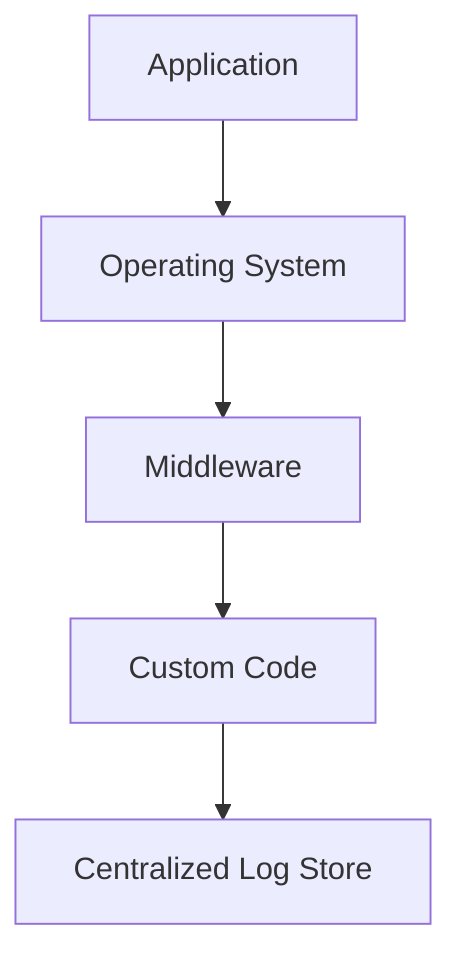
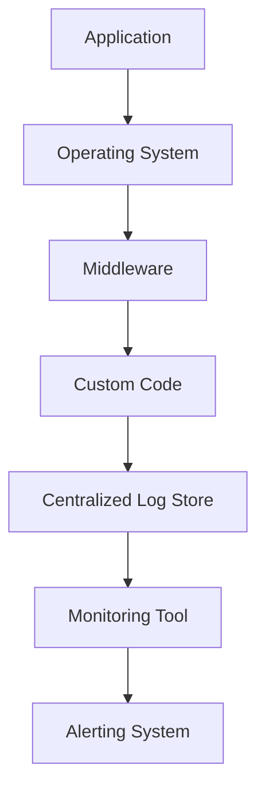

## Logging, Monitoring, and Alerting in Application Security

### Introduction to Logging, Monitoring, and Alerting

In the realm of application security, logging, monitoring, and alerting are fundamental components that help organizations detect and respond to security incidents effectively. Without these mechanisms in place, an attacker can gain unauthorized access to a system and remain undetected for extended periods, leading to significant data breaches and financial losses.

#### What is Logging?

Logging is the process of recording events that occur within a system. These events can range from user interactions and system operations to errors and security-related activities. Logs provide a detailed record of what has happened in the system, allowing administrators and security teams to review past activities and identify potential issues.

**Why is Logging Important?**

- **Incident Detection:** Logs help in identifying unusual activity patterns that could indicate a security breach.
- **Forensic Analysis:** Detailed logs are crucial for post-incident analysis to understand how an attacker gained access and what actions were taken.
- **Compliance:** Many regulatory frameworks require organizations to maintain logs for auditing and compliance purposes.

**How Does Logging Work?**

Logs are typically generated by various components of an application, such as the operating system, middleware, and custom application code. Each log entry contains metadata such as the timestamp, source of the event, and details about the event itself. These logs are then collected and stored in a centralized location for further analysis.

### Monitoring and Alerting

Monitoring involves continuously observing the system and its logs to detect anomalies or predefined conditions. Alerting is the process of notifying designated personnel when such conditions are met.

**Why is Monitoring Important?**

- **Real-time Awareness:** Monitoring provides real-time visibility into the system’s health and security posture.
- **Proactive Defense:** By detecting suspicious activities early, organizations can take immediate action to mitigate threats.
- **Operational Efficiency:** Monitoring helps in identifying performance bottlenecks and operational issues that can affect the system’s availability and reliability.

**How Does Monitoring Work?**

Monitoring tools collect data from various sources, including logs, system metrics, and network traffic. This data is analyzed using predefined rules or machine learning algorithms to identify patterns that deviate from normal behavior. When such deviations are detected, alerts are triggered to notify the appropriate personnel.

### Real-World Examples

#### Recent Breaches and CVEs

- **Equifax Data Breach (2017):** Equifax, a major credit reporting agency, suffered a massive data breach that exposed sensitive personal information of over 143 million consumers. One of the key factors contributing to the breach was the lack of proper logging and monitoring mechanisms. Had Equifax implemented robust logging and monitoring practices, the breach might have been detected earlier, reducing the extent of damage.
  
  **CVE Example:** [CVE-2017-5638](https://nvd.nist.gov/vuln/detail/CVE-2017-5638) - This vulnerability in Apache Struts allowed remote code execution due to improper input validation. Proper logging and monitoring could have helped detect and mitigate such vulnerabilities more quickly.

- **Capital One Data Breach (2019):** Capital One experienced a data breach that exposed the personal information of approximately 100 million customers and small business clients. The breach occurred due to a misconfigured web application firewall, which allowed an attacker to access sensitive data. Lack of adequate logging and monitoring contributed to the prolonged exposure of the system to the attacker.

  **CVE Example:** [CVE-2019-11510](https://nvd.nist.gov/vuln/detail/CVE-2019-11510) - This vulnerability in Apache Struts allowed remote code execution due to improper input validation. Proper logging and monitoring could have helped detect and mitigate such vulnerabilities more quickly.

### Implementation Details

#### Logging Mechanisms

To implement effective logging, organizations should consider the following:

- **Centralized Logging:** Collect logs from all sources into a centralized location for easier management and analysis.
- **Structured Logs:** Use structured formats like JSON or XML to make logs machine-readable and easier to parse.
- **Metadata:** Include relevant metadata such as timestamps, source IP addresses, and user IDs in each log entry.



#### Monitoring Tools

Popular monitoring tools include:

- **ELK Stack (Elasticsearch, Logstash, Kibana):** A widely used open-source solution for log management and visualization.
- **Splunk:** A commercial tool that provides advanced analytics and machine learning capabilities for log data.
- **Prometheus:** An open-source monitoring system and time series database designed for monitoring services and infrastructure.



#### Alerting Mechanisms

Effective alerting mechanisms should:

- **Threshold-Based Alerts:** Define thresholds for specific metrics and trigger alerts when these thresholds are exceeded.
- **Anomaly Detection:** Use machine learning algorithms to detect unusual patterns that deviate from normal behavior.
- **Multi-Channel Notifications:** Send alerts through multiple channels such as email, SMS, and messaging platforms to ensure timely notification.

### Common Pitfalls

- **Over-Logging:** Generating excessive logs can lead to storage issues and make it difficult to identify important events.
- **Under-Logging:** Insufficient logging can result in missing critical events and making forensic analysis challenging.
- **False Positives:** Overly sensitive alerting mechanisms can generate numerous false positives, leading to alert fatigue among security teams.

### How to Prevent / Defend

#### Secure Coding Practices

Implement secure coding practices to prevent vulnerabilities that can be exploited by attackers. For example, ensure proper input validation and sanitization to prevent SQL injection attacks.

**Vulnerable Code:**
```python
import sqlite3

def get_user_data(user_id):
    conn = sqlite3.connect('database.db')
    cursor = conn.cursor()
    query = f"SELECT * FROM users WHERE id = {user_id}"
    cursor.execute(query)
    return cursor.fetchall()
```

**Secure Code:**
```python
import sqlite3

def get_user_data(user_id):
    conn = sqlite3.connect('database.db')
    cursor = conn.cursor()
    query = "SELECT * FROM users WHERE id = ?"
    cursor.execute(query, (user_id,))
    return cursor.fetchall()
```

#### Configuration Hardening

Harden system configurations to minimize attack surfaces. For example, disable unnecessary services and protocols, and configure firewalls to restrict inbound and outbound traffic.

**Example Configuration:**
```nginx
server {
    listen 80;
    server_name example.com;

    location / {
        deny all;
    }

    location /api {
        allow 192.168.1.0/24;
        deny all;
    }
}
```

#### Regular Audits and Penetration Testing

Conduct regular audits and penetration testing to identify and remediate vulnerabilities. Use tools like Burp Suite, Metasploit, and Nessus to simulate attacks and test the effectiveness of logging and monitoring mechanisms.

### Complete Example

Consider a web application that processes user requests and interacts with a database. Below is an example of how logging, monitoring, and alerting can be implemented in this scenario.

#### Full HTTP Request and Response

**HTTP Request:**
```http
POST /api/login HTTP/1.1
Host: example.com
Content-Type: application/json
Content-Length: 37

{
    "username": "admin",
    "password": "password123"
}
```

**HTTP Response:**
```http
HTTP/1.1 200 OK
Date: Mon, 20 Nov 2023 12:00:00 GMT
Content-Type: application/json
Content-Length: 29

{
    "token": "eyJhbGciOiJIUzI1NiIsInR5cCI6IkpXVCJ9..."
}
```

#### Centralized Log Entry

**Log Entry:**
```json
{
    "timestamp": "2023-11-20T12:00:00Z",
    "source": "example.com/api/login",
    "event_type": "login_attempt",
    "username": "admin",
    "status": "success",
    "ip_address": "192.168.1.100",
    "user_agent": "Mozilla/5.0 (Windows NT 10.0; Win64; x64) AppleWebKit/537.36 (KHTML, like Gecko) Chrome/94.0.4606.81 Safari/537.36"
}
```

#### Monitoring Rule

**Monitoring Rule:**
```yaml
rules:
  - name: "Failed Login Attempts"
    condition: "event_type == 'login_attempt' && status == 'failure'"
    threshold: 5
    timeframe: "1 minute"
    action: "alert"
```

#### Alert Notification

**Alert Notification:**
```json
{
    "timestamp": "2023-11-20T12:01:00Z",
    "rule_name": "Failed Login Attempts",
    "description": "Multiple failed login attempts detected from IP address 192.168.1.100",
    "severity": "high",
    "action_required": "Investigate and block IP address if necessary"
}
```

### Conclusion

Effective logging, monitoring, and alerting are essential for maintaining the security and integrity of application systems. By implementing these mechanisms, organizations can detect and respond to security incidents promptly, reducing the risk of data breaches and financial losses. Regular audits, secure coding practices, and configuration hardening further enhance the overall security posture of the system.

### Practice Labs

For hands-on practice in implementing logging, monitoring, and alerting, consider the following labs:

- **PortSwigger Web Security Academy:** Offers interactive labs to learn about web application security, including logging and monitoring.
- **OWASP Juice Shop:** A deliberately insecure web application for practicing web security skills.
- **DVWA (Damn Vulnerable Web Application):** A PHP/MySQL web application that demonstrates web application vulnerabilities.

These labs provide practical experience in setting up and configuring logging, monitoring, and alerting mechanisms in real-world scenarios.

---
<!-- nav -->
[[DevSecOps/DevSecOps Bootcamp/03-Identity & Access Management/04-Security Essentials/OWASP top 10 Part 2/07-Logging and Monitoring for Security Relevance|Logging and Monitoring for Security Relevance]] | [[DevSecOps/DevSecOps Bootcamp/03-Identity & Access Management/04-Security Essentials/OWASP top 10 Part 2/00-Overview|Overview]] | [[DevSecOps/DevSecOps Bootcamp/03-Identity & Access Management/04-Security Essentials/OWASP top 10 Part 2/09-Logging, Monitoring, and Alerting in DevSecOps|Logging, Monitoring, and Alerting in DevSecOps]]
