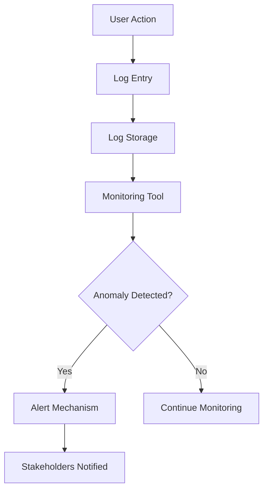

## Logging, Monitoring, and Alerting in DevSecOps

### Introduction to Logging, Monitoring, and Alerting

In the realm of DevSecOps, logging, monitoring, and alerting form the backbone of a robust security infrastructure. These components work together to provide visibility into system operations, detect anomalies, and trigger appropriate responses to potential threats. Understanding the roles and interactions of these elements is crucial for maintaining the security and integrity of applications and systems.

### Logging

**What is Logging?**

Logging is the process of recording events that occur within a system or application. Logs capture detailed information about various activities, such as user actions, system operations, errors, and warnings. This data is typically stored in files or databases and can be analyzed later to understand system behavior and diagnose issues.

**Why is Logging Important?**

Logs serve several critical purposes:

- **Troubleshooting:** Logs help identify the root cause of problems by providing a chronological record of events leading up to an issue.
- **Auditing:** Logs enable compliance with regulatory requirements by documenting system activities and access.
- **Security Analysis:** Logs are essential for detecting and investigating security incidents by tracking unauthorized access and suspicious activities.

**How Does Logging Work?**

Logs are generated by various components of a system, including operating systems, applications, and middleware. Each log entry typically includes metadata such as timestamps, severity levels, and identifiers. Here’s an example of a typical log entry:

```plaintext
2023-10-01T12:00:00Z ERROR User 'john.doe@example.com' failed to authenticate with incorrect password.
```

### Monitoring

**What is Monitoring?**

Monitoring involves continuously observing and analyzing logs and other system data to detect unusual or suspicious behavior. This process helps identify potential security threats and operational issues before they escalate.

**Why is Monitoring Important?**

Monitoring is crucial for several reasons:

- **Early Detection:** By analyzing logs in real-time, monitoring tools can quickly identify anomalous patterns that may indicate a security threat.
- **Proactive Defense:** Monitoring allows organizations to take preventive measures before an incident becomes a full-blown crisis.
- **Operational Efficiency:** Monitoring helps optimize system performance by identifying bottlenecks and inefficiencies.

**How Does Monitoring Work?**

Monitoring tools analyze log data and other system metrics to detect deviations from normal behavior. For example, consider the scenario where a user makes multiple failed login attempts:

```plaintext
2023-10-01T12:00:00Z ERROR User 'john.doe@example.com' failed to authenticate with incorrect password.
2023-10-01T12:01:00Z ERROR User 'john.doe@example.com' failed to authenticate with incorrect password.
...
2023-10-01T12:39:00Z ERROR User 'john.doe@example.com' failed to authenticate with incorrect password.
```

A monitoring tool would detect this pattern of 40 failed login attempts and flag it as suspicious.

### Alerting

**What is Alerting?**

Alerting is the process of notifying stakeholders when suspicious activity is detected. Once monitoring identifies a potential threat, alerting mechanisms ensure that the appropriate personnel are informed and can take action.

**Why is Alerting Important?**

Alerting is vital because:

- **Immediate Response:** Alerts prompt immediate action, reducing the time between detection and response.
- **Coordination:** Alerts facilitate coordination among team members, ensuring that everyone is aware of the situation.
- **Documentation:** Alerts create a record of incidents, which can be used for post-incident analysis and reporting.

**How Does Alerting Work?**

Alerting mechanisms can take various forms, such as email notifications, SMS messages, or dashboard alerts. For instance, once a monitoring tool detects 40 failed login attempts, it might send an alert like this:

```plaintext
Subject: Suspicious Activity Detected

Body:
Suspicious activity detected on the system. User 'john.doe@example.com' made 40 failed login attempts between 12:00 and 12:39 on October 1, 2023. Please investigate immediately.
```

### Real-World Example: Children's Health Plan Provider Breach

A notable real-world example of the importance of logging, monitoring, and alerting occurred with a children's health plan provider. In this case, the website operator failed to detect a breach due to a lack of proper logging and monitoring. Without collecting and analyzing log data, the organization was unaware of the ongoing security incident until it was too late.

### How to Prevent / Defend

#### Secure Logging

**Vulnerable Pattern:**
```plaintext
# Vulnerable logging configuration
log_level = "ERROR"
log_file = "/var/log/app.log"
```

**Secure Fix:**
```plaintext
# Secure logging configuration
log_level = "DEBUG"
log_file = "/var/log/app.log"
log_retention = "30 days"
log_rotation = "daily"
```

**Explanation:**
- **Log Level:** Set the log level to `DEBUG` to capture more detailed information.
- **Retention Policy:** Implement a retention policy to ensure logs are kept for a sufficient period.
- **Rotation:** Rotate logs daily to prevent them from becoming too large and to maintain a manageable log size.

#### Effective Monitoring

**Vulnerable Pattern:**
```plaintext
# Vulnerable monitoring script
#!/bin/bash
grep -c "failed login" /var/log/app.log
```

**Secure Fix:**
```plaintext
# Secure monitoring script
#!/bin/bash
grep -c "failed login" /var/log/app.log | awk '{if ($1 > 40) print "Suspicious activity detected!"}'
```

**Explanation:**
- **Threshold Detection:** Add logic to detect when the number of failed login attempts exceeds a threshold (e.g., 40).
- **Alert Mechanism:** Integrate with an alerting system to notify stakeholders when suspicious activity is detected.

#### Robust Alerting

**Vulnerable Pattern:**
```plaintext
# Vulnerable alerting configuration
alert_email = "admin@example.com"
```

**Secure Fix:**
```plaintext
# Secure alerting configuration
alert_email = ["security@example.com", "admin@example.com"]
alert_sms = "+1234567890"
```

**Explanation:**
- **Multiple Recipients:** Ensure that alerts are sent to multiple stakeholders, including security teams and administrators.
- **SMS Notifications:** Include SMS notifications for critical alerts to ensure rapid response.

### Mermaid Diagrams

#### Logging, Monitoring, and Alerting Flow



### Conclusion

Logging, monitoring, and alerting are fundamental components of a comprehensive security strategy in DevSecOps. By implementing robust logging practices, effective monitoring tools, and reliable alerting mechanisms, organizations can significantly enhance their ability to detect and respond to security threats. Real-world examples and secure configurations demonstrate the importance of these practices in maintaining the integrity and security of systems and applications.

---
<!-- nav -->
[[DevSecOps/DevSecOps Bootcamp/03-Identity & Access Management/04-Security Essentials/OWASP top 10 Part 2/08-Logging, Monitoring, and Alerting in Application Security|Logging, Monitoring, and Alerting in Application Security]] | [[DevSecOps/DevSecOps Bootcamp/03-Identity & Access Management/04-Security Essentials/OWASP top 10 Part 2/00-Overview|Overview]] | [[10-Multi-Factor Authentication (MFA) Part 1|Multi-Factor Authentication (MFA) Part 1]]
