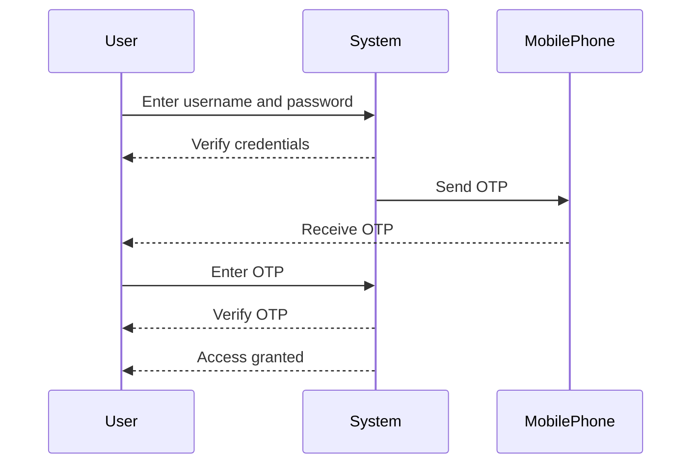
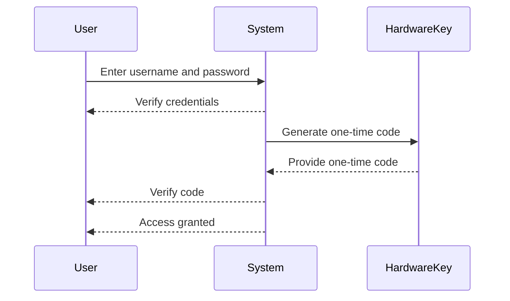

## Multi-Factor Authentication (MFA)

### What is Multi-Factor Authentication (MFA)?

Multi-Factor Authentication (MFA) is a security mechanism that requires users to provide two or more verification methods to authenticate themselves. These methods typically fall into three categories:

1. **Something you know**: A password or PIN.
2. **Something you have**: A physical token, such as a mobile phone or a hardware key.
3. **Something you are**: Biometric data, such as fingerprints or facial recognition.

The primary goal of MFA is to enhance security by making it significantly harder for unauthorized individuals to gain access to a system or service. Even if a hacker manages to obtain a user's password, they would still need additional factors to authenticate successfully.

### Why is MFA Important?

MFA is crucial because it adds an extra layer of security to the authentication process. Here’s why:

- **Enhanced Security**: By requiring multiple factors, MFA reduces the likelihood of unauthorized access, even if one factor (like a password) is compromised.
- **Protection Against Phishing**: MFA helps protect against phishing attacks, where attackers attempt to trick users into revealing their credentials.
- **Compliance Requirements**: Many industries have regulatory requirements that mandate the use of MFA for accessing sensitive systems and data.

### How Does MFA Work?

Let's break down the process of MFA:

1. **User Authentication Request**: The user initiates an authentication request, typically by entering their username and password.
2. **Secondary Factor Request**: After the initial authentication, the system prompts the user for a secondary factor. This could be a code sent via SMS, a push notification on a mobile app, or a biometric scan.
3. **Verification**: The user provides the secondary factor, which is then verified by the system.
4. **Access Granted**: If both factors are correct, the user gains access to the system.

#### Example: SMS-Based MFA

Here’s a detailed example of how SMS-based MFA works:

1. **Initial Authentication**:
    - User enters their username and password.
    - System verifies the credentials.
2. **Secondary Factor Request**:
    - System sends a one-time passcode (OTP) to the user’s registered mobile phone number.
3. **User Input**:
    - User receives the OTP via SMS.
    - User enters the OTP into the system.
4. **Verification**:
    - System checks the entered OTP against the one sent.
    - If the OTP matches, the user is authenticated.
5. **Access Granted**:
    - User gains access to the system.



### Physical Devices as MFA Factors

Physical devices, such as hardware keys, can also serve as MFA factors. These devices generate one-time codes or use cryptographic mechanisms to verify the user’s identity.

#### Example: Hardware Key MFA

1. **Initial Authentication**:
    - User enters their username and password.
    - System verifies the credentials.
2. **Secondary Factor Request**:
    - System prompts the user to insert their hardware key.
3. **User Input**:
    - User inserts the hardware key into their computer.
    - The hardware key generates a one-time code or uses a cryptographic challenge-response mechanism.
4. **Verification**:
    - System checks the generated code or cryptographic response.
    - If valid, the user is authenticated.
5. **Access Granted**:
    - User gains access to the system.



### Insecure Password Recovery Process

An insecure password recovery process can be exploited by malicious actors to gain unauthorized access to user accounts. This often happens through social engineering techniques or weak recovery mechanisms.

#### Example: Weak Password Recovery Mechanism

Consider a scenario where a user forgets their password and attempts to recover it. An insecure recovery process might involve:

1. **Email Address Verification**:
    - User enters their email address.
    - System sends a reset link to the email address.
2. **Security Questions**:
    - User answers security questions that can be easily guessed (e.g., mother’s maiden name, favorite color).

This process is vulnerable because:

- **Social Engineering**: Attackers can gather personal information about the user to answer security questions.
- **Phishing Attacks**: Attackers can intercept the reset link sent to the user’s email.

### Real-World Examples of Insecure Password Recovery

Several high-profile breaches have occurred due to insecure password recovery processes:

- **Yahoo Data Breach (2013)**: Yahoo experienced a massive data breach affecting over 3 billion user accounts. One of the vulnerabilities was an insecure password recovery process that allowed attackers to reset passwords.
- **LinkedIn Data Breach (2012)**: LinkedIn suffered a data breach where millions of hashed passwords were stolen. The breach was partly due to an insecure password recovery mechanism.

### How to Prevent / Defend Against Insecure Password Recovery

To defend against insecure password recovery processes, follow these best practices:

1. **Use Strong Authentication Methods**:
    - Implement MFA for password recovery.
    - Use biometric data or hardware keys for additional security.

2. **Avoid Easily Guessable Security Questions**:
    - Avoid using common security questions that can be easily guessed.
    - Consider using a passphrase instead of a single word.

3. **Monitor and Detect Suspicious Activity**:
    - Implement monitoring tools to detect unusual login patterns.
    - Use machine learning algorithms to identify potential threats.

4. **Educate Users**:
    - Educate users about the importance of strong passwords and secure recovery mechanisms.
    - Encourage users to enable MFA for their accounts.

#### Secure Code Fix Example

Here’s an example of how to implement a secure password recovery process:

**Vulnerable Code**:
```python
def recover_password(email):
    # Check if email exists in database
    if email_exists_in_db(email):
        # Send reset link to email
        send_reset_link(email)
```

**Secure Code**:
```python
def recover_password(email):
    # Check if email exists in database
    if email_exists_in_db(email):
        # Generate a unique token
        token = generate_unique_token()
        # Store token in database
        store_token_in_db(email, token)
        # Send reset link with token to email
        send_reset_link_with_token(email, token)
```

In the secure version, a unique token is generated and stored in the database. This token is then used to verify the user during the password reset process, adding an extra layer of security.

### Conclusion

Multi-Factor Authentication (MFA) is a critical component of modern security practices. By requiring multiple verification factors, MFA significantly enhances the security of user accounts. Additionally, ensuring that password recovery processes are secure is essential to prevent unauthorized access. By implementing strong authentication methods, avoiding easily guessable security questions, and educating users, organizations can effectively protect against security threats.

### Hands-On Labs

For practical experience with MFA and secure password recovery, consider the following labs:

- **PortSwigger Web Security Academy**: Offers modules on MFA and secure password recovery.
- **OWASP Juice Shop**: Provides scenarios for testing and securing password recovery processes.
- **DVWA (Damn Vulnerable Web Application)**: Includes exercises for implementing and testing MFA.

These labs will help you gain hands-on experience with implementing and securing MFA and password recovery processes.

---
<!-- nav -->
[[DevSecOps/DevSecOps Bootcamp/03-Identity & Access Management/04-Security Essentials/OWASP top 10 Part 2/09-Logging, Monitoring, and Alerting in DevSecOps|Logging, Monitoring, and Alerting in DevSecOps]] | [[DevSecOps/DevSecOps Bootcamp/03-Identity & Access Management/04-Security Essentials/OWASP top 10 Part 2/00-Overview|Overview]] | [[11-Multi-Factor Authentication (MFA)|Multi-Factor Authentication (MFA)]]
